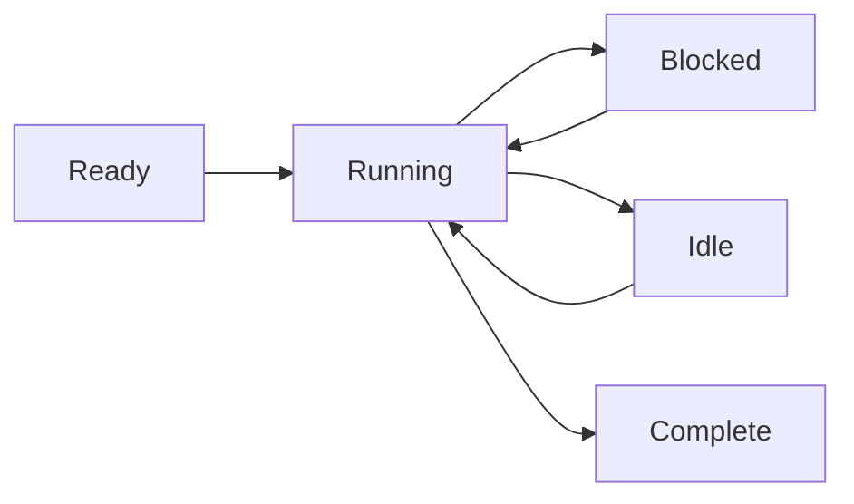

# Modelo de procesos

Wippy ejecuta código en procesos aislados: máquinas de estado ligeras que se comunican mediante mensajes en lugar de memoria compartida. Este modelo de actores proporciona a cada proceso su propio estado y ciclo de vida.

Esta página explica el modelo de ciclo de vida y aislamiento. Usa la [referencia de gestión de procesos](../lua/core/process.md) para las API de creación, mensajería, monitorización, registro y upgrade. Consulta [Process Host y servicios](../system/process-host.md) para los campos de servicios gestionados por el runtime.

## Ejecución de la máquina de estados

Cada proceso se inicializa, avanza por su ejecución, cede en operaciones bloqueantes y se cierra al completarse. El scheduler multiplexa procesos en un pool de workers y ejecuta otro trabajo mientras un proceso espera I/O.

Los procesos admiten varias suspensiones concurrentes, por lo que el código puede iniciar varias operaciones asíncronas y esperar a una o a todas sin crear procesos adicionales.


```mermaid
flowchart LR
    Ready --> Running
    Running --> Blocked
    Running --> Idle
    Blocked --> Running
    Idle --> Running
    Running --> Complete
```

Los procesos no se limitan a Lua. El runtime también admite módulos WebAssembly mediante el tipo `process.wasm`, y su arquitectura de procesos puede incorporar otras implementaciones de máquinas de estado.

<warning>
Los procesos son ligeros, pero no gratuitos. Cada proceso tiene un pequeño coste base para su estado, inbox y bookkeeping del scheduler, y las asignaciones dinámicas aumentan esa huella durante la ejecución.
</warning>

## Process Hosts

Wippy puede ejecutar varios process hosts en un runtime, cada uno con sus propias capacidades y límites de seguridad. Los procesos privilegiados del sistema pueden ejecutarse en un host separado de los hosts que ejecutan sesiones de usuario.

Algunos hosts son especializados. Por ejemplo, el host Terminal usa un worker del scheduler y proporciona contexto de I/O de terminal a los procesos aceptados; no impone un límite de un solo proceso durante su vida. Los hosts separados permiten que un deployment ejecute procesos con distintos niveles de confianza.

## Modelo de seguridad

Cada proceso se ejecuta bajo una identidad de actor y una security policy. Normalmente es el usuario que inició la llamada, mientras los procesos del sistema usan un actor del sistema con privilegios diferentes.

El control de acceso se aplica en varios niveles. La security policy puede restringir operaciones individuales del proceso y el envío de mensajes entre hosts. La policy asociada al actor actual determina qué operaciones están permitidas.

Para las implicaciones de seguridad del aislamiento de procesos, consulta el [Modelo de seguridad](./security-model.md).

## Creación de procesos

Crea procesos en segundo plano con `process.spawn()`:

```lua
local pid, err = process.spawn("app.workers:handler", "app:processes", arg1, arg2)
if err then return nil, err end
return pid
```

El primer argumento es la entrada del registro, el segundo el process host y los restantes se pasan al proceso.

Las variantes de spawn controlan las relaciones del ciclo de vida:

| Función | Comportamiento |
|----------|----------|
| `spawn` | Inicia un proceso independiente |
| `spawn_monitored` | Recibe eventos EXIT cuando termina el child |
| `spawn_linked` | Un exit anormal se propaga en ambas direcciones; con `trap_links: true`, el peer recibe `LINK_DOWN` en vez de fallar |

## Paso de mensajes

Los procesos se comunican mediante mensajes, no mediante memoria compartida:

```lua
local ok, err = process.send(target_pid, "topic", payload)
if err then return nil, err end
return ok
```

Los mensajes de un mismo sender llegan en orden. Los de senders distintos pueden intercalarse. La entrega es fire-and-forget; usa patrones request-response si necesitas confirmación.

<note>
Los procesos pueden registrarse en un registro local de nombres y dirigirse por nombre en vez de PID (por ejemplo, `session_manager`). También se pueden registrar nombres globales para dirigirse entre nodos mediante `process.registry` con scopes EVENTUAL (basado en gossip), CONSISTENT o STRONG (ambos respaldados por Raft).
</note>

## Supervisión

Cualquier proceso puede supervisar otros procesos monitorizándolos. Un supervisor inicia children monitorizados, observa eventos EXIT y decide si reiniciarlos tras un fallo.

```lua
local worker, spawn_err = process.spawn_monitored("app.workers:handler", "app:processes")
if spawn_err then return nil, spawn_err end

local event, open = process.events():receive()
if not open then return nil, errors.new("process event channel closed") end

if event.kind == process.event.EXIT and event.result.error then
    local replacement, restart_err = process.spawn_monitored("app.workers:handler", "app:processes")
    if restart_err then return nil, restart_err end
    worker = replacement
end
```

A nivel del runtime, los servicios pueden iniciar y supervisar procesos de larga duración. Define una entrada `process.service` para que el runtime gestione un proceso:

```yaml
- name: worker.service
  kind: process.service
  process: app.workers:handler
  host: app:processes
  lifecycle:
    auto_start: true
    restart:
      max_attempts: 5
      initial_delay: 1s
```

El servicio se inicia automáticamente y se integra en la gestión del ciclo de vida del runtime. En el runtime fijado, el primer inicio fallido cuenta para `max_attempts`, por lo que `5` permite como máximo cuatro inicios posteriores. Cada reintento espera `initial_delay` con jitter; el delay no aumenta entre intentos.

## Upgrade de procesos

Los procesos en ejecución pueden actualizar su código sin perder identidad. Llama a `process.upgrade()` para cambiar a una definición nueva conservando PID, mailbox y relaciones de supervisión:

```lua
process.upgrade("app.workers:v2", current_state)
```

El primer argumento es la nueva entrada del registro (o nil para recargar la definición actual). Los argumentos adicionales pasan a la versión nueva, lo que permite conservar estado durante el upgrade. El proceso reanuda de inmediato la ejecución con el código nuevo.

El runtime guarda en cache los prototipos compilados para evitar compilaciones repetidas. Si un upgrade falla, el proceso crashea y se aplica la supervisión normal; un parent que lo monitoriza puede reiniciarlo o escalar el fallo.

## Scheduling

El actor scheduler usa work-stealing entre cores de CPU. Cada worker tiene una queue local para locality de cache y una queue global para distribuir trabajo. Los procesos ceden en operaciones bloqueantes para que otros procesos se ejecuten en el pool.
