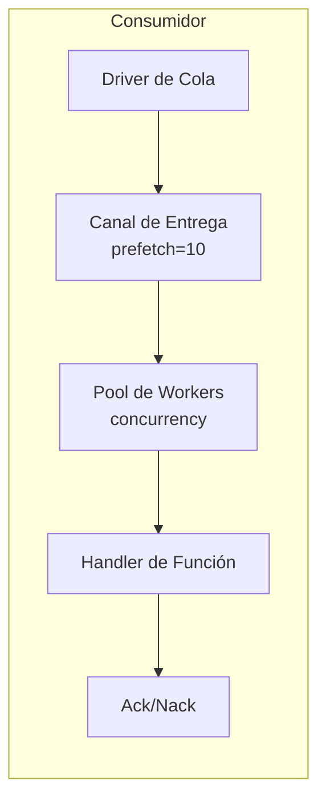

# Consumidores de Cola

Los consumidores de cola procesan mensajes de colas usando pools de workers.

## Visión General



## Configuración

| Opción | Por Defecto | Máx | Descripción |
|--------|---------|-----|-------------|
| `queue` | Requerido | - | ID de registro de la cola |
| `func` | Requerido | - | ID de registro de la función handler |
| `concurrency` | 1 | 1000 | Cantidad de workers |
| `prefetch` | 10 | 10000 | Tamaño del buffer de mensajes |

## Definición de Entrada

```yaml
- name: order_consumer
  kind: queue.consumer
  queue: app:orders
  func: app:process_order
  concurrency: 5
  prefetch: 20
  lifecycle:
    auto_start: true
    depends_on:
      - app:orders
```

## Función Handler

La función handler recibe el cuerpo del mensaje:

```lua
-- process_order.lua
local json = require("json")

local function handler(body)
    local order = json.decode(body)

    -- Procesar la orden
    local result, err = process_order(order)
    if err then
        -- Retornar error dispara Nack (requeue)
        return nil, err
    end

    -- Éxito dispara Ack
    return result
end

return handler
```

```yaml
- name: process_order
  kind: function.lua
  source: file://process_order.lua
  modules:
    - json
```

## Reconocimiento

| Resultado | Acción | Efecto |
|--------|--------|--------|
| Éxito | Ack | Mensaje removido de la cola |
| Error | Nack | Mensaje reencolado (dependiente del driver) |

## Pool de Workers

- Los workers se ejecutan como goroutines concurrentes
- Cada worker procesa un mensaje a la vez
- Los mensajes se distribuyen round-robin desde el canal de entrega
- El buffer de prefetch permite que el driver entregue por adelantado

### Ejemplo

```
concurrency: 3
prefetch: 10

Flujo:
1. El driver entrega hasta 10 mensajes al buffer
2. 3 workers extraen del buffer concurrentemente
3. A medida que los workers terminan, el buffer se rellena
4. Backpressure cuando todos los workers están ocupados y el buffer lleno
```

## Apagado Graceful

Al detener:
1. Dejar de aceptar nuevas entregas
2. Cancelar contextos de workers
3. Esperar mensajes en vuelo (con timeout)
4. Retornar error de timeout si los workers no terminan

## Declaración de Cola

```yaml
# Driver de cola (memoria para dev/test)
- name: queue_driver
  kind: queue.driver.memory
  lifecycle:
    auto_start: true

# Definición de cola
- name: orders
  kind: queue.queue
  driver: app:queue_driver
  options:
    queue_name: orders      # Sobrescribir nombre (por defecto: nombre de entrada)
    max_length: 10000       # Tamaño máximo de cola
    durable: true           # Sobrevivir reinicios
```

| Opción | Descripción |
|--------|-------------|
| `queue_name` | Sobrescribir nombre de cola (por defecto: nombre del ID de entrada) |
| `max_length` | Tamaño máximo de cola |
| `durable` | Sobrevivir reinicios (dependiente del driver) |

## Driver de Memoria

Cola en memoria incorporada para desarrollo/pruebas:

- Tipo: `queue.driver.memory`
- Mensajes almacenados en memoria
- Nack reencola mensaje al frente de la cola
- Sin persistencia a través de reinicios

## Ver También

- [Cola de Mensajes](lua/storage/queue.md) - Referencia del módulo Queue
- [Configuración de Cola](system/queue.md) - Drivers de cola y definiciones de entrada
- [Árboles de Supervisión](guides/supervision.md) - Ciclo de vida del consumidor
- [Gestión de Procesos](lua/core/process.md) - Creación de procesos y comunicación
