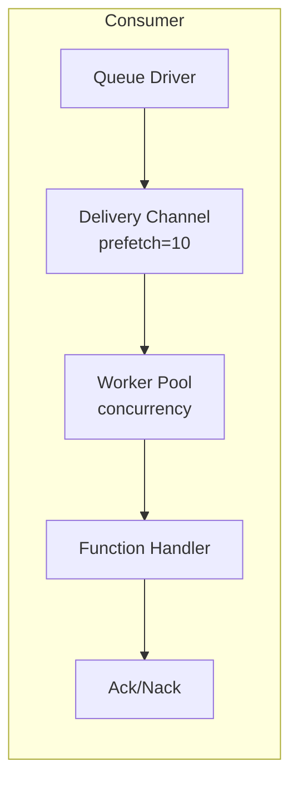

# Consumers de queue

Los consumers de queue entregan mensajes de una queue a handlers de funciones mediante un pool de workers configurable.

## Resumen


```mermaid
flowchart LR
    subgraph Consumer
        QD[Queue Driver] --> DC[Delivery Channel<br/>prefetch=10]
        DC --> WP[Worker Pool<br/>concurrency]
        WP --> FH[Function Handler]
        FH --> AN[Ack/Nack]
    end
```

## Configuración

| Opción | Predeterminado | Máximo | Descripción |
|--------|---------|-----|-------------|
| `queue` | Obligatorio | - | ID de la cola en el registro |
| `func` | Obligatorio | - | ID de la función controladora en el registro |
| `concurrency` | 1 | 1000 | Número de workers |
| `prefetch` | 10 | 10000 | Tamaño del buffer compartido de deliveries; AMQP también lo aplica como número de prefetch QoS del channel |
| `auto_ack` | false | - | Opción auto-ack específica del backend; para AMQP, `true` pide al broker confirmar al entregar |
| `driver_options` | `{}` | - | Opciones del consumer específicas del driver |

## Definición de la entrada

```yaml
- name: order_consumer
  kind: queue.consumer
  queue: app:orders
  func: app:process_order
  concurrency: 5
  prefetch: 20
  lifecycle:
    auto_start: true
    requires:
      - app:orders
```

## Función handler

La función handler recibe el body después de que el codec de la queue lo decodifique. Usa `queue.message()` para acceder al delivery actual y sus metadatos:

```lua
-- process_order.lua
local queue = require("queue")
local logger = require("logger")

local function main(order)
    local msg, msg_err = queue.message()
    if msg_err then
        return nil, msg_err
    end

    logger:info("processing order", {
        message_id = msg:id(),
        order_id = order.id
    })

    return {processed = true, order_id = order.id}
end

return {main = main}
```

```yaml
- name: process_order
  kind: function.lua
  source: file://process_order.lua
  method: main
  modules:
    - queue
    - logger
```

## Acknowledgment

A menos que el handler liquide explícitamente el delivery, el consumer usa el resultado de invocar la función:

| Resultado del handler | Acción | Efecto |
|-----------------|--------|--------|
| Termina sin error de invocación | Ack | El mensaje se elimina de la queue |
| Devuelve o lanza un error de invocación | Nack | La redelivery depende del driver |

Los valores de retorno ordinarios, incluido `false`, no eligen el comportamiento de acknowledgment. Llama a `msg:ack()` o `msg:nack()` para liquidarlo explícitamente. La liquidación es single-shot: gana la primera. Con AMQP `auto_ack: true`, el broker confirma al entregar, por lo que un fallo posterior del handler no puede provocar redelivery del broker.

## Pool de workers

- Los workers se ejecutan como goroutines concurrentes.
- Cada worker procesa un mensaje a la vez.
- Los workers toman mensajes de un delivery channel compartido. El siguiente worker libre recibe el siguiente mensaje, sin orden o rotación garantizados entre workers.
- El buffer de prefetch permite al driver entregar mensajes antes de procesarlos.

### Ejemplo

```
concurrency: 3
prefetch: 10

Flow:
1. Driver delivers up to 10 messages to buffer
2. 3 workers pull from buffer concurrently
3. As workers finish, buffer refills
4. Backpressure when all workers busy and buffer full
```

## Apagado ordenado :id=shutdown-ordenado

Durante el apagado, el consumidor:

1. Deja de aceptar deliveries nuevos.
2. Cancela los contextos de workers.
3. Espera los handlers in-flight hasta el stop timeout.
4. Devuelve un error de timeout si los workers no terminan.

## Declaración de la queue

```yaml
# Queue driver (memory for dev/test)
- name: queue_driver
  kind: queue.driver.memory
  lifecycle:
    auto_start: true

# Queue definition
- name: orders
  kind: queue.queue
  driver: app:queue_driver
  queue_name: orders        # Override name (default: entry name)
  codec: json/plain         # Payload codec (optional; json/plain is the default)
  dead_letter:              # Accepted configuration; not enforced by built-in drivers
    queue: app:dlq
    max_attempts: 5
  driver_options:
    memory:
      max_length: 10000     # Memory driver: bounded queue size
```

| Campo | Descripción |
|-------|-------------|
| `queue_name` | Sobrescribe el nombre de la queue (default: nombre del ID de entrada) |
| `codec` | Nombre del codec del payload |
| `dead_letter.queue` | ID de registro aceptado para una dead-letter queue; los drivers integrados no lo aplican |
| `dead_letter.max_attempts` | Número de intentos aceptado en configuración; los drivers integrados no lo aplican |
| `driver_options` | Settings específicos del driver, agrupados por nombre de driver |

<note>
Actualmente ningún driver integrado cuenta intentos ni enruta mensajes a partir del bloque `dead_letter`. El runtime no traduce ese bloque a argumentos de queue AMQP y los fallos ordinarios de consumers AMQP solicitan requeue. Por tanto, el dead-lettering del broker debe configurarse y activarse fuera de este bloque. El driver en memoria no enruta a una DLQ.
</note>

## Driver en memoria

El driver integrado en memoria está pensado para desarrollo y pruebas:

- Su kind es `queue.driver.memory`.
- Los mensajes se almacenan en memoria.
- Nack intenta volver a encolar al final una copia del mensaje; ese intento puede fallar cuando la queue limitada está llena.
- Los mensajes no persisten entre reinicios.

## Véase también

- [Message Queue](lua/storage/queue.md) — Referencia del módulo Queue
- [Configuración de queue](system/queue.md) — Drivers y definiciones de entradas
- [Supervisión](guides/supervision.md) — Ciclo de vida del consumer
- [Gestión de procesos](lua/core/process.md) — Creación y comunicación de procesos
