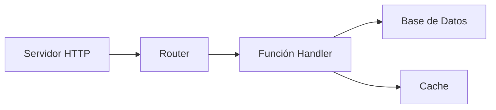
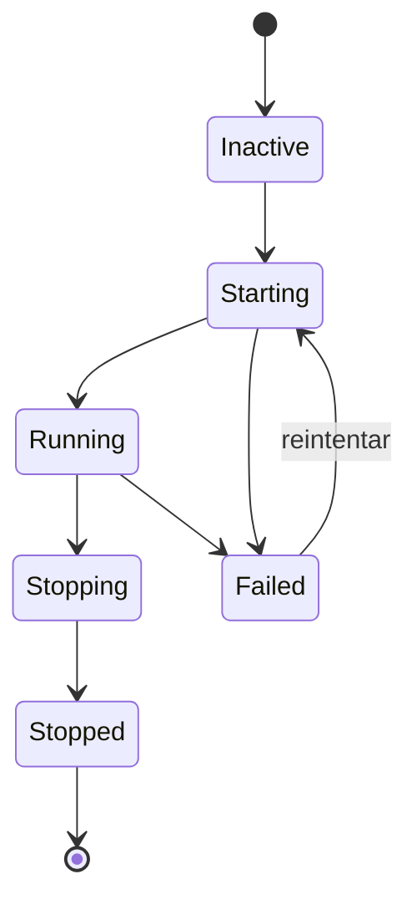

# Supervisión

El supervisor gestiona los ciclos de vida de los servicios, manejando el orden de inicio, reinicios automáticos, y apagado graceful. Los servicios con `auto_start: true` se inician cuando la aplicación arranca.

## Configuración de Ciclo de Vida

Los servicios se registran con el supervisor usando un bloque `lifecycle`. Para procesos, use `process.service` para envolver una definición de proceso:

```yaml
# Definición del proceso (el código)
- name: worker_process
  kind: process.lua
  source: file://worker.lua
  method: main

# Servicio supervisado (envuelve el proceso con gestión de ciclo de vida)
- name: worker
  kind: process.service
  process: app:worker_process
  host: app:processes
  lifecycle:
    auto_start: true
    start_timeout: 30s
    stop_timeout: 10s
    stable_threshold: 5s
    depends_on:
      - app:database
    restart:
      initial_delay: 2s
      max_delay: 60s
      max_attempts: 10
```

| Campo | Por Defecto | Descripción |
|-------|---------|-------------|
| `auto_start` | `false` | Iniciar automáticamente cuando el supervisor inicia |
| `start_timeout` | `10s` | Tiempo máximo permitido para inicio |
| `stop_timeout` | `10s` | Tiempo máximo para apagado graceful |
| `stable_threshold` | `5s` | Tiempo de ejecución antes de considerarse estable |
| `depends_on` | `[]` | Servicios que deben estar ejecutándose primero |

## Resolución de Dependencias

El supervisor resuelve dependencias de dos fuentes:

1. **Dependencias explícitas** declaradas en `depends_on`
2. **Dependencias extraídas del registro** desde referencias de entrada (ej., `database: app:db` en su config)



Las dependencias inician antes que los dependientes. Si el Servicio C depende de A y B, tanto A como B deben alcanzar el estado `Running` antes de que C inicie.

<tip>
No necesita declarar entradas de infraestructura como bases de datos en <code>depends_on</code>. El supervisor extrae automáticamente dependencias de las referencias del registro en la configuración de su entrada.
</tip>

## Política de Reinicio

Cuando un servicio falla, el supervisor reintenta con backoff exponencial:

```yaml
lifecycle:
  restart:
    initial_delay: 1s      # Espera del primer reintento
    max_delay: 90s         # Tope máximo de delay
    backoff_factor: 2.0    # Multiplicador de delay por intento
    jitter: 0.1            # +-10% de aleatorización
    max_attempts: 0        # 0 = reintentos infinitos
```

| Intento | Delay Base | Con Jitter (+-10%) |
|---------|------------|-------------------|
| 1 | 1s | 0.9s - 1.1s |
| 2 | 2s | 1.8s - 2.2s |
| 3 | 4s | 3.6s - 4.4s |
| 4 | 8s | 7.2s - 8.8s |
| ... | ... | ... |
| N | 90s | 81s - 99s (tope) |

Cuando un servicio se ejecuta por más tiempo que `stable_threshold`, el contador de reintentos se resetea. Esto previene que fallos transitorios escalen permanentemente los delays.

### Errores Terminales

Estos errores detienen los intentos de reintento:

- Cancelación de contexto
- Solicitud de terminación explícita
- Errores marcados como no reintentables

## Contexto de Seguridad

Los servicios pueden ejecutarse con una identidad de seguridad específica:

```yaml
# Definición del proceso
- name: admin_worker_process
  kind: process.lua
  source: file://admin_worker.lua
  method: main

# Servicio supervisado con contexto de seguridad
- name: admin_worker
  kind: process.service
  process: app:admin_worker_process
  host: app:processes
  lifecycle:
    auto_start: true
    security:
      actor:
        id: "service:admin-worker"
        meta:
          role: admin
      groups:
        - app:admin_policies
      policies:
        - app:data_access
```

El contexto de seguridad establece:

| Campo | Descripción |
|-------|-------------|
| `actor.id` | Cadena de identidad para este servicio |
| `actor.meta` | Metadatos clave-valor (rol, permisos, etc.) |
| `groups` | Grupos de políticas a aplicar |
| `policies` | Políticas individuales a aplicar |

El código ejecutándose en el servicio hereda este contexto de seguridad. El módulo `security` puede entonces verificar permisos:

```lua
local security = require("security")

if security.can("delete", "users") then
    -- permitido
end
```

<note>
Cuando no se configura contexto de seguridad, el servicio se ejecuta sin un actor. En modo estricto (por defecto), las verificaciones de seguridad fallan. Configure un contexto de seguridad para servicios que necesiten autorización.
</note>

## Estados del Servicio



El supervisor transiciona servicios a través de estos estados:

| Estado | Descripción |
|-------|-------------|
| `Inactive` | Registrado pero no iniciado |
| `Starting` | Inicio en progreso |
| `Running` | Operando normalmente |
| `Stopping` | Apagado graceful en progreso |
| `Stopped` | Terminado limpiamente |
| `Failed` | Ocurrió un error, puede reintentar |

## Orden de Inicio y Apagado

**Inicio**: Dependencias primero, luego dependientes. Servicios al mismo nivel de dependencia pueden iniciar en paralelo.

**Apagado**: Dependientes primero, luego dependencias. Esto asegura que los servicios dependientes terminen antes de que sus dependencias se detengan.

```
Inicio:  database -> cache -> handler -> http_server
Apagado: http_server -> handler -> cache -> database
```

## Ver También

- [Modelo de Procesos](concepts/process-model.md) - Ciclo de vida de procesos
- [Configuración](guides/configuration.md) - Formato de configuración YAML
- [Módulo Security](lua/security/security.md) - Verificaciones de permisos en Lua
