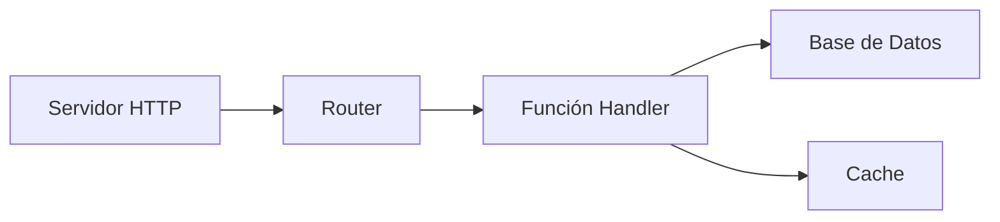
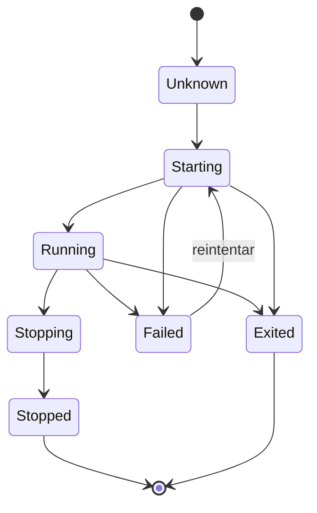

# Supervisión

El supervisor gestiona los ciclos de vida de los servicios, manejando el orden de inicio, reinicios automáticos, y apagado graceful. Los servicios con `auto_start: true` se inician cuando la aplicación arranca.

## Configuración de Ciclo de Vida

Los servicios se registran con el supervisor usando un bloque `lifecycle`. Para procesos, use `process.service` para envolver una definición de proceso:

```yaml
# Definición del proceso (el código)
- name: worker_process
  kind: process.lua
  source: file://worker.lua
  method: main

# Servicio supervisado (envuelve el proceso con gestión de ciclo de vida)
- name: worker
  kind: process.service
  process: app:worker_process
  host: app:processes
  lifecycle:
    auto_start: true
    start_timeout: 30s
    stop_timeout: 10s
    stable_threshold: 5s
    requires:
      - app:database
    restart:
      initial_delay: 2s
      max_delay: 60s
      max_attempts: 10
```

| Campo | Por Defecto | Descripción |
|-------|---------|-------------|
| `auto_start` | `false` | Iniciar automáticamente cuando el supervisor inicia |
| `start_timeout` | `10s` | Tiempo máximo permitido para inicio |
| `stop_timeout` | `10s` | Tiempo máximo para apagado graceful |
| `stable_threshold` | `5s` | Tiempo de ejecución antes de considerarse estable |
| `requires` | `[]` | Servicios que deben estar ejecutándose primero (alias heredado: `depends_on`) |
| `startup` | `required` | `required` reporta un auto-arranque fallido o bloqueado como un error de transacción; `optional` deja que el servicio siga reintentando en segundo plano sin hacer fallar el lote |

## Resolución de Dependencias

El supervisor resuelve dependencias de dos fuentes:

1. **Dependencias explícitas** declaradas en `requires` (o el heredado `depends_on`)
2. **Dependencias extraídas del registro** desde referencias de entrada (ej., `database: app:db` en su config)


```mermaid
graph LR
    A[Servidor HTTP] --> B[Router]
    B --> C[Función Handler]
    C --> D[Base de Datos]
    C --> E[Cache]
```

Las dependencias inician antes que los dependientes. Si el Servicio C depende de A y B, tanto A como B deben alcanzar el estado `Running` antes de que C inicie.

<tip>
No necesita declarar entradas de infraestructura como bases de datos en <code>depends_on</code>. El supervisor extrae automáticamente dependencias de las referencias del registro en la configuración de su entrada.
</tip>

## Política de Reinicio

Cuando un servicio falla, el supervisor reintenta con backoff exponencial:

```yaml
lifecycle:
  restart:
    initial_delay: 1s      # Espera del primer reintento
    max_delay: 90s         # Tope máximo de delay
    backoff_factor: 2.0    # Multiplicador de delay por intento
    jitter: 0.1            # ±10% de aleatorización
    max_attempts: 0        # 0 = reintentos infinitos
```

| Intento | Delay Base | Con Jitter (±10%) |
|---------|------------|-------------------|
| 1 | 1s | 0.9s - 1.1s |
| 2 | 2s | 1.8s - 2.2s |
| 3 | 4s | 3.6s - 4.4s |
| 4 | 8s | 7.2s - 8.8s |
| ... | ... | ... |
| N | 90s | 81s - 99s (tope) |

Cuando un servicio se ejecuta por más tiempo que `stable_threshold`, el contador de reintentos se resetea. Esto previene que fallos transitorios escalen permanentemente los delays.

### Errores Terminales

Estos errores detienen los intentos de reintento:

- Cancelación de contexto
- Solicitud de terminación explícita
- Errores marcados como no reintentables

## Contexto de Seguridad

Los servicios pueden ejecutarse con una identidad de seguridad específica:

```yaml
# Definición del proceso
- name: admin_worker_process
  kind: process.lua
  source: file://admin_worker.lua
  method: main

# Servicio supervisado con contexto de seguridad
- name: admin_worker
  kind: process.service
  process: app:admin_worker_process
  host: app:processes
  lifecycle:
    auto_start: true
    security:
      actor:
        id: "service:admin-worker"
        meta:
          role: admin
      groups:
        - app:admin_policies
      policies:
        - app:data_access
```

El contexto de seguridad establece:

| Campo | Descripción |
|-------|-------------|
| `actor.id` | Cadena de identidad para este servicio |
| `actor.meta` | Metadatos clave-valor (rol, permisos, etc.) |
| `groups` | Grupos de políticas a aplicar |
| `policies` | Políticas individuales a aplicar |

El código ejecutándose en el servicio hereda este contexto de seguridad. El módulo `security` puede entonces verificar permisos:

```lua
local security = require("security")

if security.can("delete", "users") then
    -- permitido
end
```

<note>
Cuando no se configura contexto de seguridad, el servicio se ejecuta sin un actor. En modo estricto (por defecto), las verificaciones de seguridad fallan. Configure un contexto de seguridad para servicios que necesiten autorización.
</note>

## Reregistro y Reemplazo

Un cambio en el registro puede volver a registrar un ID que ya tiene un controlador en ejecución. Si el registro lleva la misma instancia de servicio, nada se altera. Si lleva una instancia **distinta** — el manager reconstruyó el servicio porque su configuración cambió — el supervisor retira el controlador existente y adopta el reemplazo.

El retiro abarca más que ese único servicio. Un dependiente en ejecución capturó la instancia sustituida, por lo que no puede seguir ejecutándose contra un servicio que se está reemplazando por debajo; la clausura de retiro es el servicio reemplazado más todos los servicios en ejecución que dependen de él, detenidos en orden de dependencia (dependientes primero). Los servicios ya detenidos no se detienen una segunda vez — un manager que detiene su propia instancia antes de volver a registrarla no recibe un `Stop` redundante.

El traspaso es transaccional:

1. El plan se calcula sin tocar nada, de modo que un fallo de planificación deja intacto el conjunto en ejecución.
2. Se ejecuta el lote de detenciones. **Si alguna detención falla, el traspaso se rechaza**: los servicios que el lote ya detuvo se vuelven a levantar y se reporta el error. Un servicio que no pudo volver a levantarse se nombra en ese error. El supervisor termina siendo dueño del mismo conjunto en ejecución que tenía antes del commit, nunca de uno a medio retirar.
3. Solo después de que el lote tiene éxito se descartan y cancelan los controladores retirados, liberando las instancias de servicio sustituidas.
4. El reemplazo se crea e inicia a través del mismo secuenciador consciente de dependencias que cualquier otro inicio, y los dependientes que se detuvieron para el traspaso vuelven a levantarse contra la instancia adoptada.

Un servicio que estaba en ejecución antes del reemplazo se reinicia después, incluso cuando el nuevo registro establece `auto_start: false` — reemplazar un servicio activo es una actualización, no una detención implícita. Reiniciar un dependiente detenido se rige por su propia política de reinicio y no condiciona el commit.

## Estados del Servicio


```mermaid
stateDiagram-v2
    [*] --> Unknown
    Unknown --> Starting
    Starting --> Running
    Running --> Stopping
    Stopping --> Stopped
    Stopped --> [*]

    Running --> Failed
    Starting --> Failed
    Failed --> Starting : reintentar
    Running --> Exited
    Starting --> Exited
    Exited --> [*]
```

El supervisor transiciona servicios a través de estos estados:

| Estado | Descripción |
|-------|-------------|
| `Unknown` | Registrado pero no iniciado |
| `Starting` | Inicio en progreso |
| `Running` | Operando normalmente |
| `Stopping` | Apagado graceful en progreso |
| `Stopped` | Terminado limpiamente |
| `Exited` | Terminado por petición explícita o por un error no reintentable/terminal |
| `Failed` | Ocurrió un error, puede reintentar |

## Orden de Inicio y Apagado

**Inicio**: Dependencias primero, luego dependientes. Servicios al mismo nivel de dependencia pueden iniciar en paralelo.

**Apagado**: Dependientes primero, luego dependencias. Esto asegura que los servicios dependientes terminen antes de que sus dependencias se detengan.

```
Inicio:  database → cache → handler → http_server
Apagado: http_server → handler → cache → database
```

Con SIGINT o SIGTERM el runtime comienza un apagado graceful y toda la secuencia se ejecuta bajo un único presupuesto, `shutdown.timeout` en la configuración del runtime (30s por defecto). Ese presupuesto es un plazo nuevo que no hereda el contexto interrumpido, por lo que un Ctrl-C no corta el apagado de los componentes; el `stop_timeout` por servicio sigue acotando cada detención individual dentro de él. Una segunda señal omite la secuencia y sale inmediatamente.

```yaml
# .wippy.yaml
shutdown:
  timeout: 60s
```

## Ver También

- [Modelo de Procesos](concepts/process-model.md) - Ciclo de vida de procesos
- [Configuración](guides/configuration.md) - Formato de configuración YAML
- [Módulo Security](lua/security/security.md) - Verificaciones de permisos en Lua
