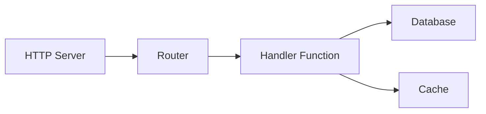
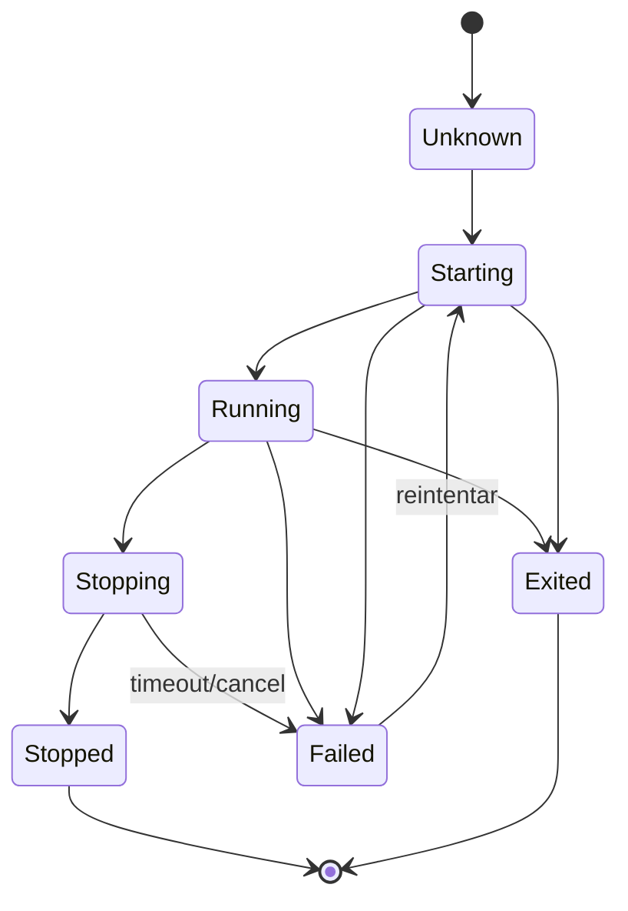

# Supervisión

El supervisor gestiona el inicio de servicios, el orden de dependencias, los reinicios y el apagado ordenado. Los servicios con `auto_start: true` se inician al arrancar la aplicación.

## Configuración del ciclo de vida

Los servicios se registran en el supervisor mediante un bloque `lifecycle`. Para procesos, usa `process.service` para envolver una definición de proceso:

```yaml
# Process definition (the code)
- name: worker_process
  kind: process.lua
  source: file://worker.lua
  method: main

# Supervised service (wraps the process with lifecycle management)
- name: worker
  kind: process.service
  process: app:worker_process
  host: app:processes
  lifecycle:
    auto_start: true
    startup: required
    start_timeout: 30s
    stop_timeout: 10s
    stable_threshold: 5s
    requires:
      - app:database
    restart:
      initial_delay: 2s
      max_delay: 60s
      max_attempts: 10
```

`host` debe referenciar un process host configurado. La entrada de `requires` debe resolver a otro servicio supervisado o, mediante la extracción de dependencias del registro, a un servicio supervisado propietario del recurso referenciado.

| Campo | Predeterminado | Descripción |
|-------|---------|-------------|
| `auto_start` | `false` | Iniciar automáticamente cuando el supervisor inicia |
| `start_timeout` | `10s` | Tiempo máximo permitido para inicio |
| `stop_timeout` | `10s` | Tiempo máximo para apagado graceful |
| `stable_threshold` | `5s` | Tiempo de ejecución antes de considerarse estable |
| `requires` | `[]` | Servicios que deben estar ejecutándose primero (alias heredado: `depends_on`) |
| `startup` | `required` | `required` reporta un auto-arranque fallido o bloqueado como un error de transacción; `optional` deja que el servicio siga reintentando en segundo plano sin hacer fallar el lote |

## Resolución de dependencias

El supervisor resuelve dependencias desde dos fuentes:

1. **Dependencias explícitas** declaradas en `requires` (o el heredado `depends_on`)
2. **Dependencias extraídas del registro** desde referencias de entrada (ej., `database: app:db` en su config)


```mermaid
graph LR
    A[HTTP Server] --> B[Router]
    B --> C[Handler Function]
    C --> D[Database]
    C --> E[Cache]
```

Las dependencias se inician antes que sus dependents. Si el servicio C depende de A y B, ambas deben alcanzar el estado `Running` antes de iniciar C.

<tip>
No hace falta repetir una referencia de infraestructura en <code>requires</code> cuando la extracción de dependencias del registro puede seguirla hasta un servicio supervisado. Usa <code>requires</code> para dependencias de ciclo de vida que no estén ya expresadas por referencias de entradas.
</tip>

## Policy de restart

Cuando un servicio falla, el supervisor reintenta según su bloque `restart`:

```yaml
lifecycle:
  restart:
    initial_delay: 1s      # Espera del primer reintento
    max_delay: 90s         # Tope máximo de delay
    backoff_factor: 2.0    # Multiplicador de delay por intento
    jitter: 0.1            # ±10% de aleatorización
    max_attempts: 0        # 0 = reintentos infinitos
```

| Intento | Delay Base | Con Jitter (±10%) |
|---------|------------|-------------------|
| 1 | 1s | 0.9s - 1.1s |
| 2 | 2s | 1.8s - 2.2s |
| 3 | 4s | 3.6s - 4.4s |
| 4 | 8s | 7.2s - 8.8s |
| ... | ... | ... |
| N | 90s | 81s - 99s (tope) |

`max_attempts` cuenta el inicio fallido inicial. Un valor de `1` no permite reintentos y `10` permite como máximo nueve inicios posteriores. `0` permite intentos ilimitados.

Cuando un servicio se ejecuta más que `stable_threshold`, su contador de reintentos se reinicia y los fallos posteriores vuelven al delay inicial.

### Errores terminales

Estos errores detienen los reintentos:

- Cancelación del contexto
- Solicitud explícita de terminación
- Errores marcados como no retryable

## Contexto de seguridad

Los servicios pueden ejecutarse con una identidad de seguridad específica:

```yaml
# Process definition
- name: admin_worker_process
  kind: process.lua
  source: file://admin_worker.lua
  method: main

# Supervised service with security context
- name: admin_worker
  kind: process.service
  process: app:admin_worker_process
  host: app:processes
  lifecycle:
    auto_start: true
    security:
      actor:
        id: "service:admin-worker"
        meta:
          role: admin
      groups:
        - app:admin_policies
      policies:
        - app:data_access
```

El contexto de seguridad define:

| Campo | Descripción |
|-------|-------------|
| `actor.id` | Cadena de identidad del servicio |
| `actor.meta` | Metadatos key-value (rol, permisos, etc.) |
| `groups` | Grupos de policies que se aplican |
| `policies` | Policies individuales que se aplican |

El código del servicio hereda este contexto de seguridad. El módulo `security` puede usarlo para comprobar permisos:

```lua
local security = require("security")

if security.can("delete", "users") then
    -- allowed
end
```

<note>
Cuando no se configura un bloque security, el supervisor no añade actor ni scope de policy específicos del servicio; se siguen heredando los valores de seguridad presentes en el contexto parent. En modo strict (predeterminado), se deniega una comprobación cuyo contexto de seguridad resultante esté incompleto. Configura un contexto de seguridad completo para los servicios que necesiten autorización.
</note>

## Reregistro y Reemplazo

Un cambio en el registro puede volver a registrar un ID que ya tiene un controlador en ejecución. Si el registro lleva la misma instancia de servicio, nada se altera. Si lleva una instancia **distinta** — el manager reconstruyó el servicio porque su configuración cambió — el supervisor retira el controlador existente y adopta el reemplazo.

El retiro abarca más que ese único servicio. Un dependiente en ejecución capturó la instancia sustituida, por lo que no puede seguir ejecutándose contra un servicio que se está reemplazando por debajo; la clausura de retiro es el servicio reemplazado más todos los servicios en ejecución que dependen de él, detenidos en orden de dependencia (dependientes primero). Los servicios ya detenidos no se detienen una segunda vez — un manager que detiene su propia instancia antes de volver a registrarla no recibe un `Stop` redundante.

El traspaso es transaccional:

1. El plan se calcula sin tocar nada, de modo que un fallo de planificación deja intacto el conjunto en ejecución.
2. Se ejecuta el lote de detenciones. **Si alguna detención falla, el traspaso se rechaza**: los servicios que el lote ya detuvo se vuelven a levantar y se reporta el error. Un servicio que no pudo volver a levantarse se nombra en ese error. El supervisor termina siendo dueño del mismo conjunto en ejecución que tenía antes del commit, nunca de uno a medio retirar.
3. Solo después de que el lote tiene éxito se descartan y cancelan los controladores retirados, liberando las instancias de servicio sustituidas.
4. El reemplazo se crea e inicia a través del mismo secuenciador consciente de dependencias que cualquier otro inicio, y los dependientes que se detuvieron para el traspaso vuelven a levantarse contra la instancia adoptada.

Un servicio que estaba en ejecución antes del reemplazo se reinicia después, incluso cuando el nuevo registro establece `auto_start: false` — reemplazar un servicio activo es una actualización, no una detención implícita. Reiniciar un dependiente detenido se rige por su propia política de reinicio y no condiciona el commit.

## Estados del Servicio


```mermaid
stateDiagram-v2
    [*] --> Unknown
    Unknown --> Starting
    Starting --> Running
    Running --> Stopping
    Stopping --> Stopped
    Stopping --> Failed : timeout/cancel
    Stopped --> [*]

    Running --> Failed
    Starting --> Failed
    Failed --> Starting : reintentar
    Running --> Exited
    Starting --> Exited
    Exited --> [*]
```

El supervisor hace pasar los servicios por estos estados:

| Estado | Descripción |
|-------|-------------|
| `Unknown` | Registrado pero no iniciado |
| `Starting` | Inicio en progreso |
| `Running` | Operando normalmente |
| `Stopping` | Apagado graceful en progreso |
| `Stopped` | Terminado limpiamente |
| `Exited` | Terminado por petición explícita o por un error no reintentable/terminal |
| `Failed` | Ocurrió un error, puede reintentar |

## Orden de inicio y apagado :id=orden-de-startup-y-shutdown

**Inicio:** las dependencias se inician antes que los dependientes. Los servicios del mismo nivel de dependencias pueden iniciarse en paralelo.

**Apagado:** los dependientes se detienen antes que las dependencias, lo que les permite terminar primero.

```
Inicio:  database → cache → handler → http_server
Apagado: http_server → handler → cache → database
```

Con SIGINT o SIGTERM el runtime comienza un apagado graceful y toda la secuencia se ejecuta bajo un único presupuesto, `shutdown.timeout` en la configuración del runtime (30s por defecto). Ese presupuesto es un plazo nuevo que no hereda el contexto interrumpido, por lo que un Ctrl-C no corta el apagado de los componentes; el `stop_timeout` por servicio sigue acotando cada detención individual dentro de él. Una segunda señal omite la secuencia y sale inmediatamente.

```yaml
# .wippy.yaml
shutdown:
  timeout: 60s
```

## Véase también

- [Modelo de procesos](concepts/process-model.md) — Ciclo de vida de procesos
- [Configuración](guides/configuration.md) — Formato de configuración YAML
- [Módulo Security](lua/security/security.md) — Comprobaciones de permisos en Lua
