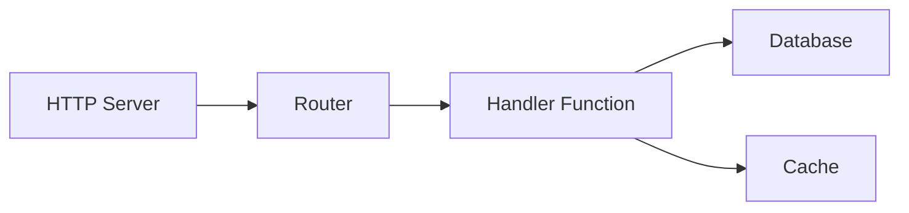
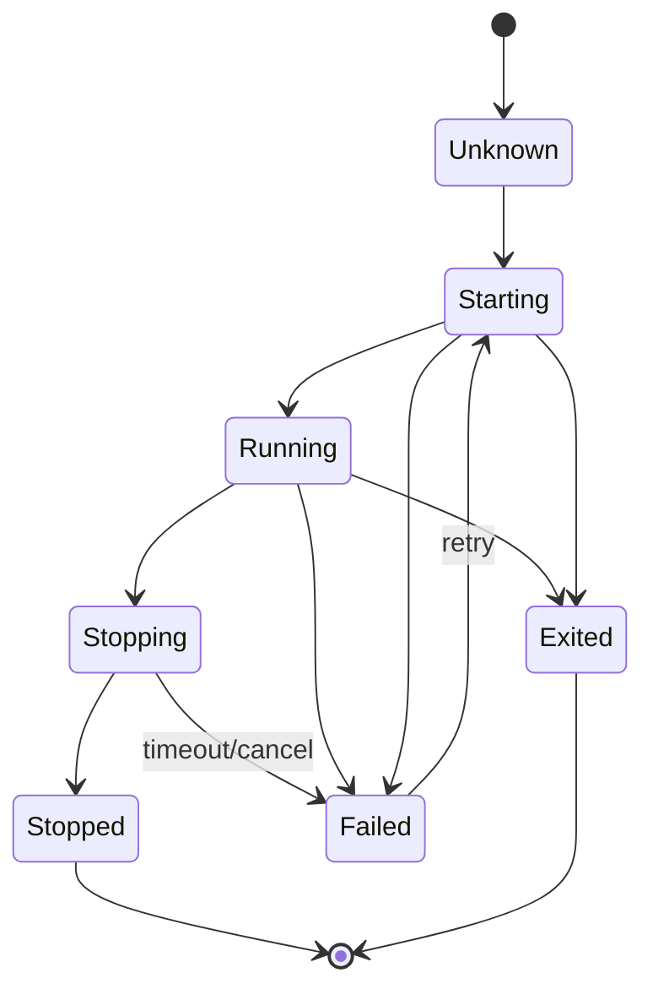

# Supervisión

El supervisor gestiona el inicio de servicios, el orden de dependencias, los reinicios y el shutdown ordenado. Los servicios con `auto_start: true` se inician al arrancar la aplicación.

## Configuración del ciclo de vida

Los servicios se registran en el supervisor mediante un bloque `lifecycle`. Para procesos, usa `process.service` para envolver una definición de proceso:

```yaml
# Process definition (the code)
- name: worker_process
  kind: process.lua
  source: file://worker.lua
  method: main

# Supervised service (wraps the process with lifecycle management)
- name: worker
  kind: process.service
  process: app:worker_process
  host: app:processes
  lifecycle:
    auto_start: true
    startup: required
    start_timeout: 30s
    stop_timeout: 10s
    stable_threshold: 5s
    requires:
      - app:database
    restart:
      initial_delay: 2s
      max_delay: 60s
      max_attempts: 10
```

`host` debe referenciar un process host configurado. La entrada de `requires` debe resolver a otro servicio supervisado o, mediante la extracción de dependencias del registro, a un servicio supervisado propietario del recurso referenciado.

| Campo | Predeterminado | Descripción |
|-------|---------|-------------|
| `auto_start` | `false` | Inicia automáticamente al arrancar el supervisor |
| `startup` | `required` | Policy de startup de una raíz auto-start: `required` bloquea el boot si falla; `optional` puede fallar y seguir reintentando sin bloquear branches independientes |
| `start_timeout` | `10s` | Tiempo máximo permitido para el startup |
| `stop_timeout` | `10s` | Tiempo máximo para el shutdown ordenado |
| `stable_threshold` | `5s` | Tiempo de ejecución tras el cual un fallo posterior reinicia el contador de reintentos |
| `requires` | `[]` | Servicios que deben estar running primero (alias legacy: `depends_on`) |

## Resolución de dependencias

El supervisor resuelve dependencias desde dos fuentes:

1. **Dependencias explícitas** declaradas en `requires` (o el legacy `depends_on`).
2. **Dependencias extraídas del registro** a partir de referencias de entradas, como `database: app:db`.


```mermaid
graph LR
    A[HTTP Server] --> B[Router]
    B --> C[Handler Function]
    C --> D[Database]
    C --> E[Cache]
```

Las dependencias se inician antes que sus dependents. Si el servicio C depende de A y B, ambas deben alcanzar el estado `Running` antes de iniciar C.

<tip>
No hace falta repetir una referencia de infraestructura en <code>requires</code> cuando la extracción de dependencias del registro puede seguirla hasta un servicio supervisado. Usa <code>requires</code> para dependencias de ciclo de vida que no estén ya expresadas por referencias de entradas.
</tip>

## Policy de restart

Cuando un servicio falla, el supervisor reintenta según su bloque `restart`:

```yaml
lifecycle:
  restart:
    initial_delay: 1s      # First retry wait
    max_delay: 90s         # Accepted backoff cap; see current behavior below
    backoff_factor: 2.0    # Accepted multiplier; see current behavior below
    jitter: 0.1            # ±10% randomization
    max_attempts: 0        # 0 = infinite retries
```

En el runtime v0.3.32a, el supervisor crea una calculadora de backoff nueva para cada reintento y solo toma su primer intervalo. Por ello, cada reintento espera `initial_delay` con el jitter configurado (0,9s–1,1s para los valores anteriores). `backoff_factor` y `max_delay` son campos de configuración aceptados, pero no cambian este schedule en el runtime fijado.

`max_attempts` cuenta el inicio fallido inicial. Un valor de `1` no permite reintentos y `10` permite como máximo nueve inicios posteriores. `0` permite intentos ilimitados.

Cuando un servicio se ejecuta más que `stable_threshold`, su contador de reintentos se reinicia y los fallos posteriores vuelven al delay inicial.

### Errores terminales

Estos errores detienen los reintentos:

- Cancelación del contexto
- Solicitud explícita de terminación
- Errores marcados como no retryable

## Contexto de seguridad

Los servicios pueden ejecutarse con una identidad de seguridad específica:

```yaml
# Process definition
- name: admin_worker_process
  kind: process.lua
  source: file://admin_worker.lua
  method: main

# Supervised service with security context
- name: admin_worker
  kind: process.service
  process: app:admin_worker_process
  host: app:processes
  lifecycle:
    auto_start: true
    security:
      actor:
        id: "service:admin-worker"
        meta:
          role: admin
      groups:
        - app:admin_policies
      policies:
        - app:data_access
```

El contexto de seguridad define:

| Campo | Descripción |
|-------|-------------|
| `actor.id` | Cadena de identidad del servicio |
| `actor.meta` | Metadatos key-value (rol, permisos, etc.) |
| `groups` | Grupos de policies que se aplican |
| `policies` | Policies individuales que se aplican |

El código del servicio hereda este contexto de seguridad. El módulo `security` puede usarlo para comprobar permisos:

```lua
local security = require("security")

if security.can("delete", "users") then
    -- allowed
end
```

<note>
Cuando no se configura un bloque security, el supervisor no añade actor ni scope de policy específicos del servicio; se siguen heredando los valores de seguridad presentes en el contexto parent. En modo strict (predeterminado), se deniega una comprobación cuyo contexto de seguridad resultante esté incompleto. Configura un contexto de seguridad completo para los servicios que necesiten autorización.
</note>

## Estados de servicio


```mermaid
stateDiagram-v2
    [*] --> Unknown
    Unknown --> Starting
    Starting --> Running
    Running --> Stopping
    Stopping --> Stopped
    Stopping --> Failed : timeout/cancel
    Stopped --> [*]

    Running --> Failed
    Starting --> Failed
    Failed --> Starting : retry
    Running --> Exited
    Starting --> Exited
    Exited --> [*]
```

El supervisor hace pasar los servicios por estos estados:

| Estado | Descripción |
|-------|-------------|
| `Unknown` | Registrado pero no iniciado |
| `Starting` | Startup en curso |
| `Running` | Funcionamiento normal |
| `Stopping` | Apagado ordenado en curso |
| `Stopped` | Operación de stop completada; los detalles informados por el servicio aún pueden incluir un error |
| `Exited` | Terminado por solicitud explícita o error no retryable/terminal |
| `Failed` | Se produjo un error; puede reintentarse |

## Orden de startup y shutdown

**Startup:** las dependencias se inician antes que los dependents. Los servicios del mismo nivel de dependencias pueden iniciarse en paralelo.

**Apagado:** los dependientes se detienen antes que las dependencias, lo que les permite terminar primero.

```
Startup:  database → cache → handler → http_server
Shutdown: http_server → handler → cache → database
```

## Véase también

- [Modelo de procesos](../concepts/process-model.md) — Ciclo de vida de procesos
- [Configuración](./configuration.md) — Formato de configuración YAML
- [Módulo Security](../lua/security/security.md) — Comprobaciones de permisos en Lua
