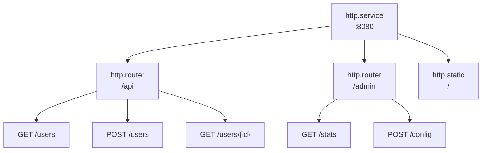

# Routing

Los routers agrupan endpoints bajo prefijos de URL y aplican middleware compartido. Los endpoints definen manejadores HTTP.

## Arquitectura



Las entradas referencian padres vía metadatos:
- Routers: `meta.server: app:gateway`
- Endpoints: `meta.router: app:api`

## Configuración del Router

```yaml
- name: api
  kind: http.router
  meta:
    server: gateway
  prefix: /api/v1
  middleware:
    - cors
    - compress
  options:
    cors.allow.origins: "*"
  post_middleware:
    - endpoint_firewall
```

| Campo | Tipo | Descripción |
|-------|------|-------------|
| `meta.server` | ID de Registro | Servidor HTTP padre |
| `prefix` | string | Prefijo de URL para todas las rutas |
| `middleware` | []string | Middleware pre-match |
| `options` | map | Opciones de middleware |
| `post_middleware` | []string | Middleware post-match |
| `post_options` | map | Opciones de middleware post-match |

## Configuración de Endpoint

```yaml
- name: get_user
  kind: http.endpoint
  meta:
    router: api
  method: GET
  path: /users/{id}
  func: app.users:get_user
```

| Campo | Tipo | Descripción |
|-------|------|-------------|
| `meta.router` | ID de Registro | Router padre |
| `method` | string | Método HTTP (GET, POST, PUT, DELETE, PATCH, HEAD) |
| `path` | string | Patrón de ruta URL (comienza con `/`) |
| `func` | ID de Registro | Función handler |

## Parámetros de Ruta

Use sintaxis `{param}` para parámetros de URL:

```yaml
- name: get_post
  kind: http.endpoint
  meta:
    router: api
  method: GET
  path: /users/{user_id}/posts/{post_id}
  func: get_user_post
```

Acceso en handler:

```lua
local http = require("http")

local function handler()
    local req = http.request()
    local user_id = req:param("user_id")
    local post_id = req:param("post_id")

    -- ...
end
```

### Rutas Comodín

Capture segmentos de ruta restantes con `{param...}`:

```yaml
- name: serve_files
  kind: http.endpoint
  meta:
    router: api
  method: GET
  path: /files/{filepath...}
  func: serve_file
```

```lua
-- Solicitud: GET /api/v1/files/docs/guides/readme.md
local file_path = req:param("filepath")  -- "docs/guides/readme.md"
```

El comodín debe ser el último segmento en la ruta.

## Funciones Handler

Los handlers de endpoint usan el módulo `http` para acceder a objetos de solicitud y respuesta. Ver [Módulo HTTP](lua-http.md) para la API completa.

```lua
local http = require("http")
local json = require("json")

local function handler()
    local req = http.request()
    local res = http.response()

    local user_id = req:param("id")
    local user = get_user(user_id)

    res:status(200)
    res:write(json.encode(user))
end

return { handler = handler }
```

## Opciones de Middleware

Las opciones de middleware usan notación de punto con el nombre del middleware como prefijo:

```yaml
middleware:
  - cors
  - ratelimit
  - token_auth
options:
  cors.allow.origins: "https://app.example.com"
  cors.allow.methods: "GET,POST,PUT,DELETE"
  ratelimit.requests: "100"
  ratelimit.window: "1m"
  token_auth.store: "app:tokens"
  token_auth.header.name: "Authorization"
```

El middleware post-match usa `post_options`:

```yaml
post_middleware:
  - endpoint_firewall
post_options:
  endpoint_firewall.default_policy: "deny"
```

## Middleware Pre-Match vs Post-Match

**Pre-match** (`middleware`) se ejecuta antes del matching de ruta:
- CORS (maneja preflight OPTIONS)
- Compresión
- Rate limiting
- Detección de IP real
- Autenticación de token (enriquecimiento de contexto)

**Post-match** (`post_middleware`) se ejecuta después de que la ruta es matcheada:
- Firewall de endpoint (necesita info de ruta para autorización)
- Firewall de recurso
- WebSocket relay

```yaml
middleware:        # Pre-match: todas las solicitudes a este router
  - cors
  - compress
  - token_auth     # Enriquece contexto con actor/scope

post_middleware:   # Post-match: solo rutas matcheadas
  - endpoint_firewall  # Usa actor de token_auth
```

<tip>
La autenticación de token puede ser pre-match porque solo enriquece contexto: no bloquea solicitudes. La autorización ocurre en middleware post-match como <code>endpoint_firewall</code> que usa el actor establecido por <code>token_auth</code>.
</tip>

## Ejemplo Completo

```yaml
version: "1.0"
namespace: app

entries:
  # Servidor
  - name: gateway
    kind: http.service
    addr: ":8080"
    lifecycle:
      auto_start: true

  # Router de API
  - name: api
    kind: http.router
    meta:
      server: gateway
    prefix: /api/v1
    middleware:
      - cors
      - compress
      - ratelimit
    options:
      cors.allow.origins: "https://app.example.com"
      ratelimit.requests: "100"
      ratelimit.window: "1m"

  # Función handler
  - name: get_users
    kind: function.lua
    source: file://handlers/users.lua
    method: list
    modules:
      - http
      - json
      - sql

  # Endpoints
  - name: list_users
    kind: http.endpoint
    meta:
      router: api
    method: GET
    path: /users
    func: get_users

  - name: get_user
    kind: http.endpoint
    meta:
      router: api
    method: GET
    path: /users/{id}
    func: app:get_user_by_id

  - name: create_user
    kind: http.endpoint
    meta:
      router: api
    method: POST
    path: /users
    func: app:create_user
```

## Rutas Protegidas

Patrón común con autenticación:

```yaml
entries:
  # Rutas públicas (sin auth)
  - name: public
    kind: http.router
    meta:
      server: gateway
    prefix: /api/public
    middleware:
      - cors

  # Rutas protegidas
  - name: protected
    kind: http.router
    meta:
      server: gateway
    prefix: /api
    middleware:
      - cors
      - token_auth
    options:
      token_store: app:tokens
    post_middleware:
      - endpoint_firewall
```

## Ver También

- [Servidor](http-server.md) - Configuración del servidor HTTP
- [Archivos Estáticos](http-static.md) - Servicio de archivos estáticos
- [Middleware](http-middleware.md) - Middleware disponible
- [Módulo HTTP](lua-http.md) - API HTTP de Lua
