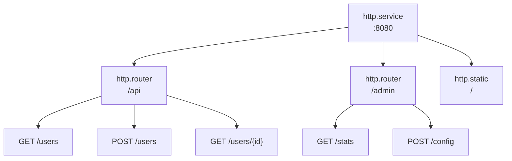

# Routing

Un `http.router` agrupa endpoints bajo un prefijo de URL y aplica middleware compartido. Cada `http.endpoint` define un handler HTTP.

**Clasificación: referencia de enrutamiento.** Los bloques de configuración son fragmentos parciales de registro salvo que incluyan un namespace y cada entrada referenciada. Los bloques de handler usan ID de funciones propiedad de la aplicación en lugar de definir una capa de datos.

## Arquitectura


```mermaid
flowchart TB
    S[http.service<br/>:8080] --> R1[http.router<br/>/api]
    S --> R2[http.router<br/>/admin]
    S --> ST[http.static<br/>/]

    R1 --> E1[GET /users]
    R1 --> E2[POST /users]
    R1 --> E3["GET /users/{id}"]

    R2 --> E4[GET /stats]
    R2 --> E5[POST /config]
```

Las entradas referencian padres vía metadatos:
- Routers: `meta.server: app:gateway`
- Endpoints: `meta.router: app:api`

## Configuración del Router

```yaml
- name: api
  kind: http.router
  meta:
    server: gateway
  prefix: /api/v1
  middleware:
    - cors
    - compress
  options:
    cors.allow.origins: "*"
  post_middleware:
    - endpoint_firewall
```

| Campo | Tipo | Descripción |
|-------|------|-------------|
| `meta.server` | ID de Registro | Servidor HTTP padre |
| `prefix` | string | Prefijo de URL para todas las rutas |
| `middleware` | []string | Middleware pre-match |
| `options` | map | Opciones de middleware |
| `post_middleware` | []string | Middleware post-match |
| `post_options` | map | Opciones de middleware post-match |

## Configuración de Endpoint

```yaml
- name: get_user
  kind: http.endpoint
  meta:
    router: api
  method: GET
  path: /users/{id}
  func: app.users:get_user
```

| Campo | Tipo | Descripción |
|-------|------|-------------|
| `meta.router` | ID de Registro | Router padre |
| `method` | string | Método HTTP: `GET`, `POST`, `PUT`, `DELETE`, `PATCH`, `HEAD`, `OPTIONS`, `TRACE` o `*` para todos los métodos |
| `path` | string | Patrón de ruta URL (comienza con `/`) |
| `func` | ID de Registro | Función handler |

## Parámetros de Ruta

Use sintaxis `{param}` para parámetros de URL:

```yaml
- name: get_post
  kind: http.endpoint
  meta:
    router: api
  method: GET
  path: /users/{user_id}/posts/{post_id}
  func: get_user_post
```

Acceso en handler:

```lua
local http = require("http")

local function handler()
    local req, req_err = http.request()
    if req_err then return nil, req_err end
    local user_id, user_err = req:param("user_id")
    if user_err then return nil, user_err end
    local post_id, post_err = req:param("post_id")
    if post_err then return nil, post_err end

    return {user_id = user_id, post_id = post_id}
end
```

### Rutas Comodín

Capture segmentos de ruta restantes con `{param...}`:

```yaml
- name: serve_files
  kind: http.endpoint
  meta:
    router: api
  method: GET
  path: /files/{filepath...}
  func: serve_file
```

El comodín coincide con los segmentos restantes, por lo que una solicitud como `GET /api/v1/files/docs/guides/readme.md` se despacha con `req:param("filepath")` establecido en `docs/guides/readme.md`.

El comodín debe ser el último segmento de la ruta.

## Funciones Handler

Los handlers de endpoint usan el módulo `http` para acceder a objetos de solicitud y respuesta. Consulta [Módulo HTTP](lua/http/http.md) para la referencia de las API de solicitud y respuesta.

```lua
local http = require("http")
local funcs = require("funcs")

local function handler()
    local req, req_err = http.request()
    if req_err then return nil, req_err end
    local res, res_err = http.response()
    if res_err then return nil, res_err end

    local user_id, param_err = req:param("id")
    if param_err then return nil, param_err end
    local user, call_err = funcs.call("app.users:get_user", user_id)
    if call_err then return nil, call_err end

    local status_err = res:set_status(http.STATUS.OK)
    if status_err then return nil, status_err end
    local write_err = res:write_json(user)
    if write_err then return nil, write_err end
    return true
end

return { handler = handler }
```

## Opciones de Middleware

Las opciones de middleware usan notación de punto con el nombre del middleware como prefijo:

```yaml
middleware:
  - cors
  - ratelimit
  - token_auth
options:
  cors.allow.origins: "https://app.example.com"
  cors.allow.methods: "GET,POST,PUT,DELETE"
  ratelimit.requests: "100"
  ratelimit.window: "1m"
  token_auth.store: "app:tokens"
  token_auth.header.name: "Authorization"
```

El middleware post-match usa `post_options`:

```yaml
post_middleware:
  - endpoint_firewall
post_options:
  endpoint_firewall.action: "access"
```

## Middleware pre-handler y post-match

**Pre-handler** (`middleware`) se ejecuta después de que el servidor selecciona una ruta, pero antes de adjuntar al contexto de la solicitud los parámetros de ruta y los metadatos del endpoint:
- CORS (maneja preflight OPTIONS)
- Compresión
- Rate limiting
- Detección de IP real
- Autenticación de token (enriquecimiento de contexto)

**Post-match** (`post_middleware`) se ejecuta después de adjuntar los parámetros de ruta y los metadatos del endpoint:
- Firewall de endpoint (necesita info de ruta para autorización)
- Firewall de recurso
- WebSocket relay

```yaml
middleware:        # Before endpoint metadata: matched routes only
  - cors
  - compress
  - token_auth     # Enriches context with actor/scope

post_middleware:   # Post-match: matched routes only
  - endpoint_firewall  # Uses actor from token_auth
```

<tip>
La autenticación mediante token pertenece a la cadena pre-handler porque enriquece el contexto de la solicitud antes de la autorización. El middleware de autorización, como <code>endpoint_firewall</code>, pertenece a la cadena post-match porque necesita el ID del endpoint coincidente. Las solicitudes sin coincidencia no ejecutan ninguna de las dos cadenas del router.
</tip>

## Conexión del router y los endpoints

Este ejemplo define la entrada del handler de lista. Los ID de función `app:get_user_by_id` y `app:create_user` hacen referencia a handlers definidos en otro lugar del mismo namespace.

```yaml
version: "1.0"
namespace: app

entries:
  # Server
  - name: gateway
    kind: http.service
    addr: ":8080"
    lifecycle:
      auto_start: true

  # API Router
  - name: api
    kind: http.router
    meta:
      server: gateway
    prefix: /api/v1
    middleware:
      - cors
      - compress
      - ratelimit
    options:
      cors.allow.origins: "https://app.example.com"
      ratelimit.requests: "100"
      ratelimit.window: "1m"

  # Handler function
  - name: get_users
    kind: function.lua
    source: file://handlers/users.lua
    method: list
    modules:
      - http
      - json
      - sql

  # Endpoints
  - name: list_users
    kind: http.endpoint
    meta:
      router: api
    method: GET
    path: /users
    func: get_users

  - name: get_user
    kind: http.endpoint
    meta:
      router: api
    method: GET
    path: /users/{id}
    func: app:get_user_by_id

  - name: create_user
    kind: http.endpoint
    meta:
      router: api
    method: POST
    path: /users
    func: app:create_user
```

## Rutas Protegidas

La configuración siguiente separa las rutas públicas de las que requieren autenticación y autorización:

```yaml
entries:
  # Public routes (no auth)
  - name: public
    kind: http.router
    meta:
      server: gateway
    prefix: /api/public
    middleware:
      - cors

  # Protected routes
  - name: protected
    kind: http.router
    meta:
      server: gateway
    prefix: /api
    middleware:
      - cors
      - token_auth
    options:
      token_auth.store: app:tokens
    post_middleware:
      - endpoint_firewall
```

## Véase también

- [Servidor](http/server.md) - Configuración del servidor HTTP
- [Archivos estáticos](http/static.md) - Servicio de archivos estáticos
- [Middleware](http/middleware.md) - Middleware disponible
- [Módulo HTTP](lua/http/http.md) - API HTTP de Lua
