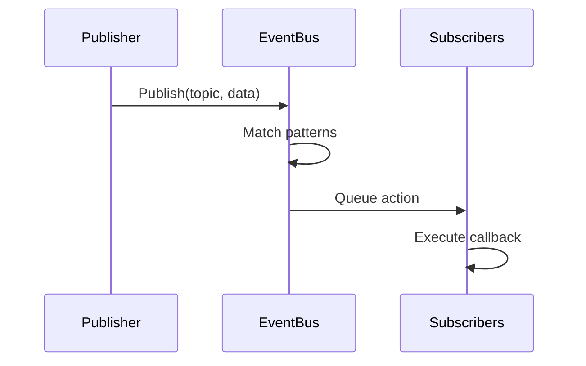
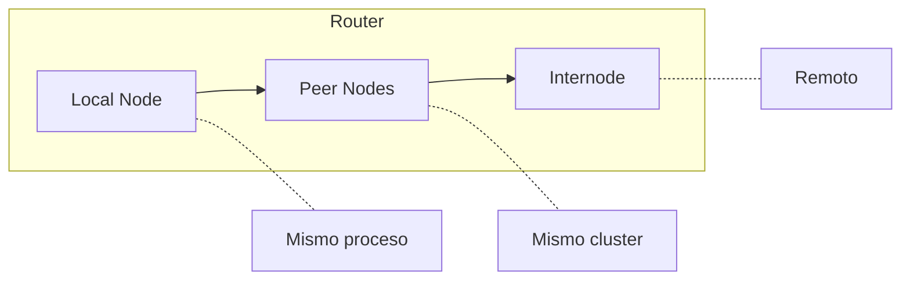

# Arquitectura

<note>
Esta página está en progreso. El contenido puede estar incompleto o cambiar.
</note>

Wippy es un sistema de capas construido en Go. Los componentes se inicializan en orden de dependencias, se comunican a través de un event bus, y ejecutan procesos Lua vía un scheduler de work-stealing.

## Capas

| Capa | Componentes |
|------|-------------|
| Application | Procesos Lua, funciones, workflows |
| Runtime | Motor Lua (gopher-lua), 50+ módulos |
| Services | HTTP, Queue, Storage, Temporal |
| System | Topology, Factory, Functions, Contracts |
| Core | Scheduler, Registry, Dispatcher, EventBus, Relay |
| Infrastructure | AppContext, Logger, Transcoder |

Cada capa depende solo de capas debajo de ella. La capa Core proporciona primitivos fundamentales, mientras Services construye abstracciones de nivel más alto encima.

## Secuencia de Boot

El startup de la aplicación procede a través de cuatro fases.

### Fase 1: Infraestructura

Crea infraestructura core antes de que cualquier componente cargue:

| Componente | Propósito |
|------------|-----------|
| AppContext | Diccionario sellado para referencias de componentes |
| EventBus | Pub/sub para comunicación entre componentes |
| Transcoder | Serialización de payload (JSON, YAML, Lua) |
| Logger | Logging estructurado con streaming de eventos |
| Relay | Routing de mensajes (Node, Router, Mailbox) |

### Fase 2: Carga de Componentes

El Loader resuelve dependencias vía ordenamiento topológico y carga componentes nivel por nivel. Componentes en el mismo nivel cargan en paralelo.

| Nivel | Componentes | Dependencias |
|-------|-------------|--------------|
| 0 | PIDGen | ninguna |
| 1 | Dispatcher | PIDGen |
| 2 | Registry | Dispatcher |
| 3 | Finder, Supervisor | Registry |
| 4 | Topology | Supervisor |
| 5 | Lifecycle | Topology |
| 6 | Factory | Lifecycle |
| 7 | Functions | Factory |

Cada componente se adjunta al contexto durante Load, haciendo servicios disponibles a componentes dependientes.

### Fase 3: Activación

Después de que todos los componentes cargan:

1. **Freeze Dispatcher** - Bloquea registry de handlers de comandos para lookups sin lock
2. **Seal AppContext** - No más escrituras permitidas, habilita lecturas sin lock
3. **Start Components** - Llama `Start()` en cada componente con interfaz `Starter`

### Fase 4: Carga de Entradas

Las entradas de registry (de archivos YAML) son cargadas y validadas:

1. Entradas parseadas de archivos de proyecto
2. Etapas de pipeline transforman entradas (override, link, bytecode)
3. Servicios marcados `auto_start: true` comienzan a ejecutar
4. Supervisor monitorea servicios registrados

## Componentes

Los componentes son servicios Go que participan en el ciclo de vida de la aplicación.

### Fases de Ciclo de Vida

| Fase | Método | Propósito |
|------|--------|-----------|
| Load | `Load(ctx) (ctx, error)` | Inicializar y adjuntar al contexto |
| Start | `Start(ctx) error` | Comenzar operación activa |
| Stop | `Stop(ctx) error` | Apagado graceful |

Los componentes declaran dependencias. El loader construye un grafo acíclico dirigido y ejecuta en orden topológico. El shutdown ocurre en orden reverso.

### Componentes Estándar

| Componente | Dependencias | Propósito |
|------------|--------------|-----------|
| PIDGen | ninguna | Generación de ID de proceso |
| Dispatcher | PIDGen | Despacho de handlers de comandos |
| Registry | Dispatcher | Almacenamiento y versionado de entradas |
| Finder | Registry | Lookup y búsqueda de entradas |
| Supervisor | Registry | Políticas de reinicio de servicios |
| Topology | Supervisor | Árbol padre/hijo de procesos |
| Lifecycle | Topology | Gestión de ciclo de vida de servicios |
| Factory | Lifecycle | Generación de procesos |
| Functions | Factory | Llamadas a funciones stateless |

## Event Bus

Pub/sub asíncrono para comunicación entre componentes.

### Diseño

- Una sola goroutine dispatcher procesa todos los eventos
- Entrega de acciones basada en cola previene bloqueo de publishers
- Pattern matching soporta tópicos exactos y wildcards (`*`)
- Ciclo de vida basado en contexto vincula suscripciones a cancelación

### Flujo de Eventos

### Tópicos Comunes

| Tópico | Publisher | Propósito |
|--------|-----------|-----------|
| `registry.entry.*` | Registry | Cambios de entrada |
| `process.started` | Topology | Ciclo de vida de proceso |
| `process.stopped` | Topology | Ciclo de vida de proceso |
| `supervisor.state.*` | Supervisor | Cambios de estado de servicio |

## Registry

Almacenamiento versionado para definiciones de entradas.

### Características

- **Versioned State** - Cada mutación crea nueva versión
- **History** - Historial respaldado por SQLite para audit trail
- **Observation** - Watch de entradas específicas para cambios
- **Event-driven** - Publica eventos en mutaciones

### Ciclo de Vida de Entrada

Etapas de pipeline transforman entradas:

| Etapa | Propósito |
|-------|-----------|
| Override | Aplicar overrides de config |
| Disable | Remover entradas por patrón |
| Link | Resolver requirements y dependencias |
| Bytecode | Compilar Lua a bytecode |
| EmbedFS | Recolectar entradas de filesystem |

## Relay

Routing de mensajes entre procesos a través de nodos.

### Routing de Tres Niveles

1. **Local** - Entrega directa dentro del mismo nodo
2. **Peer** - Forward a nodos peer en cluster
3. **Internode** - Enrutar a nodos remotos vía red

### Mailbox

Cada nodo tiene un mailbox con pool de workers:

- Hashing FNV-1a asigna remitentes a workers
- Preserva ordenamiento de mensajes por remitente
- Workers procesan mensajes concurrentemente
- Back-pressure cuando cola se llena

## AppContext

Diccionario sellado para referencias de componentes.

| Propiedad | Comportamiento |
|-----------|----------------|
| Before seal | Escrituras protegidas con RWMutex |
| After seal | Lecturas sin lock, panic en escritura |
| Duplicate keys | Panic |
| Type safety | Funciones getter tipadas |

Los componentes adjuntan servicios durante fase Load. Después de que boot completa, AppContext es sellado para rendimiento óptimo de lectura.

## Shutdown

El apagado graceful procede en orden reverso de dependencias:

1. SIGINT/SIGTERM dispara shutdown
2. Supervisor detiene servicios gestionados
3. Componentes con interfaz `Stopper` reciben `Stop()`
4. Limpieza de infraestructura

Segunda señal fuerza salida inmediata.

## Ver También

- [Scheduler](internals/scheduler.md) - Ejecución de procesos
- [Event Bus](internals/events.md) - Sistema pub/sub
- [Registry](internals/registry.md) - Gestión de estado
- [Command Dispatch](internals/dispatch.md) - Manejo de yields
