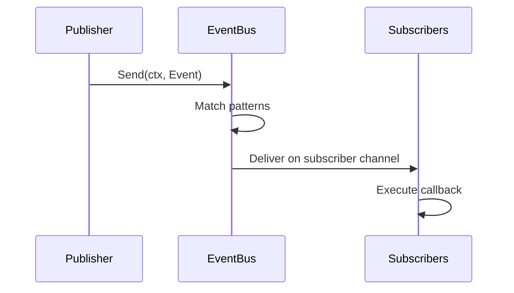
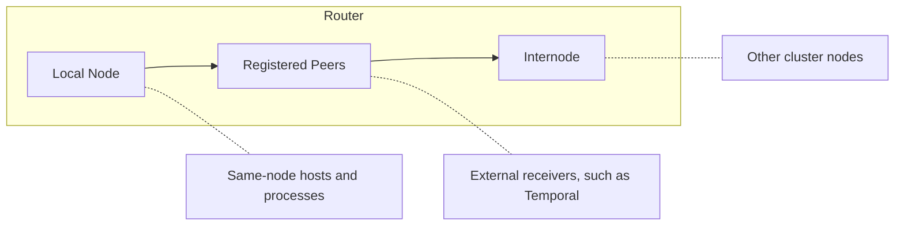

# Arquitectura

Wippy es un sistema de capas construido en Go. Los componentes se inicializan en orden de dependencias, se comunican a través de un event bus, y ejecutan procesos Lua vía un scheduler de work-stealing.

Esta es una referencia de implementación. Los diagramas y tipos Go describen componentes internos del entorno de ejecución, no entradas del registro de aplicaciones ni API de extensión.

## Capas

| Capa | Componentes |
|------|-------------|
| Application | Procesos Lua, funciones, workflows |
| Runtime | Motor Lua (wippyai/go-lua) y módulos del entorno de ejecución |
| Services | HTTP, Queue, Storage, Temporal |
| System | Topology, Factory, Functions, Contracts |
| Core | Scheduler, Registry, Dispatcher, EventBus, Relay |
| Infrastructure | AppContext, Logger, Transcoder |

Cada capa depende solo de capas debajo de ella. La capa Core proporciona primitivos fundamentales, mientras Services construye abstracciones de nivel más alto encima.

## Secuencia de Boot

El startup de la aplicación procede a través de cuatro fases.

### Fase 1: Infraestructura

Crea infraestructura core antes de que cualquier componente cargue:

| Componente | Propósito |
|------------|-----------|
| AppContext | Diccionario sellado para referencias de componentes |
| EventBus | Pub/sub para comunicación entre componentes |
| Transcoder | Serialización de payload (JSON, YAML, Lua) |
| Logger | Logging estructurado con streaming de eventos |
| Relay | Routing de mensajes (Node, Router, Mailbox) |

### Fase 2: Carga de Componentes

El Loader resuelve las dependencias mediante ordenamiento topológico y carga los componentes secuencialmente, nivel por nivel. Los componentes de un mismo nivel también se cargan de uno en uno.

Las aristas de dependencia determinan los niveles; grupos de paquetes como Core y System no imponen un orden global independiente. Por ello, los componentes sin una arista de dependencia pueden cargarse en el mismo nivel con independencia del grupo del paquete.

Cada componente se adjunta al contexto durante Load, haciendo servicios disponibles a componentes dependientes.

### Fase 3: Activación

Después de que todos los componentes cargan:

1. **Start runtime services** - Llama a `StartRuntimeServices(ctx)`
2. **Freeze Dispatcher** - Bloquea registry de handlers de comandos para lookups sin lock
3. **Seal AppContext** - No más escrituras permitidas, habilita lecturas sin lock
4. **Start Components** - Llama `Start()` en cada componente con interfaz `Starter`

### Fase 4: Carga de Entradas

Las entradas del registro procedentes de los manifiestos de proyecto `_index.json`, `_index.yaml` y `_index.yml` se cargan y validan:

1. Entradas parseadas de archivos de proyecto
2. Etapas de pipeline transforman entradas (override, link, bytecode)
3. Servicios marcados `auto_start: true` comienzan a ejecutar
4. Supervisor monitorea servicios registrados

## Componentes

Los componentes son servicios Go que participan en el ciclo de vida de la aplicación.

### Fases de Ciclo de Vida

| Fase | Método | Propósito |
|------|--------|-----------|
| Load | `Load(ctx) (ctx, error)` | Inicializar y adjuntar al contexto |
| Start | `Start(ctx) error` | Comenzar operación activa |
| Stop | `Stop(ctx) error` | Apagado graceful |

Los componentes declaran dependencias. El loader construye un grafo acíclico dirigido y ejecuta en orden topológico. El shutdown ocurre en orden reverso.

### Componentes Estándar

| Componente | Dependencias | Propósito |
|------------|--------------|-----------|
| PIDGen | ninguna | Generación de ID de proceso |
| Dispatcher | ninguna | Despacho de handlers de comandos |
| Registry | Artifact | Almacenamiento y versionado de entradas |
| Finder | Registry | Lookup y búsqueda de entradas |
| Supervisor | Registry | Políticas de reinicio de servicios |
| Topology | ninguna | Árbol padre/hijo de procesos |
| Lifecycle | Topology | Gestión de ciclo de vida de servicios |
| Factory | ninguna | Generación de procesos |
| Functions | Registry | Ejecución de funciones mediante pool |

## Bus de eventos :id=event-bus

Pub/sub asíncrono para comunicación entre componentes.

### Diseño

- Una sola goroutine dispatcher procesa todos los eventos
- Los publishers encolan acciones sin esperar a que se entreguen a los suscriptores
- Pattern matching soporta valores exactos, `*`, `**` y alternancia de segmentos
- Ciclo de vida basado en contexto vincula suscripciones a cancelación

### Flujo de Eventos

```mermaid
sequenceDiagram
    participant P as Publisher
    participant B as EventBus
    participant S as Subscribers

    P->>B: Send(ctx, Event)
    B->>B: Match patterns
    B->>S: Deliver on subscriber channel
    S->>S: Execute callback
```

### Tópicos Comunes

Los eventos transportan campos `System` y `Kind` separados. Los sistemas integrados publican:

| Sistema | Kind | Propósito |
|---------|------|-----------|
| `registry` | `entry.create`, `entry.update`, `entry.delete`, `entry.accept`, `entry.reject` | Mutaciones de entradas |
| `registry` | `registry.begin`, `registry.commit`, `registry.discard` | Límites de transacción |
| `process` | `factory.register`, `factory.delete`, `factory.accept`, `factory.reject` | Registro de factory para tipos de proceso |
| `supervisor` | `service.register`, `service.remove`, `service.update`, `service.start`, `service.stop` | Ciclo de vida de servicio |

## Registry

Almacenamiento versionado para definiciones de entradas.

### Características

- **Versioned State** - Cada mutación crea nueva versión
- **History** - Historial respaldado por SQLite para audit trail
- **Observation** - Watch de entradas específicas para cambios
- **Event-driven** - Publica eventos en mutaciones

### Ciclo de Vida de Entrada

```mermaid
flowchart LR
    YAML[YAML Files] --> Parser
    Parser --> Stages[Pipeline Stages]
    Stages --> Registry
    Registry --> Validation
    Validation --> Active
```

Etapas de pipeline transforman entradas:

| Etapa | Propósito |
|-------|-----------|
| Override | Aplicar overrides de config |
| Disable | Remover entradas por patrón |
| Link | Resolver requirements y dependencias |
| Bytecode | Compilar Lua a bytecode |
| EmbedFS | Recolectar entradas de filesystem |

## Relay

Routing de mensajes entre procesos a través de nodos.

### Routing de Tres Niveles

```mermaid
flowchart LR
    subgraph Router
        Local[Local Node] --> Peer[Registered Peers]
        Peer --> Inter[Internode]
    end

    Local -.- L[Same-node hosts and processes]
    Peer -.- P[External receivers, such as Temporal]
    Inter -.- I[Other cluster nodes]
```

1. **Local** - Entrega directa entre hosts y procesos del mismo nodo
2. **Peer** - Reenvío a un receptor externo registrado, como Temporal
3. **Internode** - Recurso final de enrutamiento por red hacia otro nodo del clúster

### Mailbox

Cada nodo tiene un mailbox con pool de workers:

- Hashing FNV-1a asigna remitentes a workers
- Preserva ordenamiento de mensajes por remitente
- Workers procesan mensajes concurrentemente
- Back-pressure cuando cola se llena

## AppContext

Diccionario sellado para referencias de componentes.

| Propiedad | Comportamiento |
|-----------|----------------|
| Antes del sellado | Escrituras de un solo hilo durante el arranque |
| Después del sellado | Lecturas sin bloqueo, pánico en escritura |
| Duplicate keys | Panic |
| Seguridad de tipos | Funciones de obtención tipadas |

Los componentes adjuntan servicios durante la fase Load. Cuando termina el arranque, AppContext se sella, lo que permite lecturas sin bloqueos e impide nuevas escrituras.

## Apagado :id=shutdown

El apagado graceful procede en orden reverso de dependencias:

1. SIGINT/SIGTERM dispara shutdown
2. Supervisor detiene servicios gestionados
3. Componentes con interfaz `Stopper` reciben `Stop()`
4. Limpieza de infraestructura

Segunda señal fuerza salida inmediata.

## Ver También

- [Scheduler](./scheduler.md) - Ejecución de procesos
- [Bus de eventos](./events.md) - Sistema pub/sub
- [Registry](./registry.md) - Gestión de estado
- [Command Dispatch](./dispatch.md) - Manejo de yields
