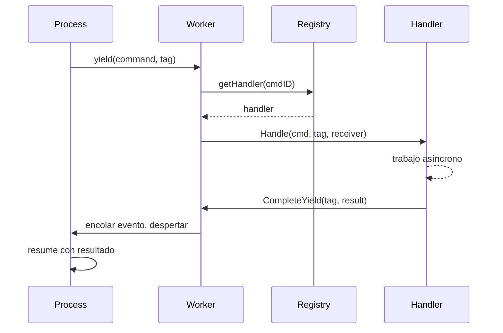

# Command Dispatch

El sistema de dispatch enruta comandos desde procesos a handlers. Los procesos hacen yield de comandos con tags de correlación, los handlers ejecutan trabajo asíncrono, y los resultados fluyen de vuelta vía colas de eventos.

## Flujo



## Registry de Comandos

El registry almacena handlers en una estructura híbrida:

```go
type Registry struct {
    handlers [256]Handler         // Comandos de sistema: índice O(1)
    extended map[CommandID]Handler // Comandos extendidos: lookup en mapa
    frozen   atomic.Bool          // Sin lock después de boot
}
```

Comandos de sistema (0-255) usan indexación de array. Comandos extendidos usan lookup en mapa. Después de `Freeze()`, todos los lookups son sin lock.

### Rangos de Command ID

| Rango | Módulo | Ejemplos |
|-------|--------|----------|
| 1-9 | process | Send, Spawn, Terminate, Monitor, Link |
| 10-29 | clock | Sleep, Ticker, Timer |
| 50-59 | stream | Read, Write, Close, Seek |
| 60-79 | http | Request, RequestBatch |
| 80-89 | websocket | Connect, Send, Receive |
| 90-99 | event | Subscribe, Send |
| 100-119 | sql | Query, Execute, operaciones de Transaction |
| 120-129 | store | Get, Set, Delete, Has |
| 130-139 | security | ValidateToken, CreateToken |
| 140-149 | function | Call, AsyncStart, AsyncCancel |
| 150-159 | exec | ProcessWait |
| 160-169 | cloudstorage | Upload, Download, List, Presigned URLs |
| 170-179 | eval | Compile, Run, CreateProcess |
| 180-189 | workflow | SideEffect, Call, Version, UpsertAttrs |
| 190-199 | contract | Open, Call, AsyncCall, AsyncCancel |
| 256+ | custom | Servicios definidos por usuario |

El registro ocurre durante boot vía `MustRegisterCommands()`. Las colisiones causan panic en startup.

## Definir Comandos

Los comandos son estructuras de datos con un `CommandID` único:

```go
const MyCommand dispatcher.CommandID = 200

type MyCmd struct {
    Input  string
    Option int
}

var myCmdPool = sync.Pool{New: func() any { return &MyCmd{} }}

func (c *MyCmd) CmdID() dispatcher.CommandID { return MyCommand }

func (c *MyCmd) Release() {
    c.Input = ""
    c.Option = 0
    myCmdPool.Put(c)
}
```

La reutilización de pool elimina asignaciones en rutas críticas. Registre en package init:

```go
func init() {
    dispatcher.MustRegisterCommands("myservice", MyCommand)
}
```

## Dispatchers

Un dispatcher agrupa handlers relacionados. Implementa `RegisterAll` para registrar handlers y métodos de ciclo de vida para setup/teardown:

```go
type Handler interface {
    Handle(ctx context.Context, cmd Command, tag uint64, receiver ResultReceiver) error
}

type ResultReceiver interface {
    CompleteYield(tag uint64, data any, err error)
}
```

```go
type Dispatcher struct {
    // estado del servicio
}

func (d *Dispatcher) RegisterAll(register func(id dispatcher.CommandID, h dispatcher.Handler)) {
    register(myapi.MyCommand, dispatcher.HandlerFunc(d.handleMyCommand))
}

func (d *Dispatcher) handleMyCommand(ctx context.Context, cmd Command, tag uint64, receiver ResultReceiver) error {
    c := cmd.(*myapi.MyCmd)
    go func() {
        result := doWork(c)
        if ctx.Err() == nil {
            receiver.CompleteYield(tag, result, nil)
        }
    }()
    return nil
}
```

Registre como componente de boot:

```go
func MyDispatcher() boot.Component {
    return boot.New(boot.P{
        Name:      "dispatcher.myservice",
        DependsOn: []boot.Name{DispatcherName},
        Load: func(ctx context.Context) (context.Context, error) {
            reg := dispatcher.GetRegistrar(ctx)
            svc := myservice.NewDispatcher()
            svc.RegisterAll(reg.Register)
            return ctx, nil
        },
    })
}
```

## Yields y Correlación

Cuando un proceso necesita trabajo asíncrono, hace yield de un comando con un tag de correlación:

```go
type Yield struct {
    Cmd Command
    Tag uint64    // Contador local al proceso para correlación
}
```

El worker extrae yields de `StepOutput` después de cada step y los despacha a handlers. Cada tag identifica únicamente la solicitud para que los resultados puedan matchearse de vuelta.

## Ver También

- [Scheduler](internal-scheduler.md) - Ejecución de procesos
- [Módulos](internal-modules.md) - Integración de módulos Lua
- [Process Model](concept-process-model.md) - Conceptos de alto nivel
