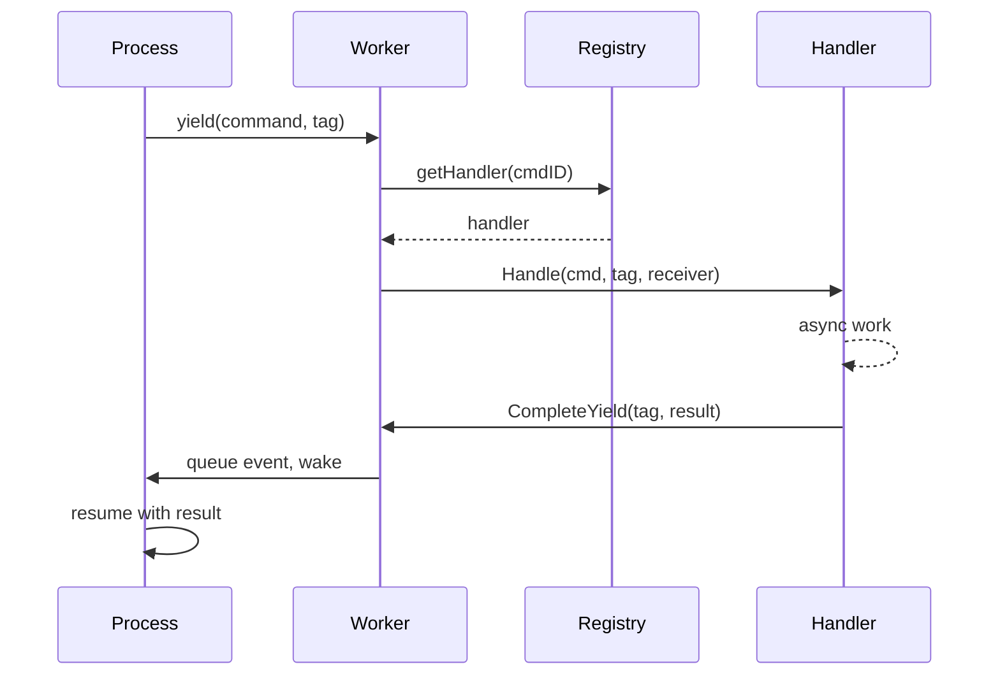

# Command Dispatch

El command dispatch enruta los yields de los procesos a handlers y devuelve resultados correlacionados mediante las colas de eventos de los procesos.

Esta es una referencia de extensión e implementación. Los fragmentos de comando y dispatcher personalizados suponen un paquete Go existente, un grafo de arranque, la API de comandos y un tratamiento de errores específico del servicio.

## Flujo


```mermaid
sequenceDiagram
    participant P as Process
    participant W as Worker
    participant R as Registry
    participant H as Handler

    P->>W: yield(command, tag)
    W->>R: getHandler(cmdID)
    R-->>W: handler
    W->>H: Handle(cmd, tag, receiver)
    H-->>H: async work
    H->>W: CompleteYield(tag, result)
    W->>P: queue event, wake
    P->>P: resume with result
```

## Registry de Comandos

El registry almacena handlers en una estructura híbrida:

```go
type Registry struct {
    handlers [256]Handler         // System commands: O(1) index
    extended map[CommandID]Handler // Extended commands: map lookup
    frozen   atomic.Bool          // Lock-free after boot
}
```

Comandos de sistema (0-255) usan indexación de array. Comandos extendidos usan lookup en mapa. Después de `Freeze()`, todos los lookups son sin lock.

### Rangos de Command ID

| Rango | Módulo | Ejemplos |
|-------|--------|----------|
| 1-9 | process | Send, Spawn, Terminate, Cancel, Monitor, Unmonitor, Link, Unlink, Exec |
| 10-29 | clock | Sleep, Ticker, Timer |
| 30-39 | socket | Connect, Listen, Accept, Bind, Resolve |
| 50-59 | stream | Read, Write, Close, Seek |
| 60-69 | http | Request, RequestBatch |
| 70-79 | tty | E/S de terminal |
| 80-89 | websocket | Connect, Send, Receive |
| 90-99 | event | Subscribe, Send |
| 100-119 | sql | Query, Execute, Prepare, Stmt, Tx ops |
| 120-129 | store | Get, Set, Delete, Has |
| 130-139 | security | ValidateToken, CreateToken |
| 140-149 | function | Call, AsyncStart, AsyncCancel |
| 150-159 | exec | ProcessWait |
| 160-169, 173-174 | cloudstorage | Upload, Download, List, Presigned URLs, Multipart, OpenReader |
| 170-171 | eval | Compile, Run |
| 172 | cdc | Subscribe |
| 180-189 | workflow | SideEffect, Exec, Version, UpsertAttrs |
| 190-199 | contract | Open, Call, AsyncCall, AsyncCancel |
| 200-211 | pg (grupo de procesos) | Join, Leave, GetMembers, GetLocalMembers, WhichGroups, Broadcast, BroadcastLocal, WhichLocalGroups, Monitor, Events, JoinGroups, LeaveGroups |
| 256+ | custom | Servicios definidos por usuario |

Los paquetes reservan la propiedad de los ID de comando desde `init()` con `MustRegisterCommands()`; las colisiones de propiedad provocan panic durante la inicialización de los paquetes. Durante la carga de componentes, cada servicio vincula sus handlers mediante `Registrar.Register`. El dispatcher solo se congela después de instalar esos handlers.

## Definir Comandos

Los comandos son estructuras de datos con un `CommandID` único:

```go
const MyCommand dispatcher.CommandID = 256

type MyCmd struct {
    Input  string
    Option int
}

func (c *MyCmd) CmdID() dispatcher.CommandID { return MyCommand }
```

Reserve el ID del comando durante la inicialización del paquete:

```go
func init() {
    dispatcher.MustRegisterCommands("myservice", MyCommand)
}
```

## Dispatchers

Un dispatcher agrupa handlers relacionados. Implementa `RegisterAll` para registrar handlers y métodos de ciclo de vida para setup/teardown:

```go
type Handler interface {
    Handle(ctx context.Context, cmd Command, tag uint64, receiver ResultReceiver) error
}

type ResultReceiver interface {
    CompleteYield(tag uint64, data any, err error)
}
```

```go
type Dispatcher struct {
    // service state
}

func (d *Dispatcher) RegisterAll(register func(id dispatcher.CommandID, h dispatcher.Handler)) {
    register(myapi.MyCommand, dispatcher.HandlerFunc(d.handleMyCommand))
}

func (d *Dispatcher) handleMyCommand(ctx context.Context, cmd Command, tag uint64, receiver ResultReceiver) error {
    c := cmd.(*myapi.MyCmd)
    go func() {
        result := doWork(c)
        if ctx.Err() == nil {
            receiver.CompleteYield(tag, result, nil)
        }
    }()
    return nil
}
```

Registre como componente de boot:

```go
func MyDispatcher() boot.Component {
    return boot.New(boot.P{
        Name:      "dispatcher.myservice",
        DependsOn: []boot.Name{DispatcherName},
        Load: func(ctx context.Context) (context.Context, error) {
            reg := dispatcher.GetRegistrar(ctx)
            svc := myservice.NewDispatcher()
            svc.RegisterAll(reg.Register)
            return ctx, nil
        },
    })
}
```

## Yields y Correlación

Cuando un proceso necesita trabajo asíncrono, hace yield de un comando con un tag de correlación:

```go
type Yield struct {
    Cmd Command
    Tag uint64    // Process-local counter for correlation
}
```

El worker extrae yields de `StepOutput` después de cada step y los despacha a handlers. Cada tag identifica únicamente la solicitud para que los resultados puedan matchearse de vuelta.

## Ver También

- [Scheduler](internals/scheduler.md) - Ejecución de procesos
- [Módulos](internals/modules.md) - Integración de módulos Lua
- [Process Model](concepts/process-model.md) - Conceptos de alto nivel
