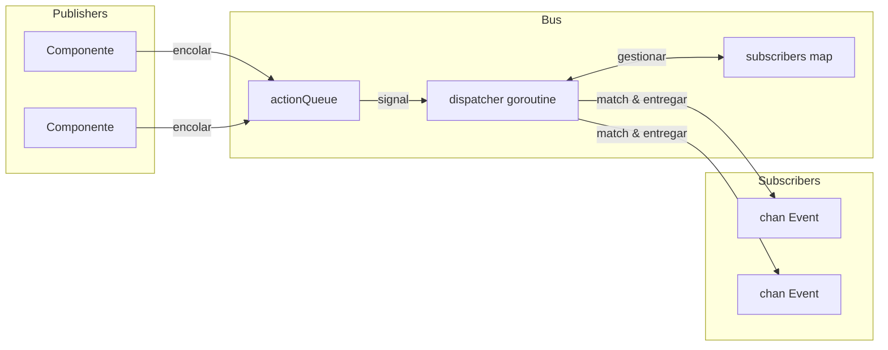

# Event Bus

El event bus es un sistema pub/sub usando una sola goroutine dispatcher. Los publishers encolan acciones, el dispatcher las procesa secuencialmente, y los subscribers reciben eventos matcheados en canales.

## Estructura de Evento

```go
type Event struct {
    System string  // Componente/módulo (ej. "registry", "process")
    Kind   string  // Tipo de evento (ej. "create", "update", "exit")
    Path   string  // Identificador de entidad
    Data   any     // Payload
}
```

## Arquitectura del Bus



El bus almacena estado en una estructura simple:

```go
type Bus struct {
    subscribers       map[SubscriberID]sub
    subscriberCounter uint64

    actionQueue []action
    spareQueue  []action
    actionMu    sync.Mutex
    actionReady chan struct{}  // buffered=1

    closed atomic.Bool
}
```

Todas las mutaciones pasan por la goroutine dispatcher, eliminando condiciones de carrera sin locking complejo.

## Acciones

Cuatro tipos de acciones fluyen a través de la cola:

| Acción | Comportamiento |
|--------|----------------|
| Subscribe | Agrega subscriber al mapa, responde en canal done |
| Unsubscribe | Remueve subscriber, responde en canal done |
| Send | Entrega evento a subscribers matcheados |
| Stop | Limpia subscribers, drena cola, sale del loop |

Subscribe y Unsubscribe bloquean hasta que el dispatcher confirma. Send es fire-and-forget.

## Intercambio de Cola

El dispatcher usa intercambio de slices para evitar asignaciones en estado estable:

```go
func (b *Bus) processActions() bool {
    b.actionMu.Lock()
    actions := b.actionQueue
    b.actionQueue = b.spareQueue[:0]
    b.spareQueue = nil
    b.actionMu.Unlock()

    for i := range actions {
        // procesar acción
    }

    clear(actions)
    b.actionMu.Lock()
    b.spareQueue = actions[:0]
    b.actionMu.Unlock()
    return true
}
```

Dos slices alternan: uno para procesamiento, uno para nuevas llegadas. El canal `actionReady` tiene buffer de 1, así que la señalización nunca bloquea y múltiples encolas colapsan en un solo wakeup.

## Pattern Matching

Las suscripciones compilan patrones una vez en tiempo de subscribe:

```go
type sub struct {
    subID   SubscriberID
    ctx     context.Context
    system  *wildcard.Wildcard
    kind    *wildcard.Wildcard
    eventCh chan<- Event
}
```

El paquete wildcard soporta tres tipos de patrón:

| Patrón | Matchea |
|--------|---------|
| `registry` | Solo match exacto |
| `*` | Cualquier segmento único |
| `**` | Cero o más segmentos |
| `(a\|b)` | Alternación dentro de segmento |

Los patrones se dividen en `.` así que `registry.*` matchea `registry.create` pero no `registry.entry.create`. El patrón `registry.**` matchea los tres: `registry`, `registry.create`, y `registry.entry.create`.

## Entrega de Eventos

Durante procesamiento de Send, el dispatcher itera subscribers:

```go
for id, s := range b.subscribers {
    if s.system != nil && !s.system.Match(a.event.System) {
        continue
    }
    if s.kind != nil && !s.kind.Match(a.event.Kind) {
        continue
    }

    select {
    case <-a.ctx.Done():
        goto cleanup
    case <-s.ctx.Done():
        expiredSubs = append(expiredSubs, id)
    case s.eventCh <- a.event:
    }
}
```

Si el contexto de un subscriber es cancelado, se marca para remoción durante ese pase de entrega. El contexto del evento también puede cancelar entrega a mitad de iteración.

## Bridge de Proceso Lua

El dispatcher de eventos conecta eventos Go a procesos Lua. Se suscribe una vez a todos los eventos (`"**"`) y enruta internamente basado en suscripciones de procesos:

```go
type Dispatcher struct {
    bus    event.Bus
    node   relay.Node
    subID  SubscriberID
    eventC chan event.Event

    mu   sync.RWMutex
    subs map[string]*subscription  // topic -> subscription
}
```

Cuando un proceso Lua se suscribe vía `events.subscribe()`, el dispatcher almacena el patrón y PID destino. Eventos matcheados son empaquetados y enviados vía relay:

```go
func (d *Dispatcher) routeEvent(evt event.Event) {
    d.mu.RLock()
    defer d.mu.RUnlock()

    for _, sub := range d.subs {
        if !matchPattern(sub.system, evt.System) {
            continue
        }
        if sub.kind != "" && !matchPattern(sub.kind, evt.Kind) {
            continue
        }

        data := map[string]any{
            "system": evt.System,
            "kind":   evt.Kind,
            "path":   evt.Path,
        }
        if evt.Data != nil {
            data["data"] = evt.Data
        }

        pkg := relay.NewPackage(pid.PID{}, sub.pid, sub.topic, payload.New(data))
        d.node.Send(pkg)
    }
}
```

## Tipos Helper

### Subscriber

Envuelve suscripción de canal con callback:

```go
handler, err := eventbus.NewSubscriber(ctx, bus, "registry", "*.created",
    func(evt Event) {
        // manejar
    })
defer handler.Close()
```

Genera dos goroutines: una lee eventos y llama al handler, otra espera cancelación de contexto para desuscribir.

### EventRouter

Gestiona múltiples handlers con ciclo de vida centralizado:

```go
router, err := eventbus.StartRouter(ctx, bus,
    WithHandlers(handler1, handler2),
    WithLogger(log))
defer router.Stop()
```

Cada handler implementa `Pattern()` y `Handle()`. El router crea un Subscriber para cada uno y cierra todos en Stop.

### Awaiter

Espera sincrónica por un evento específico:

```go
awaiter := eventbus.NewAwaiter(bus, "registry", "accept")
waiter, _ := awaiter.Prepare(ctx, "service-id")
defer waiter.Close()

bus.Send(ctx, triggeringEvent)

result := waiter.Wait()  // bloquea hasta match o timeout
```

El patrón Prepare-then-Wait evita condiciones de carrera: suscribirse antes de disparar el evento que produce la respuesta.

## Shutdown

1. `Stop()` atómicamente establece flag closed y encola acción Stop
2. Dispatcher limpia mapa de subscribers
3. Acciones restantes en cola son drenadas:
   - Solicitudes Subscribe obtienen error "bus is closed"
   - Solicitudes Unsubscribe completan inmediatamente
   - Eventos Send son descartados
4. WaitGroup completa

## Ver También

- [Registry](internals/registry.md) - Productor principal de eventos
- [Command Dispatch](internals/dispatch.md) - Routing proceso-a-handler
