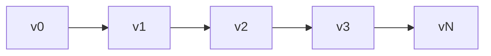
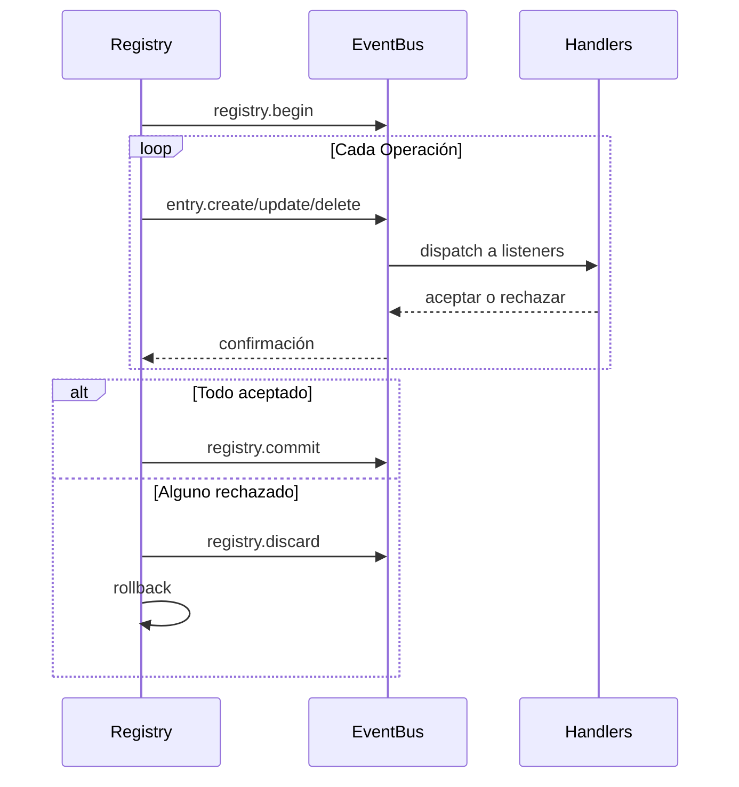

# Internos del Registry

El registry es un almacén de estado versionado y orientado a eventos. Mantiene historial de versiones completo, soporta transacciones, y propaga cambios a través del event bus.

## Almacenamiento de Entradas

Las entradas se almacenan como un slice ordenado con un índice de hash map para lookups O(1):

```go
type Entry struct {
    ID       ID              // namespace:name
    Kind     Kind            // Tipo de entrada
    Meta     attrs.Bag       // Metadatos del autor
    Data     payload.Payload // Contenido
    Registry EntryMetadata   // Procedencia propiedad del registry
}

type EntryMetadata struct {
    Owner string // Fuente de despliegue que suministró la entrada
    Root  bool   // Declaración de dependencia seleccionada por el despliegue
}
```

Los IDs de entrada usan el paquete `unique` de Go para interning—IDs idénticos comparten memoria.

`Registry` es propiedad del registry, no del autor de la entrada. `Owner` se asigna a partir de la fuente de despliegue; `Root` se establece desde el campo de escritura `dependency_root` en una entrada `ns.dependency`. Las APIs ordinarias de entradas devuelven solo `ID`, `Kind`, `Meta` y `Data`; la procedencia se lee a través de la API de estado del snapshot.

## Snapshot

`Registry.Snapshot()` devuelve una vista atómica: la versión, las entradas en esa versión, y los metadatos de estado propiedad del registry para esa misma versión.

```go
type Snapshot struct {
    Registry StateMetadata
    Version  Version
    Entries  State
}

type StateMetadata struct {
    Resolution *DependencyResolution
}
```

Leer versión, entradas y resolución como un solo valor impide que un llamante empareje entradas con una resolución de otra versión. El grafo de módulos seleccionado se almacena una vez por snapshot en lugar de repetirse en cada entrada.

## Overlays

`OverlayWriter` es una capacidad opcional del registry para entradas locales al proceso:

```go
type OverlayWriter interface {
    ApplyOverlay(context.Context, string, uint64, ChangeSet) (uint64, error)
    GetOverlay(string) (State, uint64, error)
}
```

Las entradas de overlay se agrupan bajo una cadena de propietario lógico. Se unen al estado efectivo y pasan por el mismo ordenamiento topológico y las mismas transiciones de handlers que las entradas durables, de modo que los servicios arrancan y se detienen por ellas con normalidad, pero nunca producen una versión de historial. Están vacías tras un arranque en frío y deben ser reconciliadas por el servicio de control propietario.

Las escrituras son concurrentes de forma optimista: `GetOverlay` devuelve la generación actual del propietario, y `ApplyOverlay` confirma solo si esa generación sigue siendo la actual; en caso contrario devuelve un `Conflict` reintentable. Cada aplicación exitosa emite una nueva generación única en el proceso, y se retiene una lápida para los propietarios que mutaron, de modo que una secuencia ABA no pueda confundirse con un overlay sin cambios.

Las reglas de composición validadas en cada aplicación:

- Una entrada solo puede crearse si ninguna entrada durable ni de overlay ocupa su ID.
- Solo la identidad propietaria puede actualizar o eliminar sus entradas de overlay.
- Las entradas de overlay no pueden llevar metadatos propiedad del registry, ni usar kinds reclamados por directivas del registry.
- Un borrado no puede eliminar una entrada de la que dependa una entrada superviviente.
- Las aristas de dependencia no pueden cruzar fronteras de propietario, y las entradas durables no pueden depender de entradas de overlay.

## Cadena de Versiones

Cada versión apunta a su padre. El cálculo de ruta usa un algoritmo de grafos para encontrar la ruta más corta entre cualquier dos versiones:


```mermaid
flowchart LR
    v0[v0] --> v1[v1] --> v2[v2] --> v3[v3] --> vN[vN]
```

## ChangeSets

Un changeset es una lista ordenada de operaciones que transforman un estado a otro:

| Operación | OriginalEntry | Propósito |
|-----------|---------------|-----------|
| Create | nil | Agregar nueva entrada |
| Update | valor anterior | Modificar existente |
| Delete | valor eliminado | Remover entrada |

`OriginalEntry` permite reversión—updates almacenan el valor previo, deletes almacenan lo que fue removido.

### Construir Deltas

`BuildDelta(oldState, newState)` genera operaciones mínimas:

1. Comparar estados, identificar cambios
2. Ordenar deletes en orden inverso de dependencias (dependientes primero)
3. Ordenar creates/updates en orden de dependencias (dependencias primero)

### Squashing

Múltiples changesets se fusionan rastreando estado final por entrada:

```
Create + Update = Create (con valor actualizado)
Create + Delete = ∅ (se cancelan)
Update + Delete = Delete
Delete + Create = Update
```

## Transacciones


```mermaid
sequenceDiagram
    participant R as Registry
    participant B as EventBus
    participant H as Handlers

    R->>B: registry.begin
    loop Cada Operación
        R->>B: entry.create/update/delete
        B->>H: dispatch a listeners
        H-->>B: aceptar o rechazar
        B-->>R: confirmación
    end
    alt Todo aceptado
        R->>B: registry.commit
    else Alguno rechazado
        R->>B: registry.discard
        R->>R: rollback
    end
```

Los handlers tienen 30 segundos para aceptar o rechazar cada operación. En rechazo, el registry hace rollback calculando y aplicando el delta inverso.

### Entradas No Propagantes

Algunos kinds omiten el event bus completamente:
- `registry.entry` - Configs de aplicación
- `ns.requirement` - Requisitos de namespace
- `ns.dependency` - Dependencias de módulos
- `ns.definition` - Metadatos del módulo (readme, wiki, licencia, autores)

## Resolución de Dependencias

Las entradas pueden declarar dependencias en otras entradas. El resolver extrae dependencias vía patrones registrados:

```go
resolver.RegisterPattern(registry.DependencyPattern{
    Path:          "meta.server",
    AllowWildcard: true,
})
```

Las dependencias se extraen de campos Meta y Data de entradas, luego se usan para ordenamiento topológico durante transiciones de estado.

### Política de Acceso a Dependencias

El acceso externo a dependencias es un valor de contexto por solicitud, no una bandera global:

| Política | Efecto |
|----------|--------|
| `DependencyAccessUnspecified` | El llamante elige; se aplica su propio valor por defecto |
| `DependencyAccessOnline` | Se permite la resolución externa y la descarga de artefactos |
| `DependencyAccessVerifiedOffline` | El acceso externo está prohibido; la resolución usa manifiestos fijados y artefactos presentes localmente |

`LoadState()` usa verified-offline por defecto cuando el contexto no especifica nada, de modo que el arranque reproduce un grafo almacenado sin llegar a la red. Restaurar una línea base de despliegue cambia el contexto a online porque debe descargar los módulos que esa línea base nombra. Bajo verified-offline, un proveedor de manifiestos que sirve solo los módulos fijados reemplaza al proveedor del hub, y un artefacto ausente falla como evidencia faltante en lugar de disparar una descarga.

## Historial de Versiones

Backends de historial:

| Implementación | Caso de Uso |
|----------------|-------------|
| SQLite | Persistencia de producción |
| PostgreSQL | Persistencia de producción, compartida entre nodos |
| Memory | Por defecto cuando `history_type` no está definido; testing |
| Nil | Sin historial |

SQLite usa modo WAL con tablas para versiones, changesets (codificados MessagePack), y metadatos. PostgreSQL se selecciona con `registry.history_type: postgres` más `history_dsn`/`history_schema` (ver [Configuración](guides/configuration.md#registry)).

El historial también persiste la resolución exacta de dependencias de cada versión: cuando se aplica un cambio de `ns.dependency`, el grafo de módulos resuelto se almacena direccionado por contenido junto al changeset. El arranque y el rollback reproducen el grafo almacenado en lugar de volver a resolver, de modo que una versión siempre se reconcilia con las versiones con las que fue resuelta. El esquema del historial migra automáticamente en el primer arranque tras una actualización; una versión preexistente se resuelve una vez en la primera visita y se registra como punto de control.

### Navegación

El cálculo de ruta encuentra la ruta más corta entre versiones:

```go
Path(v0, v3) = [v1, v2, v3]  // Aplicar changesets hacia adelante
Path(v3, v1) = [v2, v1]      // Aplicar changesets revertidos
```

`LoadState()` reproduce historial desde una línea base sin crear nuevas versiones—usado durante boot.

## Finder

Motor de consultas con cache LRU para buscar entradas:

| Operador | Prefijo | Ejemplo |
|----------|---------|---------|
| Glob | (ninguno) | `.kind=function.*` |
| Regex | `~` | `~meta.path=/api/.*` |
| Contains | `*` | `*meta.tags=backend` |
| Prefix | `^` | `^meta.name=user` |
| Suffix | `$` | `$meta.path=Handler` |

Cache se invalida en cambio de versión.

## Ver También

- [Registry](concepts/registry.md) - Conceptos de alto nivel
- [Events](internals/events.md) - Detalles del event bus
