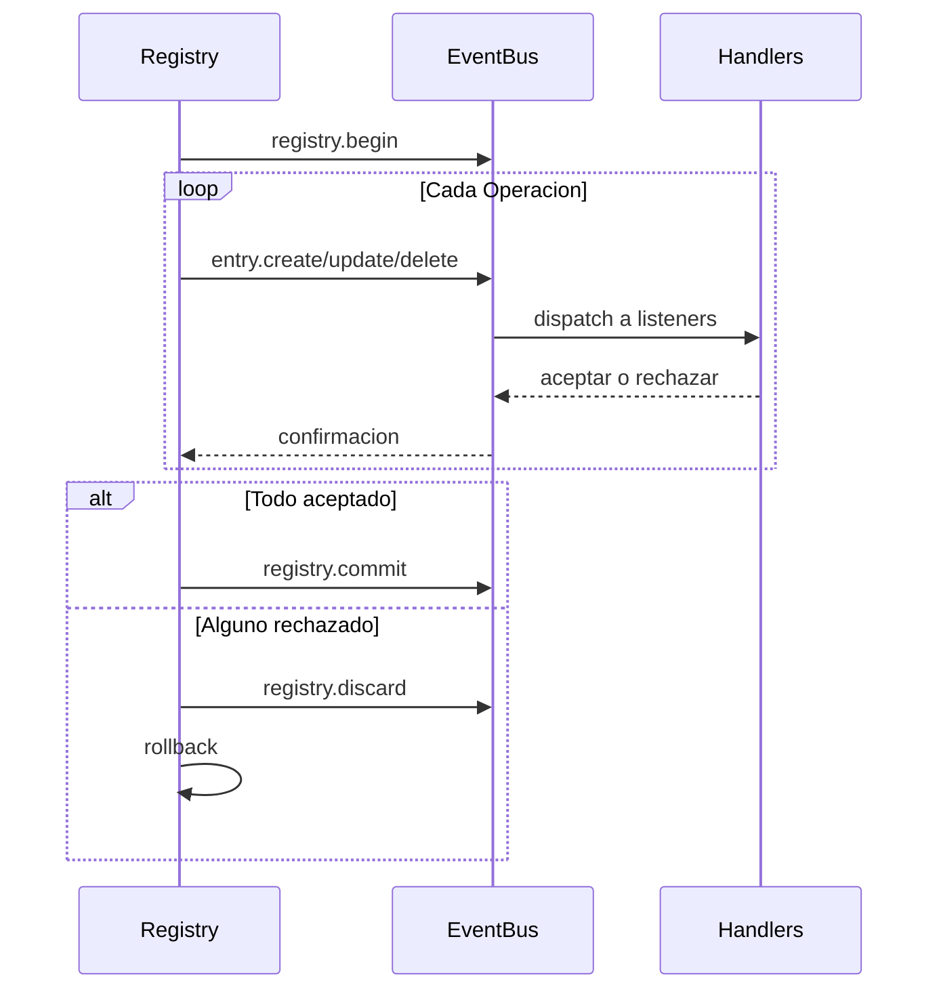

# Internos del Registry

El registry es un almacen de estado versionado y orientado a eventos. Mantiene historial de versiones completo, soporta transacciones, y propaga cambios a traves del event bus.

## Almacenamiento de Entradas

Las entradas se almacenan como un slice ordenado con un indice de hash map para lookups O(1):

```go
type Entry struct {
    ID   ID              // namespace:name
    Kind Kind            // Tipo de entrada
    Meta attrs.Bag       // Metadatos
    Data payload.Payload // Contenido
}
```

Los IDs de entrada usan el paquete `unique` de Go para interning—IDs identicos comparten memoria.

## Cadena de Versiones

Cada version apunta a su padre. El calculo de ruta usa un algoritmo de grafos para encontrar la ruta mas corta entre cualquier dos versiones:


## ChangeSets

Un changeset es una lista ordenada de operaciones que transforman un estado a otro:

| Operacion | OriginalEntry | Proposito |
|-----------|---------------|-----------|
| Create | nil | Agregar nueva entrada |
| Update | valor anterior | Modificar existente |
| Delete | valor eliminado | Remover entrada |

`OriginalEntry` permite reversion—updates almacenan el valor previo, deletes almacenan lo que fue removido.

### Construir Deltas

`BuildDelta(oldState, newState)` genera operaciones minimas:

1. Comparar estados, identificar cambios
2. Ordenar deletes en orden inverso de dependencias (dependientes primero)
3. Ordenar creates/updates en orden de dependencias (dependencias primero)

### Squashing

Multiples changesets se fusionan rastreando estado final por entrada:

```
Create + Update = Create (con valor actualizado)
Create + Delete = ∅ (se cancelan)
Update + Delete = Delete
Delete + Create = Update
```

## Transacciones



Los handlers tienen 30 segundos para aceptar o rechazar cada operacion. En rechazo, el registry hace rollback calculando y aplicando el delta inverso.

### Entradas No Propagantes

Algunos kinds omiten el event bus completamente:
- `registry.entry` - Configs de aplicacion
- `ns.requirement` - Requisitos de namespace
- `ns.dependency` - Dependencias de modulos

## Resolucion de Dependencias

Las entradas pueden declarar dependencias en otras entradas. El resolver extrae dependencias via patrones registrados:

```go
resolver.RegisterPattern(PathConfig{
    Path: "meta.server",
    AllowWildcard: true,
})
```

Las dependencias se extraen de campos Meta y Data de entradas, luego se usan para ordenamiento topologico durante transiciones de estado.

## Historial de Versiones

Backends de historial:

| Implementacion | Caso de Uso |
|----------------|-------------|
| SQLite | Persistencia de produccion |
| Memory | Testing |
| Nil | Sin historial |

SQLite usa modo WAL con tablas para versiones, changesets (codificados MessagePack), y metadatos.

### Navegacion

El calculo de ruta encuentra la ruta mas corta entre versiones:

```go
Path(v0, v3) = [v1, v2, v3]  // Aplicar changesets hacia adelante
Path(v3, v1) = [v2, v1]      // Aplicar changesets revertidos
```

`LoadState()` reproduce historial desde una linea base sin crear nuevas versiones—usado durante boot.

## Finder

Motor de consultas con cache LRU para buscar entradas:

| Operador | Prefijo | Ejemplo |
|----------|---------|---------|
| Glob | (ninguno) | `.kind=function.*` |
| Regex | `~` | `~meta.path=/api/.*` |
| Contains | `*` | `*meta.tags=backend` |
| Prefix | `^` | `^meta.name=user` |
| Suffix | `$` | `$meta.path=Handler` |

Cache se invalida en cambio de version.

## Ver Tambien

- [Registry](concept-registry.md) - Conceptos de alto nivel
- [Events](internal-events.md) - Detalles del event bus
