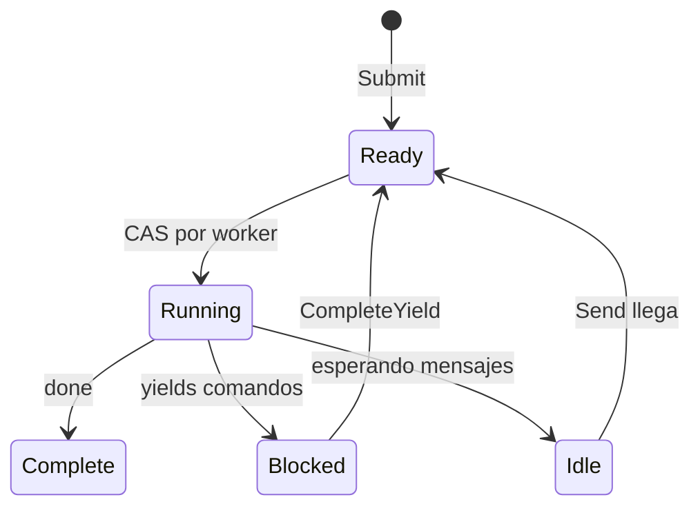

# Scheduler

El scheduler ejecuta procesos usando un diseño de work-stealing. Los workers mantienen deques locales y roban de otros cuando están idle.

## Interfaz de Proceso

El scheduler trabaja con cualquier tipo que implemente la interfaz `Process`:

```go
type Process interface {
    Init(ctx context.Context, method string, input payload.Payloads) error
    Step(events []Event, out *StepOutput) error
    Close()
}
```

| Método | Propósito |
|--------|-----------|
| `Init` | Preparar proceso con nombre de método de entrada y argumentos de entrada |
| `Step` | Avanzar máquina de estados con eventos entrantes, escribir yields a salida |
| `Close` | Liberar recursos |

El parámetro `method` en `Init` especifica qué punto de entrada invocar. Una instancia de proceso puede exponer múltiples puntos de entrada, y el llamador selecciona cuál ejecutar. Esto también sirve como verificación de que el scheduler está iniciando el proceso correctamente.

El scheduler llama `Step()` repetidamente, pasando eventos (completaciones de yield, mensajes) y recolectando yields (comandos a despachar). El proceso escribe su estado y cualquier yield al buffer `StepOutput`.

```go
type Event struct {
    Type  EventType  // EventYieldComplete o EventMessage
    Tag   uint64     // Tag de correlación para completaciones de yield
    Data  any        // Datos de resultado o payload de mensaje
    Error error      // Error si yield falló
}
```

## Estructura

El scheduler genera `GOMAXPROCS` workers por defecto. Cada worker tiene un deque local para acceso LIFO amigable con cache. Una cola FIFO global maneja nuevos envíos y transferencias entre workers. Los procesos se rastrean por PID para routing de mensajes.

## Búsqueda de Trabajo


Workers verifican fuentes en orden de prioridad:

| Prioridad | Fuente | Patrón |
|-----------|--------|--------|
| 1 | Deque local | Pop LIFO, sin lock, amigable con cache |
| 2 | Cola global | Pop FIFO con transferencia batch |
| 3 | Otros workers | Robar mitad del deque de víctima |

Al hacer pop de global, workers toman un item y transfieren en batch hasta 16 más a su deque local.

## Deque Chase-Lev

Cada worker posee un deque Chase-Lev de work-stealing:

```go
type Deque struct {
    buffer atomic.Pointer[dequeBuffer]
    top    atomic.Int64  // Ladrones roban desde aquí (CAS)
    bottom atomic.Int64  // Dueño push/pop aquí
}
```

El dueño hace push y pop desde el fondo (LIFO) sin sincronización. Los ladrones roban desde arriba (FIFO) usando CAS. Esto da al dueño acceso amigable con cache a items recientemente pusheados mientras distribuye trabajo más viejo a stealers.

`StealHalfInto` toma la mitad de los items en una operación CAS, reduciendo contención.

## Spinning Adaptativo

Antes de bloquear en la variable de condición, workers giran adaptativamente:

| Contador de Spin | Acción |
|------------------|--------|
| < 4 | Loop cerrado |
| 4-15 | Yield thread (`runtime.Gosched`) |
| >= 16 | Bloquear en variable de condición |

## Estados de Proceso



| Estado | Descripción |
|--------|-------------|
| Ready | Encolado para ejecución |
| Running | Worker está ejecutando Step() |
| Blocked | Esperando completación de yield |
| Idle | Esperando mensajes |
| Complete | Ejecución terminada |

Un flag de wakeup maneja races: si un handler llama `CompleteYield` mientras el worker todavía posee el proceso (Running), establece el flag. El worker verifica el flag después de despachar y re-encola si está establecido.

## Cola de Eventos

Cada proceso tiene una cola de eventos MPSC (multi-producer, single-consumer):

- **Productores**: Handlers de comandos (`CompleteYield`), remitentes de mensajes (`Send`)
- **Consumidor**: Worker drena eventos en `Step()`

## Routing de Mensajes

El scheduler implementa `relay.Receiver` para enrutar mensajes a procesos. Cuando `Send()` es llamado, busca el PID destino en el mapa `byPID`, pushea el mensaje como evento a la cola del proceso, y despierta el proceso si está idle pusheándolo a la cola global.

## Shutdown

En shutdown, el scheduler envía eventos de cancelación a todos los procesos en ejecución y espera que completen o timeout. Workers salen una vez que no queda trabajo.

## Ver También

- [Command Dispatch](internal-dispatch.md) - Cómo yields llegan a handlers
- [Process Model](concept-process-model.md) - Conceptos de alto nivel
