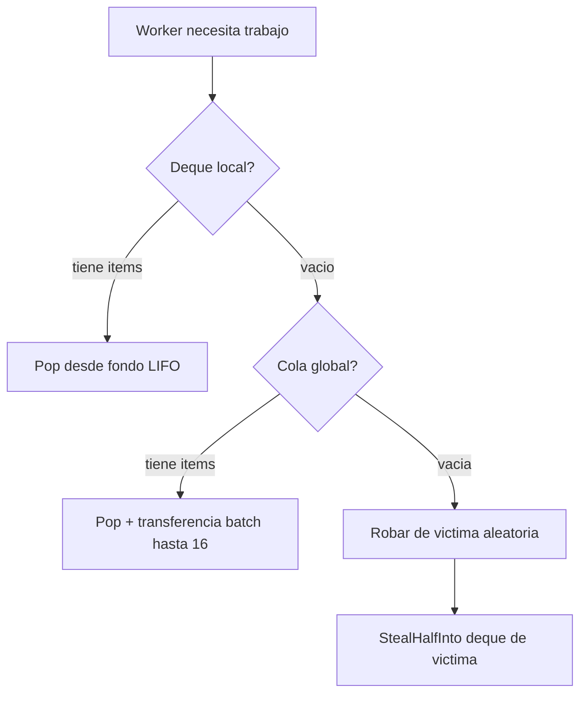
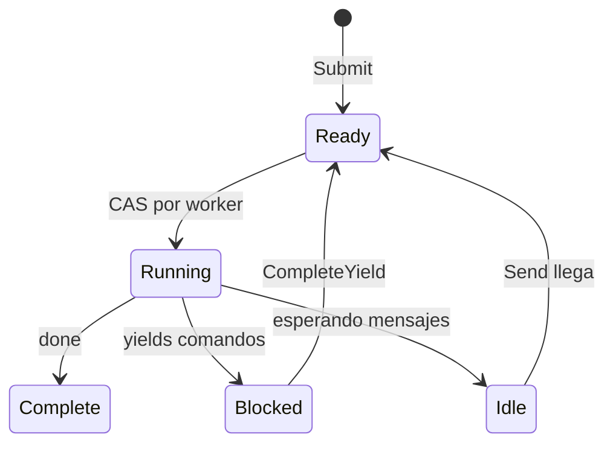

# Scheduler

El scheduler ejecuta procesos usando un diseno de work-stealing. Los workers mantienen deques locales y roban de otros cuando estan idle.

## Interfaz de Proceso

El scheduler trabaja con cualquier tipo que implemente la interfaz `Process`:

```go
type Process interface {
    Init(ctx context.Context, method string, input payload.Payloads) error
    Step(events []Event, out *StepOutput) error
    Close()
}
```

| Metodo | Proposito |
|--------|-----------|
| `Init` | Preparar proceso con nombre de metodo de entrada y argumentos de entrada |
| `Step` | Avanzar maquina de estados con eventos entrantes, escribir yields a salida |
| `Close` | Liberar recursos |

El parametro `method` en `Init` especifica que punto de entrada invocar. Una instancia de proceso puede exponer multiples puntos de entrada, y el llamador selecciona cual ejecutar. Esto tambien sirve como verificacion de que el scheduler esta iniciando el proceso correctamente.

El scheduler llama `Step()` repetidamente, pasando eventos (completaciones de yield, mensajes) y recolectando yields (comandos a despachar). El proceso escribe su estado y cualquier yield al buffer `StepOutput`.

```go
type Event struct {
    Type  EventType  // EventYieldComplete o EventMessage
    Tag   uint64     // Tag de correlacion para completaciones de yield
    Data  any        // Datos de resultado o payload de mensaje
    Error error      // Error si yield fallo
}
```

## Estructura

El scheduler genera `GOMAXPROCS` workers por defecto. Cada worker tiene un deque local para acceso LIFO amigable con cache. Una cola FIFO global maneja nuevos envios y transferencias entre workers. Los procesos se rastrean por PID para routing de mensajes.

## Busqueda de Trabajo



Workers verifican fuentes en orden de prioridad:

| Prioridad | Fuente | Patron |
|-----------|--------|--------|
| 1 | Deque local | Pop LIFO, sin lock, amigable con cache |
| 2 | Cola global | Pop FIFO con transferencia batch |
| 3 | Otros workers | Robar mitad del deque de victima |

Al hacer pop de global, workers toman un item y transfieren en batch hasta 16 mas a su deque local.

## Deque Chase-Lev

Cada worker posee un deque Chase-Lev de work-stealing:

```go
type Deque struct {
    buffer atomic.Pointer[dequeBuffer]
    top    atomic.Int64  // Ladrones roban desde aqui (CAS)
    bottom atomic.Int64  // Dueno push/pop aqui
}
```

El dueno hace push y pop desde el fondo (LIFO) sin sincronizacion. Los ladrones roban desde arriba (FIFO) usando CAS. Esto da al dueno acceso amigable con cache a items recientemente pusheados mientras distribuye trabajo mas viejo a stealers.

`StealHalfInto` toma la mitad de los items en una operacion CAS, reduciendo contencion.

## Spinning Adaptativo

Antes de bloquear en la variable de condicion, workers giran adaptativamente:

| Contador de Spin | Accion |
|------------------|--------|
| < 4 | Loop cerrado |
| 4-15 | Yield thread (`runtime.Gosched`) |
| >= 16 | Bloquear en variable de condicion |

## Estados de Proceso



| Estado | Descripcion |
|--------|-------------|
| Ready | Encolado para ejecucion |
| Running | Worker esta ejecutando Step() |
| Blocked | Esperando completacion de yield |
| Idle | Esperando mensajes |
| Complete | Ejecucion terminada |

Un flag de wakeup maneja races: si un handler llama `CompleteYield` mientras el worker todavia posee el proceso (Running), establece el flag. El worker verifica el flag despues de despachar y re-encola si esta establecido.

## Cola de Eventos

Cada proceso tiene una cola de eventos MPSC (multi-producer, single-consumer):

- **Productores**: Handlers de comandos (`CompleteYield`), remitentes de mensajes (`Send`)
- **Consumidor**: Worker drena eventos en `Step()`

## Routing de Mensajes

El scheduler implementa `relay.Receiver` para enrutar mensajes a procesos. Cuando `Send()` es llamado, busca el PID destino en el mapa `byPID`, pushea el mensaje como evento a la cola del proceso, y despierta el proceso si esta idle pusheandolo a la cola global.

## Shutdown

En shutdown, el scheduler envia eventos de cancelacion a todos los procesos en ejecucion y espera que completen o timeout. Workers salen una vez que no queda trabajo.

## Ver Tambien

- [Command Dispatch](internal-dispatch.md) - Como yields llegan a handlers
- [Process Model](concept-process-model.md) - Conceptos de alto nivel
