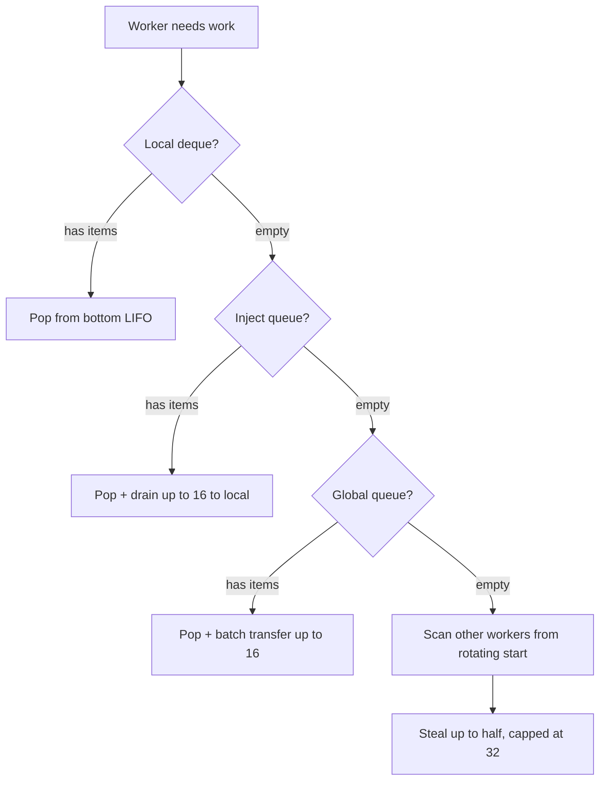
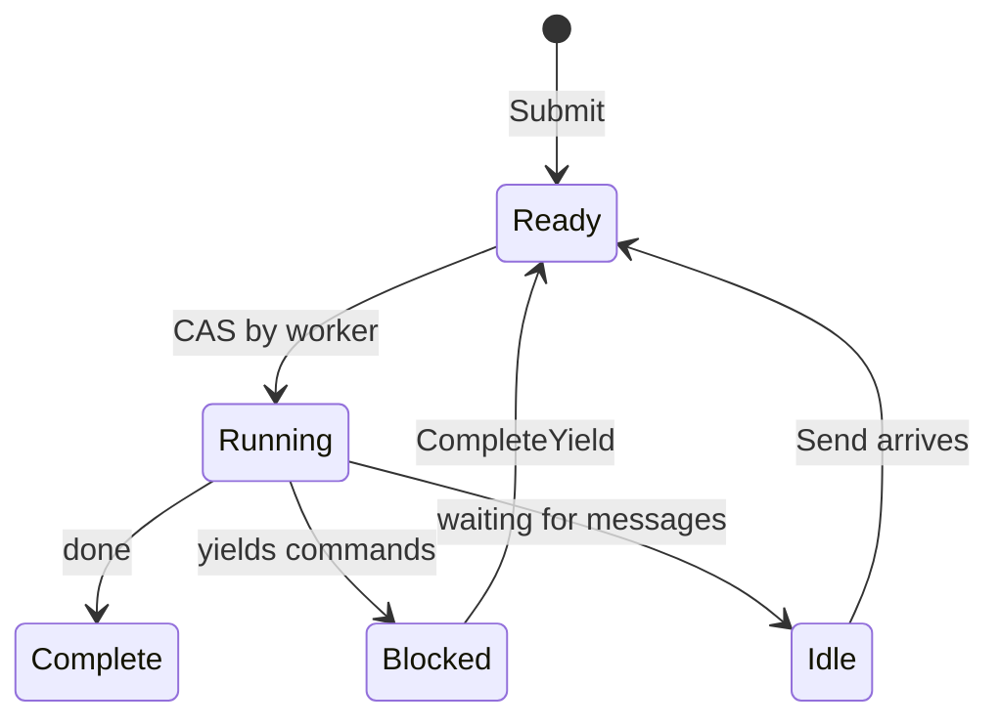

# Scheduler

El scheduler ejecuta procesos en workers con deques locales, colas de inyección, una cola global y work stealing.

Esta es una referencia de implementación. Sus estructuras Go y diagramas describen el scheduler del entorno de ejecución fijado, no API implementadas por el código de la aplicación.

## Interfaz de Proceso

El scheduler trabaja con cualquier tipo que implemente la interfaz `Process`:

```go
type Process interface {
    Init(ctx context.Context, method string, input payload.Payloads) error
    Step(events []Event, out *StepOutput) error
    Close()
}
```

| Método | Propósito |
|--------|-----------|
| `Init` | Preparar proceso con nombre de método de entrada y argumentos de entrada |
| `Step` | Avanzar máquina de estados con eventos entrantes, escribir yields a salida |
| `Close` | Liberar recursos |

El parámetro `method` en `Init` especifica qué punto de entrada invocar. Una instancia de proceso puede exponer múltiples puntos de entrada, y el llamador selecciona cuál ejecutar.

El scheduler llama `Step()` repetidamente, pasando eventos (completaciones de yield, mensajes) y recolectando yields (comandos a despachar). El proceso escribe su estado y cualquier yield al buffer `StepOutput`.

```go
type Event struct {
    Type  EventType  // EventYieldComplete or EventMessage
    Tag   uint64     // Correlation tag for yield completions
    Data  any        // Result data or message payload
    Error error      // Error if yield failed
}
```

## Estructura

El scheduler genera `GOMAXPROCS` workers por defecto. Cada worker tiene un deque local para acceso LIFO amigable con la caché y una cola de inyección MPSC por worker para trabajo reencolado con afinidad a ese worker, incluidas las finalizaciones de yield y los despertares por mensajes. Una cola FIFO global maneja nuevos envíos y reencolados sin afinidad. Los procesos se rastrean por PID para routing de mensajes.

## Búsqueda de Trabajo


```mermaid
flowchart TD
    W[Worker needs work] --> L{Local deque?}
    L -->|has items| LP[Pop from bottom LIFO]
    L -->|empty| I{Inject queue?}
    I -->|has items| IP[Pop + drain up to 16 to local]
    I -->|empty| G{Global queue?}
    G -->|has items| GP[Pop + batch transfer up to 16]
    G -->|empty| S[Scan other workers from rotating start]
    S --> SH[Steal up to half, capped at 32]
```

Workers verifican fuentes en orden de prioridad:

| Prioridad | Fuente | Patrón |
|-----------|--------|--------|
| 1 | Deque local | Pop LIFO, sin lock, amigable con cache |
| 2 | Cola de inyección | Pop MPSC de reencolados/eventos afines; drena hasta 16 al deque local |
| 3 | Cola global | Pop FIFO con transferencia batch |
| 4 | Otros workers | Escanea desde un índice inicial rotatorio y roba hasta la mitad, con un máximo de 32 elementos por intento |

Al hacer pop de la cola de inyección o global, los workers toman un elemento y transfieren hasta 16 más a su deque local.

## Deque Chase-Lev

Cada worker posee un deque Chase-Lev de work-stealing:

```go
type Deque struct {
    buffer atomic.Pointer[dequeBuffer]
    top    atomic.Int64  // Thieves steal from here (CAS)
    bottom atomic.Int64  // Owner pushes/pops here
}
```

El dueño hace push y pop desde el fondo (LIFO) sin mutex; extraer el último elemento usa CAS para coordinarse con los ladrones. Los ladrones roban desde arriba (FIFO) usando CAS. Esto da al dueño acceso amigable con la caché a elementos añadidos recientemente mientras distribuye trabajo más antiguo a otros workers.

`StealHalfInto` toma hasta la mitad de los elementos disponibles en una operación CAS, limitado por el buffer de destino. Los intentos de robo del worker usan un buffer de 32 elementos.

## Spinning Adaptativo

Antes de bloquear en la variable de condición, workers giran adaptativamente:

| Contador de Spin | Acción |
|------------------|--------|
| < 4 | Loop cerrado |
| 4-15 | Yield thread (`runtime.Gosched`) |
| >= 16 | Bloquear en variable de condición |

## Estados de Proceso


```mermaid
stateDiagram-v2
    [*] --> Ready: Submit
    Ready --> Running: CAS by worker
    Running --> Complete: done
    Running --> Blocked: yields commands
    Running --> Idle: waiting for messages
    Blocked --> Ready: CompleteYield
    Idle --> Ready: Send arrives
```

| Estado | Descripción |
|--------|-------------|
| Ready | Encolado para ejecución |
| Running | Worker está ejecutando Step() |
| Blocked | Esperando completación de yield |
| Idle | Esperando mensajes |
| Complete | Ejecución terminada |

Un flag de wakeup maneja races: si un handler llama `CompleteYield` mientras el worker todavía posee el proceso (Running), establece el flag. El worker verifica el flag después de despachar y re-encola si está establecido.

## Cola de Eventos

Cada proceso tiene una cola de eventos MPSC (multi-producer, single-consumer):

- **Productores**: Handlers de comandos (`CompleteYield`), remitentes de mensajes (`Send`)
- **Consumidor**: Worker drena eventos en `Step()`

## Routing de Mensajes

El scheduler implementa `relay.Receiver` para enrutar mensajes a procesos. Cuando `Send()` es llamado, busca el PID destino en el mapa `byPID`, pushea el mensaje como evento a la cola del proceso, y despierta el proceso si está idle pusheándolo a la cola global.

## Apagado :id=shutdown

Durante el apagado, el scheduler envía eventos de cancelación a todos los procesos rastreados y espera a que terminen o venza el tiempo límite. Los workers salen cuando ya no queda trabajo.

## Ver También

- [Command Dispatch](internals/dispatch.md) - Cómo yields llegan a handlers
- [Process Model](concepts/process-model.md) - Conceptos de alto nivel
