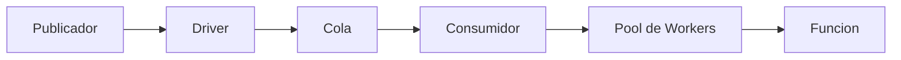

# Cola

Wippy proporciona un sistema de colas para procesamiento asincrono de mensajes con drivers y consumidores configurables.

## Arquitectura



- **Driver** - Implementacion de backend (memory, AMQP, Redis)
- **Cola** - Cola logica vinculada a un driver
- **Consumidor** - Conecta cola a handler con configuracion de concurrencia
- **Pool de Workers** - Procesadores de mensajes concurrentes

Multiples colas pueden compartir un driver. Multiples consumidores pueden procesar de la misma cola.

## Tipos de Entrada

| Tipo | Descripcion |
|------|-------------|
| `queue.driver.memory` | Driver de cola en memoria |
| `queue.queue` | Declaracion de cola con referencia a driver |
| `queue.consumer` | Consumidor que procesa mensajes |

## Configuracion de Driver

### Driver de Memoria

Driver en memoria para desarrollo y pruebas.

```yaml
- name: memory_driver
  kind: queue.driver.memory
  lifecycle:
    auto_start: true
```

<note>
Drivers adicionales (AMQP, Redis, SQS) estan planeados. La interfaz del driver permite intercambiar backends sin cambiar la configuracion de cola o consumidor.
</note>

## Configuracion de Cola

```yaml
- name: tasks
  kind: queue.queue
  driver: app.queue:memory_driver
```

| Campo | Tipo | Requerido | Descripcion |
|-------|------|----------|-------------|
| `driver` | ID de Registro | Si | Referencia al driver de cola |
| `options` | Map | No | Opciones especificas del driver |

<note>
El driver de memoria no tiene opciones de configuracion. Los drivers externos (AMQP, Redis, SQS) definen sus propias opciones para comportamiento de cola como durabilidad, longitud maxima, y TTL.
</note>

## Configuracion de Consumidor

```yaml
- name: task_consumer
  kind: queue.consumer
  queue: app.queue:tasks
  func: app.queue:task_handler
  concurrency: 4
  prefetch: 20
  lifecycle:
    auto_start: true
    depends_on:
      - app.queue:tasks
```

| Campo | Por Defecto | Max | Descripcion |
|-------|---------|-----|-------------|
| `queue` | Requerido | - | ID de registro de la cola |
| `func` | Requerido | - | ID de registro de la funcion handler |
| `concurrency` | 1 | 1000 | Conteo de workers paralelos |
| `prefetch` | 10 | 10000 | Tamano del buffer de mensajes |

<tip>
Los consumidores respetan el contexto de llamada y pueden estar sujetos a politicas de seguridad. Configure actor y politicas a nivel de ciclo de vida. Ver <a href="system-security.md">Seguridad</a>.
</tip>

### Pool de Workers

Los workers se ejecutan como goroutines concurrentes:

```
concurrency: 3, prefetch: 10

1. El driver entrega hasta 10 mensajes al buffer
2. 3 workers extraen del buffer concurrentemente
3. A medida que los workers terminan, el buffer se rellena
4. Backpressure cuando todos los workers estan ocupados y el buffer lleno
```

## Funcion Handler

Las funciones del consumidor reciben datos del mensaje y retornan exito o error:

```lua
local json = require("json")
local logger = require("logger")

local function handler(body)
    local data = json.decode(body)

    logger.info("Procesando", {task_id = data.id})

    local result, err = process_task(data)
    if err then
        return nil, err  -- Nack: reencolar mensaje
    end

    return result  -- Ack: remover de cola
end

return handler
```

```yaml
- name: task_handler
  kind: function.lua
  source: file://task_handler.lua
  modules:
    - json
    - logger
```

### Reconocimiento

| Resultado del Handler | Accion | Efecto |
|----------------|--------|--------|
| Valor de retorno | Ack | Mensaje removido de la cola |
| Retornar error | Nack | Mensaje reencolado (dependiente del driver) |

## Publicando Mensajes

Desde codigo Lua:

```lua
local queue = require("queue")

queue.publish("app.queue:tasks", {
    id = "task-123",
    action = "process",
    data = payload
})
```

Ver [Modulo Queue](lua-queue.md) para la API completa.

## Apagado Graceful

Al detener el consumidor:

1. Dejar de aceptar nuevas entregas
2. Cancelar contextos de workers
3. Esperar mensajes en vuelo (con timeout)
4. Retornar error si los workers no terminan a tiempo

## Ver Tambien

- [Modulo Queue](lua/storage/queue.md) - Referencia de API Lua
- [Guia de Consumidores de Cola](guides/queue-consumers.md) - Patrones de consumidor y pools de workers
- [Supervision](guides/supervision.md) - Gestion del ciclo de vida del consumidor
