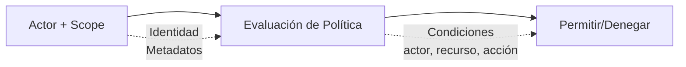

# Modelo de Seguridad

Wippy implementa control de acceso basado en atributos. Cada solicitud lleva un actor (quién) y un scope (qué políticas aplican). Las políticas evalúan el acceso basado en la acción, recurso, y metadatos tanto del actor como del recurso.



## Tipos de Entrada

| Tipo | Descripción |
|------|-------------|
| `security.policy` | Política declarativa con condiciones |
| `security.policy.expr` | Política basada en expresiones |
| `security.token_store` | Almacenamiento y validación de tokens |

## Actores

Un actor representa quién está realizando una acción.

```lua
local security = require("security")

-- Crear actor con metadatos
local actor = security.new_actor("user:123", {
    role = "admin",
    team = "backend",
    department = "engineering",
    clearance = 3
})

-- Acceder propiedades del actor
local id = actor:id()        -- "user:123"
local meta = actor:meta()    -- {role="admin", ...}
```

### Actor en Contexto

```lua
-- Obtener actor actual del contexto
local actor = security.actor()
if not actor then
    return nil, errors.new("UNAUTHORIZED", "Sin actor en contexto")
end
```

## Políticas

Las políticas definen reglas de acceso con acciones, recursos, condiciones y efectos.

### Política Declarativa

```yaml
# src/security/_index.yaml
version: "1.0"
namespace: app.security

entries:
  # Acceso completo admin
  - name: admin_policy
    kind: security.policy
    policy:
      actions: "*"
      resources: "*"
      effect: allow
      conditions:
        - field: actor.meta.role
          operator: eq
          value: admin
    groups:
      - admin

  # Acceso de solo lectura
  - name: readonly_policy
    kind: security.policy
    policy:
      actions:
        - "*.read"
        - "*.get"
        - "*.list"
      resources: "*"
      effect: allow
    groups:
      - default

  # Acceso de propietario de recurso
  - name: owner_policy
    kind: security.policy
    policy:
      actions:
        - read
        - write
        - delete
      resources: "document:*"
      effect: allow
      conditions:
        - field: meta.owner
          operator: eq
          value_from: actor.id
    groups:
      - default

  # Denegar confidencial sin autorización
  - name: deny_confidential
    kind: security.policy
    policy:
      actions: "*"
      resources: "document:*"
      effect: deny
      conditions:
        - field: meta.classification
          operator: eq
          value: confidential
        - field: actor.meta.clearance
          operator: lt
          value: 3
    groups:
      - security
```

### Estructura de Política

```yaml
policy:
  actions: "*" | "accion" | ["accion1", "accion2"]
  resources: "*" | "recurso" | ["res1", "res2"]
  effect: allow | deny
  conditions:  # Opcional
    - field: "ruta.campo"
      operator: "eq"
      value: "valor_estatico"
      # O
      value_from: "otra.ruta.campo"
```

### Política Basada en Expresiones

Para lógica compleja, use políticas de expresiones:

```yaml
- name: flexible_access
  kind: security.policy.expr
  policy:
    actions:
      - read
      - write
    resources: "file:*"
    effect: allow
    expression: |
      (actor.meta.role == "editor" && action == "write") ||
      (action == "read" && meta.public == true) ||
      actor.id == meta.owner
  groups:
    - editors
```

## Condiciones

Las condiciones permiten evaluación dinámica de políticas basada en actor, acción, recurso y metadatos.

### Rutas de Campo

| Ruta | Descripción |
|------|-------------|
| `actor.id` | Identificador único del actor |
| `actor.meta.*` | Metadatos del actor (soporta anidamiento) |
| `action` | La acción que se está realizando |
| `resource` | El identificador del recurso |
| `meta.*` | Metadatos del recurso |

### Operadores

| Operador | Descripción | Ejemplo |
|----------|-------------|---------|
| `eq` | Igual | `actor.meta.role eq "admin"` |
| `ne` | No igual | `meta.status ne "deleted"` |
| `lt` | Menor que | `meta.priority lt 5` |
| `gt` | Mayor que | `actor.meta.clearance gt 2` |
| `lte` | Menor o igual | `meta.size lte 1000` |
| `gte` | Mayor o igual | `actor.meta.level gte 3` |
| `in` | Valor en array | `action in ["read", "write"]` |
| `nin` | Valor no en array | `meta.status nin ["deleted", "archived"]` |
| `exists` | Campo existe | `meta.owner exists true` |
| `nexists` | Campo no existe | `meta.deleted nexists true` |
| `contains` | String contiene | `resource contains "sensitive"` |
| `ncontains` | String no contiene | `resource ncontains "public"` |
| `matches` | Coincidencia regex | `resource matches "^doc:.*"` |
| `nmatches` | No coincide regex | `actor.id nmatches "^system:.*"` |

## Scopes

Los scopes combinan múltiples políticas en un contexto de seguridad.

```lua
local security = require("security")

-- Obtener políticas
local admin_policy = security.policy("app.security:admin_policy")
local readonly_policy = security.policy("app.security:readonly_policy")

-- Crear scope con políticas
local scope = security.new_scope()
scope = scope:with(admin_policy)
scope = scope:with(readonly_policy)

-- Los scopes son inmutables - :with() retorna nuevo scope
```

### Scopes Nombrados (Grupos de Políticas)

Cargar todas las políticas de un grupo:

```lua
-- Cargar scope con todas las políticas del grupo
local scope, err = security.named_scope("app.security:admin")
```

## Evaluación de Políticas

### Flujo de Evaluación

```
1. Verificar cada política en scope
2. Si ALGUNA política retorna Deny -> Resultado es Deny
3. Si al menos un Allow y ningún Deny -> Resultado es Allow
4. Sin políticas aplicables -> Resultado es Undefined
```

### Resultados de Evaluación

| Resultado | Significado |
|--------|---------|
| `allow` | Acceso concedido |
| `deny` | Acceso explícitamente denegado |
| `undefined` | Ninguna política coincidió |

## Almacenes de Tokens

Los almacenes de tokens proporcionan creación, validación y revocación segura de tokens.

### Configuración

```yaml
# src/auth/_index.yaml
version: "1.0"
namespace: app.auth

entries:
  # Registrar variable de entorno
  - name: os_env
    kind: env.storage.os

  - name: AUTH_SECRET_KEY
    kind: env.variable
    variable: AUTH_SECRET_KEY
    storage: app.auth:os_env

  # Almacén respaldo para tokens
  - name: token_data
    kind: store.memory
    lifecycle:
      auto_start: true

  # Almacén de tokens
  - name: tokens
    kind: security.token_store
    store: app.auth:token_data
    token_length: 32
    default_expiration: "24h"
    token_key_env: "AUTH_SECRET_KEY"
```

### Opciones del Almacén de Tokens

| Opción | Por Defecto | Descripción |
|--------|---------|-------------|
| `store` | requerido | Referencia al almacén clave-valor respaldo |
| `token_length` | 32 | Tamaño del token en bytes (256 bits) |
| `default_expiration` | 24h | TTL por defecto del token |
| `token_key` | ninguno | Clave de firma HMAC-SHA256 (valor directo) |
| `token_key_env` | ninguno | Nombre de variable de entorno para clave de firma |

Use `token_key_env` en producción para evitar embeber secretos en entradas.

## Verificación Rápida de Permisos

```lua
-- Verificar contra actor y scope del contexto actual
local allowed = security.can("read", "document:123", {
    owner = "user:456"
})

if not allowed then
    return nil, errors.new("FORBIDDEN", "Acceso denegado")
end
```

## Flujo de Contexto

El contexto de seguridad se propaga a través de llamadas de funciones.

### Estableciendo Contexto

```lua
local funcs = require("funcs")

-- Llamar función con contexto de seguridad
local result, err = funcs.new()
    :with_actor(actor)
    :with_scope(scope)
    :call("app.api:protected_endpoint", data)
```

## Seguridad a Nivel de Servicio

Configure seguridad por defecto para servicios:

```yaml
- name: worker_service
  kind: process.lua
  source: file://worker.lua
  lifecycle:
    auto_start: true
    security:
      actor:
        id: "service:worker"
        meta:
          role: worker
          service: true
      policies:
        - app.security:worker_policy
      groups:
        - workers
```

## Modo Estricto

Habilite modo estricto para denegar acceso cuando el contexto de seguridad está ausente:

```yaml
# wippy.yaml
security:
  strict_mode: true
```

| Modo | Contexto Ausente | Comportamiento |
|------|-----------------|----------|
| Normal | Sin actor/scope | Allow (permisivo) |
| Estricto | Sin actor/scope | Deny (seguro por defecto) |

## Ver También

- [Módulo Security](lua/security/security.md) - API de seguridad en Lua
