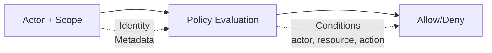

# Modelo de Seguridad

Wippy implementa control de acceso basado en atributos. Cada solicitud lleva un actor (quién) y un scope (qué políticas aplican). Las políticas evalúan el acceso basándose en la acción, el recurso y los metadatos tanto del actor como del recurso.


```mermaid
flowchart LR
    A[Actor + Scope] --> PE[Policy Evaluation] --> AD[Allow/Deny]
    A -.->|Identity<br/>Metadata| PE
    PE -.->|Conditions<br/>actor, resource, action| AD
```

## Tipos de Entrada

| Tipo | Descripción |
|------|-------------|
| `security.policy` | Política declarativa con condiciones |
| `security.policy.expr` | Política basada en expresiones |
| `security.token_store` | Almacenamiento y validación de tokens |

## Actores

Un actor representa quién está realizando una acción.

```lua
local security = require("security")

-- Crear actor con metadatos
local actor = security.new_actor("user:123", {
    role = "admin",
    team = "backend",
    department = "engineering",
    clearance = 3
})

-- Acceder a propiedades del actor
local id = actor:id()        -- "user:123"
local meta = actor:meta()    -- {role="admin", ...}
```

### Actor en el Contexto

```lua
-- Obtener el actor actual desde el contexto
local actor = security.actor()
if not actor then
    return nil, errors.new("UNAUTHORIZED", "No actor in context")
end
```

## Políticas

Las políticas definen reglas de acceso con acciones, recursos, condiciones y efectos.

### Política Declarativa

```yaml
# src/security/_index.yaml
version: "1.0"
namespace: app.security

entries:
  # Acceso total de administrador
  - name: admin_policy
    kind: security.policy
    policy:
      actions: "*"
      resources: "*"
      effect: allow
      conditions:
        - field: actor.meta.role
          operator: eq
          value: admin
    groups:
      - admin

  # Acceso solo de lectura
  - name: readonly_policy
    kind: security.policy
    policy:
      actions:
        - "*.read"
        - "*.get"
        - "*.list"
      resources: "*"
      effect: allow
    groups:
      - default

  # Acceso del propietario del recurso
  - name: owner_policy
    kind: security.policy
    policy:
      actions:
        - read
        - write
        - delete
      resources: "document:*"
      effect: allow
      conditions:
        - field: meta.owner
          operator: eq
          value_from: actor.id
    groups:
      - default

  # Denegar confidencial sin nivel de autorización
  - name: deny_confidential
    kind: security.policy
    policy:
      actions: "*"
      resources: "document:*"
      effect: deny
      conditions:
        - field: meta.classification
          operator: eq
          value: confidential
        - field: actor.meta.clearance
          operator: lt
          value: 3
    groups:
      - security
```

### Estructura de Política

```yaml
policy:
  actions: "*" | "action" | ["action1", "action2"]
  resources: "*" | "resource" | ["res1", "res2"]
  effect: allow | deny
  conditions:  # Opcional
    - field: "field.path"
      operator: "eq"
      value: "static_value"
      # O
      value_from: "other.field.path"
```

### Política Basada en Expresiones

Para lógica compleja, use políticas de expresión:

```yaml
- name: flexible_access
  kind: security.policy.expr
  policy:
    actions:
      - read
      - write
    resources: "file:*"
    effect: allow
    expression: |
      (actor.meta.role == "editor" && action == "write") ||
      (action == "read" && meta.public == true) ||
      actor.id == meta.owner
  groups:
    - editors
```

## Condiciones

Las condiciones permiten la evaluación dinámica de políticas basada en actor, acción, recurso y metadatos.

### Rutas de Campo

| Ruta | Descripción |
|------|-------------|
| `actor.id` | Identificador único del actor |
| `actor.meta.*` | Metadatos del actor (admite anidamiento) |
| `action` | La acción que se está realizando |
| `resource` | El identificador del recurso |
| `meta.*` | Metadatos del recurso |

### Operadores

| Operador | Descripción | Ejemplo |
|----------|-------------|---------|
| `eq` | Igual | `actor.meta.role eq "admin"` |
| `ne` | No igual | `meta.status ne "deleted"` |
| `lt` | Menor que | `meta.priority lt 5` |
| `gt` | Mayor que | `actor.meta.clearance gt 2` |
| `lte` | Menor o igual | `meta.size lte 1000` |
| `gte` | Mayor o igual | `actor.meta.level gte 3` |
| `in` | Valor en arreglo | `action in ["read", "write"]` |
| `nin` | Valor no en arreglo | `meta.status nin ["deleted", "archived"]` |
| `exists` | El campo existe | `meta.owner exists true` |
| `nexists` | El campo no existe | `meta.deleted nexists true` |
| `contains` | String contiene | `resource contains "sensitive"` |
| `ncontains` | String no contiene | `resource ncontains "public"` |
| `matches` | Coincide con regex | `resource matches "^doc:.*"` |
| `nmatches` | No coincide con regex | `actor.id nmatches "^system:.*"` |

### Ejemplos de Condiciones

```yaml
# Coincidir con rol del actor
conditions:
  - field: actor.meta.role
    operator: eq
    value: admin

# Comparar campos
conditions:
  - field: meta.owner
    operator: eq
    value_from: actor.id

# Comparación numérica
conditions:
  - field: actor.meta.clearance
    operator: gte
    value: 3

# Pertenencia a arreglo
conditions:
  - field: actor.meta.role
    operator: in
    value:
      - admin
      - moderator

# Coincidencia de patrón
conditions:
  - field: resource
    operator: matches
    value: "^api:/v[0-9]+/admin/.*"

# Múltiples condiciones (AND)
conditions:
  - field: actor.meta.department
    operator: eq
    value: engineering
  - field: meta.environment
    operator: eq
    value: production
```

## Scopes

Los scopes combinan múltiples políticas en un contexto de seguridad.

```lua
local security = require("security")

-- Obtener políticas
local admin_policy = security.policy("app.security:admin_policy")
local readonly_policy = security.policy("app.security:readonly_policy")

-- Crear scope con políticas
local scope = security.new_scope()
scope = scope:with(admin_policy)
scope = scope:with(readonly_policy)

-- Los scopes son inmutables - :with() devuelve un nuevo scope
```

### Scopes Nombrados (Grupos de Políticas)

Cargar todas las políticas de un grupo:

```lua
-- Cargar scope con todas las políticas del grupo
local scope, err = security.named_scope("app.security:admin")
```

Las políticas se asignan a grupos mediante el campo `groups`:

```yaml
- name: admin_policy
  kind: security.policy
  policy:
    # ...
  groups:
    - admin      # Esta política está en el grupo "admin"
    - default    # Puede estar en varios grupos
```

### Operaciones de Scope

```lua
-- Agregar política
local new_scope = scope:with(policy)

-- Eliminar política
local new_scope = scope:without("app.security:temp_policy")

-- Verificar si una política está en el scope
local has = scope:contains("app.security:admin_policy")

-- Obtener todas las políticas
local policies = scope:policies()
```

## Evaluación de Políticas

### Flujo de Evaluación

```
1. No actor or no scope in context → strict mode decides (deny by default)
2. Check each policy in scope
3. If ANY policy returns Deny → Result is Deny
4. If at least one Allow and no Deny → Result is Allow
5. No applicable policies → Result is Undefined
```

Una verificación de acceso solo pasa con `Allow`. `Undefined` deniega el acceso, exactamente igual que `Deny` — el modo estricto no interviene una vez que hay tanto un actor como un scope.

### Resultados de Evaluación

| Resultado | Significado |
|-----------|-------------|
| `allow` | Acceso concedido |
| `deny` | Acceso denegado explícitamente |
| `undefined` | Ninguna política coincidió |

```lua
-- Evaluar directamente
local result = scope:evaluate(actor, "read", "document:123", {
    owner = "user:456",
    classification = "internal"
})

if result == "deny" then
    return nil, errors.new("FORBIDDEN", "Access denied")
elseif result == "undefined" then
    -- Ninguna política coincidió - las verificaciones de acceso lo tratan como denegado
end
```

### Verificación Rápida de Permisos

```lua
-- Verificar contra el actor y scope del contexto actual
local allowed = security.can("read", "document:123", {
    owner = "user:456"
})

if not allowed then
    return nil, errors.new("FORBIDDEN", "Access denied")
end
```

## Almacenes de Tokens

Los almacenes de tokens proporcionan creación, validación y revocación seguras de tokens.

### Configuración

```yaml
# src/auth/_index.yaml
version: "1.0"
namespace: app.auth

entries:
  # Registrar variable de entorno
  - name: os_env
    kind: env.storage.os

  - name: AUTH_SECRET_KEY
    kind: env.variable
    variable: AUTH_SECRET_KEY
    storage: app.auth:os_env

  # Almacén respaldo para tokens
  - name: token_data
    kind: store.memory
    lifecycle:
      auto_start: true

  # Almacén de tokens
  - name: tokens
    kind: security.token_store
    store: app.auth:token_data
    token_length: 32
    default_expiration: "24h"
    token_key: ${env:AUTH_SECRET_KEY}
```

### Opciones del Almacén de Tokens

| Opción | Predeterminado | Descripción |
|--------|----------------|-------------|
| `store` | requerido | Referencia al almacén clave-valor de respaldo |
| `token_length` | 32 | Tamaño del token en bytes (256 bits) |
| `default_expiration` | 24h | TTL predeterminado del token |
| `token_key` | ninguno | Clave de firma HMAC-SHA256 (valor directo, o `${env:NAME}` para obtenerla del [registro de entorno](system/env.md)) |

Use `token_key: ${env:NAME}` en producción para evitar incrustar secretos en las entradas. La directiva heredada `token_key_env` se resuelve de la misma forma pero está obsoleta; prefiera `${env:NAME}`.

### Creación de Tokens

```lua
local security = require("security")

-- Obtener almacén de tokens
local store, err = security.token_store("app.auth:tokens")
if err then
    return nil, err
end

-- Crear actor y scope
local actor = security.new_actor("user:123", {
    role = "user",
    email = "user@example.com"
})

local scope, _ = security.named_scope("app.security:default")

-- Crear token
local token, err = store:create(actor, scope, {
    expiration = "7d",  -- Sobrescribir expiración predeterminada
    meta = {
        device = "mobile",
        ip = "192.168.1.1"
    }
})

if err then
    return nil, err
end

-- Formato del token: base64_token.hmac_signature (si token_key está definido)
-- Ejemplo: "dGVzdHRva2VuMTIz.a1b2c3d4e5f6"
```

### Validación de Tokens

```lua
-- Validar token
local actor, scope, err = store:validate(token)
if err then
    return nil, errors.new("UNAUTHORIZED", "Invalid token")
end

-- Actor y scope se reconstruyen desde los datos almacenados
print(actor:id())  -- "user:123"
```

### Revocación de Tokens

```lua
-- Revocar un token
local ok, err = store:revoke(token)

-- Cerrar el almacén cuando termine
store:close()
```

## Flujo de Contexto

El contexto de seguridad se propaga a través de las llamadas a funciones.

### Establecer el Contexto

```lua
local funcs = require("funcs")

-- Llamar función con contexto de seguridad
local result, err = funcs.new()
    :with_actor(actor)
    :with_scope(scope)
    :call("app.api:protected_endpoint", data)
```

### Herencia del Contexto

| Componente | Hereda |
|------------|--------|
| Actor | Sí - se pasa a llamadas hijas |
| Scope | Sí - se pasa a llamadas hijas |
| Modo estricto | No - es a nivel de aplicación |

Las funciones heredan el contexto de seguridad del llamador. Un proceso generado no: arranca sobre un frame nuevo, y su contexto proviene del bloque `security:` de su propia entrada. Cuando esa entrada no declara ningún bloque, el proceso se ejecuta sin actor y sin scope, lo que el modo estricto deniega. Un bloque declarado que omite `actor` hereda el actor de quien lo genera, y uno que omite tanto `policies` como `groups` hereda su scope — así que "comienza sin contexto" significa "sin herencia ambiental", no "no se le puede dar un contexto".

## Declarar Seguridad en las Entradas

Un bloque de seguridad tiene la misma forma en todos los lugares donde aparece:

| Campo | Tipo | Descripción |
|-------|------|-------------|
| `actor.id` | string | Identidad del actor; reemplaza al actor heredado |
| `actor.meta` | map | Atributos del actor que evalúan las políticas |
| `policies` | list | Registry IDs de políticas, fusionados en el scope |
| `groups` | list | Registry IDs de grupos de políticas, cuyas políticas se fusionan en el scope |

`policies` y `groups` son **registry IDs en forma `namespace:name`**. Un nombre suelto no se resuelve — a diferencia del campo `groups:` de una entrada de política, que usa por defecto el namespace de la propia política, estas referencias no llevan namespace por defecto.

La resolución es atómica y fail-closed. Cada política y grupo listado se resuelve antes de instalar nada; si alguno falta, está vacío o no contiene políticas, toda la configuración falla y no se aplica ningún actor ni ningún scope parcial. Por lo tanto, un llamador nunca cruza una frontera con medio contexto.

### Entradas de Proceso

Las entradas `process.lua`, `process.lua.bc`, `function.lua` y `function.lua.bc` aceptan un bloque `security:` de nivel superior que se aplica a cada ejecución de esa entrada:

```yaml
- name: worker_process
  kind: process.lua
  source: file://worker.lua
  method: main
  security:
    actor:
      id: "service:worker"
      meta:
        role: worker
        service: true
    policies:
      - app.security:worker_policy
    groups:
      - app.security:workers
```

El bloque se aplica cuando el proceso arranca, tanto en `process.host` como en `terminal.host`. Un fallo de resolución aborta el spawn en lugar de arrancar el proceso con un contexto más débil.

### Ciclo de Vida del Servicio

Los servicios supervisados aceptan el mismo bloque bajo `lifecycle`, resuelto una vez al crear el controlador del servicio y sellado durante toda la vida del servicio:

```yaml
- name: worker
  kind: process.service
  process: app:worker_process
  host: app:processes
  lifecycle:
    auto_start: true
    security:
      actor:
        id: "service:worker"
      groups:
        - app.security:workers
```

### Comandos de la CLI

Una entrada de comando declara `meta.command.security`, aplicado solo cuando la entrada se lanza como comando de la CLI — el operador que ejecuta `wippy run <name>` es el ancla de confianza de ese contexto. Nunca afecta a un spawn ordinario de la misma entrada. El bloque se valida estrictamente: los campos desconocidos se rechazan, un bloque vacío se rechaza, y `security` sin un `name` de comando se rechaza. Ver [Seguridad de comandos](guides/cli.md#command-security).

## Modo Estricto

El modo estricto decide qué ocurre cuando una solicitud no lleva actor ni scope. Está **activado por defecto**, así que un contexto incompleto se deniega. Desactivarlo es una decisión explícita, tomada en el archivo de configuración del runtime (`.wippy.yaml`), no en el manifiesto de módulo `wippy.yaml`:

```yaml
# .wippy.yaml
security:
  strict_mode: false
```

| Modo | Contexto Ausente | Comportamiento |
|------|------------------|----------------|
| Estricto (por defecto) | Sin actor/scope | Deniega |
| Permisivo (`strict_mode: false`) | Sin actor/scope | Permite |

El modo estricto no cambia nada una vez que hay un actor y un scope: la evaluación deniega por defecto en cualquier caso. Solo rige el caso incompleto, y por eso un proceso que se ejecuta sin un contexto de seguridad declarado falla todas las verificaciones bajo el valor por defecto. Dele a ese proceso un bloque `security:`, o arránquelo por una ruta que le suministre uno.

## Flujo de Autenticación

Validación de token en un handler HTTP:

```lua
local http = require("http")
local security = require("security")

local function protected_handler()
    local req = http.request()
    local res = http.response()

    -- Extraer y validar token
    local auth = req:header("Authorization")
    if not auth then
        return res:set_status(401):write_json({error = "Missing authorization"})
    end

    local token = auth:gsub("^Bearer%s+", "")
    local store, _ = security.token_store("app.auth:tokens")
    local actor, scope, err = store:validate(token)
    if err then
        return res:set_status(401):write_json({error = "Invalid token"})
    end

    -- Verificar permiso
    if not security.can("api.users.read", "users") then
        return res:set_status(403):write_json({error = "Forbidden"})
    end

    res:write_json({user = actor:id()})
end

return { handler = protected_handler }
```

Creación de token durante el login:

```lua
local actor = security.new_actor("user:" .. user.id, {role = user.role})
local scope, _ = security.named_scope("app.security:" .. user.role)

local store, _ = security.token_store("app.auth:tokens")
local token, err = store:create(actor, scope, {expiration = "24h"})
```

## Fronteras de Confianza del Runtime

La evaluación de políticas rige lo que el código puede hacer. Tres mecanismos separados rigen qué código se admite y hasta dónde puede viajar un contexto.

### Integridad de Módulos

Cada módulo de `wippy.lock` lleva un digest de artefacto. Las descargas se hacen por etapas, se verifican contra el digest fijado en el bloqueo y contra el digest que sirvió el hub, y solo entonces se mueven a su lugar; los packs ya vendorizados se reverifican en el arranque. Una discrepancia es un fallo `PermissionDenied` que no se reintenta ni se rodea — el módulo no se carga. Los directorios de módulo extraídos llevan su propio digest registrado y digest de árbol y se comprueban de la misma forma, de modo que un árbol vendorizado modificado se detecta en lugar de confiarse en él. Ver [Gestión de Dependencias](guides/dependency-management.md#integrity-verification).

### Identidad Internodo del Clúster

Los nodos de un clúster se autentican entre sí. Cada nodo posee una clave de identidad ed25519 y el mapa de claves públicas de pares en las que confía; el handshake de la malla es mutuo y vincula un HMAC sobre el secreto de gossip compartido a una firma ed25519 sobre una transcripción que cubre ambos IDs de nodo y ambos nonces. Un par que no está en el mapa de confianza, o cuya clave anunciada por gossip discrepa de la entrada de confianza, se rechaza. No existe un modo sin autenticar: un nodo sin identidad no puede unirse a la malla. Ver [Identidad internodo](guides/cluster.md#internode-identity).

### Propagación en Temporal

Un contexto de seguridad que cruza hacia Temporal se transporta como un header firmado, no como entrada plana del workflow. El actor, sus metadatos y los IDs de políticas se serializan en un sobre `wippy-security` y se firman con la clave HMAC del cliente, con audiencia en el ID concreto del workflow o de la activity. El worker receptor verifica la firma y la audiencia y resuelve localmente cada política nombrada antes de que el workflow o la activity se ejecute; cualquier fallo hace fallar la ejecución. Un workflow que se ejecuta bajo un contexto de seguridad también rechaza señales sin firmar, de modo que un cliente externo de Temporal no puede operarlo. Ver [Workflows](temporal/workflows.md#security-context) y [Resumen de Temporal](temporal/overview.md#security-context-propagation).

## Mejores Prácticas

1. **Privilegio mínimo** - Otorgue los permisos mínimos requeridos
2. **Denegar por defecto** - Use políticas de permiso explícitas, active el modo estricto
3. **Use grupos de políticas** - Organice las políticas por rol/función
4. **Firme los tokens** - Siempre defina `token_key_env` en producción
5. **Expiración corta** - Use tiempos de vida cortos para operaciones sensibles
6. **Condicione sobre el contexto** - Prefiera condiciones dinámicas frente a políticas estáticas
7. **Audite acciones sensibles** - Registre operaciones relevantes para la seguridad

## Referencia del Módulo security

| Función | Descripción |
|---------|-------------|
| `security.actor()` | Obtiene el actor actual desde el contexto |
| `security.scope()` | Obtiene el scope actual desde el contexto |
| `security.can(action, resource, meta?)` | Verifica permiso |
| `security.new_actor(id, meta?)` | Crea un nuevo actor |
| `security.new_scope(policies?)` | Crea un scope vacío o con políticas iniciales |
| `security.policy(id)` | Obtiene política por ID |
| `security.named_scope(group_id)` | Obtiene scope con todas las políticas del grupo |
| `security.token_store(id)` | Obtiene un almacén de tokens |
