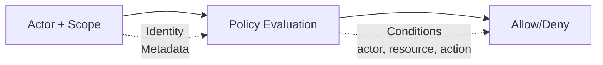

# Modelo de Seguridad

Wippy implementa control de acceso basado en atributos con actores y ámbitos de políticas. Las políticas evalúan acciones y recursos utilizando metadatos del actor y del recurso.

Esta página es una referencia de configuración y API. Los ejemplos completos nombran las entradas de registro necesarias; los bloques Lua y YAML más breves ilustran una operación o un fragmento de configuración dentro de un contexto de seguridad existente.


```mermaid
flowchart LR
    A[Actor + Scope] --> PE[Policy Evaluation] --> AD[Allow/Deny]
    A -.->|Identity<br/>Metadata| PE
    PE -.->|Conditions<br/>actor, resource, action| AD
```

## Tipos de Entrada

| Tipo | Descripción |
|------|-------------|
| `security.policy` | Política declarativa con condiciones |
| `security.policy.expr` | Política basada en expresiones |
| `security.token_store` | Almacenamiento y validación de tokens |

## Actores

Un actor identifica al principal que realiza una acción.

```lua
local security = require("security")

-- Create actor with metadata
local actor = security.new_actor("user:123", {
    role = "admin",
    team = "backend",
    department = "engineering",
    clearance = 3
})

-- Access actor properties
local id = actor:id()        -- "user:123"
local meta = actor:meta()    -- {role="admin", ...}
```

### Actor en el Contexto

```lua
-- Get current actor from context
local errors = require("errors")

local actor = security.actor()
if not actor then
    return nil, errors.new({
        kind = errors.PERMISSION_DENIED,
        message = "No actor in context"
    })
end
```

## Políticas

Las políticas definen reglas de acceso con acciones, recursos, condiciones y efectos.

### Política Declarativa

```yaml
# src/security/_index.yaml
version: "1.0"
namespace: app.security

entries:
  # Admin full access
  - name: admin_policy
    kind: security.policy
    policy:
      actions: "*"
      resources: "*"
      effect: allow
      conditions:
        - field: actor.meta.role
          operator: eq
          value: admin
    groups:
      - admin

  # Read-only access
  - name: readonly_policy
    kind: security.policy
    policy:
      actions:
        - "*.read"
        - "*.get"
        - "*.list"
      resources: "*"
      effect: allow
    groups:
      - default

  # Resource owner access
  - name: owner_policy
    kind: security.policy
    policy:
      actions:
        - read
        - write
        - delete
      resources: "document:*"
      effect: allow
      conditions:
        - field: meta.owner
          operator: eq
          value_from: actor.id
    groups:
      - default

  # Deny confidential without clearance
  - name: deny_confidential
    kind: security.policy
    policy:
      actions: "*"
      resources: "document:*"
      effect: deny
      conditions:
        - field: meta.classification
          operator: eq
          value: confidential
        - field: actor.meta.clearance
          operator: lt
          value: 3
    groups:
      - security
```

### Estructura de Política

```text
policy:
  actions: "*" | "action" | ["action1", "action2"]
  resources: "*" | "resource" | ["res1", "res2"]
  effect: allow | deny
  conditions:  # Optional
    - field: "field.path"
      operator: "eq"
      value: "static_value"
      # OR
      value_from: "other.field.path"
```

### Política Basada en Expresiones

Para lógica compleja, use políticas de expresión:

```yaml
- name: flexible_access
  kind: security.policy.expr
  policy:
    actions:
      - read
      - write
    resources: "file:*"
    effect: allow
    expression: |
      (actor.meta.role == "editor" && action == "write") ||
      (action == "read" && meta.public == true) ||
      actor.id == meta.owner
  groups:
    - editors
```

## Condiciones

Las condiciones permiten la evaluación dinámica de políticas basada en actor, acción, recurso y metadatos.

### Rutas de Campo

| Ruta | Descripción |
|------|-------------|
| `actor.id` | Identificador único del actor |
| `actor.meta.*` | Metadatos del actor (admite anidamiento) |
| `action` | La acción que se está realizando |
| `resource` | El identificador del recurso |
| `meta.*` | Metadatos del recurso |

### Operadores

| Operador | Descripción | Ejemplo |
|----------|-------------|---------|
| `eq` | Igual | `actor.meta.role eq "admin"` |
| `ne` | No igual | `meta.status ne "deleted"` |
| `lt` | Menor que | `meta.priority lt 5` |
| `gt` | Mayor que | `actor.meta.clearance gt 2` |
| `lte` | Menor o igual | `meta.size lte 1000` |
| `gte` | Mayor o igual | `actor.meta.level gte 3` |
| `in` | Valor en arreglo | `action in ["read", "write"]` |
| `nin` | Valor no en arreglo | `meta.status nin ["deleted", "archived"]` |
| `exists` | El campo existe | `meta.owner exists true` |
| `nexists` | El campo no existe | `meta.deleted nexists true` |
| `contains` | String contiene | `resource contains "sensitive"` |
| `ncontains` | String no contiene | `resource ncontains "public"` |
| `matches` | Coincide con regex | `resource matches "^doc:.*"` |
| `nmatches` | No coincide con regex | `actor.id nmatches "^system:.*"` |

### Ejemplos de Condiciones

```yaml
# Match actor role
conditions:
  - field: actor.meta.role
    operator: eq
    value: admin

# Compare fields
conditions:
  - field: meta.owner
    operator: eq
    value_from: actor.id

# Numeric comparison
conditions:
  - field: actor.meta.clearance
    operator: gte
    value: 3

# Array membership
conditions:
  - field: actor.meta.role
    operator: in
    value:
      - admin
      - moderator

# Pattern matching
conditions:
  - field: resource
    operator: matches
    value: "^api:/v[0-9]+/admin/.*"

# Multiple conditions (AND)
conditions:
  - field: actor.meta.department
    operator: eq
    value: engineering
  - field: meta.environment
    operator: eq
    value: production
```

## Scopes

Los scopes combinan múltiples políticas en un contexto de seguridad.

```lua
local security = require("security")

-- Get policies
local admin_policy, admin_err = security.policy("app.security:admin_policy")
if admin_err then return nil, admin_err end
local readonly_policy, readonly_err = security.policy("app.security:readonly_policy")
if readonly_err then return nil, readonly_err end

-- Create scope with policies
local scope = security.new_scope()
scope = scope:with(admin_policy)
scope = scope:with(readonly_policy)

-- Scopes are immutable - :with() returns new scope
```

### Scopes Nombrados (Grupos de Políticas)

Cargar todas las políticas de un grupo:

```lua
-- Load scope with all policies in group
local scope, err = security.named_scope("app.security:admin")
if err then return nil, err end
```

Las políticas se asignan a grupos mediante el campo `groups`:

```yaml
- name: admin_policy
  kind: security.policy
  policy:
    # ...
  groups:
    - admin      # This policy is in "admin" group
    - default    # Can be in multiple groups
```

### Operaciones de Scope

```lua
-- Add policy
local new_scope = scope:with(policy)

-- Remove policy
local new_scope = scope:without("app.security:temp_policy")

-- Check if policy is in scope
local has = scope:contains("app.security:admin_policy")

-- Get all policies
local policies = scope:policies()
```

### Permisos del módulo

El modo estricto aplica comprobaciones de permisos a la creación de actores, políticas y ámbitos, además de las operaciones con tokens:

| Acción | Recurso | Utilizado por | Comportamiento ante denegación |
|--------|---------|---------------|--------------------------------|
| `security.actor.create` | ID del actor | `security.new_actor` | Genera un error de Lua |
| `security.policy.get` | ID de registro de la política | `security.policy` | Devuelve `nil, error` |
| `security.policy_group.get` | ID del grupo de políticas | `security.named_scope` | Devuelve `nil, error` |
| `security.scope.create` | `custom`, `with` o `without` | `security.new_scope`, `scope:with` y `scope:without`, respectivamente | Genera un error de Lua |

Concede únicamente las operaciones y los ID que necesita cada llamador. Los ejemplos de actores, ámbitos y tokens de esta página presuponen que estos permisos están presentes, además de los permisos específicos de cada operación con tokens.

## Evaluación de Políticas

### Flujo de Evaluación

```
1. Evaluate policies until a deny is found or the scope is exhausted
2. If ANY policy returns Deny → Result is Deny
3. If at least one Allow and no Deny → Result is Allow
4. No applicable policies → Result is Undefined
```

### Resultados de Evaluación

| Resultado | Significado |
|-----------|-------------|
| `allow` | Acceso concedido |
| `deny` | Acceso denegado explícitamente |
| `undefined` | Ninguna política coincidió |

```lua
local errors = require("errors")

-- Evaluate directly
local result = scope:evaluate(actor, "read", "document:123", {
    owner = "user:456",
    classification = "internal"
})

if result == "deny" then
    return nil, errors.new({
        kind = errors.PERMISSION_DENIED,
        message = "Access denied"
    })
elseif result == "undefined" then
    -- No policy matched; treat this as denied unless the caller handles it explicitly.
end
```

### Verificación Rápida de Permisos

```lua
local errors = require("errors")

-- Check against current context's actor and scope
local allowed = security.can("read", "document:123", {
    owner = "user:456"
})

if not allowed then
    return nil, errors.new({
        kind = errors.PERMISSION_DENIED,
        message = "Access denied"
    })
end
```

## Almacenes de Tokens

Los almacenes de tokens crean, validan y revocan tokens de autenticación.

Las operaciones de Lua están sujetas a permisos. El ámbito activo debe permitir `security.token_store.get` para obtener el almacén y `security.token.create`, `security.token.validate` o `security.token.revoke` para la operación correspondiente. Esto se aplica tanto en el modo estricto predeterminado como en contextos de seguridad configurados explícitamente. Los ejemplos que crean un actor o cargan un ámbito con nombre también requieren `security.actor.create` y `security.policy_group.get`.

### Configuración

```yaml
# src/auth/_index.yaml
version: "1.0"
namespace: app.auth

entries:
  # Register environment variable
  - name: os_env
    kind: env.storage.os

  - name: AUTH_SECRET_KEY
    kind: env.variable
    variable: AUTH_SECRET_KEY
    storage: app.auth:os_env

  # Backing store for tokens
  - name: token_data
    kind: store.memory
    lifecycle:
      auto_start: true

  # Token store
  - name: tokens
    kind: security.token_store
    store: app.auth:token_data
    token_length: 32
    default_expiration: "24h"
    token_key: ${env:AUTH_SECRET_KEY}
```

### Opciones del Almacén de Tokens

| Opción | Predeterminado | Descripción |
|--------|----------------|-------------|
| `store` | requerido | Referencia al almacén clave-valor de respaldo |
| `token_length` | 32 | Tamaño del token en bytes (256 bits) |
| `default_expiration` | 24h | TTL predeterminado del token |
| `token_key` | ninguno | Clave de firma HMAC-SHA256 (valor directo o `${env:NAME}` para obtenerlo del [registro de entorno](./env.md)) |

Utiliza `token_key: ${env:NAME}` en producción para evitar incrustar secretos en las entradas. La directiva heredada `token_key_env` también lee el registro de entorno, pero conserva el valor directo o cero cuando la búsqueda no existe o está vacía; un marcador moderno sin valor predeterminado falla si la variable no existe. La directiva heredada está obsoleta.

### Creación de Tokens

```lua
local security = require("security")

-- Get token store
local store, err = security.token_store("app.auth:tokens")
if err then
    return nil, err
end

-- Create actor and scope
local actor = security.new_actor("user:123", {
    role = "user",
    email = "user@example.com"
})

local scope, scope_err = security.named_scope("app.security:default")
if scope_err then
    store:close()
    return nil, scope_err
end

-- Create token
local token, create_err = store:create(actor, scope, {
    expiration = "7d",  -- Override default expiration
    meta = {
        device = "mobile",
        ip = "192.168.1.1"
    }
})
store:close()
if create_err then return nil, create_err end
return token

-- Token format: base64_token.hmac_signature (if token_key set)
-- Example: "dGVzdHRva2VuMTIz.a1b2c3d4e5f6"
```

### Validación de Tokens

```lua
local errors = require("errors")

-- Validate token
local actor, scope, err = store:validate(token)
store:close()
if err then
    return nil, errors.new({
        kind = errors.PERMISSION_DENIED,
        message = "Invalid token"
    })
end

-- Actor and scope are reconstructed from stored data
print(actor:id())  -- "user:123"
```

### Revocación de Tokens

```lua
-- Revoke single token
local ok, err = store:revoke(token)
if err then
    store:close()
    return nil, err
end

-- Close store when done
store:close()
return ok
```

## Flujo de Contexto

El actor y el ámbito forman parte del contexto heredable del marco. Las llamadas a funciones y los procesos generados heredan ambos salvo que el llamador proporcione un contexto de reemplazo. Cambiar explícitamente el actor o el ámbito de un proceso generado requiere el permiso `process.security`. Cambiar el contexto de seguridad de una llamada de función mediante `funcs.new():with_actor(...)` o `:with_scope(...)` requiere en cambio `funcs.security` sobre `security`.

### Establecer el Contexto

```lua
local funcs = require("funcs")

-- Call function with security context
local caller, err = funcs.new():with_actor(actor)
if err then return nil, err end
caller, err = caller:with_scope(scope)
if err then return nil, err end
local result, call_err = caller:call("app.api:protected_endpoint", data)
if call_err then return nil, call_err end
```

### Herencia del Contexto

| Componente | Hereda |
|------------|--------|
| Actor | Sí - se pasa a llamadas hijas y procesos generados |
| Scope | Sí - se pasa a llamadas hijas y procesos generados |
| Modo estricto | No - es a nivel de aplicación |

## Seguridad a Nivel de Servicio

Configure la seguridad predeterminada para servicios:

```yaml
- name: worker_service
  kind: process.lua
  source: file://worker.lua
  lifecycle:
    auto_start: true
    security:
      actor:
        id: "service:worker"
        meta:
          role: worker
          service: true
      policies:
        - app.security:worker_policy
      groups:
        - workers
```

## Modo Estricto

El modo estricto está activado de forma predeterminada y deniega el acceso cuando falta el actor o el ámbito. Establécelo en `false` únicamente cuando un despliegue necesite deliberadamente el comportamiento permisivo heredado:

```yaml
# .wippy.yaml
security:
  strict_mode: true
```

| `strict_mode` | Contexto ausente | Comportamiento |
|------|-----------------|----------|
| `false` | Falta el actor o el ámbito | Permite (permisivo) |
| `true` (predeterminado) | Falta el actor o el ámbito | Deniega |

Cuando existen tanto el actor como el ámbito, las políticas siempre se evalúan. Desactivar el modo estricto no convierte un resultado `undefined` en permiso; `security.can(...)` devuelve `false` salvo que la evaluación devuelva `allow`.

## Flujo de Autenticación

Validación de token en un handler HTTP:

```lua
local http = require("http")
local security = require("security")

local function protected_handler()
    local req, req_err = http.request()
    if req_err then return nil, req_err end
    local res, res_err = http.response()
    if res_err then return nil, res_err end

    local function respond(status, body)
        local content_type_err = res:set_header("Content-Type", "application/json")
        if content_type_err then return nil, content_type_err end
        local status_err = res:set_status(status)
        if status_err then return nil, status_err end
        local write_err = res:write_json(body)
        if write_err then return nil, write_err end
        return true
    end

    -- Extract and validate token
    local auth, header_err = req:header("Authorization")
    if header_err then return nil, header_err end
    if not auth then
        return respond(http.STATUS.UNAUTHORIZED, {error = "Missing authorization"})
    end

    local token = auth:match("^Bearer%s+(.+)$")
    if not token then
        return respond(http.STATUS.UNAUTHORIZED, {error = "Expected a bearer token"})
    end
    local store, store_err = security.token_store("app.auth:tokens")
    if store_err then
        return respond(http.STATUS.INTERNAL_ERROR, {error = "Token store unavailable"})
    end

    local actor, scope, validate_err = store:validate(token)
    store:close()
    if validate_err then
        return respond(http.STATUS.UNAUTHORIZED, {error = "Invalid token"})
    end

    -- Evaluate the actor and scope reconstructed from this token.
    if scope:evaluate(actor, "api.users.read", "users") ~= "allow" then
        return respond(http.STATUS.FORBIDDEN, {error = "Forbidden"})
    end

    return respond(http.STATUS.OK, {user = actor:id()})
end

return { handler = protected_handler }
```

Creación de token durante el login:

```lua
local actor = security.new_actor("user:" .. user.id, {role = user.role})
local scope, scope_err = security.named_scope("app.security:" .. user.role)
if scope_err then return nil, scope_err end

local store, store_err = security.token_store("app.auth:tokens")
if store_err then return nil, store_err end
local token, token_err = store:create(actor, scope, {expiration = "24h"})
store:close()
if token_err then return nil, token_err end
return token
```

## Mejores Prácticas

1. **Privilegio mínimo** - Otorgue los permisos mínimos requeridos
2. **Denegar por defecto** - Use políticas de permiso explícitas, active el modo estricto
3. **Use grupos de políticas** - Organice las políticas por rol/función
4. **Firme los tokens** - Configura siempre `token_key` a partir de una referencia `${env:NAME}` en producción
5. **Expiración corta** - Use tiempos de vida cortos para operaciones sensibles
6. **Condicione sobre el contexto** - Prefiera condiciones dinámicas frente a políticas estáticas
7. **Audite acciones sensibles** - Registre operaciones relevantes para la seguridad

## Referencia del Módulo security

| Función | Descripción |
|---------|-------------|
| `security.actor()` | Obtiene el actor actual desde el contexto |
| `security.scope()` | Obtiene el scope actual desde el contexto |
| `security.can(action, resource, meta?)` | Verifica permiso |
| `security.new_actor(id, meta?)` | Crea un nuevo actor |
| `security.new_scope(policies?)` | Crea un scope vacío o con políticas iniciales |
| `security.policy(id)` | Obtiene política por ID |
| `security.named_scope(group_id)` | Obtiene scope con todas las políticas del grupo |
| `security.token_store(id)` | Obtiene un almacén de tokens |
