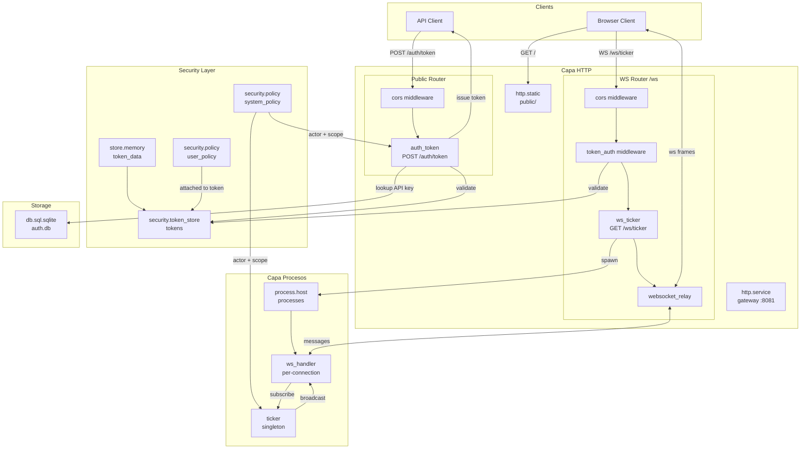

# Ticker de Criptomonedas

Construye una demostración de ticker con autenticación por API key y entrega mediante
WebSocket. El ejemplo cubre seguridad basada en tokens, configuración de middleware y
manejo de conexiones mediante procesos.

**Clasificación:** Tutorial local ejecutable. Incluye el registro, las fuentes Lua,
el cliente de navegador, los comandos de inicio ordenados y la verificación en el
navegador. Sus políticas permisivas y su almacén de tokens en memoria están limitados
deliberadamente a una demostración en loopback.

## Resumen

- **Intercambio de API key** — Envía una API key y recibe un bearer token firmado con HMAC
- **Middleware de token** — Valida un bearer token y restaura su contexto de seguridad; el endpoint rechaza solicitudes sin actor
- **Fan-out WebSocket** — Transmite desde un proceso ticker a múltiples handlers de conexión
- **Recursos estáticos** — Sirve el cliente del navegador con `http.static`
- **Almacenamiento** — Conserva las API keys en SQLite y los datos de token en memoria

## Requisitos previos

- El runtime Wippy `v0.3.32a`.
- Un navegador compatible con WebSocket.
- Un directorio de trabajo vacío. Crea los directorios del proyecto antes de añadir
  los archivos siguientes:

  ```bash
  mkdir auth-ticker
  cd auth-ticker
  mkdir -p src/public data
  ```

  En PowerShell:

  ```powershell
  New-Item -ItemType Directory -Path auth-ticker\src\public -Force
  New-Item -ItemType Directory -Path auth-ticker\data -Force
  Set-Location auth-ticker
  ```

## Estructura del Proyecto

```
auth-ticker/
├── data/
├── wippy.lock
└── src/
    ├── _index.yaml
    ├── auth_token.lua
    ├── ws_ticker.lua
    ├── ws_handler.lua
    ├── ticker.lua
    ├── migrate.lua
    └── public/
        └── index.html
```

## Arquitectura


```mermaid
flowchart TB
    subgraph Clients
        Browser[Browser Client]
        API[API Client]
    end

    subgraph "Capa HTTP"
        Server[http.service<br/>gateway :8081]
        Static[http.static<br/>public/]

        subgraph "Public Router"
            CORS1[cors middleware]
            AuthEndpoint[auth_token<br/>POST /auth/token]
        end

        subgraph "WS Router /ws"
            CORS2[cors middleware]
            TokenAuth[token_auth middleware]
            WSEndpoint[ws_ticker<br/>GET /ws/ticker]
            WSRelay[websocket_relay]
        end
    end

    subgraph "Security Layer"
        TokenStore[security.token_store<br/>tokens]
        Policy[security.policy<br/>user_policy]
        SysPolicy[security.policy<br/>system_policy]
        MemStore[store.memory<br/>token_data]
    end

    subgraph "Storage"
        DB[db.sql.sqlite<br/>auth.db]
    end

    subgraph "Capa Procesos"
        Supervisor[process.host<br/>processes]
        WSHandler[ws_handler<br/>per-connection]
        Ticker[ticker<br/>singleton]
    end

    %% Conexiones de cliente
    Browser -->|"GET /"| Static
    API -->|"POST /auth/token"| CORS1
    Browser -->|"WS /ws/ticker"| CORS2

    %% API flow
    CORS1 --> AuthEndpoint
    AuthEndpoint -->|validate| TokenStore
    AuthEndpoint -->|"issue token"| API

    %% WS flow
    CORS2 --> TokenAuth
    TokenAuth -->|validate| TokenStore
    TokenAuth --> WSEndpoint
    WSEndpoint -->|spawn| Supervisor
    Supervisor --> WSHandler
    WSEndpoint --> WSRelay
    WSRelay <-->|"messages"| WSHandler

    %% Token store deps
    MemStore --> TokenStore
    Policy -->|attached to token| TokenStore
    SysPolicy -->|"actor + scope"| AuthEndpoint
    SysPolicy -->|"actor + scope"| Ticker

    %% Auth uses DB for API keys
    AuthEndpoint -->|lookup API key| DB

    %% Process communication
    WSHandler -->|subscribe| Ticker
    Ticker -->|broadcast| WSHandler
    WSRelay <-->|"ws frames"| Browser
```

## Flujo de Seguridad

1. **Intercambio de API Key**: El cliente hace POST de API key a `/auth/token`. El handler valida contra base de datos, crea un actor con la `user_policy`, y emite un token firmado HMAC.

2. **Autenticación de Token**: Las conexiones WebSocket pasan por middleware `token_auth` que valida el Bearer token y restaura el contexto de seguridad (actor + políticas).

3. **Generación de Procesos**: El endpoint WebSocket genera un proceso handler. Como el token incluye la `user_policy`, el spawn está autorizado.

4. **Routing de Mensajes**: El middleware `websocket_relay` enruta frames WebSocket al proceso handler como mensajes.

## Configuración

Crea `src/_index.yaml`:

```yaml
version: "1.0"
namespace: app

entries:
  # Database for API keys
  - name: db
    kind: db.sql.sqlite
    file: "./data/auth.db"
    lifecycle:
      auto_start: true

  # Token backing store
  - name: token_data
    kind: store.memory
    lifecycle:
      auto_start: true

  # Token store with HMAC signing
  - name: tokens
    kind: security.token_store
    store: app:token_data
    token_length: 32
    default_expiration: "1h"
    token_key: "local-demo-signing-key-do-not-deploy"

  # Security policy for authenticated users
  - name: user_policy
    kind: security.policy
    policy:
      actions: "*"
      resources: "*"
      effect: allow
    groups:
      - user

  # Política para código interno que se ejecuta sin un actor de usuario final
  - name: system_policy
    kind: security.policy
    policy:
      actions:
        - db.get
        - security.actor.create
        - security.policy.get
        - security.scope.create
        - security.token_store.get
        - security.token.create
        - process.registry.register
        - process.send
        - process.monitor
      resources: "*"
      effect: allow

  # Process host
  - name: processes
    kind: process.host
    lifecycle:
      auto_start: true

  # Terminal host used by `wippy run -x app:migrate`
  - name: terminal
    kind: terminal.host
    lifecycle:
      auto_start: true

  # Database migration
  - name: migrate
    kind: process.lua
    source: file://migrate.lua
    method: main
    modules: [sql, logger, crypto]
    security:
      actor:
        id: "service:migrate"
      policies:
        - app:system_policy

  # Ticker broadcaster
  - name: ticker
    kind: process.lua
    source: file://ticker.lua
    method: main
    modules: [logger, time, crypto]
    security:
      actor:
        id: "service:ticker"
      policies:
        - app:system_policy

  - name: ticker-service
    kind: process.service
    process: app:ticker
    host: app:processes
    lifecycle:
      auto_start: true

  # WebSocket handler (spawned per connection)
  - name: ws_handler
    kind: process.lua
    source: file://ws_handler.lua
    method: main
    modules: [logger, json]

  # HTTP server
  - name: gateway
    kind: http.service
    addr: "127.0.0.1:8081"
    lifecycle:
      auto_start: true
      requires:
        - app:ticker-service

  # Public router (no auth)
  - name: public_router
    kind: http.router
    meta:
      server: app:gateway
    middleware:
      - cors
    options:
      cors.allow.origins: "http://127.0.0.1:8081"

  # WebSocket router (with auth)
  - name: ws_router
    kind: http.router
    meta:
      server: app:gateway
    prefix: /ws
    middleware:
      - cors
      - token_auth
    options:
      cors.allow.origins: "http://127.0.0.1:8081"
      token_auth.store: "app:tokens"
    post_middleware:
      - websocket_relay
    post_options:
      wsrelay.allowed.origins: "http://127.0.0.1:8081"

  # Static files
  - name: public_fs
    kind: fs.directory
    directory: ./src/public

  - name: static
    kind: http.static
    meta:
      server: app:gateway
    path: /
    fs: app:public_fs
    static_options:
      spa: true
      index: index.html

  # Auth token exchange
  - name: auth_token
    kind: function.lua
    source: file://auth_token.lua
    method: handler
    modules: [http, sql, crypto, security, json]
    security:
      actor:
        id: "service:auth"
      policies:
        - app:system_policy

  - name: auth_token.endpoint
    kind: http.endpoint
    meta:
      router: app:public_router
    method: POST
    path: /auth/token
    func: app:auth_token

  # WebSocket ticker endpoint
  - name: ws_ticker
    kind: function.lua
    source: file://ws_ticker.lua
    method: handler
    modules: [http, json, security, logger]

  - name: ws_ticker.endpoint
    kind: http.endpoint
    meta:
      router: app:ws_router
    method: GET
    path: /ticker
    func: app:ws_ticker
```

`user_policy` viaja dentro de cada token emitido y cubre lo que hace una conexión autenticada. `system_policy` cubre el código que se ejecuta antes de que exista cualquier token — la migración, el ticker y el propio intercambio de token — porque una llamada protegida hecha sin actor ni scope es denegada.

Para producción, lea la clave HMAC desde una variable de entorno con un placeholder (`token_key: ${env:TOKEN_KEY}`) en lugar de hardcodearla. Ver [Sistema de Entorno](system/env.md).

## Intercambio de Token

`auth_token.lua` - valida API keys y emite tokens firmados HMAC:

```lua
local http = require("http")
local sql = require("sql")
local security = require("security")

local function handler()
    local req = http.request()
    local res = http.response()

    local body, parse_err = req:body_json()
    if parse_err then
        res:set_status(http.STATUS.BAD_REQUEST)
        res:write_json({error = "invalid JSON"})
        return
    end

    local api_key = body.api_key
    if not api_key or #api_key == 0 then
        res:set_status(http.STATUS.BAD_REQUEST)
        res:write_json({error = "api_key required"})
        return
    end

    local db, db_err = sql.get("app:db")
    if db_err then
        res:set_status(http.STATUS.INTERNAL_ERROR)
        res:write_json({error = "database unavailable"})
        return
    end

    local rows, query_err = db:query(
        "SELECT user_id, role FROM api_keys WHERE api_key = ?",
        {api_key}
    )
    db:release()

    if query_err then
        res:set_status(http.STATUS.INTERNAL_ERROR)
        res:write_json({error = "lookup failed"})
        return
    end
    if #rows == 0 then
        res:set_status(http.STATUS.UNAUTHORIZED)
        res:write_json({error = "invalid API key"})
        return
    end

    local user = rows[1]

    -- Create actor with user identity
    local actor = security.new_actor("user:" .. user.user_id, {
        role = user.role,
        user_id = user.user_id
    })

    -- Attach user_policy to the scope
    local policy, _ = security.policy("app:user_policy")
    local scope = policy and security.new_scope({policy}) or security.new_scope()

    -- Issue HMAC-signed token
    local store, store_err = security.token_store("app:tokens")
    if store_err then
        res:set_status(http.STATUS.INTERNAL_ERROR)
        res:write_json({error = "token store unavailable"})
        return
    end

    local token, token_err = store:create(actor, scope, {
        expiration = "1h",
        meta = {ip = req:remote_addr()}
    })
    store:close()

    if token_err then
        res:set_status(http.STATUS.INTERNAL_ERROR)
        res:write_json({error = "token creation failed"})
        return
    end

    res:write_json({
        token = token,
        user_id = user.user_id,
        role = user.role,
        expires_in = 3600
    })
end

return { handler = handler }
```

## Endpoint WebSocket

`ws_ticker.lua` - genera un proceso handler para cada conexión autenticada:

```lua
local http = require("http")
local json = require("json")
local security = require("security")
local logger = require("logger")

local function handler()
    local req = http.request()
    local res = http.response()

    if req:method() ~= http.METHOD.GET then
        res:set_status(http.STATUS.METHOD_NOT_ALLOWED)
        res:write_json({error = "method not allowed"})
        return
    end

    -- Actor is set by token_auth middleware
    local actor = security.actor()
    if not actor then
        res:set_status(http.STATUS.UNAUTHORIZED)
        res:write_json({error = "authentication required"})
        return
    end

    local user_id = actor:id()

    -- Spawn handler process (authorized by user_policy in token)
    local pid, err = process.spawn("app:ws_handler", "app:processes", user_id)
    if err then
        logger:error("spawn failed", {error = tostring(err)})
        res:set_status(http.STATUS.INTERNAL_ERROR)
        res:write_json({error = "failed to create handler"})
        return
    end

    -- Configure websocket_relay to route messages to handler
    res:set_header("X-WS-Relay", json.encode({
        target_pid = tostring(pid),
        metadata = {user_id = user_id, auth_time = os.time()}
    }))
end

return { handler = handler }
```

## Handler de Conexión

El middleware `websocket_relay` envía automáticamente mensajes de ciclo de vida al proceso handler:
- `ws.join` - Conexión establecida, incluye `client_pid` para enviar respuestas
- `ws.message` - Cliente envió un mensaje; el payload es el frame crudo (un string para frames de texto)
- `ws.leave` - Conexión cerrada (enviado automáticamente al desconectar)

Los mensajes enviados en sentido contrario, al PID del cliente, llegan al navegador como un único frame de texto JSON con la forma `{topic, data}`. El topic lo elige usted y el payload llega como `data`.

`ws_handler.lua` - maneja estos mensajes de ciclo de vida:

```lua
local logger = require("logger")
local json = require("json")

local function main(user_id)
    local inbox = process.inbox()
    local client_pid = nil
    local subscribed = false

    logger:info("handler started", {user_id = user_id})

    while true do
        local msg, ok = inbox:receive()
        if not ok then break end

        local topic = msg:topic()
        local data = msg:payload():data()

        if topic == "ws.join" then
            client_pid = data.client_pid

            -- Subscribe with our PID for crash monitoring
            local _, subscribe_err = process.send("ticker", "subscribe", {
                client_pid = client_pid,
                handler_pid = process.pid()
            })
            if subscribe_err then
                error("failed to subscribe to ticker: " .. tostring(subscribe_err))
            end
            subscribed = true

            -- Enviar bienvenida
            process.send(client_pid, "welcome", {user_id = user_id})

            logger:info("client joined", {user_id = user_id, client_pid = client_pid})

        elseif topic == "ws.message" then
            local content = json.decode(data)
            if content and content.type == "ping" then
                process.send(client_pid, "pong", {})
            end

        elseif topic == "ws.leave" then
            -- Relay envía esto automáticamente al desconectar
            logger:info("client left", {user_id = user_id, client_pid = data.client_pid})
            if subscribed then
                process.send("ticker", "unsubscribe", {handler_pid = process.pid()})
            end
            break
        end
    end

    return 0
end

return { main = main }
```

## Broadcasting

`ticker.lua` mantiene las suscripciones y transmite actualizaciones de precios
simuladas localmente; el tutorial no llama a un servicio externo de datos de mercado:

```lua
local logger = require("logger")
local time = require("time")
local crypto = require("crypto")

-- handler_pid -> client_pid mapping
local subscriptions = {}

local prices = {
    ["BTC-USD"] = 42000.00,
    ["ETH-USD"] = 2500.00,
    ["SOL-USD"] = 95.00
}

local function broadcast(updates)
    for _, client_pid in pairs(subscriptions) do
        process.send(client_pid, "ticker", updates)
    end
end

local function update_prices()
    for symbol, price in pairs(prices) do
        local bytes, random_err = crypto.random.bytes(2)
        if random_err then
            error("failed to generate price movement: " .. tostring(random_err))
        end
        local rand = (bytes:byte(1) * 256 + bytes:byte(2)) / 65535.0
        local factor = (rand - 0.5) * 0.002
        prices[symbol] = price * (1 + factor)
        prices[symbol] = tonumber(string.format("%.2f", prices[symbol]))
    end
end

local function get_updates()
    local updates = {}
    for symbol, price in pairs(prices) do
        table.insert(updates, {symbol = symbol, price = price, timestamp = os.time()})
    end
    return updates
end

local function main()
    local inbox = process.inbox()
    local events = process.events()

    local ticker, ticker_err = time.ticker("1s")
    if ticker_err then
        logger:error("failed to create ticker", {error = tostring(ticker_err)})
        error("failed to create ticker: " .. tostring(ticker_err))
    end
    local tick_ch = ticker:response()

    local _, register_err = process.registry.register("ticker")
    if register_err then
        error("failed to register ticker: " .. tostring(register_err))
    end
    logger:info("ticker started", {pid = process.pid()})

    while true do
        local r = channel.select {
            inbox:case_receive(),
            events:case_receive(),
            tick_ch:case_receive()
        }

        if r.channel == tick_ch then
            update_prices()
            if next(subscriptions) then
                broadcast(get_updates())
            end

        elseif r.channel == events then
            local event = r.value
            if event.kind == process.event.CANCEL then
                ticker:stop()
                logger:info("ticker stopping")
                return 0
            elseif event.kind == process.event.EXIT then
                -- Handler terminó, remover suscripción
                if subscriptions[event.from] then
                    logger:info("handler exited", {handler_pid = event.from})
                    subscriptions[event.from] = nil
                end
            end

        else
            local msg = r.value
            local topic = msg:topic()
            local data = msg:payload():data()

            if topic == "subscribe" then
                local handler_pid = data.handler_pid
                local client_pid = data.client_pid

                subscriptions[handler_pid] = client_pid
                process.monitor(handler_pid)

                logger:info("subscribed", {handler_pid = handler_pid, client_pid = client_pid})

                process.send(client_pid, "ticker", get_updates())

            elseif topic == "unsubscribe" then
                subscriptions[data.handler_pid] = nil
                logger:info("unsubscribed", {handler_pid = data.handler_pid})
            end
        end
    end
end

return { main = main }
```

## Migración de Base de Datos

`migrate.lua` - crea la tabla de API keys y genera una clave demo:

```lua
local sql = require("sql")
local logger = require("logger")
local crypto = require("crypto")

local function main()
    local db, err = sql.get("app:db")
    if err then
        logger:error("failed to connect", {error = tostring(err)})
        error("failed to connect: " .. tostring(err))
    end

    local _, exec_err = db:execute([[
        CREATE TABLE IF NOT EXISTS api_keys (
            id INTEGER PRIMARY KEY AUTOINCREMENT,
            api_key TEXT UNIQUE NOT NULL,
            user_id TEXT NOT NULL,
            role TEXT NOT NULL DEFAULT 'user',
            created_at INTEGER NOT NULL
        )
    ]])

    if exec_err then
        db:release()
        logger:error("migration failed", {error = tostring(exec_err)})
        error("migration failed: " .. tostring(exec_err))
    end

    -- Create one random local-demo key. It is printed only on first creation.
    local rows, query_err = db:query(
        "SELECT api_key FROM api_keys WHERE user_id = ?",
        {"demo"}
    )
    if query_err then
        db:release()
        error("failed to query demo API key: " .. tostring(query_err))
    end

    if #rows == 0 then
        local demo_key, key_err = crypto.random.string(32)
        if key_err then
            db:release()
            error("failed to generate demo API key: " .. tostring(key_err))
        end

        local _, insert_err = db:execute(
            "INSERT INTO api_keys (api_key, user_id, role, created_at) VALUES (?, ?, ?, ?)",
            {demo_key, "demo", "user", os.time()}
        )
        if insert_err then
            db:release()
            error("failed to store demo API key: " .. tostring(insert_err))
        end
        logger:info("demo API key created", {api_key = demo_key})
    else
        logger:info("demo API key already exists; use the value saved from its first creation")
    end

    db:release()
    return 0
end

return { main = main }
```

## Cliente de Navegador

`public/index.html` - intercambia el API key por un token y luego recibe los precios en streaming. Un navegador no puede establecer cabeceras en el handshake de un WebSocket, por lo que el token viaja en el parámetro de consulta `x-auth-token` que `token_auth` también lee:

```html
<!doctype html>
<html>
<head>
  <meta charset="utf-8">
  <title>Crypto Ticker</title>
  <style>
    body { font-family: system-ui, sans-serif; max-width: 40rem; margin: 3rem auto; }
    table { border-collapse: collapse; width: 100%; margin-top: 1rem; }
    th, td { text-align: left; padding: .4rem .6rem; border-bottom: 1px solid #ddd; }
    #status { color: #666; }
  </style>
</head>
<body>
  <h1>Crypto Ticker</h1>
  <input id="key" placeholder="demo API key" size="40">
  <button id="connect">Connect</button>
  <p id="status">disconnected</p>
  <table><thead><tr><th>Symbol</th><th>Price</th></tr></thead><tbody id="rows"></tbody></table>

  <script>
    const status = document.getElementById("status");
    const rows = document.getElementById("rows");

    document.getElementById("connect").onclick = async () => {
      const res = await fetch("/auth/token", {
        method: "POST",
        headers: {"Content-Type": "application/json"},
        body: JSON.stringify({api_key: document.getElementById("key").value})
      });
      if (!res.ok) { status.textContent = "auth failed"; return; }
      const {token} = await res.json();

      const url = `ws://${location.host}/ws/ticker?x-auth-token=${encodeURIComponent(token)}`;
      const ws = new WebSocket(url);

      ws.onopen = () => {
        status.textContent = "connected";
        ws.send(JSON.stringify({type: "ping"}));
      };
      ws.onclose = () => { status.textContent = "disconnected"; };

      ws.onmessage = (evt) => {
        const msg = JSON.parse(evt.data);
        if (msg.topic !== "ticker") return;
        rows.innerHTML = "";
        for (const quote of msg.data) {
          rows.insertAdjacentHTML("beforeend",
            `<tr><td>${quote.symbol}</td><td>${quote.price.toFixed(2)}</td></tr>`);
        }
      };
    };
  </script>
</body>
</html>
```

## Ejecución

Inicializa el lock, ejecuta la migración hasta que termine y después inicia los
servicios de larga duración. Ejecutar la migración como comando independiente evita
que el endpoint de tokens compita con la creación de la tabla.

```bash
mkdir -p data
wippy init
wippy run -x app:migrate
wippy run
```

Abre `http://127.0.0.1:8081` e introduce la API key de demostración del log de
migración. La página debe mostrar `Connected as demo` y después los precios de BTC,
ETH y SOL, que se actualizan una vez por segundo.

También puedes verificar el intercambio antes de abrir el navegador:

```bash
curl -X POST http://127.0.0.1:8081/auth/token \
  -H "Content-Type: application/json" \
  -d '{"api_key":"<demo-key-from-migration>"}'
```

En PowerShell:

```powershell
Invoke-RestMethod -Method Post `
  -Uri http://127.0.0.1:8081/auth/token `
  -ContentType 'application/json' `
  -Body '{"api_key":"<demo-key-from-migration>"}'
```

Una respuesta correcta contiene `token`, `user_id: "demo"`, `role: "user"` y
`expires_in: 3600`. Una clave no válida devuelve HTTP 401.

## Solución de problemas y limpieza

- `no such table: api_keys` significa que se omitió o falló la migración. Detén el
  runtime y vuelve a ejecutar `wippy run -x app:migrate` antes de iniciarlo de nuevo.
- Un 401 de `/auth/token` significa que la API key no coincide con la fila de
  `data/auth.db`. Restablece la base de datos si perdiste el valor del log único.
- Un 401 o un cierre inmediato del WebSocket normalmente significa que se eliminó
  el parámetro de query o que el reinicio del runtime restableció el almacén de tokens
  en memoria. Intercambia de nuevo la API key después de cada reinicio.
- Un rechazo de origen significa que la URL del navegador no coincide exactamente
  con `http://127.0.0.1:8081`; usa esa URL o actualiza juntas ambas opciones de origen.
- Detén el runtime con Ctrl+C. Elimina `data/auth.db` para borrar la API key de la
  demostración.

## Siguientes Pasos

- [WebSocket Relay](http/websocket-relay.md) — Configuración de middleware
- [Módulo Security](lua/security/security.md) — Actores, políticas y almacenes de tokens
- [Gestión de procesos](lua/core/process.md) — Generación y mensajería
