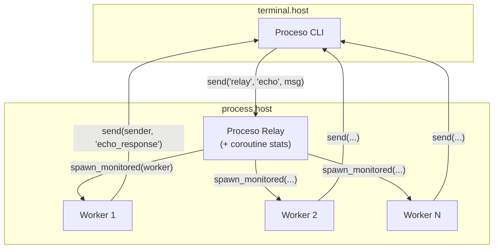

# Echo Service

Construya un servicio de eco distribuido demostrando procesos, canales, coroutines, paso de mensajes y supervisión.

## Resumen

Este tutorial crea un cliente CLI que envía mensajes a un servicio relay, que genera workers para procesar cada mensaje. Demuestra:

- **Generación de procesos** - Crear procesos hijos dinámicamente
- **Paso de mensajes** - Comunicación entre procesos vía send/receive
- **Canales y select** - Multiplexar múltiples fuentes de eventos
- **Coroutines** - Ejecución concurrente dentro de un proceso
- **Registro de procesos** - Encontrar procesos por nombre
- **Monitoreo** - Rastrear ciclo de vida de procesos hijos

## Arquitectura



## Estructura del Proyecto

```
echo-service/
├── wippy.lock
└── src/
    ├── _index.yaml
    ├── cli.lua
    ├── relay.lua
    └── worker.lua
```

## Definiciones de Entradas

Cree `src/_index.yaml`:

```yaml
version: "1.0"
namespace: app

entries:
  - name: terminal
    kind: terminal.host
    lifecycle:
      auto_start: true

  - name: processes
    kind: process.host
    lifecycle:
      auto_start: true

  - name: cli
    kind: process.lua
    source: file://cli.lua
    method: main
    modules:
      - io
      - process
      - time
      - channel

  - name: relay
    kind: process.lua
    source: file://relay.lua
    method: main
    modules:
      - process
      - logger
      - channel
      - time

  - name: relay-service
    kind: process.service
    process: app:relay
    host: app:processes
    lifecycle:
      auto_start: true

  - name: worker
    kind: process.lua
    source: file://worker.lua
    method: main
    modules:
      - process
      - time
```

## El Proceso Relay

El relay se registra a sí mismo, maneja mensajes, genera workers, y ejecuta una coroutine de estadísticas.

Cree `src/relay.lua`:

```lua
local logger = require("logger")
local time = require("time")

local stats = {
    messages = 0,
    workers_spawned = 0
}

local function stats_reporter()
    while true do
        time.sleep("5s")
        logger:info("stats", {
            messages = stats.messages,
            workers_spawned = stats.workers_spawned
        })
    end
end

local function main()
    local inbox = process.inbox()
    local events = process.events()

    process.registry.register("relay")
    logger:info("relay started", {pid = process.pid()})

    coroutine.spawn(stats_reporter)

    while true do
        local r = channel.select {
            inbox:case_receive(),
            events:case_receive()
        }

        if r.channel == events then
            local event = r.value
            if event.kind == process.event.EXIT then
                logger:info("worker exited", {
                    from = event.from,
                    result = event.result
                })
            end
        else
            local msg = r.value
            if msg:topic() == "echo" then
                local echo = msg:payload():data()
                stats.messages = stats.messages + 1

                local worker_pid, err = process.spawn_monitored(
                    "app:worker",
                    "app:processes",
                    echo.sender,
                    echo.data
                )

                if err then
                    logger:error("spawn failed", {error = err})
                else
                    stats.workers_spawned = stats.workers_spawned + 1
                end
            end
        end
    end
end

return { main = main }
```

### Patrones Clave {id="relay-key-patterns"}

**Generación de Coroutines**

```lua
coroutine.spawn(stats_reporter)
```

Crea una coroutine concurrente compartiendo memoria con la función principal. Las coroutines ceden en operaciones I/O como `time.sleep`.

**Channel Select**

```lua
local r = channel.select {
    inbox:case_receive(),
    events:case_receive()
}
```

Espera en múltiples canales. `r.channel` identifica cuál se activó, `r.value` contiene los datos.

**Extracción de Payload**

```lua
local echo = msg:payload():data()
```

Los mensajes tienen `msg:topic()` para el string del tópico y `msg:payload():data()` para el payload.

**Spawn con Monitoreo**

```lua
local worker_pid, err = process.spawn_monitored("app:worker", "app:processes", ...)
```

Combina spawn y monitor. Cuando el worker termina, recibimos un evento EXIT.

## El Proceso Worker

Los workers reciben argumentos directamente y envían respuestas al remitente.

Cree `src/worker.lua`:

```lua
local time = require("time")

local function main(sender_pid, data)
    time.sleep("100ms")

    local response = {
        data = string.upper(data),
        worker = process.pid()
    }

    process.send(sender_pid, "echo_response", response)

    return 0
end

return { main = main }
```

## El Proceso CLI

El CLI envía mensajes por nombre registrado y espera respuestas con timeout.

Cree `src/cli.lua`:

```lua
local io = require("io")
local time = require("time")

local reset = "\027[0m"
local function dim(s) return "\027[2m" .. s .. reset end
local function green(s) return "\027[32m" .. s .. reset end
local function yellow(s) return "\027[33m" .. s .. reset end
local function cyan(s) return "\027[36m" .. s .. reset end

local function main()
    local inbox = process.inbox()

    -- Esperar a que relay se registre
    time.sleep("200ms")

    io.print(cyan("Echo Client"))
    io.print(dim("Escriba mensajes para eco. Ctrl+C para salir.\n"))

    while true do
        io.write(yellow("> "))
        local input = io.readline()

        if not input or #input == 0 then
            break
        end

        local msg = {
            sender = process.pid(),
            data = input
        }
        local ok, err = process.send("relay", "echo", msg)
        if err then
            io.print(dim("  error: relay no disponible"))
        else
            local timeout = time.after("2s")
            local r = channel.select {
                inbox:case_receive(),
                timeout:case_receive()
            }

            if r.channel == timeout then
                io.print(dim("  timeout"))
            else
                local msg = r.value
                if msg:topic() == "echo_response" then
                    local resp = msg:payload():data()
                    io.print(green("  " .. resp.data))
                    io.print(dim("  from worker: " .. resp.worker))
                end
            end
        end
    end

    io.print("\nAdiós!")
    return 0
end

return { main = main }
```

### Patrones Clave {id="cli-key-patterns"}

**Enviar por Nombre**

```lua
process.send("relay", "echo", msg)
```

`process.send` acepta nombres registrados directamente. Retorna error si no se encuentra.

**Patrón de Timeout**

```lua
local timeout = time.after("2s")
local r = channel.select {
    inbox:case_receive(),
    timeout:case_receive()
}
if r.channel == timeout then
    -- timeout
end
```

## Ejecución

```bash
wippy init
wippy run -x app:terminal/app:cli
```

Salida de ejemplo:

```
Echo Client
Escriba mensajes para eco. Ctrl+C para salir.

> hello world
  HELLO WORLD
  from worker: {app:processes|0x00004}
```

## Resumen de Conceptos

| Concepto | API |
|----------|-----|
| Generación de procesos | `process.spawn_monitored(entry, host, ...)` |
| Paso de mensajes | `process.send(dest, topic, data)` |
| Inbox | `process.inbox()` |
| Eventos | `process.events()` |
| Registro | `process.registry.register(name)` |
| Channel select | `channel.select {...}` |
| Timeout | `time.after(duration)` |
| Coroutines | `coroutine.spawn(fn)` |

## Siguientes Pasos

- [Gestión de Procesos](lua/core/process.md)
- [Canales](lua/core/channel.md)
- [Tiempo y Duración](lua/core/time.md)
