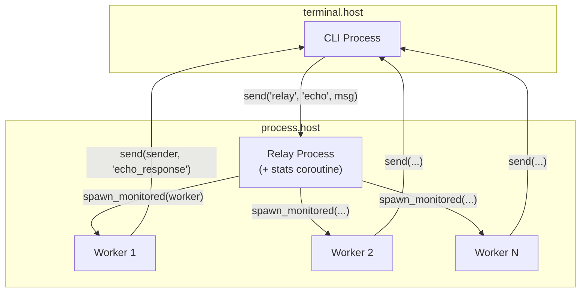

# Servicio de Eco

Crea un servicio CLI de eco que utiliza varios procesos Wippy, canales, coroutines, paso de mensajes y supervisión de procesos.

**Clasificación:** tutorial ejecutable. Proporciona el registro y las fuentes Lua completas para una aplicación CLI local de un solo nodo, además de los pasos de inicio y verificación.

## Resumen

Este tutorial crea un cliente CLI que envía mensajes a un servicio relay, que genera workers para procesar cada mensaje. Demuestra:

- **Generación de procesos** - Crear procesos hijos dinámicamente
- **Paso de mensajes** - Comunicación entre procesos vía send/receive
- **Canales y select** - Multiplexar múltiples fuentes de eventos
- **Coroutines** - Ejecución concurrente dentro de un proceso
- **Registro de procesos** - Encontrar procesos por nombre
- **Monitoreo** - Rastrear ciclo de vida de procesos hijos

## Requisitos previos

- Entorno de ejecución Wippy `v0.3.32a` disponible como `wippy`. Confírmalo con `wippy version --short`.
- Un terminal interactivo.
- Un directorio de trabajo vacío. Crea el proyecto y el directorio de fuentes antes de añadir los archivos siguientes:

  ```bash
  mkdir echo-service
  cd echo-service
  mkdir src
  ```

## Arquitectura


```mermaid
flowchart TB
    subgraph terminal["terminal.host"]
        CLI["CLI Process"]
    end

    subgraph processes["process.host"]
        Relay["Relay Process<br/>(+ stats coroutine)"]
        W1["Worker 1"]
        W2["Worker 2"]
        W3["Worker N"]
    end

    CLI -->|"send('relay', 'echo', msg)"| Relay
    Relay -->|"spawn_monitored(worker)"| W1
    Relay -->|"spawn_monitored(...)"| W2
    Relay -->|"spawn_monitored(...)"| W3
    W1 -->|"send(sender, 'echo_response')"| CLI
    W2 -->|"send(...)"| CLI
    W3 -->|"send(...)"| CLI
```

## Estructura del Proyecto

```
echo-service/
├── wippy.lock
└── src/
    ├── _index.yaml
    ├── cli.lua
    ├── relay.lua
    └── worker.lua
```

## Definiciones de Entradas

Cree `src/_index.yaml`:

```yaml
version: "1.0"
namespace: app

entries:
  # Capabilities used by the CLI, relay, and workers in strict mode
  - name: process-policy
    kind: security.policy
    policy:
      actions:
        - process.host
        - process.registry.register
        - process.send
        - process.spawn
        - process.spawn.monitored
      resources: "*"
      effect: allow

  - name: terminal
    kind: terminal.host
    lifecycle:
      auto_start: true

  - name: processes
    kind: process.host
    lifecycle:
      auto_start: true

  - name: cli
    kind: process.lua
    source: file://cli.lua
    method: main
    modules:
      - io
      - time
    security:
      actor:
        id: app:cli
      policies:
        - app:process-policy

  - name: relay
    kind: process.lua
    source: file://relay.lua
    method: main
    modules:
      - logger
      - time
    security:
      actor:
        id: app:relay
      policies:
        - app:process-policy

  - name: relay-service
    kind: process.service
    process: app:relay
    host: app:processes
    lifecycle:
      auto_start: true

  - name: worker
    kind: process.lua
    source: file://worker.lua
    method: main
    modules:
      - time
    security:
      actor:
        id: app:worker
      policies:
        - app:process-policy
```

## El Proceso Relay

El relay se registra a sí mismo, maneja mensajes, genera workers, y ejecuta una coroutine de estadísticas.

Cree `src/relay.lua`:

```lua
local logger = require("logger")
local time = require("time")

local stats = {
    messages = 0,
    workers_spawned = 0
}

local function stats_reporter()
    while true do
        time.sleep("5s")
        logger:info("stats", {
            messages = stats.messages,
            workers_spawned = stats.workers_spawned
        })
    end
end

local function main()
    local inbox = process.inbox()
    local events = process.events()

    local _, register_err = process.registry.register("relay")
    if register_err then
        error("cannot register relay: " .. tostring(register_err))
    end
    logger:info("relay started", {pid = process.pid()})

    coroutine.spawn(stats_reporter)

    while true do
        local r = channel.select {
            inbox:case_receive(),
            events:case_receive()
        }

        if r.channel == events then
            local event = r.value
            if event.kind == process.event.EXIT then
                logger:info("worker exited", {
                    from = event.from,
                    result = event.result
                })
            end
        else
            local msg = r.value
            if msg:topic() == "echo" then
                local echo = msg:payload():data()
                stats.messages = stats.messages + 1

                local worker_pid, err = process.spawn_monitored(
                    "app:worker",
                    "app:processes",
                    echo.sender,
                    echo.data
                )

                if err then
                    logger:error("spawn failed", {error = tostring(err)})
                else
                    stats.workers_spawned = stats.workers_spawned + 1
                end
            end
        end
    end
end

return { main = main }
```

### Patrones Clave {id="relay-key-patterns"}

**Creación de coroutines**

```lua
coroutine.spawn(stats_reporter)
```

Esto inicia una coroutine que comparte memoria con la función principal. Las coroutines ceden el control en operaciones de E/S como `time.sleep`.

**Selección de canales**

```lua
local r = channel.select {
    inbox:case_receive(),
    events:case_receive()
}
```

Espera en varios canales. `r.channel` identifica el canal seleccionado y `r.value` contiene sus datos.

**Extracción de Payload**

```lua
local echo = msg:payload():data()
```

Los mensajes proporcionan `msg:topic()` para la cadena del tema y `msg:payload():data()` para el payload.

**Spawn con Monitoreo**

```lua
local worker_pid, err = process.spawn_monitored("app:worker", "app:processes", ...)
```

Esto crea el worker y comienza a supervisarlo. Cuando termina, el relay recibe un evento `EXIT`.

## El Proceso Worker

Los workers reciben argumentos directamente y envían respuestas al remitente.

Cree `src/worker.lua`:

```lua
local function main(sender_pid, data)
    local response = {
        data = string.upper(data),
        worker = process.pid()
    }

    local _, send_err = process.send(sender_pid, "echo_response", response)
    if send_err then
        error("cannot send echo response: " .. tostring(send_err))
    end

    return 0
end

return { main = main }
```

## El Proceso CLI

El CLI envía mensajes por nombre registrado y espera respuestas con timeout.

Cree `src/cli.lua`:

```lua
local io = require("io")
local time = require("time")

local reset = "\027[0m"
local function dim(s) return "\027[2m" .. s .. reset end
local function green(s) return "\027[32m" .. s .. reset end
local function yellow(s) return "\027[33m" .. s .. reset end
local function cyan(s) return "\027[36m" .. s .. reset end

local function main()
    local inbox = process.inbox()

    -- Wait for relay to register its name
    local deadline = time.after("5s")
    while not process.registry.lookup("relay") do
        local tick = time.after("50ms")
        local r = channel.select { deadline:case_receive(), tick:case_receive() }
        if r.channel == deadline then
            io.print("relay not ready")
            return 1
        end
    end

    io.print(cyan("Echo Client"))
    io.print(dim("Type messages to echo. Ctrl+C to exit.\n"))

    while true do
        local _, write_err = io.write(yellow("> "))
        if write_err then
            io.eprint("cannot write prompt:", write_err)
            return 1
        end

        local _, flush_err = io.flush()
        if flush_err then
            io.eprint("cannot flush prompt:", flush_err)
            return 1
        end

        local input, read_err = io.readline()
        if read_err then
            io.eprint("cannot read input:", read_err)
            return 1
        end

        if not input or #input == 0 then
            break
        end

        local msg = {
            sender = process.pid(),
            data = input
        }
        local _, err = process.send("relay", "echo", msg)
        if err then
            io.print(dim("  error: " .. tostring(err)))
        else
            local timeout = time.after("2s")
            local r = channel.select {
                inbox:case_receive(),
                timeout:case_receive()
            }

            if r.channel == timeout then
                io.print(dim("  timeout"))
            else
                local msg = r.value
                if msg:topic() == "echo_response" then
                    local resp = msg:payload():data()
                    io.print(green("  " .. resp.data))
                    io.print(dim("  from worker: " .. resp.worker))
                end
            end
        end
    end

    io.print("\nGoodbye!")
    return 0
end

return { main = main }
```

### Patrones Clave {id="cli-key-patterns"}

**Enviar por Nombre**

```lua
process.send("relay", "echo", msg)
```

`process.send` acepta un nombre registrado como destino y devuelve un error si no puede resolverlo.

**Patrón de Timeout**

```lua
local timeout = time.after("2s")
local r = channel.select {
    inbox:case_receive(),
    timeout:case_receive()
}
if r.channel == timeout then
    -- timed out
end
```

## Ejecución

```bash
wippy init
wippy run -x app:cli
```

Salida de ejemplo:

```
Echo Client
Type messages to echo. Ctrl+C to exit.

> hello world
  HELLO WORLD
  from worker: {app:processes|0x00004}
```

El PID del worker se genera durante la ejecución y será diferente. Introduce varias líneas para confirmar que cada respuesta está en mayúsculas. Envía una línea vacía para salir correctamente.

## Solución de problemas y limpieza

- `relay not ready` significa que el relay iniciado automáticamente no se registró en cinco segundos. Consulta el log del entorno de ejecución en busca de un error de inicio, política o registro del relay.
- `not allowed to spawn` o `not allowed to send` significa que las entradas de proceso no tienen el contexto de seguridad `app:process-policy` mostrado anteriormente.
- `no terminal host found` significa que falta la entrada `terminal.host`. Si el proyecto contiene varios hosts de terminal, añade `--host app:terminal` al comando de ejecución.
- Un timeout después del envío significa que el worker no devolvió una respuesta. Comprueba en el log del relay si falló la creación y confirma que `app:worker` y `app:processes` coinciden con los nombres de las entradas.
- Envía una línea vacía para salir del CLI. Pulsa Ctrl+C si el entorno de ejecución sigue activo; después de salir del directorio, elimina `echo-service/` si solo era un ejercicio desechable.

## Siguientes Pasos

- [Gestión de procesos](../lua/core/process.md) — Referencia de la API de procesos
- [Canales](../lua/core/channel.md) — Referencia de la API de canales
- [Tiempo y duración](../lua/core/time.md) — Referencia de la API de tiempo
