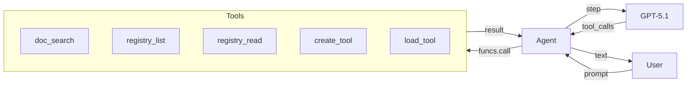
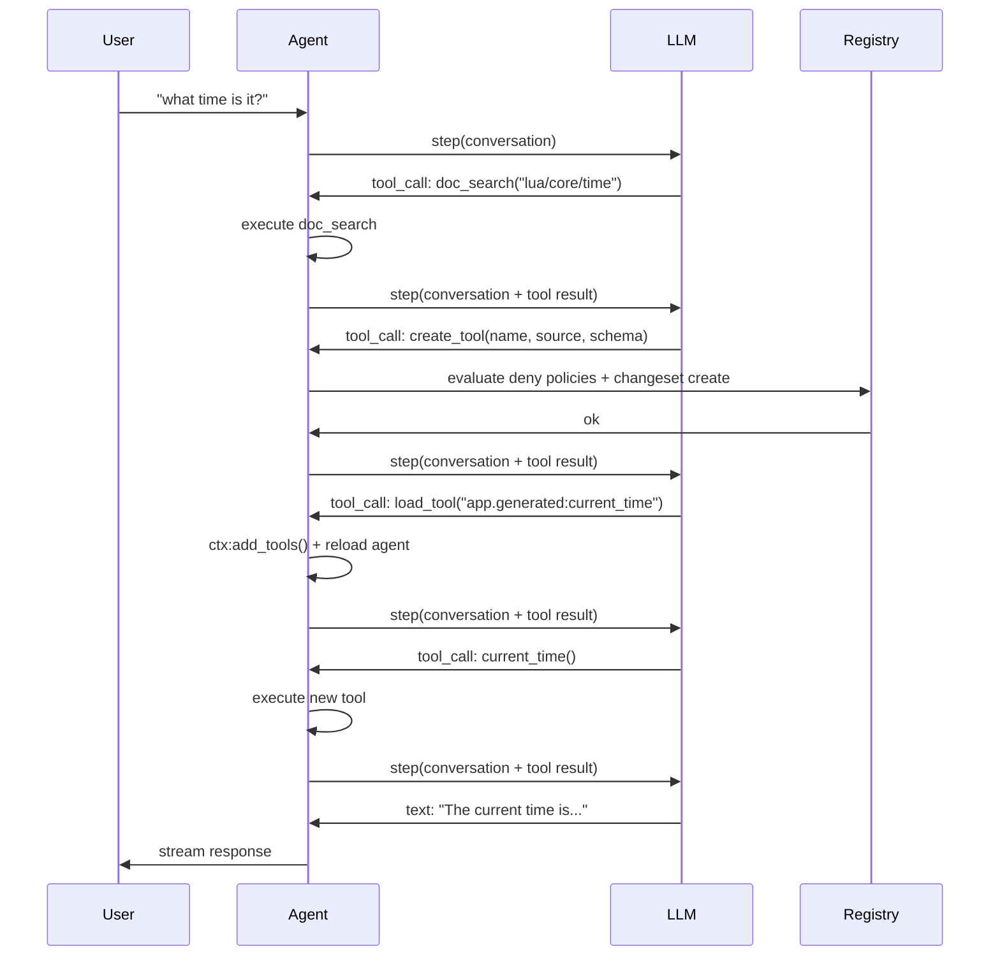
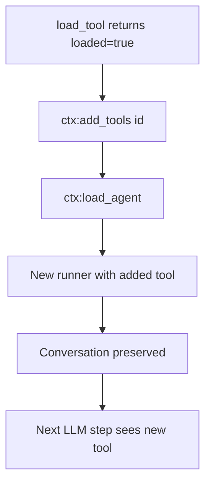
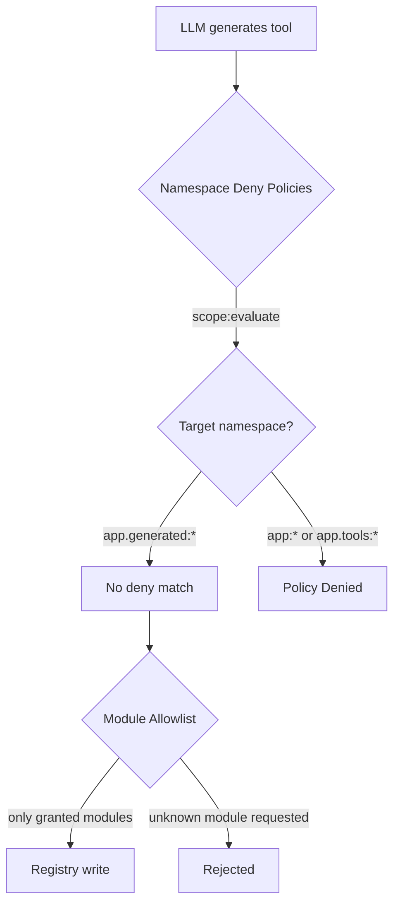

# Micro AGI

Construya un agente automodificable que crea sus propias herramientas en tiempo de ejecución — leyendo documentación, escribiendo Lua, registrando entradas en el registro y cargándolas en la sesión activa.

## Lo Que Vamos a Construir

Un agente de terminal que:
- Responde preguntas usando un LLM con streaming
- Busca en la documentación de Wippy para aprender APIs
- Inspecciona el registro para descubrir capacidades existentes
- Construye nuevas herramientas sobre la marcha cuando carece de una capacidad
- Gestiona su propia ventana de contexto mediante compresión



## Arquitectura

El agente se ejecuta como un proceso de Wippy con acceso al registro. Cuando el LLM decide que necesita una capacidad que no tiene, usa el bucle de automodificación:



La idea clave: las herramientas son entradas del registro. Crear una herramienta es simplemente escribir una entrada `function.lua` con código Lua en línea en `data.source`. El runtime del agente la compila y carga como cualquier otra entrada.

## Estructura del Proyecto

```
micro-agi/
├── .wippy.yaml
├── wippy.yaml
└── src/
    ├── _index.yaml
    ├── README.md
    ├── agent.lua
    └── tools/
        ├── _index.yaml
        ├── doc_search.lua
        ├── registry_list.lua
        ├── registry_read.lua
        ├── create_tool.lua
        └── load_tool.lua
```

## Infraestructura

Cree `.wippy.yaml`:

```yaml
version: "1.0"

logger:
  encoding: console
```

## Definiciones de Entradas

Cree `src/_index.yaml` con infraestructura, políticas de seguridad, modelos, agente y proceso:

```yaml
version: "1.0"
namespace: app

entries:
  - name: definition
    kind: ns.definition
    readme: file://README.md
    meta:
      title: Micro AGI
      description: Self-modifying development agent that builds its own tools at runtime
      depends_on: [wippy/llm, wippy/agent]

  - name: os_env
    kind: env.storage.os

  - name: processes
    kind: process.host
    lifecycle:
      auto_start: true

  - name: __dep.llm
    kind: ns.dependency
    component: wippy/llm
    version: "*"
    parameters:
      - name: env_storage
        value: app:os_env
      - name: process_host
        value: app:processes

  - name: __dep.agent
    kind: ns.dependency
    component: wippy/agent
    version: "*"
    parameters:
      - name: process_host
        value: app:processes
```

### Políticas de Seguridad

Dos entradas `security.policy` restringen los namespaces en los que puede escribir el agente:

```yaml
  - name: deny_core_ns
    kind: security.policy
    policy:
      actions: "*"
      resources: "app:*"
      effect: deny
    groups:
      - agent_security

  - name: deny_tools_ns
    kind: security.policy
    policy:
      actions: "*"
      resources: "app.tools:*"
      effect: deny
    groups:
      - agent_security
```

Estas políticas se cargan como un ámbito con nombre (`app:agent_security`) por `create_tool` y se evalúan antes de cualquier escritura en el registro. El agente puede escribir en `app.generated:*` (ninguna política deny coincide), pero no puede escribir en `app:*` (entradas core, modelos, definición del agente) ni en `app.tools:*` (herramientas integradas).

Vea [Modelo de Seguridad](system/security.md) para detalles sobre la evaluación de políticas.

### Modelos

Dos modelos cumplen propósitos diferentes:

```yaml
  - name: gpt-5.1
    kind: registry.entry
    meta:
      name: gpt-5.1
      type: llm.model
      title: GPT-5.1
      comment: Reasoning model
      capabilities: [generate, tool_use, structured_output, vision, thinking]
      class: [reasoning]
      priority: 210
    max_tokens: 128000
    output_tokens: 32768
    pricing:
      input: 2.5
      output: 10
    providers:
      - id: wippy.llm.openai:provider
        options:
          reasoning_model_request: true
        provider_model: gpt-5.1
    thinking_effort: 10

  - name: gpt-4.1-nano
    kind: registry.entry
    meta:
      name: gpt-4.1-nano
      type: llm.model
      title: GPT-4.1 Nano
      comment: Compression model
      capabilities: [generate, tool_use, structured_output]
      class: [fast]
      priority: 100
    max_tokens: 1047576
    output_tokens: 32768
    pricing:
      input: 0.1
      output: 0.4
    providers:
      - id: wippy.llm.openai:provider
        provider_model: gpt-4.1-nano
```

GPT-5.1 maneja el razonamiento y el uso de herramientas. GPT-4.1 Nano maneja la compresión de contexto a un costo 25 veces menor.

### Definición del Agente

```yaml
  - name: dev_assistant
    kind: registry.entry
    meta:
      type: agent.gen1
      name: dev_assistant
      title: Dev Assistant
      comment: Wippy development assistant
    prompt: |
      Self-modifying Wippy development agent. You run inside Wippy runtime
      with access to docs, registry, and dynamic tool creation.

      Rules:
      - NEVER fabricate, guess, or hallucinate facts. If you need real data,
        use or build a tool to get it. Only state what a tool actually returned.
      - Maximum 2-3 sentences per response. No bullet lists. No disclaimers.
      - Never say "I can't" or "I don't have". Build the tool and do it.
      - Act first, explain only if asked.

      To gain new capabilities: doc_search the API, create_tool with Lua source,
      load_tool, call it. All in one turn.
    model: gpt-5.1
    max_tokens: 2048
    tools:
      - "app.tools:*"
```

El prompt es deliberadamente escueto. Reglas clave:
- **Sin alucinaciones** — el agente debe usar herramientas para obtener datos reales
- **Automodificación** — construir herramientas en lugar de rechazar
- **Acción sobre explicación** — actuar primero, explicar si se pregunta

### Proceso

```yaml
  - name: agent
    kind: process.lua
    meta:
      command:
        name: agent
        short: Start dev assistant
    source: file://agent.lua
    method: main
    modules: [io, json, process, funcs, registry, time, security]
    imports:
      prompt: wippy.llm:prompt
      agent_context: wippy.agent:context
      compress: wippy.llm.util:compress
```

El proceso se ejecuta como un comando de terminal. La aplicación de la seguridad ocurre dentro de `create_tool`, que carga el grupo de políticas `agent_security` y lo evalúa antes de escribir.

Imports:
- `prompt` — constructor de conversaciones
- `agent_context` — carga de agente y gestión dinámica de herramientas
- `compress` — compresión de texto basada en LLM para gestión de contexto

## Herramientas

Cree `src/tools/_index.yaml` con cinco herramientas:

### doc_search

Obtiene la documentación de Wippy mediante la API `wippy.ai/llm`. Admite dos modos: obtener una página por ruta, o buscar por consulta.

```lua
local http_client = require("http_client")
local json = require("json")

local BASE_URL = "https://wippy.ai/llm"
local MAX_CHARS = 8000

local function fetch_page(path)
    local url = BASE_URL .. "/path/en/" .. path
    local resp, err = http_client.get(url, {
        headers = { ["User-Agent"] = "wippy-agent/1.0" },
    })
    if err then
        return nil, tostring(err)
    end
    if resp.status_code ~= 200 then
        return nil, "HTTP " .. resp.status_code
    end

    local body = resp.body or ""
    if #body > MAX_CHARS then
        body = body:sub(1, MAX_CHARS) .. "\n... (truncated)"
    end
    return body, nil
end

local function search_docs(query)
    local url = BASE_URL .. "/search?q=" .. query
    local resp, err = http_client.get(url, {
        headers = { ["User-Agent"] = "wippy-agent/1.0" },
    })
    if err then
        return { error = tostring(err) }
    end
    if resp.status_code ~= 200 then
        return { error = "HTTP " .. resp.status_code }
    end

    local body = resp.body or ""
    if #body > MAX_CHARS then
        body = body:sub(1, MAX_CHARS) .. "\n... (truncated)"
    end

    return { results = body }
end

local function handler(input)
    if input.path then
        local content, err = fetch_page(input.path)
        if err then
            return { error = err }
        end
        return { path = input.path, content = content }
    end

    if input.query then
        return search_docs(input.query)
    end

    return { error = "provide either 'path' or 'query'" }
end

return { handler = handler }
```

### create_tool

El núcleo de la automodificación. Evalúa las políticas deny de namespace y crea una entrada `function.lua` en el registro con código Lua en línea.

El campo `modules` en la entrada generada controla a qué puede acceder la herramienta. Los módulos no listados simplemente no existen para esa entrada — no hay nada que bloquear o escanear.

```lua
local registry = require("registry")
local json = require("json")
local security = require("security")

local NAMESPACE = "app.generated"
local MAX_SOURCE_LEN = 16000
local MAX_NAME_LEN = 64

local ALLOWED_MODULES = {
    time = true, json = true, http_client = true, expr = true,
    text = true, base64 = true, yaml = true, crypto = true,
    hash = true, uuid = true, url = true,
}
```

**Evaluación de políticas** — `create_tool` carga el ámbito con nombre `agent_security` y evalúa las políticas deny contra el ID de la entrada objetivo. Las escrituras en `app:*` o `app.tools:*` se deniegan; las escrituras en `app.generated:*` pasan (ninguna política deny coincide):

```lua
local actor = security.new_actor("service:agent", { role = "agent" })
local scope, scope_err = security.named_scope("app:agent_security")
if scope_err then
    return { error = "failed to load security scope: " .. tostring(scope_err) }
end

local result = scope:evaluate(actor, action, id)
if result == "deny" then
    return { error = "policy denied: " .. action .. " on " .. id }
end
```

**Escritura en el registro** — la entrada se escribe con el código fuente en `data.source` y solo los módulos permitidos:

```lua
local entry = {
    id = id,
    kind = "function.lua",
    meta = {
        type = "tool",
        title = input.name,
        comment = input.description,
        input_schema = schema,
        llm_alias = input.name,
        llm_description = input.description,
    },
    data = {
        source = input.source,
        modules = modules,
        method = "handler",
    },
}

local snap = registry.snapshot()
local changes = snap:changes()
if existing then
    changes:update(entry)
else
    changes:create(entry)
end
changes:apply()
```

Sin archivos en disco. La herramienta vive enteramente en el registro.

### load_tool

Valida que la entrada es una herramienta y le indica al bucle del agente que recargue:

```lua
local function handler(input)
    local entry, err = registry.get(input.id)
    if err then
        return { error = tostring(err) }
    end
    if not entry then
        return { error = "not found: " .. input.id }
    end
    if not entry.meta or entry.meta.type ~= "tool" then
        return { error = "not a tool (meta.type != 'tool'): " .. input.id }
    end

    return {
        loaded = true,
        id = entry.id,
        alias = entry.meta.llm_alias or input.id,
        description = entry.meta.llm_description or "",
    }
end
```

El bucle del agente detecta `loaded = true` en el resultado y llama a `ctx:add_tools(id)` seguido de `ctx:load_agent()` para recompilar el agente con la nueva herramienta.

## Bucle del Agente

El bucle del agente en `src/agent.lua` maneja streaming, ejecución de herramientas, carga dinámica y compresión de contexto.

### Streaming

Usa el mismo patrón de coroutine + canal del [tutorial de Agente LLM](tutorials/llm-agent.md):

```lua
coroutine.spawn(function()
    local response, err = session.runner:step(session.conversation, {
        stream_target = {
            reply_to = process.pid(),
            topic = STREAM_TOPIC,
        },
    })
    done_ch:send({ response = response, err = err })
end)
```

### Ejecución de Herramientas

Las herramientas se llaman mediante `funcs.call()` con `pcall` por seguridad:

```lua
local ok, result = pcall(funcs.call, tc.registry_id, args)
```

### Carga Dinámica de Herramientas

Cuando `load_tool` retorna `loaded = true`, el agente se recarga a sí mismo:



```lua
local function handle_tool_loading(tool_calls, results)
    local reload_needed = false
    for _, tc in ipairs(tool_calls) do
        if tc.name == "load_tool" then
            local result = results[tc.id]
            if result and result.loaded then
                session.ctx:add_tools(result.id)
                reload_needed = true
            end
        end
    end
    if reload_needed then
        reload_agent()
    end
end
```

La conversación se preserva entre recargas porque vive en el constructor de prompts, no en el runner.

### Compresión de Contexto

Cuando los tokens del prompt exceden 96K (75% de la ventana de contexto de 128K), la conversación se comprime usando GPT-4.1 Nano:

```lua
if response.tokens and response.tokens.prompt_tokens
    and response.tokens.prompt_tokens > PROMPT_TOKEN_LIMIT then
    try_compress()
end
```

La compresión extrae el contenido de los mensajes, llama a `compress.to_size()` apuntando a 4000 caracteres, y reemplaza la conversación con un resumen:

```lua
local summary = compress.to_size(COMPRESS_MODEL, full_text, COMPRESS_TARGET)
session.conversation = prompt.new()
session.conversation:add_system("Conversation summary:\n\n" .. summary)
```

## Modelo de Seguridad

El agente está protegido mediante políticas deny de namespace y control de acceso a nivel de módulo.



### Políticas Deny de Namespace

| Política | Recursos | Efecto |
|----------|----------|--------|
| `deny_core_ns` | `app:*` | deny |
| `deny_tools_ns` | `app.tools:*` | deny |

`create_tool` carga el grupo de políticas `agent_security` y evalúa contra el ID de la entrada objetivo. Como las políticas deny solo coinciden con `app:*` y `app.tools:*`, las escrituras en `app.generated:*` pasan (resultado es `undefined`, lo que significa "no denegado").

Esto evita que el agente:
- Modifique su propio prompt o definición de agente (`app:dev_assistant`)
- Sobrescriba sus herramientas integradas (`app.tools:*`)
- Cambie entradas de infraestructura (`app:processes`, etc.)

### Control de Acceso a Módulos

Las herramientas generadas declaran sus `modules` en `data.modules`. Solo se permiten módulos del conjunto `ALLOWED_MODULES`. El runtime de Wippy lo aplica a nivel de módulo — si un módulo no está listado en la entrada, `require()` retorna un error. No hay escaneo de código fuente porque no hay nada que escanear: los módulos no concedidos no existen en el contexto de ejecución.

## Ejecutar

Ejecutar directamente desde el hub:

```bash
wippy run wippy/micro-agi agent
```

O clonar y ejecutar localmente:

```bash
cd micro-agi
wippy init && wippy update
wippy run agent
```

```
dev assistant (quit to exit)

> what time is it?
  [doc_search] ok
  [create_tool] ok
  [load_tool] ok
  [+] app.generated:current_time_utc
  [current_time_utc] ok
The current UTC time is 2026-02-13T03:13:41Z.

> fetch https://httpbin.org/get and show my ip
  [create_tool] ok
  [load_tool] ok
  [+] app.generated:http_get
  [http_get] ok
Your IP is 203.0.113.42.
```

## Siguientes Pasos

- [Agente LLM](tutorials/llm-agent.md) — Construir un agente básico desde cero
- [Módulo de Agente](framework/agents.md) — Referencia del framework de agentes
- [Registro](concepts/registry.md) — Cómo funciona el registro
- [Modelo de Seguridad](system/security.md) — Políticas de seguridad declarativas
- [Tipos de Entrada](guides/entry-kinds.md) — Tipos de entrada disponibles
