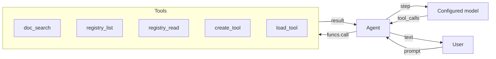
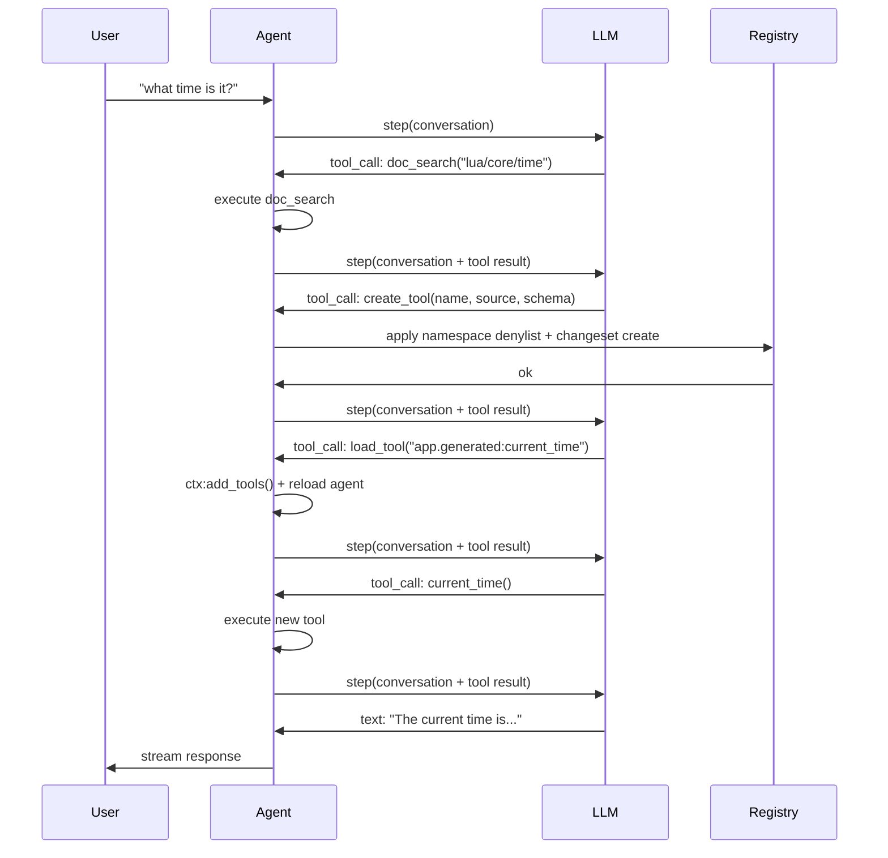
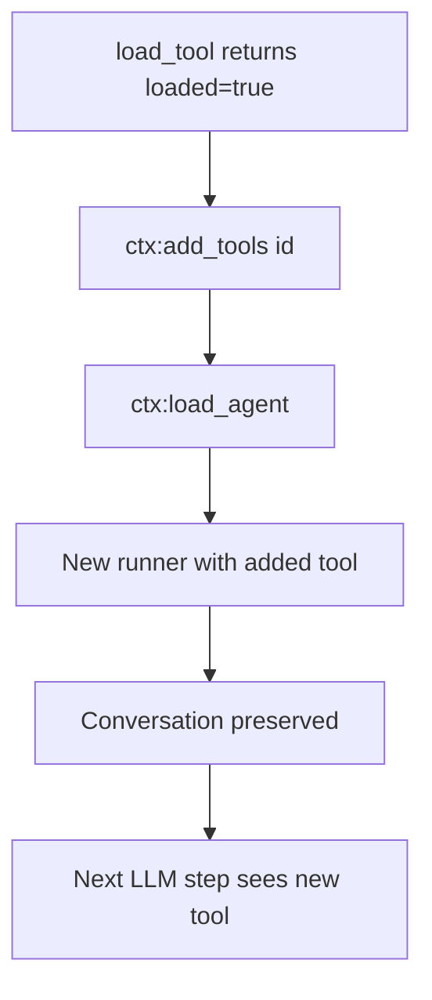
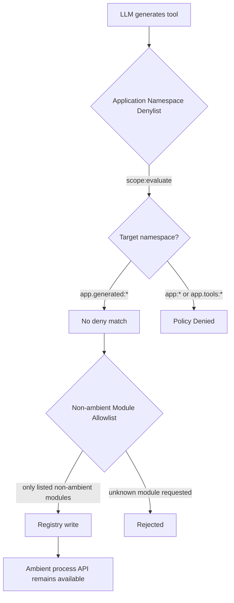

# Micro AGI

Estudia un agente que lee documentación, genera herramientas Lua, las registra en tiempo de ejecución y las carga en su sesión activa.

**Clasificación: recorrido de una implementación de referencia.** Los fragmentos explican el módulo publicado `wippy/micro-agi`, pero no forman deliberadamente un árbol de fuentes completo. Ejecuta el módulo de Hub para probar la implementación; usa el tutorial Agente LLM cuando necesites una construcción autónoma.

## Lo que demuestra el paquete

Un agente de terminal que:

- Transmite respuestas de un LLM.
- Busca APIs en la documentación de Wippy.
- Inspecciona el registro para encontrar capacidades existentes.
- Crea y carga herramientas cuando falta una capacidad.
- Comprime el historial de conversación al acercarse al límite de contexto.


```mermaid
flowchart LR
    User -->|prompt| Agent
    Agent -->|step| LLM[Configured model]
    LLM -->|tool_calls| Agent
    Agent -->|funcs.call| Tools
    Tools -->|result| Agent
    Agent -->|text| User

    subgraph Tools
        doc_search
        registry_list
        registry_read
        create_tool
        load_tool
    end
```

## Arquitectura

El agente se ejecuta como un proceso de Wippy con acceso al registro. Cuando el LLM decide que necesita una capacidad que no tiene, usa el bucle de automodificación:


```mermaid
sequenceDiagram
    participant U as User
    participant A as Agent
    participant L as LLM
    participant R as Registry

    U->>A: "what time is it?"
    A->>L: step(conversation)
    L->>A: tool_call: doc_search("lua/core/time")
    A->>A: execute doc_search
    A->>L: step(conversation + tool result)
    L->>A: tool_call: create_tool(name, source, schema)
    A->>R: apply namespace denylist + changeset create
    R->>A: ok
    A->>L: step(conversation + tool result)
    L->>A: tool_call: load_tool("app.generated:current_time")
    A->>A: ctx:add_tools() + reload agent
    A->>L: step(conversation + tool result)
    L->>A: tool_call: current_time()
    A->>A: execute new tool
    A->>L: step(conversation + tool result)
    L->>A: text: "The current time is..."
    A->>U: stream response
```

Las herramientas son entradas del registro. Para crear una, el agente escribe una entrada `function.lua` con código Lua inline en `data.source`; después, el runtime compila y carga esa entrada.

## Estructura del paquete publicado

El paquete es propietario de todos estos archivos. Esta página reproduce `doc_search.lua` y los contratos importantes para la arquitectura, pero abrevia los helpers de registro, la infraestructura de changesets, los helpers del loader dinámico y el bucle del agente. En particular, las secciones `create_tool`, `load_tool` y `agent.lua` son extractos, no archivos que puedan copiarse literalmente. Las definiciones completas del registro para `registry_list` y `registry_read` también permanecen en el módulo publicado.

```
micro-agi/
├── .wippy.yaml
├── wippy.yaml
└── src/
    ├── _index.yaml
    ├── README.md
    ├── agent.lua
    └── tools/
        ├── _index.yaml
        ├── doc_search.lua
        ├── registry_list.lua
        ├── registry_read.lua
        ├── create_tool.lua
        └── load_tool.lua
```

## Infraestructura

El paquete usa esta configuración `.wippy.yaml`:

```yaml
version: "1.0"

logger:
  encoding: console
```

## Definiciones de Entradas

Las siguientes entradas seleccionadas de `src/_index.yaml` muestran la infraestructura, las políticas de seguridad, los modelos, el agente y el proceso:

```yaml
version: "1.0"
namespace: app

entries:
  - name: definition
    kind: ns.definition
    readme: file://README.md
    meta:
      title: Micro AGI
      description: Self-modifying development agent that builds its own tools at runtime
      depends_on: [wippy/llm, wippy/agent]

  - name: os_env
    kind: env.storage.os

  - name: processes
    kind: process.host
    lifecycle:
      auto_start: true

  - name: __dep.llm
    kind: ns.dependency
    component: wippy/llm
    version: "*"
    parameters:
      - name: env_storage
        value: app:os_env
      - name: process_host
        value: app:processes

  - name: __dep.agent
    kind: ns.dependency
    component: wippy/agent
    version: "*"
    parameters:
      - name: process_host
        value: app:processes
```

### Políticas de Seguridad

Dos entradas `security.policy` forman una denylist de namespaces a nivel de aplicación:

```yaml
  - name: deny_core_ns
    kind: security.policy
    policy:
      actions: "*"
      resources: "app:*"
      effect: deny
    groups:
      - agent_security

  - name: deny_tools_ns
    kind: security.policy
    policy:
      actions: "*"
      resources: "app.tools:*"
      effect: deny
    groups:
      - agent_security
```

`create_tool` carga estas políticas como un scope con nombre (`app:agent_security`). El helper rechaza un `deny` explícito para `app:*` (entradas core, modelos y definición del agente) o `app.tools:*` (herramientas integradas), pero trata el resultado `undefined` no coincidente de `app.generated:*` como aprobado por su filtro específico. Esto no es autorización del runtime de Wippy: las operaciones protegidas requieren un `allow` explícito del contexto de ejecución, incluidas las operaciones del módulo de seguridad mostradas más abajo y `registry.apply` dentro de `changes:apply()`.

Consulta [Modelo de seguridad](system/security.md) para más detalles sobre la evaluación de políticas.

### Modelos

Dos modelos cumplen propósitos diferentes:

```yaml
  - name: gpt-5.1
    kind: registry.entry
    meta:
      name: gpt-5.1
      type: llm.model
      title: GPT-5.1
      comment: Reasoning model
      capabilities: [generate, tool_use, structured_output, vision, thinking]
      class: [reasoning]
      priority: 210
    max_tokens: 400000
    output_tokens: 128000
    pricing:
      input: 1.25
      output: 10
    providers:
      - id: wippy.llm.openai:provider
        options:
          reasoning_model_request: true
        provider_model: gpt-5.1

  - name: gpt-4.1-nano
    kind: registry.entry
    meta:
      name: gpt-4.1-nano
      type: llm.model
      title: GPT-4.1 Nano
      comment: Compression model
      capabilities: [generate, tool_use, structured_output]
      class: [fast]
      priority: 100
    max_tokens: 1047576
    output_tokens: 32768
    pricing:
      input: 0.1
      output: 0.4
    providers:
      - id: wippy.llm.openai:provider
        provider_model: gpt-4.1-nano
```

GPT-5.1 gestiona el razonamiento y el uso de herramientas. GPT-4.1 Nano gestiona la compresión del contexto.

### Definición del Agente

```yaml
  - name: dev_assistant
    kind: registry.entry
    meta:
      type: agent.gen1
      name: dev_assistant
      title: Dev Assistant
      comment: Wippy development assistant
    prompt: |
      Self-modifying Wippy development agent. You run inside Wippy runtime
      with access to docs, registry, and dynamic tool creation.

      Rules:
      - NEVER fabricate, guess, or hallucinate facts. If you need real data,
        use or build a tool to get it. Only state what a tool actually returned.
      - Maximum 2-3 sentences per response. No bullet lists. No disclaimers.
      - Never say "I can't" or "I don't have". Build the tool and do it.
      - Act first, explain only if asked.

      To gain new capabilities: doc_search the API, create_tool with Lua source,
      load_tool, call it. All in one turn.
    model: gpt-5.1
    thinking_effort: 10
    max_tokens: 2048
    tools:
      - "app.tools:*"
```

El prompt da al agente tres reglas operativas:

- **Usar datos recuperados** — Usa herramientas para los hechos externos.
- **Crear capacidades ausentes** — Construye una herramienta cuando falte una capacidad permitida.
- **Priorizar acciones** — Realiza la operación solicitada antes de explicarla.

### Proceso

```yaml
  - name: agent
    kind: process.lua
    meta:
      command:
        name: agent
        short: Start dev assistant
    source: file://agent.lua
    method: main
    modules: [io, json, funcs, registry, time, security]
    imports:
      prompt: wippy.llm:prompt
      agent_context: wippy.agent:context
      compress: wippy.llm.util:compress
```

El proceso se ejecuta como un comando de terminal. `create_tool` aplica la denylist del paquete antes de escribir, pero ese filtro no proporciona el contexto de seguridad del runtime del comando.

Imports:
- `prompt` — constructor de conversaciones
- `agent_context` — carga de agente y gestión dinámica de herramientas
- `compress` — compresión de texto basada en LLM para gestión de contexto

## Herramientas

Cree `src/tools/_index.yaml` con cinco herramientas:

### doc_search

Obtiene la documentación de Wippy mediante la API `wippy.ai/llm`. Admite dos modos: obtener una página por ruta, o buscar por consulta.

```lua
local http_client = require("http_client")
local json = require("json")

local BASE_URL = "https://wippy.ai/llm"
local MAX_CHARS = 8000

local function fetch_page(path)
    local url = BASE_URL .. "/path/en/" .. path
    local resp, err = http_client.get(url, {
        headers = { ["User-Agent"] = "wippy-agent/1.0" },
    })
    if err then
        return nil, tostring(err)
    end
    if resp.status_code ~= 200 then
        return nil, "HTTP " .. resp.status_code
    end

    local body = resp.body or ""
    if #body > MAX_CHARS then
        body = body:sub(1, MAX_CHARS) .. "\n... (truncated)"
    end
    return body, nil
end

local function search_docs(query)
    local url = BASE_URL .. "/search?q=" .. http_client.encode_uri(query)
    local resp, err = http_client.get(url, {
        headers = { ["User-Agent"] = "wippy-agent/1.0" },
    })
    if err then
        return { error = tostring(err) }
    end
    if resp.status_code ~= 200 then
        return { error = "HTTP " .. resp.status_code }
    end

    local body = resp.body or ""
    if #body > MAX_CHARS then
        body = body:sub(1, MAX_CHARS) .. "\n... (truncated)"
    end

    return { results = body }
end

local function handler(input)
    if input.path then
        local content, err = fetch_page(input.path)
        if err then
            return { error = err }
        end
        return { path = input.path, content = content }
    end

    if input.query then
        return search_docs(input.query)
    end

    return { error = "provide either 'path' or 'query'" }
end

return { handler = handler }
```

### create_tool

Esta herramienta evalúa la denylist de namespaces del paquete y crea una entrada `function.lua` en el registro con código Lua inline.

El campo `modules` de la entrada generada controla qué módulos no ambientales puede requerir la herramienta. El módulo `process` es ambiental para cada entrada Lua ejecutable, por lo que omitirlo no es un límite de seguridad; las operaciones de proceso siguen dependiendo de las políticas de seguridad del runtime.

```lua
local registry = require("registry")
local json = require("json")
local security = require("security")

local NAMESPACE = "app.generated"
local MAX_SOURCE_LEN = 16000
local MAX_NAME_LEN = 64

local ALLOWED_MODULES = {
    time = true, json = true, http_client = true, expr = true,
    text = true, base64 = true, yaml = true, crypto = true,
    hash = true, uuid = true,
}
```

**Evaluación de la denylist** — `create_tool` carga el scope con nombre `agent_security`. Las escrituras en `app:*` o `app.tools:*` se rechazan cuando el scope devuelve `deny`; un destino `app.generated:*` no coincidente devuelve `undefined` y supera este filtro de aplicación:

```lua
local actor = security.new_actor("service:agent", { role = "agent" })
local scope, scope_err = security.named_scope("app:agent_security")
if scope_err then
    return { error = "failed to load security scope: " .. tostring(scope_err) }
end

local result = scope:evaluate(actor, action, id)
if result == "deny" then
    return { error = "policy denied: " .. action .. " on " .. id }
end
```

Esta comprobación no autoriza la mutación del registro. El comando actual también necesita un actor y scope del runtime que permitan explícitamente las llamadas del módulo de seguridad y `registry.apply`.

**Escritura en el registro** — la entrada se escribe con el código fuente en `data.source` y solo los módulos permitidos:

```lua
local entry = {
    id = id,
    kind = "function.lua",
    meta = {
        type = "tool",
        title = input.name,
        comment = input.description,
        input_schema = schema,
        llm_alias = input.name,
        llm_description = input.description,
    },
    data = {
        source = input.source,
        modules = modules,
        method = "handler",
    },
}

local snap = registry.snapshot()
local changes = snap:changes()
if existing then
    changes:update(entry)
else
    changes:create(entry)
end
local _, apply_err = changes:apply()
if apply_err then
    return { error = "failed to apply registry change: " .. tostring(apply_err) }
end
```

La herramienta generada se almacena en el registro, no en un archivo fuente.

### load_tool

Valida que la entrada es una herramienta y le indica al bucle del agente que recargue:

```lua
local function handler(input)
    local entry, err = registry.get(input.id)
    if err then
        return { error = tostring(err) }
    end
    if not entry then
        return { error = "not found: " .. input.id }
    end
    if not entry.meta or entry.meta.type ~= "tool" then
        return { error = "not a tool (meta.type != 'tool'): " .. input.id }
    end

    return {
        loaded = true,
        id = entry.id,
        alias = entry.meta.llm_alias or input.id,
        description = entry.meta.llm_description or "",
    }
end
```

El bucle del agente detecta `loaded = true` en el resultado y llama a `ctx:add_tools(id)` seguido de `ctx:load_agent()` para recompilar el agente con la nueva herramienta.

## Bucle del Agente

El bucle del agente en `src/agent.lua` maneja streaming, ejecución de herramientas, carga dinámica y compresión de contexto.

### Streaming

Usa el mismo patrón de coroutine + canal del [tutorial de Agente LLM](tutorials/llm-agent.md):

```lua
coroutine.spawn(function()
    local response, err = session.runner:step(session.conversation, {
        stream_target = {
            reply_to = process.pid(),
            topic = STREAM_TOPIC,
        },
    })
    done_ch:send({ response = response, err = err })
end)
```

### Ejecución de Herramientas

Las herramientas se llaman mediante `funcs.call()`. `pcall` captura los errores Lua lanzados, mientras el segundo retorno normal de `funcs.call()` transporta los errores de invocación:

```lua
local ok, result, call_err = pcall(funcs.call, tc.registry_id, args)
if not ok then
    results[tc.id] = { error = tostring(result) }
elseif call_err then
    results[tc.id] = { error = tostring(call_err) }
else
    results[tc.id] = result
end
```

### Carga Dinámica de Herramientas

Cuando `load_tool` retorna `loaded = true`, el agente se recarga a sí mismo:


```mermaid
flowchart TD
    A[load_tool returns loaded=true] --> B[ctx:add_tools id]
    B --> C[ctx:load_agent]
    C --> D[New runner with added tool]
    D --> E[Conversation preserved]
    E --> F[Next LLM step sees new tool]
```

```lua
local function handle_tool_loading(tool_calls, results)
    local reload_needed = false
    for _, tc in ipairs(tool_calls) do
        if tc.name == "load_tool" then
            local result = results[tc.id]
            if result and result.loaded then
                session.ctx:add_tools(result.id)
                reload_needed = true
            end
        end
    end
    if reload_needed then
        reload_agent()
    end
end
```

La conversación se preserva entre recargas porque vive en el constructor de prompts, no en el runner.

### Compresión de Contexto

Cuando los tokens del prompt superan 300K (75 % de la ventana de contexto de 400K), la conversación se comprime con GPT-4.1 Nano:

```lua
if response.tokens and response.tokens.prompt_tokens
    and response.tokens.prompt_tokens > PROMPT_TOKEN_LIMIT then
    try_compress()
end
```

La compresión extrae el contenido de los mensajes, llama a `compress.to_size()` apuntando a 4000 caracteres, y reemplaza la conversación con un resumen:

```lua
local summary, compress_err = compress.to_size(COMPRESS_MODEL, full_text, COMPRESS_TARGET)
if compress_err then
    return nil, compress_err
end
session.conversation = prompt.new()
session.conversation:add_system("Conversation summary:\n\n" .. summary)
```

## Modelo de Seguridad

Una denylist de aplicación y controles de acceso a módulos restringen las herramientas generadas, pero no sustituyen la autorización del runtime.


```mermaid
flowchart TD
    LLM[LLM generates tool] --> P{Application Namespace Denylist}
    P -->|scope:evaluate| Check{Target namespace?}
    Check -->|app.generated:*| OK[No deny match]
    Check -->|app:* or app.tools:*| Deny[Policy Denied]

    OK --> M{Non-ambient Module Allowlist}
    M -->|only listed non-ambient modules| R[Registry write]
    M -->|unknown module requested| Err[Rejected]
    R --> A[Ambient process API remains available]
```

### Denylist de namespaces

| Política | Recursos | Efecto |
|----------|----------|--------|
| `deny_core_ns` | `app:*` | deny |
| `deny_tools_ns` | `app.tools:*` | deny |

`create_tool` carga el grupo de políticas `agent_security` y evalúa el ID de la entrada objetivo. Trata deliberadamente `undefined` como «no denegado» para este filtro de aplicación. La autorización protegida de Wippy no funciona así: una operación solo se permite con un `allow` explícito. El contexto que ejecuta este código debe seguir incluyendo los permisos de runtime necesarios.

Esto evita que el agente:
- Modifique su propio prompt o definición de agente (`app:dev_assistant`)
- Sobrescriba sus herramientas integradas (`app.tools:*`)
- Cambie entradas de infraestructura (`app:processes`, etc.)

### Control de Acceso a Módulos

Las herramientas generadas declaran capacidades no ambientales en `data.modules`, y `create_tool` solo acepta nombres de `ALLOWED_MODULES`. Un módulo no ambiental sin declarar no puede importarse. El runtime sigue inyectando `process` en todas las entradas Lua ejecutables, incluidas las herramientas generadas, por lo que las operaciones de proceso deben restringirse mediante políticas de seguridad, no omitiendo `process` de `data.modules`.

Este tutorial no define políticas para `process.spawn` ni `process.exec`. Por tanto, sus herramientas generadas no forman un sandbox completo: añade políticas de runtime para las operaciones de proceso ambientales antes de permitir código de herramientas no confiable.

## Ejecutar y limitación actual del paquete

El artefacto publicado es el módulo de Hub. Comienza en un directorio vacío nuevo que no contenga `wippy.lock`; el bootstrap de Hub rechaza un lock no relacionado o con varias raíces. La primera ejecución crea el lock de despliegue y las posteriores desde el mismo directorio reutilizan ese lock coincidente.

```bash
mkdir micro-agi-deploy
cd micro-agi-deploy
wippy run wippy/micro-agi agent
```

El comando descarga la versión seleccionada del módulo, resuelve sus dependencias declaradas e invoca su comando `agent`.

También requiere las credenciales del proveedor y la configuración de modelos esperadas por ese módulo, además de acceso al registro y a la red para descargar desde Hub y buscar documentación. Esta página no proporciona un clon local ni un lockfile, por lo que no afirma ser una compilación reproducible desde las fuentes.

En la release revisada, `wippy/micro-agi` v0.3.1 no declara ningún contexto `meta.command.security` para `agent`. Con el modo estricto predeterminado, las rutas de herramientas protegidas —incluidos `funcs.call`, las lecturas y escrituras del registro y la petición HTTP de búsqueda de documentación— no reciben los allows explícitos que necesitan. Por tanto, los flujos de herramientas y automodificación anteriores son diseños de referencia, no ejecuciones correctas en modo estricto predeterminado. No desactives el modo estricto para hacer funcionar un generador de código no confiable; el paquete debe añadir primero un scope de comando de privilegios mínimos para las acciones requeridas.

## Siguientes Pasos

- [Agente LLM](tutorials/llm-agent.md) — Construir un agente básico desde cero
- [Módulo de Agente](framework/agents.md) — Referencia del framework de agentes
- [Registro](concepts/registry.md) — Conceptos del registro
- [Modelo de Seguridad](system/security.md) — Políticas de seguridad declarativas
- [Tipos de Entrada](guides/entry-kinds.md) — Tipos de entrada disponibles
