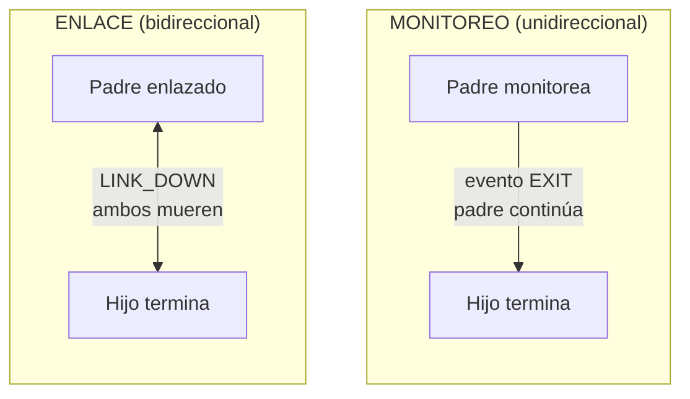

# Supervisión de Procesos

Monitorear y enlazar procesos para construir sistemas tolerantes a fallos.

## Monitoreo vs Enlace

**Monitoreo** proporciona observación unidireccional:
- El padre monitorea al hijo
- Si el hijo termina, el padre recibe un evento EXIT
- El padre continúa ejecutándose

**Enlace** crea compartición de destino bidireccional:
- El padre y el hijo están enlazados
- Si cualquier proceso falla, ambos terminan
- A menos que se establezca `trap_links=true`



## Monitoreo de Procesos

### Spawn con Monitoreo

Usar `process.spawn_monitored()` para lanzar y monitorear en una sola llamada:

```lua
local function main()
    local events_ch = process.events()

    -- Lanzar worker e iniciar monitoreo
    local worker_pid, err = process.spawn_monitored(
        "app.workers:task_worker",
        "app:processes"
    )
    if err then
        return nil, "spawn failed: " .. tostring(err)
    end

    -- Esperar que el worker complete
    local event = events_ch:receive()

    if event.kind == process.event.EXIT then
        print("Worker exited:", event.from)
        if event.result then
            print("Result:", event.result.value)
        end
        if event.result and event.result.error then
            print("Error:", event.result.error)
        end
    end
end
```

### Monitorear un Proceso Existente

Llamar `process.monitor()` para comenzar a monitorear un proceso que ya está ejecutándose:

```lua
local function main()
    local time = require("time")
    local events_ch = process.events()

    -- Lanzar sin monitoreo
    local worker_pid, err = process.spawn(
        "app.workers:long_worker",
        "app:processes"
    )
    if err then
        return nil, "spawn failed: " .. tostring(err)
    end

    -- Iniciar monitoreo más tarde
    local ok, monitor_err = process.monitor(worker_pid)
    if monitor_err then
        return nil, "monitor failed: " .. tostring(monitor_err)
    end

    -- Cancelar el worker
    time.sleep("5ms")
    process.cancel(worker_pid)

    -- Recibir evento EXIT
    local event = events_ch:receive()
    if event.kind == process.event.EXIT then
        print("Worker terminated:", event.from)
    end
end
```

### Detener el Monitoreo

Usar `process.unmonitor()` para dejar de recibir eventos EXIT:

```lua
local function main()
    local time = require("time")
    local events_ch = process.events()

    -- Lanzar y monitorear
    local worker_pid, err = process.spawn_monitored(
        "app.workers:long_worker",
        "app:processes"
    )

    time.sleep("5ms")

    -- Detener monitoreo
    local ok, unmon_err = process.unmonitor(worker_pid)
    if unmon_err then
        return nil, "unmonitor failed: " .. tostring(unmon_err)
    end

    -- Cancelar worker
    process.cancel(worker_pid)

    -- No se recibirá ningún evento EXIT (desmonitorizamos)
    local timeout = time.after("200ms")
    local result = channel.select {
        events_ch:case_receive(),
        timeout:case_receive(),
    }

    if result.channel == events_ch then
        return nil, "should not receive event after unmonitor"
    end
end
```

## Enlace de Procesos

### Enlace Explícito

Usar `process.link()` para crear un enlace bidireccional:

```lua
-- Worker que enlaza a un proceso destino
local function worker_main()
    local time = require("time")
    local events_ch = process.events()
    local inbox_ch = process.inbox()

    -- Habilitar trap_links para recibir eventos LINK_DOWN
    process.set_options({ trap_links = true })

    -- Recibir PID destino del remitente
    local msg = inbox_ch:receive()
    local target_pid = msg:payload():data()
    local sender = msg:from()

    -- Crear enlace bidireccional
    local ok, err = process.link(target_pid)
    if err then
        return nil, "link failed: " .. tostring(err)
    end

    -- Notificar al remitente que estamos enlazados
    process.send(sender, "linked", process.pid())

    -- Esperar LINK_DOWN cuando el destino sale
    local timeout = time.after("3s")
    local result = channel.select {
        events_ch:case_receive(),
        timeout:case_receive(),
    }

    if result.channel == events_ch then
        local event = result.value
        if event.kind == process.event.LINK_DOWN then
            return "LINK_DOWN_RECEIVED"
        end
    end

    return nil, "no LINK_DOWN received"
end
```

### Spawn con Enlace

Usar `process.spawn_linked()` para lanzar y enlazar en una sola llamada:

```lua
local function parent_main()
    -- Habilitar trap_links para manejar la muerte del hijo
    process.set_options({ trap_links = true })

    local events_ch = process.events()

    -- Lanzar y enlazar al hijo
    local child_pid, err = process.spawn_linked(
        "app.workers:child_worker",
        "app:processes"
    )
    if err then
        return nil, "spawn_linked failed: " .. tostring(err)
    end

    -- Si el hijo muere, recibimos LINK_DOWN
    local event = events_ch:receive()
    if event.kind == process.event.LINK_DOWN then
        print("Child died:", event.from)
    end
end
```

## Trampa de Enlaces

Por defecto, cuando un proceso enlazado falla, el proceso actual también falla. Establecer `trap_links=true` para recibir eventos LINK_DOWN en su lugar.

### Comportamiento por Defecto (trap_links=false)

Sin `trap_links`, el fallo del proceso enlazado termina el proceso actual:

```lua
local function worker_main()
    local events_ch = process.events()

    -- trap_links es false por defecto
    local opts = process.get_options()
    print("trap_links:", opts.trap_links)  -- false

    -- Lanzar worker enlazado que fallará
    local child_pid, err = process.spawn_linked(
        "app.workers:error_worker",
        "app:processes"
    )

    -- Cuando el hijo falla, ESTE proceso termina
    -- Nunca llegamos a este punto
    local event = events_ch:receive()
end
```

### Con trap_links=true

Habilitar `trap_links` para recibir eventos LINK_DOWN y sobrevivir:

```lua
local function worker_main()
    -- Habilitar trap_links
    process.set_options({ trap_links = true })

    local events_ch = process.events()

    -- Lanzar worker enlazado que fallará
    local child_pid, err = process.spawn_linked(
        "app.workers:error_worker",
        "app:processes"
    )

    -- Esperar evento LINK_DOWN
    local event = events_ch:receive()

    if event.kind == process.event.LINK_DOWN then
        print("Child failed, handling gracefully")
        return "LINK_DOWN_RECEIVED"
    end
end
```

## Cancelación

### Enviar Señal de Cancelación

Usar `process.cancel()` para terminar un proceso de forma controlada:

```lua
local function main()
    local time = require("time")
    local events_ch = process.events()

    -- Lanzar y monitorear worker
    local worker_pid, err = process.spawn_monitored(
        "app.workers:long_worker",
        "app:processes"
    )

    time.sleep("5ms")

    -- Cancelar el worker
    local ok, cancel_err = process.cancel(worker_pid)
    if cancel_err then
        return nil, "cancel failed: " .. tostring(cancel_err)
    end

    -- Esperar evento EXIT
    local event = events_ch:receive()
    if event.kind == process.event.EXIT then
        print("Worker cancelled:", event.from)
    end
end
```

### Manejar la Cancelación

El worker recibe el evento CANCEL a través de `process.events()`:

```lua
local function worker_main()
    local events_ch = process.events()
    local inbox_ch = process.inbox()

    while true do
        local result = channel.select {
            inbox_ch:case_receive(),
            events_ch:case_receive(),
        }

        if result.channel == events_ch then
            local event = result.value
            if event.kind == process.event.CANCEL then
                -- Limpiar recursos
                cleanup()
                return "cancelled gracefully"
            end
        else
            -- Procesar mensaje del buzón
            handle_message(result.value)
        end
    end
end
```

## Topologías de Supervisión

### Topología en Estrella

Padre con múltiples hijos enlazados a él:

```lua
-- Worker padre lanza hijos que enlazan AL padre
local function star_parent_main()
    local time = require("time")
    local events_ch = process.events()
    local child_count = 10

    -- Habilitar trap_links para ver morir a los hijos
    process.set_options({ trap_links = true })

    local children = {}

    -- Lanzar hijos
    for i = 1, child_count do
        local child_pid, err = process.spawn(
            "app.workers:linker_child",
            "app:processes"
        )
        if err then
            error("spawn child failed: " .. tostring(err))
        end

        -- Enviar PID del padre al hijo
        process.send(child_pid, "inbox", process.pid())
        children[child_pid] = true
    end

    -- Esperar que todos los hijos confirmen el enlace
    for i = 1, child_count do
        local msg = process.inbox():receive()
        if msg:topic() ~= "linked" then
            error("expected linked confirmation")
        end
    end

    -- Desencadenar fallo - todos los hijos deberían recibir LINK_DOWN
    error("PARENT_STAR_FAILURE")
end
```

Worker hijo que enlaza al padre:

```lua
local function linker_child_main()
    local events_ch = process.events()
    local inbox_ch = process.inbox()

    -- Recibir PID del padre
    local msg = inbox_ch:receive()
    local parent_pid = msg:payload():data()

    -- Enlazar al padre
    process.link(parent_pid)

    -- Confirmar enlace
    process.send(parent_pid, "linked", process.pid())

    -- Esperar LINK_DOWN cuando el padre muere
    local event = events_ch:receive()
    if event.kind == process.event.LINK_DOWN then
        return "parent_died"
    end
end
```

### Topología en Cadena

Cadena lineal donde cada nodo enlaza a su padre:

```lua
-- Raíz de cadena: A -> B -> C -> D -> E
local function chain_root_main()
    local time = require("time")

    -- Lanzar primer hijo
    local child_pid, err = process.spawn_linked(
        "app.workers:chain_node",
        "app:processes",
        4  -- profundidad restante
    )
    if err then
        error("spawn failed: " .. tostring(err))
    end

    -- Esperar que la cadena se construya
    time.sleep("100ms")

    -- Desencadenar cascada - todos los procesos enlazados mueren
    error("CHAIN_ROOT_FAILURE")
end
```

Nodo de cadena lanza el siguiente nodo y enlaza:

```lua
local function chain_node_main(depth)
    local time = require("time")

    if depth > 0 then
        -- Lanzar el siguiente en la cadena
        local child_pid, err = process.spawn_linked(
            "app.workers:chain_node",
            "app:processes",
            depth - 1
        )
        if err then
            error("spawn failed: " .. tostring(err))
        end
    end

    -- Bloquear hasta que la muerte del padre nos mate via LINK_DOWN (trap_links=false por defecto)
    process.inbox():receive()
end
```

## Pool de Workers con Supervisión

### Configuración

```yaml
# src/_index.yaml
version: "1.0"
namespace: app

entries:
  - name: processes
    kind: process.host
    host:
      workers: 16
    lifecycle:
      auto_start: true
```

```yaml
# src/supervisor/_index.yaml
version: "1.0"
namespace: app.supervisor

entries:
  - name: pool
    kind: process.lua
    source: file://pool.lua
    method: main
    modules:
      - time
    lifecycle:
      auto_start: true
```

### Implementación del Supervisor

```lua
-- src/supervisor/pool.lua
local function main(worker_count)
    local time = require("time")
    worker_count = worker_count or 4

    -- Habilitar trap_links para manejar muertes de workers
    process.set_options({ trap_links = true })

    local events_ch = process.events()
    local workers = {}

    local function start_worker(id)
        local pid, err = process.spawn_linked(
            "app.workers:task_worker",
            "app:processes",
            id
        )
        if err then
            print("Failed to start worker " .. id .. ": " .. tostring(err))
            return nil
        end

        workers[pid] = {id = id, started_at = os.time()}
        print("Worker " .. id .. " started: " .. pid)
        return pid
    end

    -- Iniciar el pool inicial
    for i = 1, worker_count do
        start_worker(i)
    end

    print("Supervisor started with " .. worker_count .. " workers")

    -- Bucle de supervisión
    while true do
        local timeout = time.after("60s")
        local result = channel.select {
            events_ch:case_receive(),
            timeout:case_receive(),
        }

        if result.channel == timeout then
            -- Verificación de salud periódica
            local count = 0
            for _ in pairs(workers) do count = count + 1 end
            print("Health check: " .. count .. " active workers")

        elseif result.channel == events_ch then
            local event = result.value

            if event.kind == process.event.LINK_DOWN then
                local dead_worker = workers[event.from]
                if dead_worker then
                    workers[event.from] = nil
                    local uptime = os.time() - dead_worker.started_at
                    print("Worker " .. dead_worker.id .. " died after " .. uptime .. "s, restarting")

                    -- Breve retraso antes de reiniciar
                    time.sleep("100ms")
                    start_worker(dead_worker.id)
                end
            end
        end
    end
end

return { main = main }
```

## Configuración del Proceso

### Definición del Worker

```yaml
# src/workers/_index.yaml
version: "1.0"
namespace: app.workers

entries:
  - name: task_worker
    kind: process.lua
    source: file://task_worker.lua
    method: main
    modules:
      - time
```

### Implementación del Worker

```lua
-- src/workers/task_worker.lua
local function main(worker_id)
    local time = require("time")
    local events_ch = process.events()
    local inbox_ch = process.inbox()

    print("Task worker " .. worker_id .. " started")

    while true do
        local timeout = time.after("5s")
        local result = channel.select {
            inbox_ch:case_receive(),
            events_ch:case_receive(),
            timeout:case_receive(),
        }

        if result.channel == events_ch then
            local event = result.value
            if event.kind == process.event.CANCEL then
                print("Worker " .. worker_id .. " cancelled")
                return "cancelled"
            elseif event.kind == process.event.LINK_DOWN then
                print("Worker " .. worker_id .. " linked process died")
                return nil, "linked_process_died"
            end

        elseif result.channel == inbox_ch then
            local msg = result.value
            local topic = msg:topic()
            local payload = msg:payload():data()

            if topic == "work" then
                print("Worker " .. worker_id .. " processing: " .. payload)
                time.sleep("100ms")
                process.send(msg:from(), "result", "completed: " .. payload)
            end

        elseif result.channel == timeout then
            -- Timeout por inactividad
            print("Worker " .. worker_id .. " idle")
        end
    end
end

return { main = main }
```

## Configuración del Host de Proceso

El host de proceso controla cuántos hilos del SO ejecutan procesos:

```yaml
# src/_index.yaml
version: "1.0"
namespace: app

entries:
  - name: processes
    kind: process.host
    host:
      workers: 16  # Número de hilos del SO
    lifecycle:
      auto_start: true
```

Configuración de workers:
- Controla el paralelismo para trabajo con uso intensivo de CPU
- Típicamente se establece al número de núcleos de CPU
- Todos los procesos comparten este pool de hilos

## Tipos de Evento

| Evento | Desencadenado por | Configuración requerida |
|--------|------------------|-------------------------|
| `EXIT` | El proceso monitorizado sale | `spawn_monitored()` o `monitor()` |
| `LINK_DOWN` | El proceso enlazado falla | `spawn_linked()` o `link()` con `trap_links=true` |
| `CANCEL` | Se llama `process.cancel()` | Ninguna (siempre se entrega) |

## Ejecutar el Pool Supervisor

Colocar los archivos del pool en la estructura mostrada en [Configuración](#configuration), luego:

```bash
wippy init
wippy run
```

El supervisor arranca automáticamente, lanza cuatro workers y registra los reinicios cuando cualquiera de ellos muere. Desencadenar un reinicio cancelando un worker desde otro proceso:

```lua
-- en un proceso ad-hoc o comando de chat
process.cancel("<pid-from-supervisor-log>")
```

El pool recibe `LINK_DOWN`, espera 100 ms y relanza el worker con el mismo id.

## Próximos Pasos

- [Procesos](tutorials/processes.md) - Fundamentos de procesos
- [Canales](tutorials/channels.md) - Patrones de paso de mensajes
- [Módulo de Proceso](lua/core/process.md) - Referencia de API
