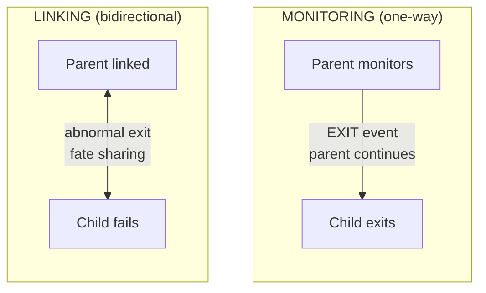

# Recetas de supervisión de procesos

Utiliza la supervisión y los enlaces para observar salidas de procesos, propagar fallos, gestionar la cancelación y reiniciar workers.

**Clasificación:** receta parcial. Los fragmentos del ciclo de vida son independientes y la sección del pool de workers proporciona sus entradas principales, pero no el proceso de control independiente necesario para provocar y verificar un reinicio.

## Contexto y dependencias

Los fragmentos están dirigidos al entorno de ejecución Wippy `v0.3.32a` y presuponen una entrada Lua ejecutable, un `process.host` en ejecución llamado `app:processes` y entradas de worker definidas por el proyecto, como `app.workers:task_worker`. Las API `process` y `channel` son globales ambientales. Cualquier fragmento que llame a `time.*` requiere el módulo `time` en su entrada y `local time = require("time")` en el código fuente.

La creación de procesos, la selección del host, la supervisión, el enlace, el envío, la cancelación y la terminación son operaciones protegidas. Adjunta un actor y políticas de permiso de alcance limitado a cada entrada ejecutable que las utilice. La configuración del pool de workers que aparece más abajo incluye las políticas necesarias para esa receta; los fragmentos aislados no.

## Monitoreo vs Enlace

**Monitoreo** proporciona observación unidireccional:

- El padre monitorea al hijo
- Si el hijo termina, el padre recibe un evento `EXIT`
- El padre continúa ejecutándose

**Enlace** crea un destino compartido bidireccional:

- El padre y el hijo están enlazados
- Si cualquiera de los procesos termina de forma anómala, el otro también termina
- Establecer `trap_links=true` convierte los fallos en eventos que el proceso puede gestionar


```mermaid
flowchart TB
    subgraph Monitoring["MONITORING (one-way)"]
        direction TB
        P1[Parent monitors] -->|EXIT event<br/>parent continues| C1[Child exits]
    end

    subgraph Linking["LINKING (bidirectional)"]
        direction TB
        P2[Parent linked] <-->|abnormal exit<br/>fate sharing| C2[Child fails]
    end
```

## Monitoreo de Procesos

### Spawn con Monitoreo

Usar `process.spawn_monitored()` para lanzar y monitorear en una sola llamada:

```lua
local function main()
    local events_ch = process.events()

    -- Spawn worker and start monitoring
    local worker_pid, err = process.spawn_monitored(
        "app.workers:task_worker",
        "app:processes"
    )
    if err then
        return nil, "spawn failed: " .. tostring(err)
    end

    -- Wait for worker to complete
    local event = events_ch:receive()

    if event.kind == process.event.EXIT then
        print("Worker exited:", event.from)
        if event.result then
            print("Result:", event.result.value)
        end
        if event.result and event.result.error then
            print("Error:", event.result.error)
        end
    end
end
```

### Monitorear un Proceso Existente

Llamar `process.monitor()` para comenzar a monitorear un proceso que ya está ejecutándose:

```lua
local function main()
    local time = require("time")
    local events_ch = process.events()

    -- Spawn without monitoring
    local worker_pid, err = process.spawn(
        "app.workers:long_worker",
        "app:processes"
    )
    if err then
        return nil, "spawn failed: " .. tostring(err)
    end

    -- Start monitoring later
    local ok, monitor_err = process.monitor(worker_pid)
    if monitor_err then
        return nil, "monitor failed: " .. tostring(monitor_err)
    end

    -- Cancel the worker
    time.sleep("5ms")
    local _, cancel_err = process.cancel(worker_pid)
    if cancel_err then
        return nil, "cancel failed: " .. tostring(cancel_err)
    end

    -- Receive EXIT event
    local event = events_ch:receive()
    if event.kind == process.event.EXIT then
        print("Worker terminated:", event.from)
    end
end
```

### Detener el Monitoreo

Usar `process.unmonitor()` para dejar de recibir eventos EXIT:

```lua
local function main()
    local time = require("time")
    local events_ch = process.events()

    -- Spawn and monitor
    local worker_pid, err = process.spawn_monitored(
        "app.workers:long_worker",
        "app:processes"
    )
    if err then
        return nil, "spawn failed: " .. tostring(err)
    end

    time.sleep("5ms")

    -- Stop monitoring
    local ok, unmon_err = process.unmonitor(worker_pid)
    if unmon_err then
        return nil, "unmonitor failed: " .. tostring(unmon_err)
    end

    -- Cancel worker
    local _, cancel_err = process.cancel(worker_pid)
    if cancel_err then
        return nil, "cancel failed: " .. tostring(cancel_err)
    end

    -- No EXIT event will be received (we unmonitored)
    local timeout = time.after("200ms")
    local result = channel.select {
        events_ch:case_receive(),
        timeout:case_receive(),
    }

    if result.channel == events_ch then
        return nil, "should not receive event after unmonitor"
    end
end
```

## Enlace de Procesos

### Enlace Explícito

Usar `process.link()` para crear un enlace bidireccional:

```lua
-- Worker that links to a target process
local function worker_main()
    local time = require("time")
    local events_ch = process.events()
    local inbox_ch = process.inbox()

    -- Enable trap_links to receive LINK_DOWN events
    local _, options_err = process.set_options({ trap_links = true })
    if options_err then
        return nil, "set_options failed: " .. tostring(options_err)
    end

    -- Receive target PID from sender
    local msg = inbox_ch:receive()
    local target_pid = msg:payload():data()
    local sender = msg:from()

    -- Create bidirectional link
    local ok, err = process.link(target_pid)
    if err then
        return nil, "link failed: " .. tostring(err)
    end

    -- Notify sender we're linked
    local _, send_err = process.send(sender, "linked", process.pid())
    if send_err then
        return nil, "confirmation failed: " .. tostring(send_err)
    end

    -- Wait for LINK_DOWN when target exits with an error
    local timeout = time.after("3s")
    local result = channel.select {
        events_ch:case_receive(),
        timeout:case_receive(),
    }

    if result.channel == events_ch then
        local event = result.value
        if event.kind == process.event.LINK_DOWN then
            return "LINK_DOWN_RECEIVED"
        end
    end

    return nil, "no LINK_DOWN received"
end
```

### Spawn con Enlace

Usar `process.spawn_linked()` para lanzar y enlazar en una sola llamada:

```lua
local function parent_main()
    -- Enable trap_links to handle child death
    local _, options_err = process.set_options({ trap_links = true })
    if options_err then
        return nil, "set_options failed: " .. tostring(options_err)
    end

    local events_ch = process.events()

    -- Spawn and link to child
    local child_pid, err = process.spawn_linked(
        "app.workers:child_worker",
        "app:processes"
    )
    if err then
        return nil, "spawn_linked failed: " .. tostring(err)
    end

    -- If the child exits with an error, we receive LINK_DOWN
    local event = events_ch:receive()
    if event.kind == process.event.LINK_DOWN then
        print("Child died:", event.from)
    end
end
```

El destino o el hijo deben terminar de forma anómala para que estos ejemplos reciban `LINK_DOWN`; el ejemplo de enlace explícito también requiere que el fallo ocurra dentro de su ventana de espera de tres segundos. Una finalización normal no emite este evento.

## Trampa de Enlaces

Por defecto, cuando un proceso enlazado falla, el proceso actual también falla. Establecer `trap_links=true` para recibir eventos LINK_DOWN en su lugar.

### Comportamiento por Defecto (trap_links=false)

Sin `trap_links`, el fallo del proceso enlazado termina el proceso actual:

```lua
local function worker_main()
    local events_ch = process.events()

    -- trap_links is false by default
    local opts = process.get_options()
    print("trap_links:", opts.trap_links)  -- false

    -- Spawn linked worker that will fail
    local child_pid, err = process.spawn_linked(
        "app.workers:error_worker",
        "app:processes"
    )
    if err then
        return nil, "spawn_linked failed: " .. tostring(err)
    end

    -- When child errors, THIS process terminates
    -- We never reach this point
    local event = events_ch:receive()
end
```

### Con trap_links=true

Habilitar `trap_links` para recibir eventos LINK_DOWN y sobrevivir:

```lua
local function worker_main()
    -- Enable trap_links
    local _, options_err = process.set_options({ trap_links = true })
    if options_err then
        return nil, "set_options failed: " .. tostring(options_err)
    end

    local events_ch = process.events()

    -- Spawn linked worker that will fail
    local child_pid, err = process.spawn_linked(
        "app.workers:error_worker",
        "app:processes"
    )
    if err then
        return nil, "spawn_linked failed: " .. tostring(err)
    end

    -- Wait for LINK_DOWN event
    local event = events_ch:receive()

    if event.kind == process.event.LINK_DOWN then
        print("Child failed, handling gracefully")
        return "LINK_DOWN_RECEIVED"
    end
end
```

## Cancelación

### Enviar Señal de Cancelación

Usar `process.cancel()` para terminar un proceso de forma controlada:

```lua
local function main()
    local time = require("time")
    local events_ch = process.events()

    -- Spawn and monitor worker
    local worker_pid, err = process.spawn_monitored(
        "app.workers:long_worker",
        "app:processes"
    )
    if err then
        return nil, "spawn failed: " .. tostring(err)
    end

    time.sleep("5ms")

    -- Cancel the worker
    local ok, cancel_err = process.cancel(worker_pid)
    if cancel_err then
        return nil, "cancel failed: " .. tostring(cancel_err)
    end

    -- Wait for EXIT event
    local event = events_ch:receive()
    if event.kind == process.event.EXIT then
        print("Worker cancelled:", event.from)
    end
end
```

### Manejar la Cancelación

El worker recibe el evento `CANCEL` mediante `process.events()`.

`cleanup()` y `handle_message()` son callbacks de la aplicación que la receta no define.

```lua
local function worker_main()
    local events_ch = process.events()
    local inbox_ch = process.inbox()

    while true do
        local result = channel.select {
            inbox_ch:case_receive(),
            events_ch:case_receive(),
        }

        if result.channel == events_ch then
            local event = result.value
            if event.kind == process.event.CANCEL then
                -- Cleanup resources
                cleanup()
                return "cancelled gracefully"
            end
        else
            -- Process inbox message
            handle_message(result.value)
        end
    end
end
```

## Topologías de Supervisión

### Topología en Estrella

Padre con múltiples hijos enlazados a él:

```lua
-- Parent worker spawns children that link TO parent
local function star_parent_main()
    local time = require("time")
    local events_ch = process.events()
    local child_count = 10

    -- Enable trap_links to see children die
    local _, options_err = process.set_options({ trap_links = true })
    if options_err then
        error("set_options failed: " .. tostring(options_err))
    end

    local children = {}

    -- Spawn children
    for i = 1, child_count do
        local child_pid, err = process.spawn(
            "app.workers:linker_child",
            "app:processes"
        )
        if err then
            error("spawn child failed: " .. tostring(err))
        end

        -- Send parent PID to child
        local _, send_err = process.send(child_pid, "inbox", process.pid())
        if send_err then
            error("send parent PID failed: " .. tostring(send_err))
        end
        children[child_pid] = true
    end

    -- Wait for all children to confirm link
    for i = 1, child_count do
        local msg = process.inbox():receive()
        if msg:topic() ~= "linked" then
            error("expected linked confirmation")
        end
    end

    -- Trigger failure - all children should receive LINK_DOWN
    error("PARENT_STAR_FAILURE")
end
```

Worker hijo que enlaza al padre:

```lua
local function linker_child_main()
    -- Enable trap_links to receive LINK_DOWN events
    local _, options_err = process.set_options({ trap_links = true })
    if options_err then
        return nil, "set_options failed: " .. tostring(options_err)
    end

    local events_ch = process.events()
    local inbox_ch = process.inbox()

    -- Receive parent PID
    local msg = inbox_ch:receive()
    local parent_pid = msg:payload():data()

    -- Link to parent
    local _, link_err = process.link(parent_pid)
    if link_err then
        return nil, "link failed: " .. tostring(link_err)
    end

    -- Confirm link
    local _, send_err = process.send(parent_pid, "linked", process.pid())
    if send_err then
        return nil, "confirmation failed: " .. tostring(send_err)
    end

    -- Wait for LINK_DOWN when parent dies
    local event = events_ch:receive()
    if event.kind == process.event.LINK_DOWN then
        return "parent_died"
    end
end
```

### Topología en Cadena

Cadena lineal donde cada nodo enlaza a su padre:

```lua
-- Chain root: A -> B -> C -> D -> E
local function chain_root_main()
    local time = require("time")

    -- Spawn first child
    local child_pid, err = process.spawn_linked(
        "app.workers:chain_node",
        "app:processes",
        4  -- depth remaining
    )
    if err then
        error("spawn failed: " .. tostring(err))
    end

    -- Wait for chain to build
    time.sleep("100ms")

    -- Trigger cascade - all linked processes die
    error("CHAIN_ROOT_FAILURE")
end
```

Nodo de cadena lanza el siguiente nodo y enlaza:

```lua
local function chain_node_main(depth)
    if depth > 0 then
        -- Spawn next in chain
        local child_pid, err = process.spawn_linked(
            "app.workers:chain_node",
            "app:processes",
            depth - 1
        )
        if err then
            error("spawn failed: " .. tostring(err))
        end
    end

    -- Block until parent death kills us via LINK_DOWN (default trap_links=false)
    process.inbox():receive()
end
```

## Pool de Workers con Supervisión

### Configuración :id=configuration

```yaml
# src/_index.yaml
version: "1.0"
namespace: app

entries:
  - name: supervision-policy
    kind: security.policy
    policy:
      actions:
        - process.host
        - process.send
        - process.spawn
        - process.spawn.linked
      resources: "*"
      effect: allow

  - name: processes
    kind: process.host
    host:
      workers: 16
    lifecycle:
      auto_start: true
```

```yaml
# src/supervisor/_index.yaml
version: "1.0"
namespace: app.supervisor

entries:
  - name: pool
    kind: process.lua
    source: file://pool.lua
    method: main
    modules:
      - time
    security:
      actor:
        id: app.supervisor:pool
      policies:
        - app:supervision-policy

  - name: pool-service
    kind: process.service
    process: app.supervisor:pool
    host: app:processes
    input:
      - 4
    lifecycle:
      auto_start: true
```

### Implementación del Supervisor

```lua
-- src/supervisor/pool.lua
local function main(worker_count)
    local time = require("time")
    worker_count = worker_count or 4

    -- Enable trap_links to handle worker deaths
    local _, options_err = process.set_options({ trap_links = true })
    if options_err then
        error("set_options failed: " .. tostring(options_err))
    end

    local events_ch = process.events()
    local workers = {}

    local function start_worker(id)
        local pid, err = process.spawn_linked(
            "app.workers:task_worker",
            "app:processes",
            id
        )
        if err then
            print("Failed to start worker " .. id .. ": " .. tostring(err))
            return nil
        end

        workers[pid] = {id = id, started_at = os.time()}
        print("Worker " .. id .. " started: " .. pid)
        return pid
    end

    -- Start initial pool
    for i = 1, worker_count do
        start_worker(i)
    end

    print("Supervisor started with " .. worker_count .. " workers")

    -- Supervision loop
    while true do
        local timeout = time.after("60s")
        local result = channel.select {
            events_ch:case_receive(),
            timeout:case_receive(),
        }

        if result.channel == timeout then
            -- Periodic health check
            local count = 0
            for _ in pairs(workers) do count = count + 1 end
            print("Health check: " .. count .. " active workers")

        elseif result.channel == events_ch then
            local event = result.value

            if event.kind == process.event.LINK_DOWN then
                local dead_worker = workers[event.from]
                if dead_worker then
                    workers[event.from] = nil
                    local uptime = os.time() - dead_worker.started_at
                    print("Worker " .. dead_worker.id .. " died after " .. uptime .. "s, restarting")

                    -- Brief delay before restart
                    time.sleep("100ms")
                    start_worker(dead_worker.id)
                end
            end
        end
    end
end

return { main = main }
```

## Configuración del Proceso

### Definición del Worker

```yaml
# src/workers/_index.yaml
version: "1.0"
namespace: app.workers

entries:
  - name: task_worker
    kind: process.lua
    source: file://task_worker.lua
    method: main
    modules:
      - time
    security:
      actor:
        id: app.workers:task_worker
      policies:
        - app:supervision-policy
```

### Implementación del Worker

```lua
-- src/workers/task_worker.lua
local function main(worker_id)
    local time = require("time")
    local events_ch = process.events()
    local inbox_ch = process.inbox()

    print("Task worker " .. worker_id .. " started")

    while true do
        local timeout = time.after("5s")
        local result = channel.select {
            inbox_ch:case_receive(),
            events_ch:case_receive(),
            timeout:case_receive(),
        }

        if result.channel == events_ch then
            local event = result.value
            if event.kind == process.event.CANCEL then
                print("Worker " .. worker_id .. " cancelled")
                return "cancelled"
            elseif event.kind == process.event.LINK_DOWN then
                print("Worker " .. worker_id .. " linked process died")
                return nil, "linked_process_died"
            end

        elseif result.channel == inbox_ch then
            local msg = result.value
            local topic = msg:topic()
            local payload = msg:payload():data()

            if topic == "work" then
                print("Worker " .. worker_id .. " processing: " .. payload)
                time.sleep("100ms")
                local _, send_err = process.send(msg:from(), "result", "completed: " .. payload)
                if send_err then
                    return nil, "send result failed: " .. tostring(send_err)
                end
            end

        elseif result.channel == timeout then
            -- Idle timeout
            print("Worker " .. worker_id .. " idle")
        end
    end
end

return { main = main }
```

## Configuración del host de procesos

La entrada `app:processes` definida en [Configuración](#configuration) utiliza el siguiente ajuste del host:

```yaml
# Within the app:processes entry in src/_index.yaml
host:
  workers: 16  # Worker goroutines (default: NumCPU)
```

El ajuste `workers`:

- Controla el paralelismo para trabajo limitado por CPU.
- Suele establecerse en el número de núcleos de CPU.
- Se aplica al pool del planificador que comparten todos los procesos del host.

## Tipos de Evento

| Evento | Desencadenado por | Configuración requerida |
|--------|------------------|-------------------------|
| `EXIT` | El proceso monitorizado sale | `spawn_monitored()` o `monitor()` |
| `LINK_DOWN` | El proceso enlazado falla | `spawn_linked()` o `link()` con `trap_links=true` |
| `CANCEL` | Se llama a `process.cancel()` | El destino consume `process.events()` |

## Uso de la receta del pool supervisor

El pool mostrado inicia y supervisa workers, pero no es un tutorial ejecutable completo: omite deliberadamente un proceso de control, la política de terminación de ese proceso y una aserción determinista del reinicio. Después de incorporar la receta a una aplicación, inicializa y ejecuta esa aplicación normalmente:

```bash
wippy init
wippy run
```

El supervisor se inicia automáticamente y crea cuatro workers. Para verificar el comportamiento de reinicio, añade una entrada de control de confianza que descubra el PID de un worker, tenga permiso `process.terminate` para ese PID, lo termine y compruebe que el supervisor inicia un reemplazo.

Una salida anómala de un worker hace que el pool reciba `LINK_DOWN`; espera 100 ms y vuelve a crear el worker con el mismo ID. Un `process.cancel()` controlado permite que el worker termine normalmente, lo que no genera `LINK_DOWN` y, por tanto, no provoca un reinicio. Detén la aplicación con Ctrl+C cuando termine la verificación.

## Próximos Pasos

- [Procesos](processes.md) — Fundamentos de procesos
- [Canales](channels.md) — Patrones de paso de mensajes
- [Módulo Process](../lua/core/process.md) — Referencia de la API de procesos
