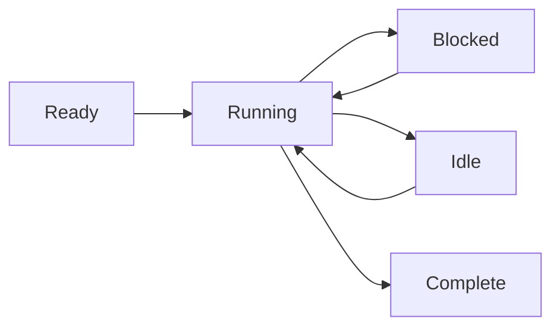

# プロセスモデル

Wippyは分離されたプロセスでコードを実行します。これはメッセージパッシングを通じて通信する軽量なステートマシンです。このアクターモデルアプローチにより、共有状態に起因するバグが排除され、並行プログラミングが予測可能になります。

## ステートマシン実行

すべてのプロセスは同じパターンに従います：初期化し、ブロッキング操作でyieldしながら実行をステップ実行し、完了時にクローズします。スケジューラはワーカープール上で数千のプロセスを多重化し、あるプロセスがI/Oを待機している間に他のプロセスを実行します。

プロセスは複数の同時yieldをサポートします。複数の非同期操作を開始し、いずれかまたはすべての完了を待つことができます。これにより、追加のプロセスを生成せずに効率的な並列I/Oが可能になります。



プロセスはLuaに限定されません。ランタイムは任意のステートマシン実装をサポートします。Goベースのプロセスやwebassemblyモジュールも計画されています。

<warning>
プロセスは軽量ですが無料ではありません。各プロセスは約13KBのベースラインオーバーヘッドで開始します。動的アロケーションとヒープ成長は実行中にこれに追加されます。
</warning>

## プロセスホスト

Wippyは単一のランタイム内で複数のプロセスホストを実行し、それぞれが異なる機能とセキュリティ境界を持ちます。特権的な関数を実行するシステムプロセスは、ユーザーセッションを実行するホストから分離された1つのホストに存在できます。ホストはプロセスが許可される操作を制限できます。Erlangでは、このレベルの分離には別のノードが必要になります。

一部のホストは特殊化されています。たとえば、Terminalホストは単一のプロセスを実行しますが、他のホストが拒否するIO操作へのアクセスを許可します。これにより、1つのデプロイメントで信頼レベルを混在させることができます。フルアクセスを持つシステムサービスと、サンドボックス化されたユーザーコードを並行して実行できます。

## セキュリティモデル

すべてのプロセスはアクターIDとセキュリティポリシーの下で実行されます。通常、これは呼び出しを開始したユーザーですが、システムプロセスは異なる権限を持つシステムアクターの下で実行されます。

アクセス制御は複数のレベルで機能します。個々のプロセスには独自のアクセスレベルがあります。ホスト間のメッセージ送信はセキュリティポリシーに基づいて禁止できます。サンドボックス化されたユーザープロセスは、システムホストへのメッセージ送信が一切許可されない場合があります。現在のアクターに付与されたポリシーが、どの操作が許可されるかを決定します。

## プロセスの生成

`process.spawn()`でバックグラウンドプロセスを作成します：

```lua
local pid = process.spawn("app.workers:handler", "app:processes", arg1, arg2)
```

最初の引数はレジストリエントリ、2番目はプロセスホスト、残りの引数はプロセスに渡されます。

spawn系のバリアントはライフサイクルの関係を制御します：

| 関数 | 動作 |
|------|------|
| `spawn` | Fire and forget（発火して忘れる） |
| `spawn_monitored` | 子プロセスの終了時にEXITイベントを受信 |
| `spawn_linked` | 双方向—どちらかのクラッシュがもう一方に通知 |

## メッセージパッシング

プロセスはメッセージを通じて通信し、共有メモリは使用しません：

```lua
process.send(target_pid, "topic", payload)
```

同じ送信者からのメッセージは順序どおりに到着します。異なる送信者からのメッセージはインターリーブする可能性があります。配信はfire-and-forgetです。確認が必要な場合はリクエスト-レスポンスパターンを使用してください。

<note>
プロセスはローカル名前レジストリに登録でき、PIDの代わりに名前でアドレス指定できます（例：`session_manager`）。ノード間アドレス指定のためのグローバルレジストリは計画されています。
</note>

## スーパービジョン

任意のプロセスがモニタリングによって他のプロセスを監督できます。プロセスはモニタリング付きで子を生成し、EXITイベントを監視し、失敗時に再起動します。これはErlangの「クラッシュさせろ」哲学に従います：プロセスは予期しない状態でクラッシュし、監視プロセスがリカバリを処理します。

```lua
local worker = process.spawn_monitored("app.workers:handler", "app:processes")
local event = process.events():receive()

if event.kind == process.event.EXIT and event.result.error then
    worker = process.spawn_monitored("app.workers:handler", "app:processes")
end
```

ルートレベルでは、ランタイムは長時間実行プロセスを開始および監督するサービスを提供します。Linuxのsystemdに似ています。`process.service`エントリを定義して、ランタイムにプロセスを管理させます：

```yaml
- name: worker.service
  kind: process.service
  process: app.workers:handler
  host: app:processes
  lifecycle:
    auto_start: true
    restart:
      max_attempts: 5
      delay: 1s
```

サービスは自動的に開始し、バックオフ付きでクラッシュ時に再起動し、ランタイムのライフサイクル管理と統合されます。

## プロセスのアップグレード

実行中のプロセスはアイデンティティを失うことなくコードをアップグレードできます。`process.upgrade()`を呼び出して、PID、メールボックス、スーパービジョン関係を保持したまま新しい定義に切り替えます：

```lua
process.upgrade("app.workers:v2", current_state)
```

最初の引数は新しいレジストリエントリ（または現在の定義をリロードする場合はnil）です。追加の引数は新しいバージョンに渡され、アップグレード全体で状態を引き継ぐことができます。プロセスは新しいコードで即座に実行を再開します。

これにより、開発中のホットコードリロードと本番環境でのゼロダウンタイム更新が可能になります。ランタイムはコンパイル済みのprotoをキャッシュするため、アップグレードでコンパイルコストを繰り返し支払う必要はありません。何らかの理由でアップグレードが失敗した場合、プロセスはクラッシュし、通常のスーパービジョンセマンティクスが適用されます。監視している親は以前のバージョンで再起動するか、失敗をエスカレートできます。

## スケジューリング

アクタースケジューラはCPUコア間でワークスティーリングを使用します。各ワーカーはキャッシュの局所性のためにローカルキューを持ち、分散のためのグローバルキューがあります。プロセスはブロッキング操作でyieldし、少数のスレッドで数千のプロセスを同時に実行できます。
