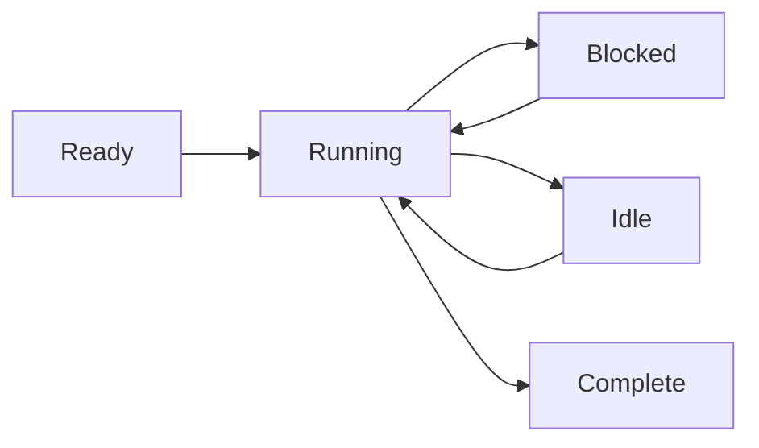

# プロセスモデル

Wippy は、shared memory ではなく message で通信する軽量な state machine である、分離された process でコードを実行します。この actor model により、各 process が独自の state と lifecycle を持ちます。

このページでは lifecycle と isolation model を説明します。spawn、messaging、monitoring、registry、upgrade API については[プロセス管理 reference](../lua/core/process.md)、runtime-managed service field については[プロセスホストとサービス](../system/process-host.md)を参照してください。

## ステートマシン実行

各 process は初期化され、execution を進め、blocking operation で yield し、完了時に close します。scheduler は worker pool 上で process を多重化し、process が I/O を待っている間に他の処理を実行します。

process は複数の concurrent yield をサポートするため、追加 process を生成せずに複数の asynchronous operation を開始し、その一部または全部を待てます。


```mermaid
flowchart LR
    Ready --> Running
    Running --> Blocked
    Running --> Idle
    Blocked --> Running
    Idle --> Running
    Running --> Complete
```

process は Lua に限定されません。runtime は `process.wasm` kind を介して WebAssembly module もサポートし、process architecture は他の state-machine implementation もサポートできます。

<warning>
process は軽量ですが cost がないわけではありません。各 process には state、inbox、scheduler bookkeeping のための小さな baseline cost があり、dynamic allocation によって実行中の footprint が増えます。
</warning>

## プロセスホスト

Wippy は 1 つの runtime 内で、それぞれ独自の capability と security boundary を持つ複数の process host を実行できます。privileged system process は、user session を実行する host とは別の host で実行できます。

一部の host は特殊化されています。たとえば Terminal host は 1 つの scheduler worker を使い、受け入れた process に terminal I/O context を提供しますが、process lifetime を 1 つに制限するものではありません。host を分けることで、1 つの deployment 内で trust level の異なる process を実行できます。

## セキュリティモデル

すべてのプロセスはアクターIDとセキュリティポリシーの下で実行されます。通常、これは呼び出しを開始したユーザーですが、システムプロセスは異なる権限を持つシステムアクターの下で実行されます。

access control は複数 level で適用されます。security policy は個々の process operation と host 間の message delivery を制限できます。現在の actor に適用された policy が、許可される operation を決定します。

process isolation の security 上の意味については、[セキュリティモデル](./security-model.md)を参照してください。

## プロセスの生成

`process.spawn()`でバックグラウンドプロセスを作成します：

```lua
local pid, err = process.spawn("app.workers:handler", "app:processes", arg1, arg2)
if err then return nil, err end
return pid
```

最初の引数はレジストリエントリ、2番目はプロセスホスト、残りの引数はプロセスに渡されます。

spawn系のバリアントはライフサイクルの関係を制御します：

| 関数 | 動作 |
|------|------|
| `spawn` | 独立した process を開始 |
| `spawn_monitored` | child の終了時に EXIT event を受信 |
| `spawn_linked` | abnormal exit が双方向に伝播。`trap_links: true` の場合、peer は fail せず `LINK_DOWN` を受信 |

## メッセージパッシング

プロセスはメッセージを通じて通信し、共有メモリは使用しません：

```lua
local ok, err = process.send(target_pid, "topic", payload)
if err then return nil, err end
return ok
```

同じ送信者からのメッセージは順序どおりに到着します。異なる送信者からのメッセージはインターリーブする可能性があります。配信はfire-and-forgetです。確認が必要な場合はリクエスト-レスポンスパターンを使用してください。

<note>
process は local name registry に登録し、PID の代わりに name で address 指定できます（例: `session_manager`）。`process.registry` の EVENTUAL（gossip-based）、CONSISTENT、STRONG（いずれも Raft-backed）scope を使い、cross-node address 指定用の cluster-wide name も登録できます。
</note>

## スーパービジョン

任意の process が monitoring によって他の process を supervise できます。supervisor は monitored child を開始し、EXIT event を監視し、障害後に再起動するかを決定します。

```lua
local worker, spawn_err = process.spawn_monitored("app.workers:handler", "app:processes")
if spawn_err then return nil, spawn_err end

local event, open = process.events():receive()
if not open then return nil, errors.new("process event channel closed") end

if event.kind == process.event.EXIT and event.result.error then
    local replacement, restart_err = process.spawn_monitored("app.workers:handler", "app:processes")
    if restart_err then return nil, restart_err end
    worker = replacement
end
```

runtime level では、service が長時間実行される process を開始して supervise できます。`process.service` entry を定義し、runtime に process を管理させます。

```yaml
- name: worker.service
  kind: process.service
  process: app.workers:handler
  host: app:processes
  lifecycle:
    auto_start: true
    restart:
      max_attempts: 5
      initial_delay: 1s
```

service は自動起動し、runtime の lifecycle management と統合されます。pinned runtime では最初の失敗した start が `max_attempts` に含まれるため、`5` で許可される follow-up start は最大 4 回です。各 retry は jitter を加えた `initial_delay` の間待ちます。試行間で delay は増加しません。

## プロセスのアップグレード

実行中のプロセスはアイデンティティを失うことなくコードをアップグレードできます。`process.upgrade()`を呼び出して、PID、メールボックス、スーパービジョン関係を保持したまま新しい定義に切り替えます：

```lua
process.upgrade("app.workers:v2", current_state)
```

最初の引数は新しいレジストリエントリ（または現在の定義をリロードする場合はnil）です。追加の引数は新しいバージョンに渡され、アップグレード全体で状態を引き継ぐことができます。プロセスは新しいコードで即座に実行を再開します。

runtime は compiled prototype を cache し、繰返しの compile を避けます。upgrade が失敗すると process は crash し、通常の supervision behavior が適用されます。monitoring parent は process を再起動するか、failure を escalate できます。

## スケジューリング

アクタースケジューラはCPUコア間でワークスティーリングを使用します。各ワーカーはキャッシュの局所性のためにローカルキューを持ち、分散のためのグローバルキューがあります。プロセスはブロッキング操作でyieldし、少数のスレッドで数千のプロセスを同時に実行できます。
