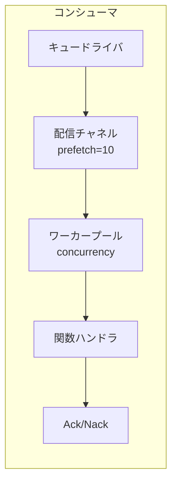

# キューコンシューマ

キューコンシューマはワーカープールを使用してキューからメッセージを処理します。

## 概要



## 設定

| オプション | デフォルト | 最大値 | 説明 |
|-----------|-----------|--------|------|
| `queue` | 必須 | - | キューレジストリID |
| `func` | 必須 | - | ハンドラ関数レジストリID |
| `concurrency` | 1 | 1000 | ワーカー数 |
| `prefetch` | 10 | 10000 | メッセージバッファサイズ |

## エントリ定義

```yaml
- name: order_consumer
  kind: queue.consumer
  queue: app:orders
  func: app:process_order
  concurrency: 5
  prefetch: 20
  lifecycle:
    auto_start: true
    depends_on:
      - app:orders
```

## ハンドラ関数

ハンドラ関数はメッセージボディを受け取ります：

```lua
-- process_order.lua
local json = require("json")

local function handler(body)
    local order = json.decode(body)

    -- 注文を処理
    local result, err = process_order(order)
    if err then
        -- エラーを返すとNack（再キュー）がトリガーされる
        return nil, err
    end

    -- 成功するとAckがトリガーされる
    return result
end

return handler
```

```yaml
- name: process_order
  kind: function.lua
  source: file://process_order.lua
  modules:
    - json
```

## 確認応答

| 結果 | アクション | 効果 |
|------|----------|------|
| 成功 | Ack | メッセージがキューから削除される |
| エラー | Nack | メッセージが再キューされる（ドライバ依存） |

## ワーカープール

- ワーカーは同時goroutineとして実行
- 各ワーカーは一度に1つのメッセージを処理
- メッセージはデリバリーチャネルからラウンドロビンで分散
- プリフェッチバッファによりドライバが先行配信可能

### 例

```
concurrency: 3
prefetch: 10

フロー:
1. ドライバが最大10メッセージをバッファに配信
2. 3ワーカーがバッファから同時にプル
3. ワーカーが終了するとバッファが補充される
4. すべてのワーカーがビジーでバッファがフルのときバックプレッシャー
```

## グレースフルシャットダウン

停止時：
1. 新しいデリバリーの受け入れを停止
2. ワーカーコンテキストをキャンセル
3. 処理中のメッセージを待機（タイムアウト付き）
4. ワーカーが終了しない場合はタイムアウトエラーを返す

## キュー宣言

```yaml
# キュードライバ（開発/テスト用メモリ）
- name: queue_driver
  kind: queue.driver.memory
  lifecycle:
    auto_start: true

# キュー定義
- name: orders
  kind: queue.queue
  driver: app:queue_driver
  options:
    queue_name: orders      # 名前をオーバーライド（デフォルト: エントリ名）
    max_length: 10000       # 最大キューサイズ
    durable: true           # 再起動を乗り越える
```

| オプション | 説明 |
|-----------|------|
| `queue_name` | キュー名をオーバーライド（デフォルト: エントリID名） |
| `max_length` | 最大キューサイズ |
| `durable` | 再起動を乗り越える（ドライバ依存） |

## メモリドライバ

開発/テスト用の組み込みインメモリキュー：

- 種別: `queue.driver.memory`
- メッセージはメモリに保存
- Nackはメッセージをキューの先頭に再キュー
- 再起動をまたいで永続化なし

## 関連項目

- [メッセージキュー](lua/storage/queue.md) - キューモジュールリファレンス
- [キュー設定](system/queue.md) - キュードライバとエントリ定義
- [スーパービジョンツリー](guides/supervision.md) - コンシューマライフサイクル
- [プロセス管理](lua/core/process.md) - プロセス生成と通信
