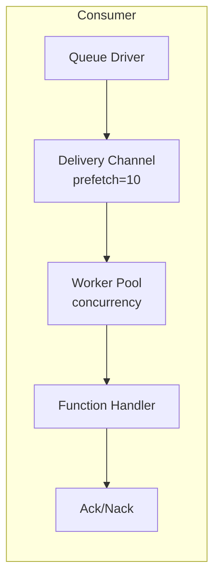

# キューコンシューマ

キューコンシューマは、設定可能なワーカープールを介して、キューから関数ハンドラへメッセージを配信します。

## 概要


```mermaid
flowchart LR
    subgraph Consumer
        QD[Queue Driver] --> DC[Delivery Channel<br/>prefetch=10]
        DC --> WP[Worker Pool<br/>concurrency]
        WP --> FH[Function Handler]
        FH --> AN[Ack/Nack]
    end
```

## 設定

| オプション | デフォルト | 最大値 | 説明 |
|-----------|-----------|--------|------|
| `queue` | 必須 | - | キューレジストリID |
| `func` | 必須 | - | ハンドラ関数レジストリID |
| `concurrency` | 1 | 1000 | ワーカー数 |
| `prefetch` | 10 | 10000 | 共有配信バッファのサイズ。AMQPでは、チャネルのQoSプリフェッチ数としても適用される |
| `auto_ack` | false | - | バックエンド固有の自動Ackオプション。AMQPでは、`true` にすると配信時にブローカーへ確認応答を要求する |
| `driver_options` | `{}` | - | ドライバ固有のコンシューマオプション |

## エントリ定義

```yaml
- name: order_consumer
  kind: queue.consumer
  queue: app:orders
  func: app:process_order
  concurrency: 5
  prefetch: 20
  lifecycle:
    auto_start: true
    requires:
      - app:orders
```

## ハンドラ関数

ハンドラ関数は、キューのコーデックによるデコード後のボディを受け取ります。現在の配信とそのメタデータへアクセスするには `queue.message()` を使用します。

```lua
-- process_order.lua
local queue = require("queue")
local logger = require("logger")

local function main(order)
    local msg, msg_err = queue.message()
    if msg_err then
        return nil, msg_err
    end

    logger:info("processing order", {
        message_id = msg:id(),
        order_id = order.id
    })

    return {processed = true, order_id = order.id}
end

return {main = main}
```

```yaml
- name: process_order
  kind: function.lua
  source: file://process_order.lua
  method: main
  modules:
    - queue
    - logger
```

## 確認応答

ハンドラが配信を明示的に確定しない限り、コンシューマは関数呼び出しの結果を使用します。

| ハンドラの結果 | アクション | 効果 |
|----------------|------------|------|
| 呼び出しエラーなしで完了 | Ack | メッセージをキューから削除 |
| 呼び出しエラーを返す、または送出する | Nack | 再配信はドライバ依存 |

`false` を含む通常の戻り値は、確認応答の動作を選択しません。明示的に確定するには `msg:ack()` または `msg:nack()` を呼び出します。確定は1回限りで、最初の確定が優先されます。AMQPで `auto_ack: true` の場合、ブローカーが配信時に確認応答するため、その後ハンドラが失敗してもブローカーによる再配信は発生しません。

## ワーカープール

- ワーカーは並行goroutineとして実行されます。
- 各ワーカーは一度に1つのメッセージを処理します。
- ワーカーは共有配信チャネルから取得します。次の空きワーカーが次のメッセージを受け取り、ワーカー間での順序やローテーションは保証されません。
- プリフェッチバッファにより、ドライバは処理に先行してメッセージを配信できます。

### 例

```
concurrency: 3
prefetch: 10

Flow:
1. Driver delivers up to 10 messages to buffer
2. 3 workers pull from buffer concurrently
3. As workers finish, buffer refills
4. Backpressure when all workers busy and buffer full
```

## グレースフルシャットダウン

シャットダウン時、コンシューマは次の処理を行います。

1. 新しい配信の受け入れを停止
2. ワーカーコンテキストをキャンセル
3. 停止タイムアウトまで、処理中のハンドラを待機
4. ワーカーが終了しない場合はタイムアウトエラーを返す

## キュー宣言

```yaml
# Queue driver (memory for dev/test)
- name: queue_driver
  kind: queue.driver.memory
  lifecycle:
    auto_start: true

# Queue definition
- name: orders
  kind: queue.queue
  driver: app:queue_driver
  queue_name: orders        # Override name (default: entry name)
  codec: json/plain         # Payload codec (optional; json/plain is the default)
  dead_letter:              # Accepted configuration; not enforced by built-in drivers
    queue: app:dlq
    max_attempts: 5
  driver_options:
    memory:
      max_length: 10000     # Memory driver: bounded queue size
```

| フィールド | 説明 |
|-----------|------|
| `queue_name` | キュー名をオーバーライド（デフォルト: エントリID名） |
| `codec` | ペイロードコーデック名 |
| `dead_letter.queue` | デッドレターキュー用として受け付けられるレジストリID。組み込みドライバでは強制されない |
| `dead_letter.max_attempts` | 設定として受け付けられる試行回数。組み込みドライバでは強制されない |
| `driver_options` | ドライバ名でキー付けされたドライバ固有の設定 |

<note>
現在、`dead_letter` ブロックの試行回数を数えたり、メッセージをルーティングしたりする組み込みドライバはありません。ランタイムはこのブロックをAMQPキュー引数へ変換せず、通常のAMQPコンシューマ失敗は再キューを要求します。したがって、ブローカー側のデッドレター処理はこのブロックの外部で設定し、発動させる必要があります。メモリドライバはDLQへルーティングしません。
</note>

## メモリドライバ

組み込みのインメモリドライバは、開発およびテスト用です。

- kindは `queue.driver.memory` です。
- メッセージはメモリに保存されます。
- Nackは、複製したメッセージをキュー末尾へ再エンキューしようとします。有界キューが満杯の場合、この試行は失敗することがあります。
- メッセージは再起動をまたいで永続化されません。

## 関連項目

- [メッセージキュー](../lua/storage/queue.md) — キューモジュールのリファレンス
- [キュー設定](../system/queue.md) — キュードライバとエントリ定義
- [スーパービジョン](./supervision.md) — コンシューマのライフサイクル
- [プロセス管理](../lua/core/process.md) — プロセスの生成と通信
