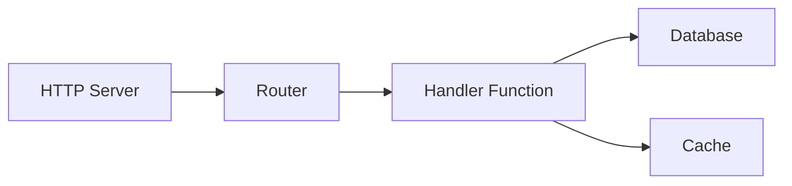
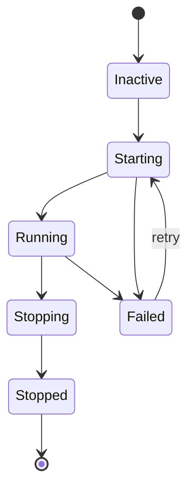

# スーパービジョン

スーパーバイザはサービスライフサイクルを管理し、起動順序、自動再起動、グレースフルシャットダウンを処理します。`auto_start: true`を持つサービスはアプリケーション起動時に開始されます。

## ライフサイクル設定

サービスは`lifecycle`ブロックを使用してスーパーバイザに登録します。プロセスの場合は、`process.service`を使用してプロセス定義をラップします：

```yaml
# プロセス定義（コード）
- name: worker_process
  kind: process.lua
  source: file://worker.lua
  method: main

# 監督されたサービス（ライフサイクル管理でプロセスをラップ）
- name: worker
  kind: process.service
  process: app:worker_process
  host: app:processes
  lifecycle:
    auto_start: true
    start_timeout: 30s
    stop_timeout: 10s
    stable_threshold: 5s
    depends_on:
      - app:database
    restart:
      initial_delay: 2s
      max_delay: 60s
      max_attempts: 10
```

| フィールド | デフォルト | 説明 |
|-----------|-----------|------|
| `auto_start` | `false` | スーパーバイザ起動時に自動起動 |
| `start_timeout` | `10s` | 起動の最大許容時間 |
| `stop_timeout` | `10s` | グレースフルシャットダウンの最大時間 |
| `stable_threshold` | `5s` | サービスが安定とみなされるまでの実行時間 |
| `depends_on` | `[]` | 先に実行されている必要があるサービス |

## 依存関係解決

スーパーバイザは2つのソースから依存関係を解決します：

1. `depends_on`で宣言された**明示的な依存関係**
2. エントリ参照から抽出された**レジストリ抽出依存関係**（設定内の`database: app:db`など）



依存関係は被依存者より先に起動します。サービスCがAとBに依存する場合、AとBの両方が`Running`状態に達してからCが起動します。

<tip>
データベースなどのインフラストラクチャエントリを<code>depends_on</code>で宣言する必要はありません。スーパーバイザはエントリ設定内のレジストリ参照から依存関係を自動的に抽出します。
</tip>

## 再起動ポリシー

サービスが失敗すると、スーパーバイザは指数バックオフでリトライします：

```yaml
lifecycle:
  restart:
    initial_delay: 1s      # 最初のリトライ待機
    max_delay: 90s         # 最大遅延上限
    backoff_factor: 2.0    # 試行ごとの遅延乗数
    jitter: 0.1            # ±10%のランダム化
    max_attempts: 0        # 0 = 無限リトライ
```

| 試行 | 基本遅延 | ジッター付き（±10%） |
|------|----------|---------------------|
| 1 | 1s | 0.9s - 1.1s |
| 2 | 2s | 1.8s - 2.2s |
| 3 | 4s | 3.6s - 4.4s |
| 4 | 8s | 7.2s - 8.8s |
| ... | ... | ... |
| N | 90s | 81s - 99s（上限） |

サービスが`stable_threshold`より長く実行されると、リトライカウンターがリセットされます。これにより、一時的な障害が遅延を永続的にエスカレートすることを防ぎます。

### ターミナルエラー

以下のエラーはリトライ試行を停止します：

- コンテキストキャンセル
- 明示的な終了リクエスト
- リトライ不可としてマークされたエラー

## セキュリティコンテキスト

サービスは特定のセキュリティIDで実行できます：

```yaml
# プロセス定義
- name: admin_worker_process
  kind: process.lua
  source: file://admin_worker.lua
  method: main

# セキュリティコンテキスト付き監督されたサービス
- name: admin_worker
  kind: process.service
  process: app:admin_worker_process
  host: app:processes
  lifecycle:
    auto_start: true
    security:
      actor:
        id: "service:admin-worker"
        meta:
          role: admin
      groups:
        - app:admin_policies
      policies:
        - app:data_access
```

セキュリティコンテキストは以下を設定します：

| フィールド | 説明 |
|-----------|------|
| `actor.id` | このサービスのID文字列 |
| `actor.meta` | キーバリューメタデータ（ロール、権限など） |
| `groups` | 適用するポリシーグループ |
| `policies` | 適用する個別ポリシー |

サービス内で実行されるコードはこのセキュリティコンテキストを継承します。`security`モジュールで権限をチェックできます：

```lua
local security = require("security")

if security.can("delete", "users") then
    -- 許可
end
```

<note>
セキュリティコンテキストが設定されていない場合、サービスはアクターなしで実行されます。strictモード（デフォルト）では、セキュリティチェックが失敗します。認可が必要なサービスにはセキュリティコンテキストを設定してください。
</note>

## サービス状態



スーパーバイザはサービスをこれらの状態間で遷移させます：

| 状態 | 説明 |
|------|------|
| `Inactive` | 登録済みだが未起動 |
| `Starting` | 起動中 |
| `Running` | 正常に動作中 |
| `Stopping` | グレースフルシャットダウン中 |
| `Stopped` | 正常終了 |
| `Failed` | エラー発生、リトライの可能性あり |

## 起動とシャットダウンの順序

**起動**: 依存関係が先、次に被依存者。同じ依存レベルのサービスは並列で起動可能。

**シャットダウン**: 被依存者が先、次に依存関係。これにより、依存関係が停止する前に被依存サービスが終了することを保証します。

```
起動:    database → cache → handler → http_server
シャットダウン: http_server → handler → cache → database
```

## 関連項目

- [プロセスモデル](concepts/process-model.md) - プロセスライフサイクル
- [設定](guides/configuration.md) - YAML設定形式
- [セキュリティモジュール](lua/security/security.md) - Luaでの権限チェック
