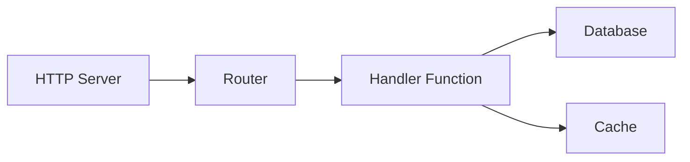
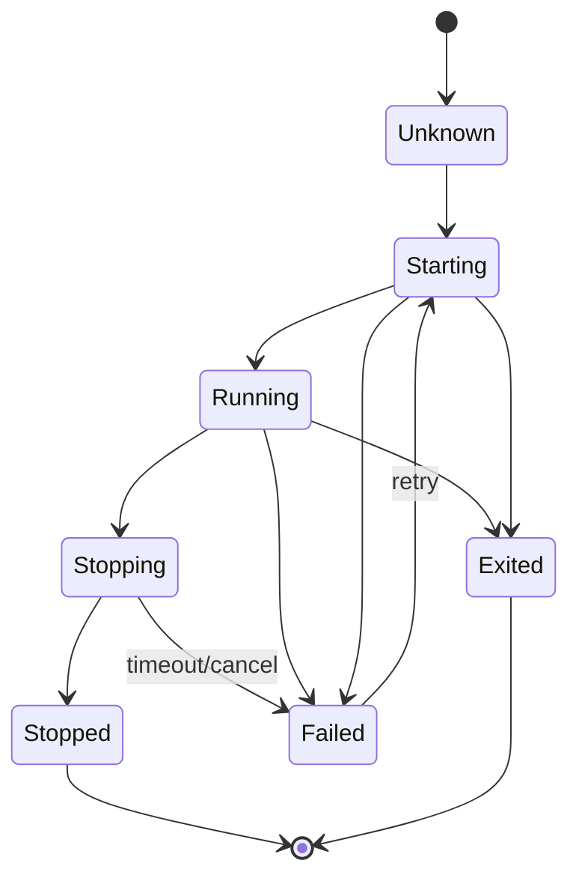

# スーパービジョン

スーパーバイザは、サービスの起動、依存関係の順序、再起動、グレースフルシャットダウンを管理します。`auto_start: true` のサービスは、アプリケーションのブート時に起動します。

## ライフサイクル設定

サービスは `lifecycle` ブロックを使用してスーパーバイザに登録します。プロセスの場合は、`process.service` を使用してプロセス定義をラップします。

```yaml
# Process definition (the code)
- name: worker_process
  kind: process.lua
  source: file://worker.lua
  method: main

# Supervised service (wraps the process with lifecycle management)
- name: worker
  kind: process.service
  process: app:worker_process
  host: app:processes
  lifecycle:
    auto_start: true
    startup: required
    start_timeout: 30s
    stop_timeout: 10s
    stable_threshold: 5s
    requires:
      - app:database
    restart:
      initial_delay: 2s
      max_delay: 60s
      max_attempts: 10
```

`host` は、設定済みのプロセスホストを参照する必要があります。`requires` のエントリは、別の監督対象サービス、またはレジストリ依存関係の抽出を通じて参照先リソースを所有する監督対象サービスのいずれかに解決される必要があります。

| フィールド | デフォルト | 説明 |
|-----------|-----------|------|
| `auto_start` | `false` | スーパーバイザ起動時に自動起動 |
| `startup` | `required` | 自動起動ルートの起動ポリシー。`required` は失敗時にブートをブロックし、`optional` は独立したブランチをブロックせずに失敗と再試行を許可する |
| `start_timeout` | `10s` | 起動の最大許容時間 |
| `stop_timeout` | `10s` | グレースフルシャットダウンの最大時間 |
| `stable_threshold` | `5s` | サービスが安定とみなされるまでの実行時間 |
| `requires` | `[]` | 先に実行されている必要があるサービス（レガシーの別名: `depends_on`）|
| `startup` | `required` | `required` は自動起動の失敗やブロックをトランザクションエラーとして報告する。`optional` はバッチを失敗させずに、サービスがバックグラウンドで再試行を続けることを許す |

## 依存関係解決

スーパーバイザは2つのソースから依存関係を解決します：

1. `requires`（またはレガシーの `depends_on`）で宣言された**明示的な依存関係**
2. エントリ参照から抽出された**レジストリ抽出依存関係**（設定内の`database: app:db`など）


```mermaid
graph LR
    A[HTTP Server] --> B[Router]
    B --> C[Handler Function]
    C --> D[Database]
    C --> E[Cache]
```

依存関係は、その依存先のサービスより先に起動します。サービスCがAとBに依存する場合、両方の依存関係が `Running` 状態に達してからCが起動します。

<tip>
データベースなどのインフラストラクチャエントリを<code>requires</code>で宣言する必要はありません。スーパーバイザはエントリ設定内のレジストリ参照から依存関係を自動的に抽出します。
</tip>

## 再起動ポリシー

サービスが失敗すると、スーパーバイザは `restart` ブロックに従って再試行します。

```yaml
lifecycle:
  restart:
    initial_delay: 1s      # First retry wait
    max_delay: 90s         # Accepted backoff cap; see current behavior below
    backoff_factor: 2.0    # Accepted multiplier; see current behavior below
    jitter: 0.1            # ±10% randomization
    max_attempts: 0        # 0 = infinite retries
```

ランタイムv0.3.32aでは、スーパーバイザは再試行ごとに新しいバックオフ計算器を作成し、その最初の間隔だけを使用します。そのため各再試行は、設定したジッターを適用した `initial_delay`（上記の値では0.9秒〜1.1秒）だけ待機します。`backoff_factor` と `max_delay` は設定フィールドとして受け付けられますが、固定されたランタイムではこのスケジュールを変更しません。

`max_attempts` は、最初に失敗した起動を含めて数えます。値 `1` では再試行せず、`10` では追加の起動を最大9回許可します。値 `0` では試行回数に上限がありません。

サービスが `stable_threshold` より長く実行されると再試行カウンターがリセットされるため、それ以降の失敗は最初の再試行遅延から始まります。

### ターミナルエラー

以下のエラーはリトライ試行を停止します：

- コンテキストキャンセル
- 明示的な終了リクエスト
- リトライ不可としてマークされたエラー

## セキュリティコンテキスト

サービスは特定のセキュリティIDで実行できます：

```yaml
# Process definition
- name: admin_worker_process
  kind: process.lua
  source: file://admin_worker.lua
  method: main

# Supervised service with security context
- name: admin_worker
  kind: process.service
  process: app:admin_worker_process
  host: app:processes
  lifecycle:
    auto_start: true
    security:
      actor:
        id: "service:admin-worker"
        meta:
          role: admin
      groups:
        - app:admin_policies
      policies:
        - app:data_access
```

セキュリティコンテキストは以下を設定します：

| フィールド | 説明 |
|-----------|------|
| `actor.id` | このサービスのID文字列 |
| `actor.meta` | キーバリューメタデータ（ロール、権限など） |
| `groups` | 適用するポリシーグループ |
| `policies` | 適用する個別ポリシー |

サービス内で実行されるコードはこのセキュリティコンテキストを継承します。`security`モジュールで権限をチェックできます：

```lua
local security = require("security")

if security.can("delete", "users") then
    -- allowed
end
```

<note>
securityブロックが設定されていない場合、スーパーバイザはサービス固有のアクターやポリシースコープを追加しません。親コンテキストにすでに存在するセキュリティ値は引き続き継承されます。strictモード（デフォルト）では、結果のセキュリティコンテキストが不完全なチェックは拒否されます。認可が必要なサービスには、完全なサービスセキュリティコンテキストを設定してください。
</note>

## 再登録と置き換え

レジストリの変更により、すでにコントローラが動作しているIDが再登録されることがあります。登録が同じサービスインスタンスを伴う場合、何も変更されません。**異なる**インスタンスを伴う場合、つまりマネージャが設定変更に伴ってサービスを再構築した場合、スーパーバイザは既存のコントローラを退役させ、置き換えを採用します。

退役の対象は当該サービスだけではありません。動作中の依存元は置き換えられる前のインスタンスを保持しているため、下から置き換えられるサービスに対して動作を継続できません。退役の範囲は、置き換えられるサービスと、それに依存して動作中のすべてのサービスであり、依存順（依存元が先）で停止されます。すでに停止しているサービスが二度停止されることはありません。再登録の前に自身のインスタンスを停止するマネージャが、冗長な`Stop`を受け取ることはありません。

引き継ぎはトランザクショナルです：

1. 計画は何にも触れずに算出されるため、計画の失敗によって動作中のサービス群が影響を受けることはありません。
2. 停止バッチが実行されます。**いずれかの停止が失敗した場合、引き継ぎは拒否されます**。バッチがすでに停止したサービスは復帰され、エラーが報告されます。復帰できなかったサービスはそのエラー内で名指しされます。スーパーバイザはコミット前と同じ動作中のサービス群を保持することになり、中途半端に退役した状態になることはありません。
3. バッチが成功した後に限り、退役したコントローラが破棄・キャンセルされ、置き換えられる前のサービスインスタンスが解放されます。
4. 置き換えは他の起動と同じ依存関係を考慮するシーケンサを通じて作成・起動され、引き継ぎのために停止された依存元は採用されたインスタンスに対して復帰します。

置き換えの前に動作していたサービスは、新しい登録が`auto_start: false`を設定していても、その後に再起動されます。動作中のサービスの置き換えは更新であって、暗黙の停止ではありません。停止された依存元の再起動は各自の再起動ポリシーに従い、コミットを妨げることはありません。

## サービス状態


```mermaid
stateDiagram-v2
    [*] --> Unknown
    Unknown --> Starting
    Starting --> Running
    Running --> Stopping
    Stopping --> Stopped
    Stopping --> Failed : timeout/cancel
    Stopped --> [*]

    Running --> Failed
    Starting --> Failed
    Failed --> Starting : retry
    Running --> Exited
    Starting --> Exited
    Exited --> [*]
```

スーパーバイザはサービスをこれらの状態間で遷移させます：

| 状態 | 説明 |
|------|------|
| `Unknown` | 登録済みだが未起動 |
| `Starting` | 起動中 |
| `Running` | 正常に動作中 |
| `Stopping` | グレースフルシャットダウン中 |
| `Stopped` | 正常終了 |
| `Exited` | 明示的な要求、またはリトライ不可能／終端的なエラーによる終了 |
| `Failed` | エラー発生、リトライの可能性あり |

## 起動とシャットダウンの順序

**起動**: 依存関係が先、次に被依存者。同じ依存レベルのサービスは並列で起動可能。

**シャットダウン**: 被依存者が先、次に依存関係。これにより、依存関係が停止する前に被依存サービスが終了することを保証します。

```
Startup:  database → cache → handler → http_server
Shutdown: http_server → handler → cache → database
```

SIGINTまたはSIGTERMを受け取るとランタイムはグレースフルシャットダウンを開始し、シーケンス全体がランタイム設定の`shutdown.timeout`（デフォルト30秒）という単一の予算の下で実行されます。この予算は中断されたコンテキストを引き継がない新しいデッドラインであるため、Ctrl-Cによってコンポーネントのシャットダウンが打ち切られることはありません。その中で各停止の上限はサービスごとの`stop_timeout`が引き続き定めます。2回目のシグナルはシーケンスをスキップして即座に終了します。

```yaml
# .wippy.yaml
shutdown:
  timeout: 60s
```

## 関連項目

- [プロセスモデル](concepts/process-model.md) — プロセスのライフサイクル
- [設定](guides/configuration.md) — YAML設定形式
- [セキュリティモジュール](lua/security/security.md) — Luaでの権限チェック
