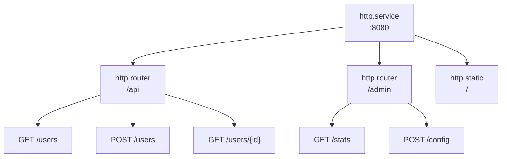

# ルーティング

ルーターはURLプレフィックスの下にエンドポイントをグループ化し、共有ミドルウェアを適用します。エンドポイントはHTTPハンドラを定義します。

## アーキテクチャ



エントリはメタデータを通じて親を参照します：
- ルーター: `meta.server: app:gateway`
- エンドポイント: `meta.router: app:api`

## ルーター設定

```yaml
- name: api
  kind: http.router
  meta:
    server: gateway
  prefix: /api/v1
  middleware:
    - cors
    - compress
  options:
    cors.allow.origins: "*"
  post_middleware:
    - endpoint_firewall
```

| フィールド | 型 | 説明 |
|------------|-----|------|
| `meta.server` | Registry ID | 親HTTPサーバー |
| `prefix` | string | すべてのルートのURLプレフィックス |
| `middleware` | []string | マッチ前ミドルウェア |
| `options` | map | ミドルウェアオプション |
| `post_middleware` | []string | マッチ後ミドルウェア |
| `post_options` | map | マッチ後ミドルウェアオプション |

## エンドポイント設定

```yaml
- name: get_user
  kind: http.endpoint
  meta:
    router: api
  method: GET
  path: /users/{id}
  func: app.users:get_user
```

| フィールド | 型 | 説明 |
|------------|-----|------|
| `meta.router` | Registry ID | 親ルーター |
| `method` | string | HTTPメソッド（GET、POST、PUT、DELETE、PATCH、HEAD） |
| `path` | string | URLパスパターン（`/`で開始） |
| `func` | Registry ID | ハンドラ関数 |

## パスパラメータ

URLパラメータには`{param}`構文を使用：

```yaml
- name: get_post
  kind: http.endpoint
  meta:
    router: api
  method: GET
  path: /users/{user_id}/posts/{post_id}
  func: get_user_post
```

ハンドラでのアクセス：

```lua
local http = require("http")

local function handler()
    local req = http.request()
    local user_id = req:param("user_id")
    local post_id = req:param("post_id")

    -- ...
end
```

### ワイルドカードパス

`{param...}`で残りのパスセグメントをキャプチャ：

```yaml
- name: serve_files
  kind: http.endpoint
  meta:
    router: api
  method: GET
  path: /files/{filepath...}
  func: serve_file
```

```lua
-- リクエスト: GET /api/v1/files/docs/guides/readme.md
local file_path = req:param("filepath")  -- "docs/guides/readme.md"
```

ワイルドカードはパスの最後のセグメントである必要があります。

## ハンドラ関数

エンドポイントハンドラは`http`モジュールを使用してリクエストとレスポンスオブジェクトにアクセスします。完全なAPIについては[HTTPモジュール](lua/http/http.md)を参照してください。

```lua
local http = require("http")
local json = require("json")

local function handler()
    local req = http.request()
    local res = http.response()

    local user_id = req:param("id")
    local user = get_user(user_id)

    res:status(200)
    res:write(json.encode(user))
end

return { handler = handler }
```

## ミドルウェアオプション

ミドルウェアオプションはミドルウェア名をプレフィックスとしたドット記法を使用：

```yaml
middleware:
  - cors
  - ratelimit
  - token_auth
options:
  cors.allow.origins: "https://app.example.com"
  cors.allow.methods: "GET,POST,PUT,DELETE"
  ratelimit.requests: "100"
  ratelimit.window: "1m"
  token_auth.store: "app:tokens"
  token_auth.header.name: "Authorization"
```

マッチ後ミドルウェアは`post_options`を使用：

```yaml
post_middleware:
  - endpoint_firewall
post_options:
  endpoint_firewall.default_policy: "deny"
```

## マッチ前 vs マッチ後ミドルウェア

**マッチ前**（`middleware`）はルートマッチング前に実行：
- CORS（OPTIONSプリフライトを処理）
- 圧縮
- レート制限
- Real IP検出
- トークン認証（コンテキスト付加）

**マッチ後**（`post_middleware`）はルートがマッチした後に実行：
- エンドポイントファイアウォール（認可にルート情報が必要）
- リソースファイアウォール
- WebSocketリレー

```yaml
middleware:        # マッチ前: このルーターへのすべてのリクエスト
  - cors
  - compress
  - token_auth     # アクター/スコープでコンテキストを付加

post_middleware:   # マッチ後: マッチしたルートのみ
  - endpoint_firewall  # token_authからのアクターを使用
```

<tip>
トークン認証はコンテキストを付加するだけでリクエストをブロックしないため、マッチ前にできます。認可はtoken_authで設定されたアクターを使用する<code>endpoint_firewall</code>のようなマッチ後ミドルウェアで行われます。
</tip>

## 完全な例

```yaml
version: "1.0"
namespace: app

entries:
  # サーバー
  - name: gateway
    kind: http.service
    addr: ":8080"
    lifecycle:
      auto_start: true

  # APIルーター
  - name: api
    kind: http.router
    meta:
      server: gateway
    prefix: /api/v1
    middleware:
      - cors
      - compress
      - ratelimit
    options:
      cors.allow.origins: "https://app.example.com"
      ratelimit.requests: "100"
      ratelimit.window: "1m"

  # ハンドラ関数
  - name: get_users
    kind: function.lua
    source: file://handlers/users.lua
    method: list
    modules:
      - http
      - json
      - sql

  # エンドポイント
  - name: list_users
    kind: http.endpoint
    meta:
      router: api
    method: GET
    path: /users
    func: get_users

  - name: get_user
    kind: http.endpoint
    meta:
      router: api
    method: GET
    path: /users/{id}
    func: app:get_user_by_id

  - name: create_user
    kind: http.endpoint
    meta:
      router: api
    method: POST
    path: /users
    func: app:create_user
```

## 保護されたルート

認証を使用した一般的なパターン：

```yaml
entries:
  # パブリックルート（認証なし）
  - name: public
    kind: http.router
    meta:
      server: gateway
    prefix: /api/public
    middleware:
      - cors

  # 保護されたルート
  - name: protected
    kind: http.router
    meta:
      server: gateway
    prefix: /api
    middleware:
      - cors
      - token_auth
    options:
      token_store: app:tokens
    post_middleware:
      - endpoint_firewall
```

## 関連項目

- [サーバー](http/server.md) - HTTPサーバー設定
- [静的ファイル](http/static.md) - 静的ファイル配信
- [ミドルウェア](http/middleware.md) - 利用可能なミドルウェア
- [HTTPモジュール](lua/http/http.md) - Lua HTTP API
