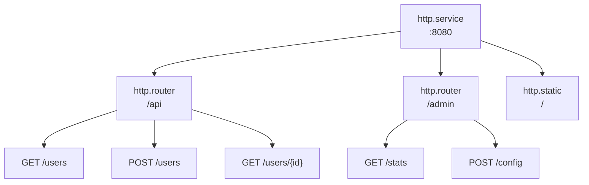

# ルーティング

`http.router`はURLプレフィックス配下にエンドポイントをまとめ、共通のミドルウェアを適用します。各`http.endpoint`はHTTPハンドラを定義します。

**分類：ルーティングリファレンス。** 設定ブロックは、名前空間と参照されるすべてのエントリを含む場合を除き、レジストリの一部分です。ハンドラブロックでは、データ層を定義する代わりにアプリケーション所有の関数IDを使用します。

## アーキテクチャ


```mermaid
flowchart TB
    S[http.service<br/>:8080] --> R1[http.router<br/>/api]
    S --> R2[http.router<br/>/admin]
    S --> ST[http.static<br/>/]

    R1 --> E1[GET /users]
    R1 --> E2[POST /users]
    R1 --> E3["GET /users/{id}"]

    R2 --> E4[GET /stats]
    R2 --> E5[POST /config]
```

エントリはメタデータを介して親を参照します：

- ルーター：`meta.server: app:gateway`
- エンドポイント：`meta.router: app:api`

## ルーター設定

```yaml
- name: api
  kind: http.router
  meta:
    server: gateway
  prefix: /api/v1
  middleware:
    - cors
    - compress
  options:
    cors.allow.origins: "*"
  post_middleware:
    - endpoint_firewall
```

| フィールド | 型 | 説明 |
|-------|------|-------------|
| `meta.server` | Registry ID | 親HTTPサーバー |
| `prefix` | string | すべてのルートに適用するURLプレフィックス |
| `middleware` | []string | マッチ前ミドルウェア |
| `options` | map | ミドルウェアオプション |
| `post_middleware` | []string | マッチ後ミドルウェア |
| `post_options` | map | マッチ後ミドルウェアのオプション |

## エンドポイント設定

```yaml
- name: get_user
  kind: http.endpoint
  meta:
    router: api
  method: GET
  path: /users/{id}
  func: app.users:get_user
```

| フィールド | 型 | 説明 |
|-------|------|-------------|
| `meta.router` | Registry ID | 親ルーター |
| `method` | string | HTTPメソッド：`GET`、`POST`、`PUT`、`DELETE`、`PATCH`、`HEAD`、`OPTIONS`、`TRACE`、またはすべてのメソッドを表す`*` |
| `path` | string | URLパスパターン（`/`で始まる） |
| `func` | Registry ID | ハンドラ関数 |

## パスパラメータ

URLパラメータには`{param}`構文を使用します：

```yaml
- name: get_post
  kind: http.endpoint
  meta:
    router: api
  method: GET
  path: /users/{user_id}/posts/{post_id}
  func: get_user_post
```

ハンドラからアクセスする例：

```lua
local http = require("http")

local function handler()
    local req, req_err = http.request()
    if req_err then return nil, req_err end
    local user_id, user_err = req:param("user_id")
    if user_err then return nil, user_err end
    local post_id, post_err = req:param("post_id")
    if post_err then return nil, post_err end

    return {user_id = user_id, post_id = post_id}
end
```

### ワイルドカードパス

残りのパスセグメントを`{param...}`でキャプチャします：

```yaml
- name: serve_files
  kind: http.endpoint
  meta:
    router: api
  method: GET
  path: /files/{filepath...}
  func: serve_file
```

ワイルドカードは残りのセグメントに一致します。そのため、`GET /api/v1/files/docs/guides/readme.md`のようなリクエストは、`req:param("filepath")`が`docs/guides/readme.md`に設定された状態でディスパッチされます。

ワイルドカードはパスの最後のセグメントでなければなりません。

## ハンドラ関数

エンドポイントハンドラは`http`モジュールを使用して、リクエストオブジェクトとレスポンスオブジェクトにアクセスします。リクエストとレスポンスのAPIリファレンスについては、[HTTPモジュール](lua/http/http.md)を参照してください。

```lua
local http = require("http")
local funcs = require("funcs")

local function handler()
    local req, req_err = http.request()
    if req_err then return nil, req_err end
    local res, res_err = http.response()
    if res_err then return nil, res_err end

    local user_id, param_err = req:param("id")
    if param_err then return nil, param_err end
    local user, call_err = funcs.call("app.users:get_user", user_id)
    if call_err then return nil, call_err end

    local status_err = res:set_status(http.STATUS.OK)
    if status_err then return nil, status_err end
    local write_err = res:write_json(user)
    if write_err then return nil, write_err end
    return true
end

return { handler = handler }
```

## ミドルウェアオプション

ミドルウェアオプションには、ミドルウェア名をプレフィックスとするドット記法を使用します：

```yaml
middleware:
  - cors
  - ratelimit
  - token_auth
options:
  cors.allow.origins: "https://app.example.com"
  cors.allow.methods: "GET,POST,PUT,DELETE"
  ratelimit.requests: "100"
  ratelimit.window: "1m"
  token_auth.store: "app:tokens"
  token_auth.header.name: "Authorization"
```

マッチ後ミドルウェアでは`post_options`を使用します：

```yaml
post_middleware:
  - endpoint_firewall
post_options:
  endpoint_firewall.action: "access"
```

## プリハンドラとマッチ後ミドルウェア

**プリハンドラ**（`middleware`）は、サーバーがルートを選択した後、ルートパラメータとエンドポイントメタデータがリクエストコンテキストに付与される前に実行されます：
- CORS（OPTIONSプリフライトを処理）
- 圧縮
- レート制限
- 実クライアントIPの検出
- トークン認証（コンテキストの拡充）

**マッチ後**（`post_middleware`）は、ルートパラメータとエンドポイントメタデータが付与された後に実行されます：
- エンドポイントファイアウォール（認可にルート情報が必要）
- リソースファイアウォール
- WebSocketリレー

```yaml
middleware:        # Before endpoint metadata: matched routes only
  - cors
  - compress
  - token_auth     # Enriches context with actor/scope

post_middleware:   # Post-match: matched routes only
  - endpoint_firewall  # Uses actor from token_auth
```

<tip>
トークン認証は、認可より前にリクエストコンテキストを拡充するため、プリハンドラチェーンに置きます。<code>endpoint_firewall</code>などの認可ミドルウェアは、一致したエンドポイントIDを必要とするため、マッチ後チェーンに置きます。一致しないリクエストでは、どちらのルーターチェーンも実行されません。
</tip>

## ルーターとエンドポイントの接続

次の例では一覧ハンドラのエントリを定義しています。`app:get_user_by_id`と`app:create_user`の関数IDは、同じ名前空間の別の場所で定義されたハンドラを参照します。

```yaml
version: "1.0"
namespace: app

entries:
  # Server
  - name: gateway
    kind: http.service
    addr: ":8080"
    lifecycle:
      auto_start: true

  # API Router
  - name: api
    kind: http.router
    meta:
      server: gateway
    prefix: /api/v1
    middleware:
      - cors
      - compress
      - ratelimit
    options:
      cors.allow.origins: "https://app.example.com"
      ratelimit.requests: "100"
      ratelimit.window: "1m"

  # Handler function
  - name: get_users
    kind: function.lua
    source: file://handlers/users.lua
    method: list
    modules:
      - http
      - json
      - sql

  # Endpoints
  - name: list_users
    kind: http.endpoint
    meta:
      router: api
    method: GET
    path: /users
    func: get_users

  - name: get_user
    kind: http.endpoint
    meta:
      router: api
    method: GET
    path: /users/{id}
    func: app:get_user_by_id

  - name: create_user
    kind: http.endpoint
    meta:
      router: api
    method: POST
    path: /users
    func: app:create_user
```

## 保護されたルート

次の設定では、公開ルートと、認証および認可を必要とするルートを分離します：

```yaml
entries:
  # Public routes (no auth)
  - name: public
    kind: http.router
    meta:
      server: gateway
    prefix: /api/public
    middleware:
      - cors

  # Protected routes
  - name: protected
    kind: http.router
    meta:
      server: gateway
    prefix: /api
    middleware:
      - cors
      - token_auth
    options:
      token_auth.store: app:tokens
    post_middleware:
      - endpoint_firewall
```

## 関連項目

- [サーバー](http/server.md) - HTTPサーバー設定
- [静的ファイル](http/static.md) - 静的ファイルの配信
- [ミドルウェア](http/middleware.md) - 利用可能なミドルウェア
- [HTTPモジュール](lua/http/http.md) - Lua HTTP API
