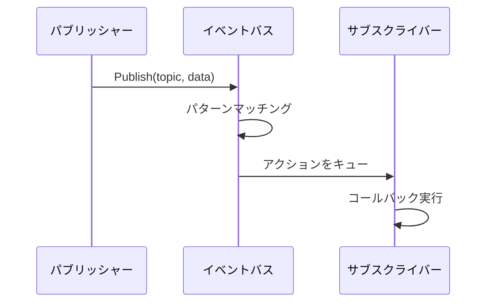
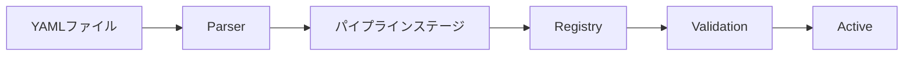
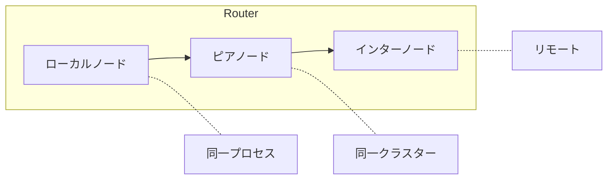

# アーキテクチャ

<note>
このページは作成中です。内容は不完全または変更される可能性があります。
</note>

WippyはGo上に構築されたレイヤードシステムです。コンポーネントは依存関係順に初期化され、イベントバスを通じて通信し、ワークスティーリングスケジューラを介してLuaプロセスを実行します。

## レイヤー

| レイヤー | コンポーネント |
|---------|-------------|
| アプリケーション | Luaプロセス、関数、ワークフロー |
| ランタイム | Luaエンジン（gopher-lua）、50以上のモジュール |
| サービス | HTTP、キュー、ストレージ、Temporal |
| システム | トポロジー、ファクトリー、関数、コントラクト |
| コア | スケジューラ、レジストリ、ディスパッチャ、イベントバス、リレー |
| インフラストラクチャ | AppContext、ロガー、トランスコーダ |

各レイヤーは下位のレイヤーにのみ依存します。コアレイヤーは基本的なプリミティブを提供し、サービスはその上に高レベルの抽象化を構築します。

## ブートシーケンス

アプリケーションの起動は4つのフェーズを経て進行します。

### フェーズ1: インフラストラクチャ

コンポーネントがロードされる前にコアインフラストラクチャを作成：

| コンポーネント | 目的 |
|-------------|------|
| AppContext | コンポーネント参照用のシールドディクショナリ |
| EventBus | コンポーネント間通信のためのPub/Sub |
| Transcoder | ペイロードシリアライゼーション（JSON、YAML、Lua） |
| Logger | イベントストリーミング付き構造化ログ |
| Relay | メッセージルーティング（Node、Router、Mailbox） |

### フェーズ2: コンポーネントロード

Loaderはトポロジカルソートで依存関係を解決し、レベルごとにコンポーネントをロードします。同じレベルのコンポーネントは並列にロードされます。

| レベル | コンポーネント | 依存関係 |
|--------|-------------|---------|
| 0 | PIDGen | なし |
| 1 | Dispatcher | PIDGen |
| 2 | Registry | Dispatcher |
| 3 | Finder, Supervisor | Registry |
| 4 | Topology | Supervisor |
| 5 | Lifecycle | Topology |
| 6 | Factory | Lifecycle |
| 7 | Functions | Factory |

各コンポーネントはLoadフェーズ中にコンテキストに自身をアタッチし、依存コンポーネントがサービスを利用可能にします。

### フェーズ3: アクティベーション

すべてのコンポーネントがロードされた後：

1. **Dispatcherをフリーズ** - ロックフリールックアップのためにコマンドハンドラレジストリをロック
2. **AppContextをシール** - 書き込み不可、ロックフリー読み取りを有効化
3. **コンポーネントを開始** - `Starter`インターフェースを持つ各コンポーネントの`Start()`を呼び出し

### フェーズ4: エントリロード

レジストリエントリ（YAMLファイルから）がロードされ検証：

1. プロジェクトファイルからエントリをパース
2. パイプラインステージがエントリを変換（オーバーライド、リンク、バイトコード）
3. `auto_start: true`とマークされたサービスが実行開始
4. スーパーバイザーが登録されたサービスをモニタリング

## コンポーネント

コンポーネントはアプリケーションライフサイクルに参加するGoサービスです。

### ライフサイクルフェーズ

| フェーズ | メソッド | 目的 |
|--------|---------|------|
| Load | `Load(ctx) (ctx, error)` | 初期化してコンテキストにアタッチ |
| Start | `Start(ctx) error` | アクティブな操作を開始 |
| Stop | `Stop(ctx) error` | グレースフルシャットダウン |

コンポーネントは依存関係を宣言します。Loaderは有向非巡回グラフを構築し、トポロジカル順序で実行します。シャットダウンは逆順で発生します。

### 標準コンポーネント

| コンポーネント | 依存関係 | 目的 |
|-------------|---------|------|
| PIDGen | なし | プロセスID生成 |
| Dispatcher | PIDGen | コマンドハンドラディスパッチ |
| Registry | Dispatcher | エントリストレージとバージョニング |
| Finder | Registry | エントリルックアップと検索 |
| Supervisor | Registry | サービス再起動ポリシー |
| Topology | Supervisor | プロセスの親子ツリー |
| Lifecycle | Topology | サービスライフサイクル管理 |
| Factory | Lifecycle | プロセス生成 |
| Functions | Factory | ステートレス関数呼び出し |

## イベントバス

コンポーネント間通信のための非同期Pub/Sub。

### 設計

- 単一のディスパッチャgoroutineがすべてのイベントを処理
- キューベースのアクション配信でパブリッシャーのブロックを防止
- パターンマッチングは正確なトピックとワイルドカード（`*`）をサポート
- コンテキストベースのライフサイクルでサブスクリプションをキャンセルに結びつけ

### イベントフロー

### 一般的なトピック

| トピック | パブリッシャー | 目的 |
|---------|------------|------|
| `registry.entry.*` | Registry | エントリの変更 |
| `process.started` | Topology | プロセスライフサイクル |
| `process.stopped` | Topology | プロセスライフサイクル |
| `supervisor.state.*` | Supervisor | サービス状態の変更 |

## レジストリ

エントリ定義のバージョン付きストレージ。

### 機能

- **バージョン付き状態** - 各変更で新バージョンを作成
- **履歴** - 監査証跡用のSQLiteバック履歴
- **監視** - 特定のエントリの変更を監視
- **イベント駆動** - 変更時にイベントをパブリッシュ

### エントリライフサイクル

パイプラインステージがエントリを変換：

| ステージ | 目的 |
|---------|------|
| Override | 設定オーバーライドを適用 |
| Disable | パターンでエントリを削除 |
| Link | 要件と依存関係を解決 |
| Bytecode | Luaをバイトコードにコンパイル |
| EmbedFS | ファイルシステムエントリを収集 |

## リレー

ノード間のプロセス間メッセージルーティング。

### 3層ルーティング

1. **ローカル** - 同一ノード内での直接配信
2. **ピア** - クラスター内のピアノードに転送
3. **インターノード** - ネットワーク経由でリモートノードにルーティング

### メールボックス

各ノードはワーカープール付きのメールボックスを持つ：

- FNV-1aハッシングで送信者をワーカーに割り当て
- 送信者ごとのメッセージ順序を保持
- ワーカーがメッセージを並行処理
- キューがいっぱいになるとバックプレッシャー

## AppContext

コンポーネント参照用のシールドディクショナリ。

| プロパティ | 動作 |
|----------|------|
| シール前 | RWMutex保護下での書き込み |
| シール後 | ロックフリー読み取り、書き込み時panicパニック |
| 重複キー | パニック |
| 型安全性 | 型付きゲッター関数 |

コンポーネントはLoadフェーズ中にサービスをアタッチします。ブート完了後、AppContextは最適な読み取りパフォーマンスのためにシールされます。

## シャットダウン

グレースフルシャットダウンは依存関係の逆順で進行：

1. SIGINT/SIGTERMがシャットダウンをトリガー
2. Supervisorが管理対象サービスを停止
3. `Stopper`インターフェースを持つコンポーネントが`Stop()`を受信
4. インフラストラクチャのクリーンアップ

2回目のシグナルで即座に終了。

## 関連項目

- [スケジューラ](internal-scheduler.md) - プロセス実行
- [イベントバス](internal-events.md) - Pub/Subシステム
- [レジストリ](internal-registry.md) - 状態管理
- [コマンドディスパッチ](internal-dispatch.md) - Yield処理

