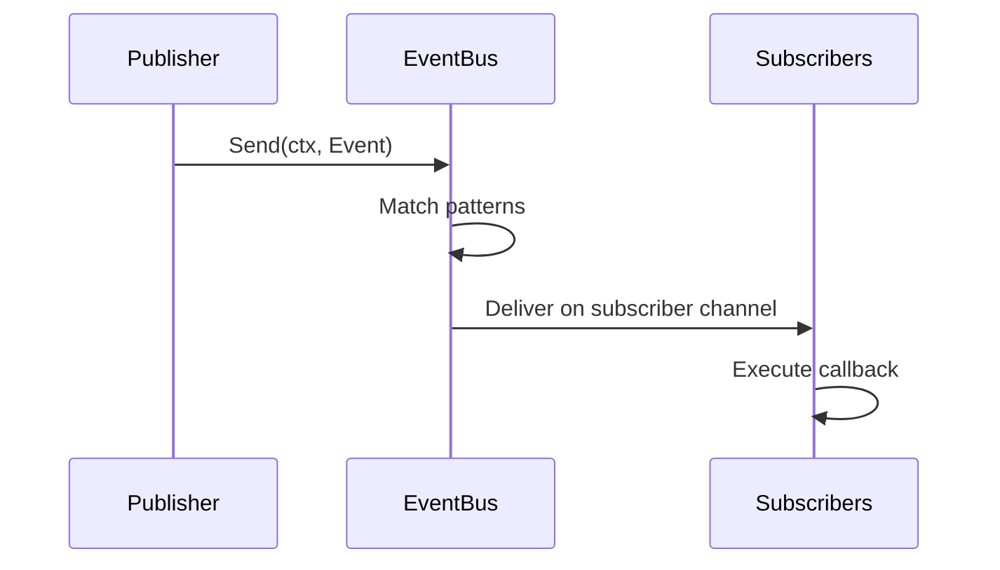
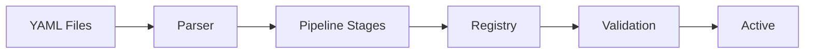
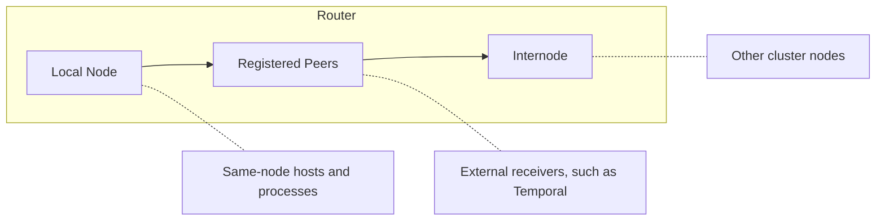

# アーキテクチャ

Wippy は Go 上に構築されたレイヤー型システムです。コンポーネントは依存関係の順序で初期化され、イベントバスを通じて通信し、work-stealing スケジューラを介して Lua プロセスを実行します。

これは実装リファレンスです。図と Go の型は、アプリケーションのレジストリエントリや拡張 API ではなく、ランタイム内部を説明します。

## レイヤー

| レイヤー | コンポーネント |
|-------|------------|
| Application | Lua プロセス、関数、ワークフロー |
| Runtime | Lua エンジン（wippyai/go-lua）とランタイムモジュール |
| Services | HTTP、Queue、Storage、Temporal |
| System | Topology、Factory、Functions、Contracts |
| Core | Scheduler、Registry、Dispatcher、EventBus、Relay |
| Infrastructure | AppContext、Logger、Transcoder |

各レイヤーは下位レイヤーだけに依存します。Core レイヤーは基本的なプリミティブを提供し、Services はその上に高レベルの抽象化を構築します。

## ブートシーケンス

アプリケーションの起動は 4 つのフェーズで進みます。

### フェーズ 1: インフラストラクチャ

コンポーネントを読み込む前にコアインフラストラクチャを作成します。

| コンポーネント | 目的 |
|-----------|---------|
| AppContext | コンポーネント参照用の sealed dictionary |
| EventBus | コンポーネント間通信用の pub/sub |
| Transcoder | ペイロードのシリアライズ（JSON、YAML、Lua） |
| Logger | イベントストリーミング付き構造化ログ |
| Relay | メッセージルーティング（Node、Router、Mailbox） |

### フェーズ 2: コンポーネントのロード

Loader はトポロジカルソートによって依存関係を解決し、レベルごとに順次コンポーネントを読み込みます。同じレベル内のコンポーネントも、一度に 1 つずつ読み込まれます。

レベルは依存関係のエッジによって決まります。Core や System などのパッケージグループが、別のグローバル順序を強制することはありません。そのため、依存関係のエッジがないコンポーネントは、パッケージグループにかかわらず同じレベルで読み込まれる場合があります。

各コンポーネントは Load 中に自身を context へ attach し、依存するコンポーネントからサービスを利用可能にします。

### フェーズ 3: 有効化

すべてのコンポーネントを読み込んだ後、次の処理を行います。

1. **ランタイムサービスを開始** - `StartRuntimeServices(ctx)` を呼び出す
2. **Dispatcher を freeze** - コマンドハンドラレジストリをロックし、ロックフリー検索を可能にする
3. **AppContext を seal** - 以降の書き込みを禁止し、ロックフリー読み取りを可能にする
4. **コンポーネントを開始** - `Starter` インターフェースを持つ各コンポーネントの `Start()` を呼び出す

### フェーズ 4: エントリのロード

`_index.json`、`_index.yaml`、`_index.yml` のプロジェクトマニフェストにあるレジストリエントリを読み込み、検証します。

1. プロジェクトファイルからエントリを解析
2. パイプラインステージがエントリを変換（override、link、bytecode）
3. `auto_start: true` のサービスが実行を開始
4. Supervisor が登録済みサービスを監視

## コンポーネント

コンポーネントはアプリケーションライフサイクルに参加する Go サービスです。

### ライフサイクルフェーズ

| フェーズ | メソッド | 目的 |
|-------|--------|---------|
| Load | `Load(ctx) (ctx, error)` | 初期化して context へ attach |
| Start | `Start(ctx) error` | アクティブな処理を開始 |
| Stop | `Stop(ctx) error` | graceful shutdown |

コンポーネントは依存関係を宣言します。Loader は有向非巡回グラフを構築し、トポロジカル順序で実行します。シャットダウンは逆順で行われます。

### 標準コンポーネント

| コンポーネント | 依存関係 | 目的 |
|-----------|--------------|---------|
| PIDGen | なし | プロセス ID の生成 |
| Dispatcher | なし | コマンドハンドラのディスパッチ |
| Registry | Artifact | エントリの格納とバージョン管理 |
| Finder | Registry | エントリの検索 |
| Supervisor | Registry | サービスの再起動ポリシー |
| Topology | なし | プロセスの親子ツリー |
| Lifecycle | Topology | サービスライフサイクル管理 |
| Factory | なし | プロセスの生成 |
| Functions | Registry | プールされた関数の実行 |

## イベントバス

コンポーネント間通信用の非同期 pub/sub です。

### 設計

- 1 つの dispatcher goroutine がすべてのイベントを処理
- Publisher は subscriber への配信を待たずにアクションを enqueue
- パターンマッチングは完全一致、`*`、`**`、セグメントの選択肢に対応
- context ベースのライフサイクルが subscription と cancel を関連付ける

### イベントフロー

```mermaid
sequenceDiagram
    participant P as Publisher
    participant B as EventBus
    participant S as Subscribers

    P->>B: Send(ctx, Event)
    B->>B: Match patterns
    B->>S: Deliver on subscriber channel
    S->>S: Execute callback
```

### 一般的なトピック

イベントは独立した `System` と `Kind` フィールドを持ちます。組み込みシステムは次のイベントを発行します。

| システム | 種別 | 目的 |
|--------|------|---------|
| `registry` | `entry.create`、`entry.update`、`entry.delete`、`entry.accept`、`entry.reject` | エントリの変更 |
| `registry` | `registry.begin`、`registry.commit`、`registry.discard` | トランザクション境界 |
| `process` | `factory.register`、`factory.delete`、`factory.accept`、`factory.reject` | プロセス種別のファクトリ登録 |
| `supervisor` | `service.register`、`service.remove`、`service.update`、`service.start`、`service.stop` | サービスライフサイクル |

## レジストリ

エントリ定義のバージョン管理ストレージです。

### 機能

- **バージョン管理された状態** - 各変更が新しいバージョンを作成
- **履歴** - デフォルトはインメモリ履歴。永続的な監査証跡には SQLite バックエンドの履歴を任意で使用可能（history_type: sqlite）
- **監視** - 特定エントリの変更を監視
- **イベント駆動** - 変更時にイベントを発行

### エントリライフサイクル

```mermaid
flowchart LR
    YAML[YAML Files] --> Parser
    Parser --> Stages[Pipeline Stages]
    Stages --> Registry
    Registry --> Validation
    Validation --> Active
```

パイプラインステージはエントリを変換します。

| ステージ | 目的 |
|-------|---------|
| Override | 設定の override を適用 |
| Disable | パターンでエントリを除外 |
| Link | requirement と dependency を解決 |
| Bytecode | Lua を bytecode へコンパイル |
| EmbedFS | ファイルシステムエントリを収集 |

## Relay

ノードをまたいだプロセス間のメッセージルーティングです。

### 3 段階のルーティング

```mermaid
flowchart LR
    subgraph Router
        Local[Local Node] --> Peer[Registered Peers]
        Peer --> Inter[Internode]
    end

    Local -.- L[Same-node hosts and processes]
    Peer -.- P[External receivers, such as Temporal]
    Inter -.- I[Other cluster nodes]
```

1. **Local** - 同じノード上のホストとプロセス間で直接配信
2. **Peer** - Temporal など、登録済みの外部 receiver へ転送
3. **Internode** - 別のクラスターノードへのネットワークルーティングにフォールバック

### Mailbox

各ノードはワーカープールを持つ mailbox を備えます。

- FNV-1a hashing により送信元をワーカーへ割り当て
- 送信元ごとのメッセージ順序を維持
- ワーカーがメッセージを並行処理
- キューが満杯になると back-pressure

## AppContext

コンポーネント参照用の sealed dictionary です。

| プロパティ | 動作 |
|----------|----------|
| seal 前 | ブート中のシングルスレッド書き込み |
| seal 後 | ロックフリー読み取り、書き込み時に panic |
| キーの重複 | Panic |
| 型安全性 | 型付き getter 関数 |

コンポーネントは Load フェーズ中にサービスを attach します。ブート完了後、AppContext は seal され、ロックフリー読み取りが可能になり、それ以上の書き込みは禁止されます。

## シャットダウン

graceful shutdown は依存関係の逆順で進みます。

1. SIGINT/SIGTERM がシャットダウンを開始
2. Supervisor が管理対象サービスを停止
3. `Stopper` インターフェースを持つコンポーネントが `Stop()` を受信
4. インフラストラクチャをクリーンアップ

2 回目のシグナルで即時終了します。

## 関連項目

- [スケジューラ](./scheduler.md) - プロセスの実行
- [イベントバス](./events.md) - pub/sub システム
- [レジストリ](./registry.md) - 状態管理
- [コマンドディスパッチ](./dispatch.md) - yield の処理
