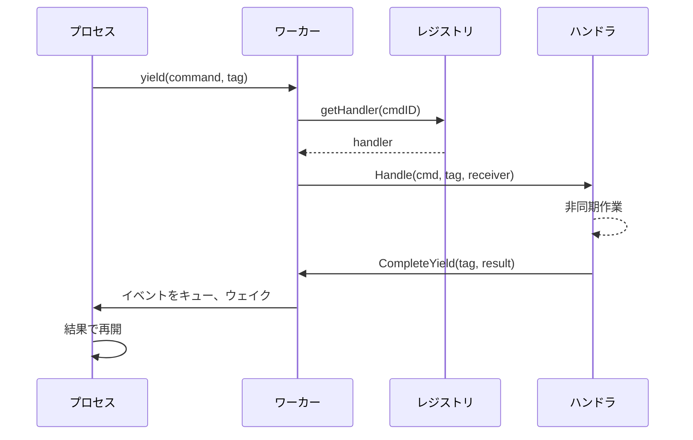

# コマンドディスパッチ

ディスパッチシステムはプロセスからハンドラにコマンドをルーティングします。プロセスは相関タグ付きでコマンドをyieldし、ハンドラが非同期作業を実行し、結果がイベントキュー経由で戻ります。

## フロー



## コマンドレジストリ

レジストリはハイブリッド構造でハンドラを格納：

```go
type Registry struct {
    handlers [256]Handler         // システムコマンド: O(1)インデックス
    extended map[CommandID]Handler // 拡張コマンド: マップルックアップ
    frozen   atomic.Bool          // ブート後はロックフリー
}
```

システムコマンド（0-255）は配列インデックスを使用。拡張コマンドはマップルックアップを使用。`Freeze()`後、すべてのルックアップはロックフリー。

### コマンドID範囲

| 範囲 | モジュール | 例 |
|-----|---------|-----|
| 1-9 | process | Send, Spawn, Terminate, Monitor, Link |
| 10-29 | clock | Sleep, Ticker, Timer |
| 50-59 | stream | Read, Write, Close, Seek |
| 60-79 | http | Request, RequestBatch |
| 80-89 | websocket | Connect, Send, Receive |
| 90-99 | event | Subscribe, Send |
| 100-119 | sql | Query, Execute, Transaction ops |
| 120-129 | store | Get, Set, Delete, Has |
| 130-139 | security | ValidateToken, CreateToken |
| 140-149 | function | Call, AsyncStart, AsyncCancel |
| 150-159 | exec | ProcessWait |
| 160-169 | cloudstorage | Upload, Download, List, Presigned URLs |
| 170-179 | eval | Compile, Run, CreateProcess |
| 180-189 | workflow | SideEffect, Call, Version, UpsertAttrs |
| 190-199 | contract | Open, Call, AsyncCall, AsyncCancel |
| 256+ | custom | ユーザー定義サービス |

登録は`MustRegisterCommands()`経由でブート時に行われます。衝突はスタートアップ時にパニック。

## コマンドの定義

コマンドは一意の`CommandID`を持つデータ構造です：

```go
const MyCommand dispatcher.CommandID = 200

type MyCmd struct {
    Input  string
    Option int
}

var myCmdPool = sync.Pool{New: func() any { return &MyCmd{} }}

func (c *MyCmd) CmdID() dispatcher.CommandID { return MyCommand }

func (c *MyCmd) Release() {
    c.Input = ""
    c.Option = 0
    myCmdPool.Put(c)
}
```

プール再利用でホットパスでのアロケーションを排除。パッケージinitで登録：

```go
func init() {
    dispatcher.MustRegisterCommands("myservice", MyCommand)
}
```

## ディスパッチャー

ディスパッチャーは関連ハンドラをグループ化します。`RegisterAll`でハンドラを登録し、セットアップ/ティアダウン用のライフサイクルメソッドを実装：

```go
type Handler interface {
    Handle(ctx context.Context, cmd Command, tag uint64, receiver ResultReceiver) error
}

type ResultReceiver interface {
    CompleteYield(tag uint64, data any, err error)
}
```

```go
type Dispatcher struct {
    // サービス状態
}

func (d *Dispatcher) RegisterAll(register func(id dispatcher.CommandID, h dispatcher.Handler)) {
    register(myapi.MyCommand, dispatcher.HandlerFunc(d.handleMyCommand))
}

func (d *Dispatcher) handleMyCommand(ctx context.Context, cmd Command, tag uint64, receiver ResultReceiver) error {
    c := cmd.(*myapi.MyCmd)
    go func() {
        result := doWork(c)
        if ctx.Err() == nil {
            receiver.CompleteYield(tag, result, nil)
        }
    }()
    return nil
}
```

ブートコンポーネントとして登録：

```go
func MyDispatcher() boot.Component {
    return boot.New(boot.P{
        Name:      "dispatcher.myservice",
        DependsOn: []boot.Name{DispatcherName},
        Load: func(ctx context.Context) (context.Context, error) {
            reg := dispatcher.GetRegistrar(ctx)
            svc := myservice.NewDispatcher()
            svc.RegisterAll(reg.Register)
            return ctx, nil
        },
    })
}
```

## Yieldと相関

プロセスが非同期作業を必要とする場合、相関タグ付きでコマンドをyield：

```go
type Yield struct {
    Cmd Command
    Tag uint64    // 相関用のプロセスローカルカウンター
}
```

ワーカーは各ステップ後に`StepOutput`からyieldを抽出し、ハンドラにディスパッチします。各タグはリクエストを一意に識別し、結果をマッチバック可能にします。

## 関連項目

- [スケジューラ](internal-scheduler.md) - プロセス実行
- [モジュール](internal-modules.md) - Luaモジュール統合
- [プロセスモデル](concept-process-model.md) - 高レベルコンセプト

