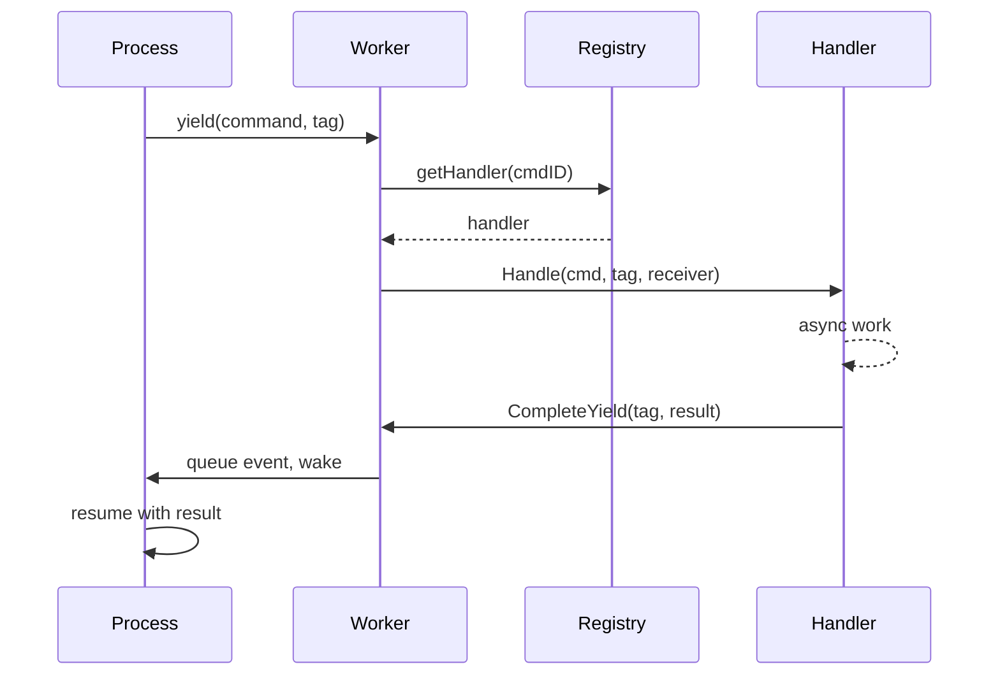

# コマンドディスパッチ

コマンドディスパッチは、プロセスの yield をハンドラへルーティングし、相関付けられた結果をプロセスイベントキュー経由で返します。

これは拡張および実装リファレンスです。カスタムコマンドとディスパッチャーの断片は、既存の Go パッケージ、ブートグラフ、コマンド API、およびサービス固有のエラー処理を前提としています。

## フロー


```mermaid
sequenceDiagram
    participant P as Process
    participant W as Worker
    participant R as Registry
    participant H as Handler

    P->>W: yield(command, tag)
    W->>R: getHandler(cmdID)
    R-->>W: handler
    W->>H: Handle(cmd, tag, receiver)
    H-->>H: async work
    H->>W: CompleteYield(tag, result)
    W->>P: queue event, wake
    P->>P: resume with result
```

## コマンドレジストリ

レジストリはハンドラをハイブリッド構造で格納します。

```go
type Registry struct {
    handlers [256]Handler         // System commands: O(1) index
    extended map[CommandID]Handler // Extended commands: map lookup
    frozen   atomic.Bool          // Lock-free after boot
}
```

システムコマンド（0～255）は配列インデックスを使用します。拡張コマンドはマップ検索を使用します。`Freeze()` 後は、すべての検索がロックフリーになります。

### コマンド ID の範囲

| 範囲 | モジュール | 例 |
|-------|--------|----------|
| 1-9 | process | Send, Spawn, Terminate, Cancel, Monitor, Unmonitor, Link, Unlink, Exec |
| 10, 14, 16, 18-23 | clock | Sleep、ticker、timer の操作 |
| 30-34 | socket | Connect, Listen, Accept, Bind, Resolve |
| 50-57 | stream | Read, Write, Close, Seek, Flush, Stat、Scanner の操作 |
| 60-61 | http | Request, RequestBatch |
| 70-78 | tty | ターミナル I/O |
| 80-85 | websocket | Connect, Send, Receive, Close, Ping, Subscribe |
| 90-91 | event | Subscribe, Send |
| 100-111 | sql | Query, Execute, Prepare、statement と transaction の操作 |
| 120-126 | store | Get, Set, Delete, Has, Entry, List, Put |
| 130-132 | security | ValidateToken, CreateToken, RevokeToken |
| 140-142 | function | Call, AsyncStart, AsyncCancel |
| 150 | exec | ProcessWait |
| 160-169 | cloudstorage | オブジェクトおよびマルチパート操作 |
| 170-171 | eval | Compile, Run |
| 172 | cdc | Subscribe |
| 173-174 | cloudstorage | AbortMultipartUpload, OpenReader |
| 180-183 | workflow | SideEffect, Exec, Version, UpsertAttrs |
| 190-193 | contract | Open, Call, AsyncCall, AsyncCancel |
| 200-211 | pg（プロセスグループ） | Join, Leave, GetMembers, GetLocalMembers, WhichGroups, Broadcast, BroadcastLocal, WhichLocalGroups, Monitor, Events, JoinGroups, LeaveGroups |
| 256+ | custom | ユーザー定義サービス |

パッケージは `init()` から `MustRegisterCommands()` を使用してコマンド ID の所有権を予約します。所有権の衝突は、パッケージの初期化中に panic を発生させます。コンポーネントのロード中、各サービスは `Registrar.Register` を通じてハンドラをバインドします。ディスパッチャーが freeze されるのは、それらのハンドラがインストールされた後です。

## コマンドの定義

コマンドは一意の `CommandID` を持つデータ構造です。

```go
const MyCommand dispatcher.CommandID = 256

type MyCmd struct {
    Input  string
    Option int
}

func (c *MyCmd) CmdID() dispatcher.CommandID { return MyCommand }
```

パッケージ初期化時にコマンド ID を予約します。

```go
func init() {
    dispatcher.MustRegisterCommands("myservice", MyCommand)
}
```

## ディスパッチャー

ディスパッチャーは関連するハンドラをグループ化します。ハンドラを登録する `RegisterAll` と、セットアップ/ティアダウン用のライフサイクルメソッドを実装します。

```go
type Handler interface {
    Handle(ctx context.Context, cmd Command, tag uint64, receiver ResultReceiver) error
}

type ResultReceiver interface {
    CompleteYield(tag uint64, data any, err error)
}
```

```go
type Dispatcher struct {
    // service state
}

func (d *Dispatcher) RegisterAll(register func(id dispatcher.CommandID, h dispatcher.Handler)) {
    register(myapi.MyCommand, dispatcher.HandlerFunc(d.handleMyCommand))
}

func (d *Dispatcher) handleMyCommand(ctx context.Context, cmd Command, tag uint64, receiver ResultReceiver) error {
    c := cmd.(*myapi.MyCmd)
    go func() {
        result := doWork(c)
        if ctx.Err() == nil {
            receiver.CompleteYield(tag, result, nil)
        }
    }()
    return nil
}
```

ブートコンポーネントとして登録します。

```go
func MyDispatcher() boot.Component {
    return boot.New(boot.P{
        Name:      "dispatcher.myservice",
        DependsOn: []boot.Name{DispatcherName},
        Load: func(ctx context.Context) (context.Context, error) {
            reg := dispatcher.GetRegistrar(ctx)
            svc := myservice.NewDispatcher()
            svc.RegisterAll(reg.Register)
            return ctx, nil
        },
    })
}
```

## Yield と相関

プロセスが非同期処理を必要とする場合、相関タグ付きのコマンドを yield します。

```go
type Yield struct {
    Cmd Command
    Tag uint64    // Process-local counter for correlation
}
```

ワーカーは各ステップの後に `StepOutput` から yield を取り出し、ハンドラへディスパッチします。各タグはリクエストを一意に識別するため、結果を対応付けて戻すことができます。

## 関連項目

- [スケジューラ](./scheduler.md) - プロセスの実行
- [モジュール](./modules.md) - Lua モジュールの統合
- [プロセスモデル](../concepts/process-model.md) - 高レベルの概念
