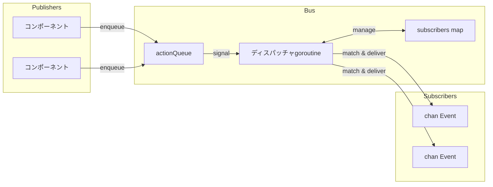

# イベントバス

イベントバスは単一のディスパッチャgoroutineを使用するPub/Subシステムです。パブリッシャーがアクションをエンキューし、ディスパッチャが順次処理し、サブスクライバーがマッチするイベントをチャネルで受信します。

## イベント構造

```go
type Event struct {
    System string  // コンポーネント/モジュール（例: "registry", "process"）
    Kind   string  // イベントタイプ（例: "create", "update", "exit"）
    Path   string  // エンティティ識別子
    Data   any     // ペイロード
}
```

## バスアーキテクチャ



バスはシンプルな構造で状態を格納：

```go
type Bus struct {
    subscribers       map[SubscriberID]sub
    subscriberCounter uint64

    actionQueue []action
    spareQueue  []action
    actionMu    sync.Mutex
    actionReady chan struct{}  // buffered=1

    closed atomic.Bool
}
```

すべての変更はディスパッチャgoroutineを通過し、複雑なロックなしで競合状態を排除。

## アクション

4種類のアクションがキューを流れる：

| アクション | 動作 |
|----------|------|
| Subscribe | サブスクライバーをマップに追加、doneチャネルで応答 |
| Unsubscribe | サブスクライバーを削除、doneチャネルで応答 |
| Send | マッチするサブスクライバーにイベントを配信 |
| Stop | サブスクライバーをクリア、キューをドレイン、ループを終了 |

SubscribeとUnsubscribeはディスパッチャが確認するまでブロック。Sendはファイアアンドフォーゲット。

## キュースワッピング

ディスパッチャは定常状態でアロケーションを避けるためにスライススワッピングを使用：

```go
func (b *Bus) processActions() bool {
    b.actionMu.Lock()
    actions := b.actionQueue
    b.actionQueue = b.spareQueue[:0]
    b.spareQueue = nil
    b.actionMu.Unlock()

    for i := range actions {
        // アクションを処理
    }

    clear(actions)
    b.actionMu.Lock()
    b.spareQueue = actions[:0]
    b.actionMu.Unlock()
    return true
}
```

2つのスライスが交互：1つは処理用、1つは新着用。`actionReady`チャネルは1にバッファされ、シグナリングがブロックせず、複数のエンキューが1回のウェイクアップにまとまります。

## パターンマッチング

サブスクリプションはサブスクライブ時に一度パターンをコンパイル：

```go
type sub struct {
    subID   SubscriberID
    ctx     context.Context
    system  *wildcard.Wildcard
    kind    *wildcard.Wildcard
    eventCh chan<- Event
}
```

ワイルドカードパッケージは3種類のパターンをサポート：

| パターン | マッチ |
|---------|------|
| `registry` | 完全一致のみ |
| `*` | 任意の単一セグメント |
| `**` | 0個以上のセグメント |
| `(a\|b)` | セグメント内の選択 |

パターンは`.`で分割されるため、`registry.*`は`registry.create`にマッチしますが`registry.entry.create`にはマッチしません。パターン`registry.**`は`registry`、`registry.create`、`registry.entry.create`の3つすべてにマッチ。

## イベント配信

Send処理中、ディスパッチャはサブスクライバーを反復：

```go
for id, s := range b.subscribers {
    if s.system != nil && !s.system.Match(a.event.System) {
        continue
    }
    if s.kind != nil && !s.kind.Match(a.event.Kind) {
        continue
    }

    select {
    case <-a.ctx.Done():
        goto cleanup
    case <-s.ctx.Done():
        expiredSubs = append(expiredSubs, id)
    case s.eventCh <- a.event:
    }
}
```

サブスクライバーのコンテキストがキャンセルされると、その配信パス中に削除対象としてマーク。イベントコンテキストも反復中に配信をキャンセル可能。

## Luaプロセスブリッジ

イベントディスパッチャはGoイベントをLuaプロセスにブリッジ。すべてのイベント（`"**"`）に一度サブスクライブし、プロセスサブスクリプションに基づいて内部でルーティング：

```go
type Dispatcher struct {
    bus    event.Bus
    node   relay.Node
    subID  SubscriberID
    eventC chan event.Event

    mu   sync.RWMutex
    subs map[string]*subscription  // topic -> subscription
}
```

Luaプロセスが`events.subscribe()`でサブスクライブすると、ディスパッチャがパターンとターゲットPIDを格納。マッチするイベントはパッケージ化されてリレー経由で送信：

```go
func (d *Dispatcher) routeEvent(evt event.Event) {
    d.mu.RLock()
    defer d.mu.RUnlock()

    for _, sub := range d.subs {
        if !matchPattern(sub.system, evt.System) {
            continue
        }
        if sub.kind != "" && !matchPattern(sub.kind, evt.Kind) {
            continue
        }

        data := map[string]any{
            "system": evt.System,
            "kind":   evt.Kind,
            "path":   evt.Path,
        }
        if evt.Data != nil {
            data["data"] = evt.Data
        }

        pkg := relay.NewPackage(pid.PID{}, sub.pid, sub.topic, payload.New(data))
        d.node.Send(pkg)
    }
}
```

## ヘルパー型

### Subscriber

チャネルサブスクリプションをコールバックでラップ：

```go
handler, err := eventbus.NewSubscriber(ctx, bus, "registry", "*.created",
    func(evt Event) {
        // handle
    })
defer handler.Close()
```

2つのgoroutineを生成：1つはイベントを読んでハンドラを呼び出し、もう1つはコンテキストキャンセルを待ってアンサブスクライブ。

### EventRouter

複数のハンドラを一元化されたライフサイクルで管理：

```go
router, err := eventbus.StartRouter(ctx, bus,
    WithHandlers(handler1, handler2),
    WithLogger(log))
defer router.Stop()
```

各ハンドラは`Pattern()`と`Handle()`を実装。RouterはそれぞれにSubscriberを作成し、Stop時にすべてをクローズ。

### Awaiter

特定のイベントの同期待機：

```go
awaiter := eventbus.NewAwaiter(bus, "registry", "accept")
waiter, _ := awaiter.Prepare(ctx, "service-id")
defer waiter.Close()

bus.Send(ctx, triggeringEvent)

result := waiter.Wait()  // マッチまたはタイムアウトまでブロック
```

Prepare-then-Waitパターンは競合状態を回避：レスポンスを生成するイベントをトリガーする前にサブスクライブ。

## シャットダウン

1. `Stop()`がclosedフラグをアトミックに設定しStopアクションをエンキュー
2. ディスパッチャがサブスクライバーマップをクリア
3. 残りのキューされたアクションをドレイン：
   - Subscribeリクエストは"bus is closed"エラーを取得
   - Unsubscribeリクエストは即座に完了
   - Sendイベントはドロップ
4. WaitGroupが完了

## 関連項目

- [レジストリ](internal-registry.md) - 主要なイベントプロデューサー
- [コマンドディスパッチ](internal-dispatch.md) - プロセスからハンドラへのルーティング

