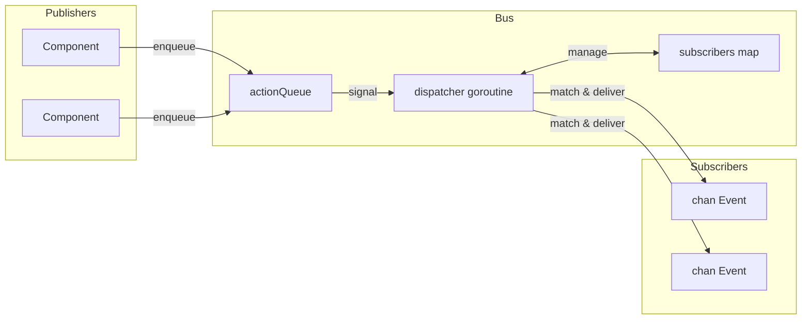

# イベントバス

イベントバスは、キューに入った pub/sub アクションを 1 つの dispatcher goroutine で処理し、一致するイベントを subscriber channel へ配信します。

Go のスニペットは実装および拡張の断片です。既存のコンポーネント context、logger、handler、アプリケーションイベント型を前提としています。

## イベント構造

```go
type Event struct {
    System string  // Component/module (e.g., "registry", "process")
    Kind   string  // Event type (e.g., "create", "update", "exit")
    Path   string  // Entity identifier
    Data   any     // Payload
    Aux    any     // In-process dispatcher context; not propagated to processes
}
```

## バスアーキテクチャ


```mermaid
flowchart LR
    subgraph Publishers
        P1[Component]
        P2[Component]
    end

    subgraph Bus
        Q[actionQueue]
        D[dispatcher goroutine]
        S[subscribers map]
    end

    subgraph Subscribers
        S1[chan Event]
        S2[chan Event]
    end

    P1 & P2 -->|enqueue| Q
    Q -->|signal| D
    D -->|match & deliver| S1 & S2
    D <-->|manage| S
```

バスは単純な構造体に状態を格納します。

```go
type Bus struct {
    subscribers       map[SubscriberID]sub
    subscriberCounter uint64

    actionQueue []action
    spareQueue  []action
    actionMu    sync.Mutex
    actionReady chan struct{}  // buffered=1

    closed atomic.Bool
}
```

すべての変更は dispatcher goroutine を経由するため、複雑なロックなしで競合状態を排除できます。

## アクション

キューには 4 種類のアクションが流れます。

| アクション | 動作 |
|--------|----------|
| Subscribe | subscriber をマップへ追加し、done channel へ応答 |
| Unsubscribe | subscriber を削除し、done channel へ応答 |
| Send | 一致する subscriber へイベントを配信 |
| Stop | subscriber を消去し、キューを drain してループを終了 |

Subscribe と Unsubscribe は dispatcher の確認までブロックします。Send は fire-and-forget です。バスは最大 `DefaultMaxSubscribers` 件（デフォルト 4096）の subscription を受け付けます。上限を超えた subscription は `ErrSubscribersCapReached` で失敗します。

## キューの交換

dispatcher は、定常状態での allocation を避けるためスライスを交換します。

```go
func (b *Bus) processActions() bool {
    b.actionMu.Lock()
    actions := b.actionQueue
    b.actionQueue = b.spareQueue[:0]
    b.spareQueue = nil
    b.actionMu.Unlock()

    for i := range actions {
        // process action
    }

    clear(actions)
    b.actionMu.Lock()
    b.spareQueue = actions[:0]
    b.actionMu.Unlock()
    return true
}
```

2 つのスライスが交互に使われます。一方は処理用、もう一方は新規到着用です。`actionReady` channel の buffer は 1 なので、signal はブロックせず、複数の enqueue は 1 回の wakeup にまとめられます。

## パターンマッチング

subscription は subscribe 時に一度だけパターンをコンパイルします。

```go
type sub struct {
    subID   SubscriberID
    ctx     context.Context
    system  *wildcard.Wildcard
    kind    *wildcard.Wildcard
    eventCh chan<- Event
}
```

wildcard パッケージは 4 種類のパターンに対応します。

| パターン | 一致対象 |
|---------|---------|
| `registry` | 完全一致のみ |
| `*` | 任意の 1 セグメント |
| `**` | 0 個以上のセグメント |
| `(a\|b)` | セグメント内の選択肢 |

パターンは `.` で分割されるため、`registry.*` は `registry.create` に一致しますが、`registry.entry.create` には一致しません。パターン `registry.**` は `registry`、`registry.create`、`registry.entry.create` のすべてに一致します。

## イベント配信

Send の処理中、dispatcher は subscriber を反復処理します。

```go
for id, s := range b.subscribers {
    if s.system != nil && !s.system.Match(a.event.System) {
        continue
    }
    if s.kind != nil && !s.kind.Match(a.event.Kind) {
        continue
    }

    select {
    case <-a.ctx.Done():
        goto cleanup
    case <-s.ctx.Done():
        expiredSubs = append(expiredSubs, id)
    case s.eventCh <- a.event:
    }
}
```

subscriber の context が cancel されている場合、その配信 pass 中に削除対象としてマークされます。イベントの context によって反復処理の途中で配信を cancel することもできます。

## Lua プロセスブリッジ

events dispatcher は Go イベントを Lua プロセスへ bridge します。すべてのイベント（`"**"`）を一度 subscribe し、プロセスの subscription に基づいて内部ルーティングします。

```go
type Dispatcher struct {
    bus    event.Bus
    node   relay.Node
    subID  SubscriberID
    eventC chan event.Event

    mu   sync.RWMutex
    subs map[string]*subscription  // topic -> subscription
}
```

Lua プロセスが `events.subscribe()` を介して subscribe すると、dispatcher はパターンと対象 PID を格納します。一致するイベントは package 化され、relay 経由で送信されます。

```go
func (d *Dispatcher) routeEvent(evt event.Event) {
    d.mu.RLock()
    defer d.mu.RUnlock()

    for _, sub := range d.subs {
        if !matchPattern(sub.system, evt.System) {
            continue
        }
        if sub.kind != "" && sub.kind != "*" && !matchPattern(sub.kind, evt.Kind) {
            continue
        }

        data := map[string]any{
            "system": evt.System,
            "kind":   evt.Kind,
            "path":   evt.Path,
        }
        if evt.Data != nil {
            data["data"] = evt.Data
        }

        pkg := relay.NewPackage(pid.PID{}, sub.pid, sub.topic, payload.New(data))
        d.node.Send(pkg)
    }
}
```

## ヘルパー型

### Subscriber

channel subscription を callback でラップします。

```go
handler, err := eventbus.NewSubscriber(ctx, bus, "registry", "entry.*",
    func(evt Event) {
        // handle
    })
if err != nil {
    return err
}
defer handler.Close()
```

2 つの goroutine を生成します。1 つはイベントを読み取って handler を呼び出し、もう 1 つは context の cancel を待って unsubscribe します。

### EventRouter

一元化されたライフサイクルで複数の handler を管理します。

```go
router, err := eventbus.StartRouter(ctx, bus,
    WithHandlers(handler1, handler2),
    WithLogger(log))
if err != nil {
    return err
}
defer router.Stop()
```

各 handler は `Pattern()` と `Handle()` を実装します。router は handler ごとに Subscriber を作成し、Stop 時にすべて閉じます。

### AwaitService

pub/sub 上の request-response です。`(system, kind)` の組ごとに 1 つの subscription を維持し、`Path` によってイベントを waiter へルーティングします。

```go
svc := eventbus.NewAwaitService(bus)
if err := svc.Start(ctx); err != nil {
    return err
}
defer svc.Stop()

waiter, err := svc.Prepare(ctx, "test", "response.(accept|reject)", "test/path", 5*time.Second)
if err != nil {
    return err
}
defer waiter.Close()

bus.Send(ctx, triggeringEvent)

result := waiter.Wait()  // returns AwaitResult{Event, Accepted, Error}
```

`Prepare` は起動イベントが送信される前に waiter を登録し、wait の登録前に応答が到着する競合を回避します。`Wait` は一致する `Path` のイベントが到着するか、タイムアウト（非正数の場合はデフォルトの `DefaultAwaitTimeout`、30 秒）までブロックします。イベント種別が `accept`、`*.accept`、`*.accepted` の場合は `Accepted` が true になります。それ以外の種別は reject として扱われ、`Data` 内の `error` は `Error` として公開されます。便利な `Await(ctx, system, kind, path, timeout)` は Prepare と Wait を組み合わせます。ブートインフラストラクチャは context に AwaitService を登録します（`event.GetAwaitService`）。

## シャットダウン

1. `Stop()` が closed フラグを atomic に設定し、Stop アクションを enqueue
2. Dispatcher が subscriber map を消去
3. 残りのキュー済みアクションを drain
   - Subscribe リクエストは「bus is closed」エラーを受信
   - Unsubscribe リクエストは即座に完了
   - Send イベントは破棄
4. WaitGroup が完了

## 関連項目

- [レジストリ](internals/registry.md) - 主なイベント生成元
- [コマンドディスパッチ](internals/dispatch.md) - プロセスからハンドラへのルーティング
