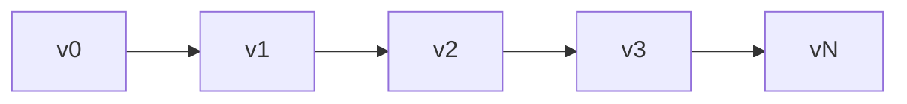
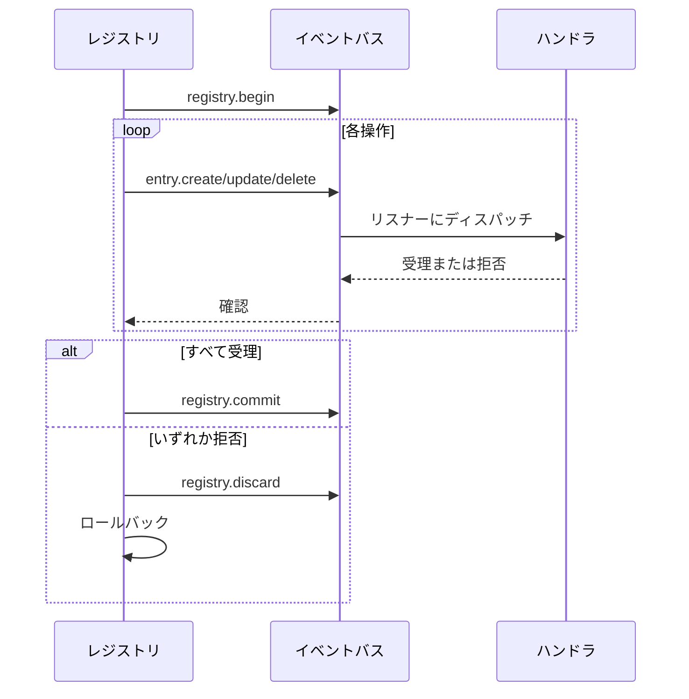

# レジストリ内部

レジストリはバージョン付きでイベント駆動の状態ストアです。完全なバージョン履歴を維持し、トランザクションをサポートし、イベントバスを通じて変更を伝播します。

## エントリストレージ

エントリはO(1)ルックアップ用のハッシュマップインデックス付き順序付きスライスとして格納：

```go
type Entry struct {
    ID   ID              // namespace:name
    Kind Kind            // エントリタイプ
    Meta attrs.Bag       // メタデータ
    Data payload.Payload // コンテンツ
}
```

エントリIDはGoの`unique`パッケージを使用してインターニング—同一のIDはメモリを共有。

## バージョンチェーン

各バージョンは親を指す。パス計算はグラフアルゴリズムを使用して任意の2つのバージョン間の最短ルートを見つける：



## ChangeSet

チェンジセットは1つの状態から別の状態に変換する操作の順序付きリスト：

| 操作 | OriginalEntry | 目的 |
|------|---------------|------|
| Create | nil | 新しいエントリを追加 |
| Update | 古い値 | 既存を変更 |
| Delete | 削除された値 | エントリを削除 |

`OriginalEntry`は反転を可能にする—更新は以前の値を、削除は削除されたものを格納。

### デルタの構築

`BuildDelta(oldState, newState)`は最小限の操作を生成：

1. 状態を比較し、変更を特定
2. 削除を依存関係の逆順でソート（依存するものが先）
3. 作成/更新を依存関係の順でソート（依存されるものが先）

### スカッシュ

複数のチェンジセットはエントリごとの最終状態を追跡してマージ：

```
Create + Update = Create（更新された値で）
Create + Delete = ∅（相殺）
Update + Delete = Delete
Delete + Create = Update
```

## トランザクション



ハンドラには各操作を受理または拒否するのに30秒。拒否時、レジストリは逆デルタを計算・適用してロールバック。

### 非伝播エントリ

一部のkindはイベントバスを完全にスキップ：
- `registry.entry` - アプリケーション設定
- `ns.requirement` - 名前空間要件
- `ns.dependency` - モジュール依存関係

## 依存関係解決

エントリは他のエントリへの依存関係を宣言可能。リゾルバは登録されたパターンを通じて依存関係を抽出：

```go
resolver.RegisterPattern(PathConfig{
    Path: "meta.server",
    AllowWildcard: true,
})
```

依存関係はエントリのMetaとDataフィールドから抽出され、状態遷移時のトポロジカルソートに使用。

## バージョン履歴

履歴バックエンド：

| 実装 | ユースケース |
|-----|-----------|
| SQLite | 本番永続化 |
| Memory | テスト |
| Nil | 履歴なし |

SQLiteはWALモードを使用し、バージョン、チェンジセット（MessagePackエンコード）、メタデータ用のテーブルを持つ。

### ナビゲーション

パス計算はバージョン間の最短ルートを見つける：

```go
Path(v0, v3) = [v1, v2, v3]  // チェンジセットを順方向に適用
Path(v3, v1) = [v2, v1]      // 逆チェンジセットを適用
```

`LoadState()`は新しいバージョンを作成せずにベースラインから履歴をリプレイ—ブート時に使用。

## Finder

エントリ検索用のLRUキャッシュ付きクエリエンジン：

| 演算子 | プレフィックス | 例 |
|-------|------------|-----|
| Glob | (なし) | `.kind=function.*` |
| Regex | `~` | `~meta.path=/api/.*` |
| Contains | `*` | `*meta.tags=backend` |
| Prefix | `^` | `^meta.name=user` |
| Suffix | `$` | `$meta.path=Handler` |

キャッシュはバージョン変更時に無効化。

## 関連項目

- [レジストリ](concept-registry.md) - 高レベルコンセプト
- [イベント](internal-events.md) - イベントバスの詳細

