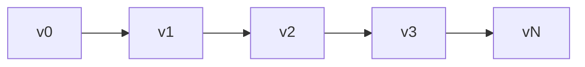
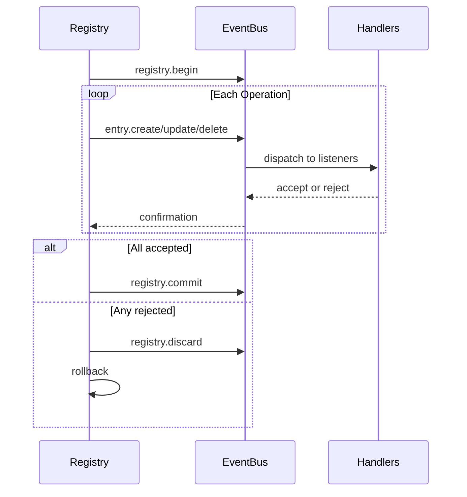

# レジストリ内部

レジストリはバージョン管理されたエントリ状態を格納し、トランザクションと履歴をサポートし、変更をイベントバス経由で伝播します。

このページの Go およびクエリの断片は、内部データ構造と finder 構文を説明するもので、独立したアプリケーション例ではありません。

## エントリストレージ

エントリは、O(1) 検索用のハッシュマップインデックスを伴う順序付きスライスとして格納されます。

```go
type Entry struct {
    ID       ID              // namespace:name
    Kind     Kind            // エントリタイプ
    Meta     attrs.Bag       // 作者のメタデータ
    Data     payload.Payload // コンテンツ
    Registry EntryMetadata   // レジストリ所有の来歴
}

type EntryMetadata struct {
    Owner string // エントリを供給したデプロイメントソース
    Root  bool   // デプロイメントが選択した依存関係の宣言
}
```

エントリ ID は Go の `unique` パッケージを使用して intern されます。同一の ID はメモリを共有します。

`Registry`はエントリの作者ではなくレジストリが所有。`Owner`はデプロイメントソースから割り当てられ、`Root`は`ns.dependency`エントリの書き込み側フィールド`dependency_root`から設定される。通常のエントリAPIが返すのは`ID`、`Kind`、`Meta`、`Data`のみ。来歴はスナップショットの状態APIを通じて読み取る。

## スナップショット

`Registry.Snapshot()`は1つのアトミックなビューを返す：バージョン、そのバージョンにおけるエントリ、そして同じバージョンに対するレジストリ所有の状態メタデータ。

```go
type Snapshot struct {
    Registry StateMetadata
    Version  Version
    Entries  State
}

type StateMetadata struct {
    Resolution *DependencyResolution
}
```

バージョン、エントリ、解決結果を1つの値として読み取ることで、呼び出し側が別バージョンの解決結果とエントリを組み合わせることを防ぐ。選択されたモジュールグラフは、すべてのエントリに繰り返し持たせるのではなく、スナップショットごとに一度だけ格納される。

## オーバーレイ

`OverlayWriter`はプロセスローカルなエントリのためのオプションのレジストリ機能：

```go
type OverlayWriter interface {
    ApplyOverlay(context.Context, string, uint64, ChangeSet) (uint64, error)
    GetOverlay(string) (State, uint64, error)
}
```

オーバーレイエントリは論理的なオーナー文字列の下にグループ化される。実効状態に参加し、永続エントリと同じトポロジーソートとハンドラ遷移を通過するため、サービスは通常どおり起動・停止するが、履歴バージョンを生成することはない。コールドブート後は空であり、所有する制御サービスによって整合される必要がある。

書き込みは楽観的並行制御：`GetOverlay`はオーナーの現在の世代を返し、`ApplyOverlay`はその世代がまだ最新である場合にのみコミットし、そうでなければリトライ可能な`Conflict`を返す。適用が成功するたびにプロセス内で一意な新しい世代が発行され、変更を行ったオーナーにはトゥームストーンが保持されるため、ABAのような一連の操作が未変更のオーバーレイと誤認されることはない。

適用のたびに検証される合成規則：

- エントリを作成できるのは、そのIDを持つ永続エントリもオーバーレイエントリも存在しない場合のみ。
- 自身のオーバーレイエントリを更新・削除できるのは所有するアイデンティティのみ。
- オーバーレイエントリはレジストリ所有のメタデータを持てず、レジストリディレクティブが要求する種別を使用できない。
- 削除は、生存する他のエントリが依存しているエントリを取り除けない。
- 依存関係のエッジはオーナーの境界を越えられず、永続エントリはオーバーレイエントリに依存できない。

## バージョンチェーン

各バージョンは親を参照します。パス計算ではグラフアルゴリズムを使用し、任意の 2 バージョン間の最短経路を求めます。


```mermaid
flowchart LR
    v0[v0] --> v1[v1] --> v2[v2] --> v3[v3] --> vN[vN]
```

## ChangeSet

変更セットは、ある状態を別の状態へ変換する操作の順序付きリストです。

| 操作 | OriginalEntry | 目的 |
|-----------|---------------|---------|
| Create | nil | 新しいエントリを追加 |
| Update | 古い値 | 既存エントリを変更 |
| Delete | 削除された値 | エントリを削除 |

`OriginalEntry` により逆操作が可能になります。更新は以前の値を、削除は削除された内容を格納します。

### Delta の構築

`BuildDelta(oldState, newState)` は最小限の操作を生成します。

1. 状態を比較して変更を特定
2. 削除を依存関係の逆順（依存側が先）に並べ替え
3. 作成/更新を依存関係の順方向（依存先が先）に並べ替え

### Squash

複数の変更セットは、エントリごとの最終状態を追跡して統合されます。

```
Create + Update = Create (with updated value)
Create + Delete = ∅ (cancel out)
Update + Delete = Delete
Delete + Create = Update
```

## トランザクション


```mermaid
sequenceDiagram
    participant R as Registry
    participant B as EventBus
    participant H as Handlers

    R->>B: registry.begin
    loop Each Operation
        R->>B: entry.create/update/delete
        B->>H: dispatch to listeners
        H-->>B: accept or reject
        B-->>R: confirmation
    end
    alt All accepted
        R->>B: registry.commit
    else Any rejected
        R->>B: registry.discard
        R->>R: rollback
    end
```

デフォルトでは、レジストリは各操作についてリスナーが accept または reject するまで 30 秒待ちます。`registry.event_wait_timeout` は操作ごとのタイムアウトを変更します。reject された場合、レジストリは逆 delta を計算して適用し、ロールバックします。

### 伝播しないエントリ

次の種別はデフォルトでイベントバスを経由しません。

- `registry.entry` - アプリケーション設定
- `ns.requirement` - 名前空間要件
- `ns.dependency` - モジュール依存関係
- `ns.definition` - モジュールメタデータ（readme、wiki、license、authors）

これはデフォルトの集合であり、ランタイム設定の`registry.dispatch_internal_kinds`がこれを置き換える。

## 依存関係解決

## 依存関係の解決

エントリは他のエントリへの依存関係を宣言できます。resolver は登録されたパターンを通じて依存関係を抽出します。

```go
resolver.RegisterPattern(registry.DependencyPattern{
    Path:          "meta.server",
    AllowWildcard: true,
})
```

依存関係はエントリの Meta および Data フィールドから抽出され、状態遷移時のトポロジカルソートに使用されます。

### 依存関係アクセスポリシー

外部の依存関係へのアクセスはグローバルなフラグではなく、リクエストスコープのコンテキスト値：

| ポリシー | 効果 |
|--------|--------|
| `DependencyAccessUnspecified` | 呼び出し側が選択。呼び出し側自身のデフォルトが適用される |
| `DependencyAccessOnline` | 外部での解決とアーティファクトのダウンロードが許可される |
| `DependencyAccessVerifiedOffline` | 外部アクセスは禁止。解決はロックされたマニフェストとローカルに存在するアーティファクトを使用する |

`LoadState()`はコンテキストが何も指定しない場合、verified-offlineをデフォルトとする。そのためブートはネットワークに接続せず、保存済みのグラフをリプレイする。デプロイメントのベースラインを復元する場合は、そのベースラインが指すモジュールを取得しなければならないため、コンテキストをonlineに切り替える。verified-offlineでは、ロックされたモジュールのみを提供するマニフェストプロバイダがハブのプロバイダに取って代わり、欠けているアーティファクトはダウンロードを引き起こすのではなく、証跡の欠落として失敗する。

## バージョン履歴

履歴バックエンドは次のとおりです。

| 実装 | 用途 |
|----------------|----------|
| SQLite | 本番環境の永続化 |
| PostgreSQL | ノード間で共有する本番環境の永続化 |
| Memory | `history_type` 未設定時のデフォルト。テスト |
| Nil | 履歴なし |

SQLite は、バージョン、変更セット（MessagePack エンコード）、メタデータのテーブルを WAL モードで使用します。PostgreSQL は `registry.history_type: postgres` と `history_dsn`/`history_schema` で選択します（[設定](guides/configuration.md#registry)を参照）。

履歴は各バージョンの正確な依存関係解決も永続化します。`ns.dependency` の変更が適用されると、解決済みモジュールグラフが変更セットとともに content-addressed 形式で格納されます。起動とロールバックでは再解決せず、格納されたグラフを再生するため、バージョンは常に解決時と同じバージョン群と整合します。履歴スキーマはアップグレード後の初回起動時に自動移行されます。既存バージョンは初回アクセス時に一度解決され、checkpoint されます。

### ナビゲーション

パス計算は、バージョン間の最短経路を求めます。

```go
Path(v0, v3) = [v1, v2, v3]  // Apply changesets forward
Path(v3, v1) = [v2, v1]      // Apply reversed changesets
```

`LoadState()` は新しいバージョンを作成せず、基準点から履歴を再生します。起動時に使用されます。

## Finder

エントリ検索用の LRU キャッシュ付きクエリエンジンです。

| 演算子 | プレフィックス | 例 |
|----------|--------|---------|
| ルートフィールド glob | `.` ルートフィールド | `.kind=function.*` |
| 正規表現 | `~` | `~meta.path=/api/.*` |
| 含む | `*` | `*meta.tags=backend` |
| 前方一致 | `^` | `^meta.name=user` |
| 後方一致 | `$` | `$meta.path=Handler` |

バージョン変更時にキャッシュは無効化されます。

glob マッチングはルートフィールド `.kind`、`.name`、`.ns`、`.id` に適用されます。プレフィックスのない `meta.*` 条件は等価比較を使用します。

## 関連項目

- [レジストリ](concepts/registry.md) - 高レベルの概念
- [イベント](internals/events.md) - イベントバスの詳細
