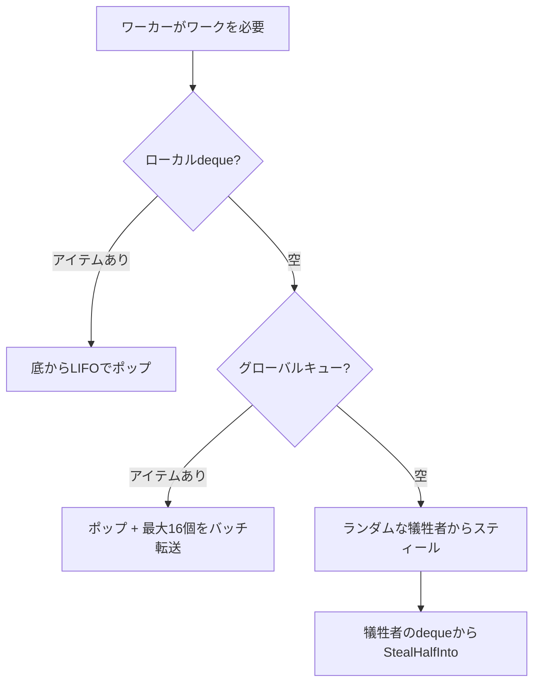
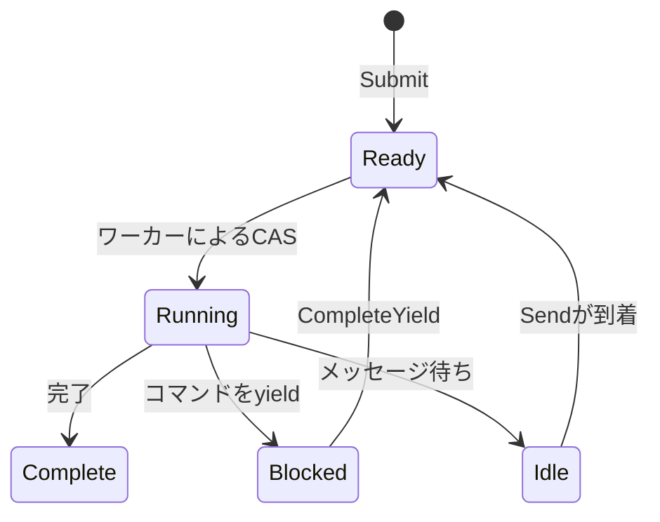

# スケジューラ

スケジューラはワークスティーリング設計を使用してプロセスを実行します。ワーカーはローカルdequeを維持し、アイドル時に互いからスティールします。

## プロセスインターフェース

スケジューラは`Process`インターフェースを実装する任意の型で動作：

```go
type Process interface {
    Init(ctx context.Context, method string, input payload.Payloads) error
    Step(events []Event, out *StepOutput) error
    Close()
}
```

| メソッド | 目的 |
|---------|------|
| `Init` | エントリメソッド名と入力引数でプロセスを準備 |
| `Step` | 着信イベントで状態マシンを進め、出力にyieldを書き込み |
| `Close` | リソースを解放 |

`Init`の`method`パラメータはどのエントリポイントを呼び出すかを指定。プロセスインスタンスは複数のエントリポイントを公開でき、呼び出し側がどれを実行するかを選択。これはスケジューラがプロセスを正しく開始していることの検証としても機能。

スケジューラは`Step()`を繰り返し呼び出し、イベント（yield完了、メッセージ）を渡してyield（ディスパッチするコマンド）を収集。プロセスはステータスとyieldを`StepOutput`バッファに書き込む。

```go
type Event struct {
    Type  EventType  // EventYieldCompleteまたはEventMessage
    Tag   uint64     // yield完了用の相関タグ
    Data  any        // 結果データまたはメッセージペイロード
    Error error      // yieldが失敗した場合のエラー
}
```

## 構造

スケジューラはデフォルトで`GOMAXPROCS`個のワーカーを生成。各ワーカーはキャッシュフレンドリーなLIFOアクセス用のローカルdequeを持つ。グローバルFIFOキューは新しいサブミッションとワーカー間転送を処理。プロセスはメッセージルーティング用にPIDで追跡。

## ワーク探索



ワーカーは優先順位でソースをチェック：

| 優先度 | ソース | パターン |
|-------|--------|---------|
| 1 | ローカルdeque | LIFOポップ、ロックフリー、キャッシュフレンドリー |
| 2 | グローバルキュー | バッチ転送付きFIFOポップ |
| 3 | 他のワーカー | 犠牲者のdequeから半分をスティール |

グローバルからポップする際、ワーカーは1つのアイテムを取得し、最大16個をローカルdequeにバッチ転送。

## Chase-Lev Deque

各ワーカーはChase-Levワークスティーリングdequeを所有：

```go
type Deque struct {
    buffer atomic.Pointer[dequeBuffer]
    top    atomic.Int64  // 泥棒がここからスティール（CAS）
    bottom atomic.Int64  // 所有者がここでプッシュ/ポップ
}
```

所有者は同期なしで底からプッシュ/ポップ（LIFO）。泥棒はCASを使用して上からスティール（FIFO）。これにより所有者は最近プッシュされたアイテムにキャッシュフレンドリーにアクセスでき、古いワークはスティーラーに分配。

`StealHalfInto`は1回のCAS操作で半分のアイテムを取得し、競合を削減。

## 適応型スピニング

条件変数でブロックする前に、ワーカーは適応的にスピン：

| スピン回数 | アクション |
|-----------|---------|
| < 4 | タイトループ |
| 4-15 | スレッドyield（`runtime.Gosched`） |
| >= 16 | 条件変数でブロック |

## プロセス状態



| 状態 | 説明 |
|------|------|
| Ready | 実行待ちキュー |
| Running | ワーカーがStep()を実行中 |
| Blocked | yield完了待ち |
| Idle | メッセージ待ち |
| Complete | 実行完了 |

ウェイクアップフラグは競合を処理：ハンドラがワーカーがまだプロセスを所有している（Running）間に`CompleteYield`を呼び出すと、フラグを設定。ワーカーはディスパッチ後にフラグをチェックし、設定されていれば再キュー。

## イベントキュー

各プロセスはMPSC（multi-producer, single-consumer）イベントキューを持つ：

- **プロデューサー**: コマンドハンドラ（`CompleteYield`）、メッセージ送信者（`Send`）
- **コンシューマー**: ワーカーが`Step()`でドレイン

## メッセージルーティング

スケジューラは`relay.Receiver`を実装してメッセージをプロセスにルーティング。`Send()`が呼ばれると、`byPID`マップでターゲットPIDを検索し、メッセージをイベントとしてプロセスキューにプッシュし、アイドルならプロセスをグローバルキューにプッシュしてウェイク。

## シャットダウン

シャットダウン時、スケジューラはすべての実行中プロセスにキャンセルイベントを送信し、完了またはタイムアウトを待機。ワーカーはワークがなくなると終了。

## 関連項目

- [コマンドディスパッチ](internals/dispatch.md) - yieldがハンドラに到達する方法
- [プロセスモデル](concepts/process-model.md) - 高レベルコンセプト

