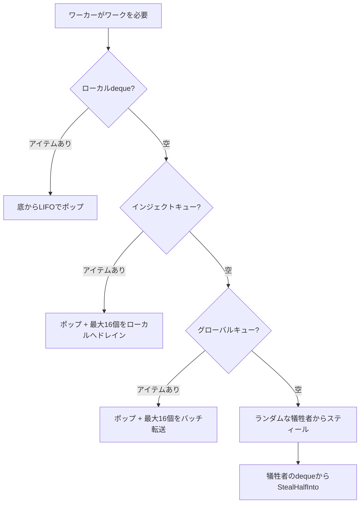
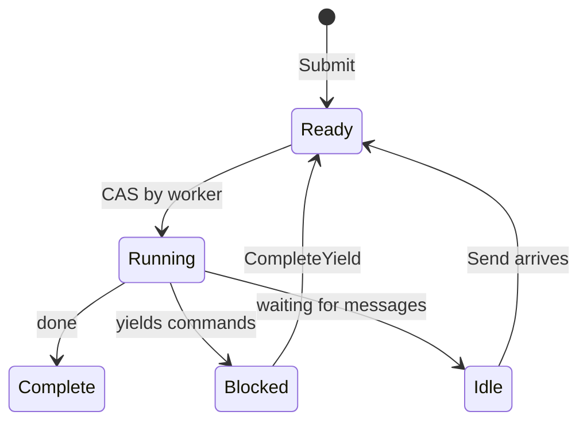

# スケジューラ

スケジューラは、ローカル deque、inject queue、グローバルキュー、work stealing を備えたワーカー上でプロセスを実行します。

これは実装リファレンスです。Go の構造体と図は固定されたランタイムスケジューラを説明するもので、アプリケーションコードが実装する API ではありません。

## プロセスインターフェース

スケジューラは `Process` インターフェースを実装する任意の型で動作します。

```go
type Process interface {
    Init(ctx context.Context, method string, input payload.Payloads) error
    Step(events []Event, out *StepOutput) error
    Close()
}
```

| メソッド | 目的 |
|--------|---------|
| `Init` | エントリメソッド名と入力引数を使用してプロセスを準備 |
| `Step` | 受信イベントで状態機械を進め、yield を出力へ書き込む |
| `Close` | リソースを解放 |

`Init` の `method` パラメータは、呼び出すエントリーポイントを指定します。1 つのプロセスインスタンスが複数のエントリーポイントを公開でき、呼び出し元が実行するものを選択します。

スケジューラは `Step()` を繰り返し呼び出し、イベント（yield の完了、メッセージ）を渡して、yield（ディスパッチするコマンド）を収集します。プロセスはその状態とすべての yield を `StepOutput` バッファへ書き込みます。

```go
type Event struct {
    Type  EventType  // EventYieldComplete or EventMessage
    Tag   uint64     // Correlation tag for yield completions
    Data  any        // Result data or message payload
    Error error      // Error if yield failed
}
```

## 構造

スケジューラはデフォルトで `GOMAXPROCS` 個のワーカーを生成します。各ワーカーにはキャッシュ効率の高い LIFO アクセス用のローカル deque と、yield 完了やメッセージによる wake を含む、そのワーカーにアフィニティのある再キュー処理用のワーカー別 MPSC inject queue があります。グローバル FIFO キューは、新規投入とアフィニティのない再キューを処理します。プロセスはメッセージルーティングのため PID で追跡されます。

## 処理の探索


```mermaid
flowchart TD
    W[ワーカーがワークを必要] --> L{ローカルdeque?}
    L -->|アイテムあり| LP[底からLIFOでポップ]
    L -->|空| I{インジェクトキュー?}
    I -->|アイテムあり| IP[ポップ + 最大16個をローカルへドレイン]
    I -->|空| G{グローバルキュー?}
    G -->|アイテムあり| GP[ポップ + 最大16個をバッチ転送]
    G -->|空| S[ランダムな犠牲者からスティール]
    S --> SH[犠牲者のdequeからStealHalfInto]
```

ワーカーは次の優先順位でソースを確認します。

| 優先度 | ソース | パターン |
|-------|--------|---------|
| 1 | ローカルdeque | LIFOポップ、ロックフリー、キャッシュフレンドリー |
| 2 | インジェクトキュー | アフィンな非同期完了のMPSCポップ、最大16個をローカルへドレイン |
| 3 | グローバルキュー | バッチ転送付きFIFOポップ |
| 4 | 他のワーカー | 犠牲者のdequeから半分をスティール |

インジェクトキューまたはグローバルキューからポップする際、ワーカーは1つのアイテムを取得し、さらに最大16個をローカルdequeへ移動します。

## Chase-Lev Deque

各ワーカーは Chase-Lev work-stealing deque を所有します。

```go
type Deque struct {
    buffer atomic.Pointer[dequeBuffer]
    top    atomic.Int64  // Thieves steal from here (CAS)
    bottom atomic.Int64  // Owner pushes/pops here
}
```

所有者はミューテックスを使わず bottom から push/pop（LIFO）します。最後の項目を pop するときは、steal 側との調整に CAS を使用します。steal 側は CAS を使い、top から steal（FIFO）します。これにより所有者は最近 push された項目へキャッシュ効率よくアクセスでき、古い処理は steal 側へ分散されます。

`StealHalfInto` は、1 回の CAS 操作で利用可能な項目の半分までを取得し、宛先バッファのサイズで制限されます。ワーカーの steal 試行では 32 項目のバッファを使用します。

## 適応的スピン

条件変数でブロックする前に、ワーカーは適応的にスピンします。

| スピン回数 | アクション |
|------------|--------|
| < 4 | タイトなループ |
| 4-15 | スレッドを yield（`runtime.Gosched`） |
| >= 16 | 条件変数でブロック |

## プロセス状態


```mermaid
stateDiagram-v2
    [*] --> Ready: Submit
    Ready --> Running: CAS by worker
    Running --> Complete: done
    Running --> Blocked: yields commands
    Running --> Idle: waiting for messages
    Blocked --> Ready: CompleteYield
    Idle --> Ready: Send arrives
```

| 状態 | 説明 |
|-------|-------------|
| Ready | 実行キューに追加済み |
| Running | ワーカーが Step() を実行中 |
| Blocked | yield の完了を待機中 |
| Idle | メッセージを待機中 |
| Complete | 実行が完了 |

wakeup フラグが競合を処理します。ワーカーがまだプロセスを所有している間（Running）にハンドラが `CompleteYield` を呼び出した場合、フラグを設定します。ワーカーはディスパッチ後にフラグを確認し、設定されていれば再キューします。

## イベントキュー

各プロセスは MPSC（multi-producer, single-consumer）イベントキューを持ちます。

- **Producer**: コマンドハンドラ（`CompleteYield`）、メッセージ送信元（`Send`）
- **Consumer**: ワーカーが `Step()` 内でイベントを drain

キューは世代カウンタで保護される。すべてのプロデューサーは観測した世代にバインドされ、`Reset`が世代を進めるため、前回の実行から残った送信者が再利用されたキューにプッシュすることはできない。

通常のイベントトラフィックは無制限。アカウンティングはメッセージ単位のオプトインで、`MaxItems`または`MaxBytes`を持つメッセージはトピックごとの予算に対して受け入れられ、そのトピックで観測された最も厳しい制限が優先される。メッセージは消費側プロセスが解放するまで予約を保持し、終端メッセージがバックログ容量を消費することはない。

トピックの予算を使い切ると、キューはあふれたメッセージの代わりに合成メッセージを1件だけ追加する。このメッセージは`message queue limit exceeded`とそれに続く終端ペイロードを運ぶ。そのトピックの以降のトラフィックはキューがリセットされるまで破棄されるため、上限付きのサブスクリプションは無制限に増大するのではなくエラー終端で終わる。

## メッセージルーティング

スケジューラは`relay.Receiver`を実装してメッセージをプロセスにルーティング。`Send`はバックグラウンドコンテキストで`SendContext`に委譲する。`SendContext`はターゲット検索の前と受け入れの前にキャンセルを確認する。受け入れ自体はノンブロッキングであり、成功すると取り消せないためである。

いずれも`byPID`マップでターゲットPIDを検索し、プロセッサの現在の世代の下でパッケージをプロセスキューにプッシュする。受け入れは3通り:

| 結果 | 意味 | パッケージの所有権 |
|--------|---------|-------------------|
| Accepted | キューがパッケージを受け取った | キュー。処理後にスケジューラが解放 |
| Dropped | トピックごとの予算があふれ、キューは自身のオーバーフロー終端以外何も保持しなかった | 呼び出し側。即座に解放 |
| Rejected | キューがクローズ済み、または世代が古い | 呼び出し側。`SendContext`は`ErrProcessClosed`を返す |

受け入れられた、または破棄されたプッシュは、その後プロセスがアイドルまたはブロック中であればウェイクする。再キューイングはinjectOrGlobal経由で行われ、プロセスに既知のワーカーアフィニティがある場合は最後のワーカーのワーカーごとのインジェクトキューにプッシュし、それ以外はグローバルキューにフォールバックする。

## シャットダウン

シャットダウン時、スケジューラは追跡対象の全プロセスへ cancel イベントを送り、完了またはタイムアウトまで待機します。処理がなくなるとワーカーは終了します。

## 関連項目

- [コマンドディスパッチ](internals/dispatch.md) - yield がハンドラへ到達する仕組み
- [プロセスモデル](concepts/process-model.md) - 高レベルの概念
