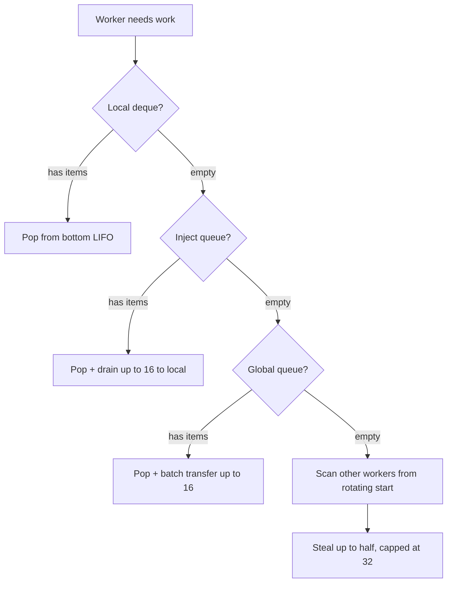
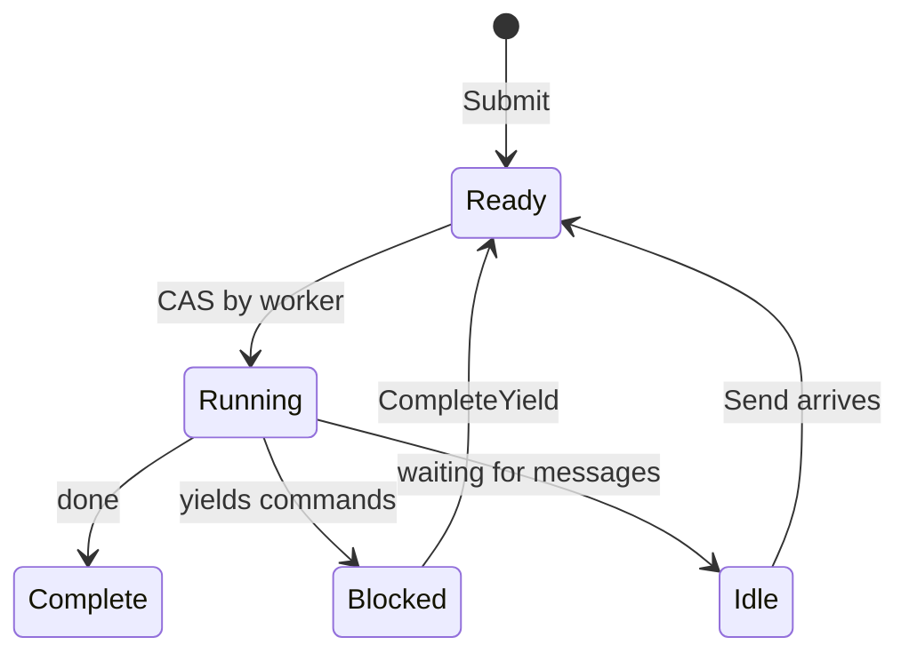

# スケジューラ

スケジューラは、ローカル deque、inject queue、グローバルキュー、work stealing を備えたワーカー上でプロセスを実行します。

これは実装リファレンスです。Go の構造体と図は固定されたランタイムスケジューラを説明するもので、アプリケーションコードが実装する API ではありません。

## プロセスインターフェース

スケジューラは `Process` インターフェースを実装する任意の型で動作します。

```go
type Process interface {
    Init(ctx context.Context, method string, input payload.Payloads) error
    Step(events []Event, out *StepOutput) error
    Close()
}
```

| メソッド | 目的 |
|--------|---------|
| `Init` | エントリメソッド名と入力引数を使用してプロセスを準備 |
| `Step` | 受信イベントで状態機械を進め、yield を出力へ書き込む |
| `Close` | リソースを解放 |

`Init` の `method` パラメータは、呼び出すエントリーポイントを指定します。1 つのプロセスインスタンスが複数のエントリーポイントを公開でき、呼び出し元が実行するものを選択します。

スケジューラは `Step()` を繰り返し呼び出し、イベント（yield の完了、メッセージ）を渡して、yield（ディスパッチするコマンド）を収集します。プロセスはその状態とすべての yield を `StepOutput` バッファへ書き込みます。

```go
type Event struct {
    Type  EventType  // EventYieldComplete or EventMessage
    Tag   uint64     // Correlation tag for yield completions
    Data  any        // Result data or message payload
    Error error      // Error if yield failed
}
```

## 構造

スケジューラはデフォルトで `GOMAXPROCS` 個のワーカーを生成します。各ワーカーにはキャッシュ効率の高い LIFO アクセス用のローカル deque と、yield 完了やメッセージによる wake を含む、そのワーカーにアフィニティのある再キュー処理用のワーカー別 MPSC inject queue があります。グローバル FIFO キューは、新規投入とアフィニティのない再キューを処理します。プロセスはメッセージルーティングのため PID で追跡されます。

## 処理の探索


```mermaid
flowchart TD
    W[Worker needs work] --> L{Local deque?}
    L -->|has items| LP[Pop from bottom LIFO]
    L -->|empty| I{Inject queue?}
    I -->|has items| IP[Pop + drain up to 16 to local]
    I -->|empty| G{Global queue?}
    G -->|has items| GP[Pop + batch transfer up to 16]
    G -->|empty| S[Scan other workers from rotating start]
    S --> SH[Steal up to half, capped at 32]
```

ワーカーは次の優先順位でソースを確認します。

| 優先度 | ソース | パターン |
|----------|--------|---------|
| 1 | ローカル deque | LIFO pop、ロックフリー、キャッシュ効率が高い |
| 2 | Inject queue | アフィニティのある再キュー/イベントを MPSC pop し、最大 16 件をローカルへ drain |
| 3 | グローバルキュー | バッチ転送を伴う FIFO pop |
| 4 | 他のワーカー | ローテーションする開始インデックスから走査し、1 回の試行で最大 32 件を上限に半分まで steal |

inject queue またはグローバルキューから pop するとき、ワーカーは 1 項目を取得し、さらに最大 16 項目をローカル deque へ移動します。

## Chase-Lev Deque

各ワーカーは Chase-Lev work-stealing deque を所有します。

```go
type Deque struct {
    buffer atomic.Pointer[dequeBuffer]
    top    atomic.Int64  // Thieves steal from here (CAS)
    bottom atomic.Int64  // Owner pushes/pops here
}
```

所有者はミューテックスを使わず bottom から push/pop（LIFO）します。最後の項目を pop するときは、steal 側との調整に CAS を使用します。steal 側は CAS を使い、top から steal（FIFO）します。これにより所有者は最近 push された項目へキャッシュ効率よくアクセスでき、古い処理は steal 側へ分散されます。

`StealHalfInto` は、1 回の CAS 操作で利用可能な項目の半分までを取得し、宛先バッファのサイズで制限されます。ワーカーの steal 試行では 32 項目のバッファを使用します。

## 適応的スピン

条件変数でブロックする前に、ワーカーは適応的にスピンします。

| スピン回数 | アクション |
|------------|--------|
| < 4 | タイトなループ |
| 4-15 | スレッドを yield（`runtime.Gosched`） |
| >= 16 | 条件変数でブロック |

## プロセス状態


```mermaid
stateDiagram-v2
    [*] --> Ready: Submit
    Ready --> Running: CAS by worker
    Running --> Complete: done
    Running --> Blocked: yields commands
    Running --> Idle: waiting for messages
    Blocked --> Ready: CompleteYield
    Idle --> Ready: Send arrives
```

| 状態 | 説明 |
|-------|-------------|
| Ready | 実行キューに追加済み |
| Running | ワーカーが Step() を実行中 |
| Blocked | yield の完了を待機中 |
| Idle | メッセージを待機中 |
| Complete | 実行が完了 |

wakeup フラグが競合を処理します。ワーカーがまだプロセスを所有している間（Running）にハンドラが `CompleteYield` を呼び出した場合、フラグを設定します。ワーカーはディスパッチ後にフラグを確認し、設定されていれば再キューします。

## イベントキュー

各プロセスは MPSC（multi-producer, single-consumer）イベントキューを持ちます。

- **Producer**: コマンドハンドラ（`CompleteYield`）、メッセージ送信元（`Send`）
- **Consumer**: ワーカーが `Step()` 内でイベントを drain

## メッセージルーティング

スケジューラは、メッセージをプロセスへルーティングするため `relay.Receiver` を実装します。`Send()` が呼び出されると、`byPID` マップで対象 PID を検索し、メッセージをイベントとしてプロセスキューへ push し、プロセスが idle または blocked なら wake します。injectOrGlobal を通じて再キューし、プロセスに既知のワーカーアフィニティがある場合は最後のワーカーのワーカー別 inject queue へ push し、それ以外はグローバルキューへフォールバックします。

## シャットダウン

シャットダウン時、スケジューラは追跡対象の全プロセスへ cancel イベントを送り、完了またはタイムアウトまで待機します。処理がなくなるとワーカーは終了します。

## 関連項目

- [コマンドディスパッチ](./dispatch.md) - yield がハンドラへ到達する仕組み
- [プロセスモデル](../concepts/process-model.md) - 高レベルの概念
