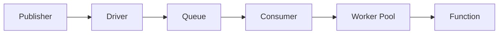

# キュー

Wippyは設定可能なドライバとコンシューマを持つ非同期メッセージ処理用のキューシステムを提供します。

## アーキテクチャ



- **ドライバ** - バックエンド実装（memory、AMQP、Redis）
- **キュー** - ドライバにバインドされた論理キュー
- **コンシューマ** - 並行性設定でキューとハンドラを接続
- **ワーカープール** - 同時メッセージプロセッサ

複数のキューが1つのドライバを共有できます。複数のコンシューマが同じキューから処理できます。

## エントリ種別

| 種別 | 説明 |
|------|------|
| `queue.driver.memory` | インメモリキュードライバ |
| `queue.queue` | ドライバ参照付きキュー宣言 |
| `queue.consumer` | メッセージを処理するコンシューマ |

## ドライバ設定

### メモリドライバ

開発とテスト用のインメモリドライバ。

```yaml
- name: memory_driver
  kind: queue.driver.memory
  lifecycle:
    auto_start: true
```

<note>
追加のドライバ（AMQP、Redis、SQS）が計画されています。ドライバインターフェースにより、キューやコンシューマの設定を変更せずにバックエンドを交換できます。
</note>

## キュー設定

```yaml
- name: tasks
  kind: queue.queue
  driver: app.queue:memory_driver
```

| フィールド | 型 | 必須 | 説明 |
|------------|-----|------|------|
| `driver` | Registry ID | はい | キュードライバへの参照 |
| `options` | Map | いいえ | ドライバ固有のオプション |

<note>
メモリドライバには設定オプションがありません。外部ドライバ（AMQP、Redis、SQS）は永続性、最大長、TTLなどのキュー動作用の独自オプションを定義します。
</note>

## コンシューマ設定

```yaml
- name: task_consumer
  kind: queue.consumer
  queue: app.queue:tasks
  func: app.queue:task_handler
  concurrency: 4
  prefetch: 20
  lifecycle:
    auto_start: true
    depends_on:
      - app.queue:tasks
```

| フィールド | デフォルト | 最大値 | 説明 |
|-----------|-----------|--------|------|
| `queue` | 必須 | - | キューレジストリID |
| `func` | 必須 | - | ハンドラ関数レジストリID |
| `concurrency` | 1 | 1000 | 並列ワーカー数 |
| `prefetch` | 10 | 10000 | メッセージバッファサイズ |

<tip>
コンシューマは呼び出しコンテキストを尊重し、セキュリティポリシーの対象となります。ライフサイクルレベルでアクターとポリシーを設定してください。<a href="system/security.md">セキュリティ</a>を参照。
</tip>

### ワーカープール

ワーカーは同時goroutineとして実行：

```
concurrency: 3, prefetch: 10

1. ドライバが最大10メッセージをバッファに配信
2. 3ワーカーがバッファから同時にプル
3. ワーカーが終了するとバッファが補充
4. すべてのワーカーがビジーでバッファがフルのときバックプレッシャー
```

## ハンドラ関数

コンシューマ関数はメッセージデータを受け取り、成功またはエラーを返します：

```lua
local json = require("json")
local logger = require("logger")

local function handler(body)
    local data = json.decode(body)

    logger.info("Processing", {task_id = data.id})

    local result, err = process_task(data)
    if err then
        return nil, err  -- Nack: メッセージを再キュー
    end

    return result  -- Ack: キューから削除
end

return handler
```

```yaml
- name: task_handler
  kind: function.lua
  source: file://task_handler.lua
  modules:
    - json
    - logger
```

### 確認応答

| ハンドラ結果 | アクション | 効果 |
|-------------|----------|------|
| 戻り値 | Ack | メッセージがキューから削除される |
| エラーを返す | Nack | メッセージが再キューされる（ドライバ依存） |

## メッセージの発行

Luaコードから：

```lua
local queue = require("queue")

queue.publish("app.queue:tasks", {
    id = "task-123",
    action = "process",
    data = payload
})
```

完全なAPIについては[キューモジュール](lua/storage/queue.md)を参照してください。

## グレースフルシャットダウン

コンシューマ停止時：

1. 新しいデリバリーの受け入れを停止
2. ワーカーコンテキストをキャンセル
3. 処理中のメッセージを待機（タイムアウト付き）
4. ワーカーが時間内に終了しない場合はエラーを返す

## 関連項目

- [キューモジュール](lua/storage/queue.md) - Lua APIリファレンス
- [キューコンシューマガイド](guides/queue-consumers.md) - コンシューマパターンとワーカープール
- [スーパービジョン](guides/supervision.md) - コンシューマライフサイクル管理
